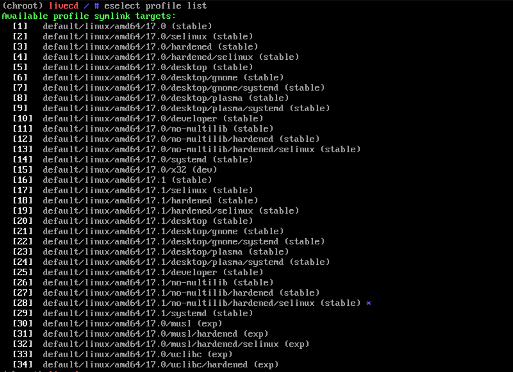
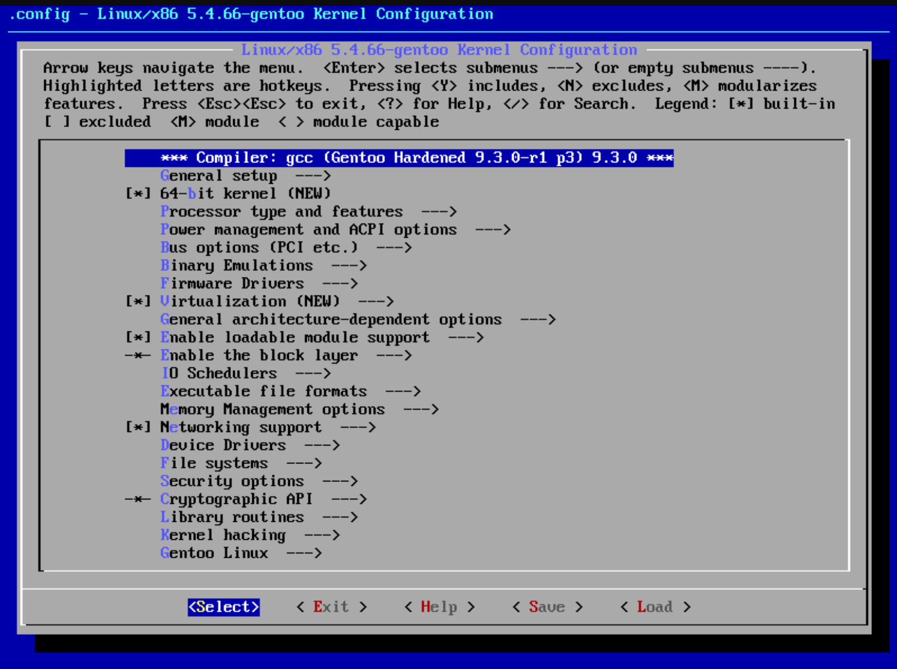
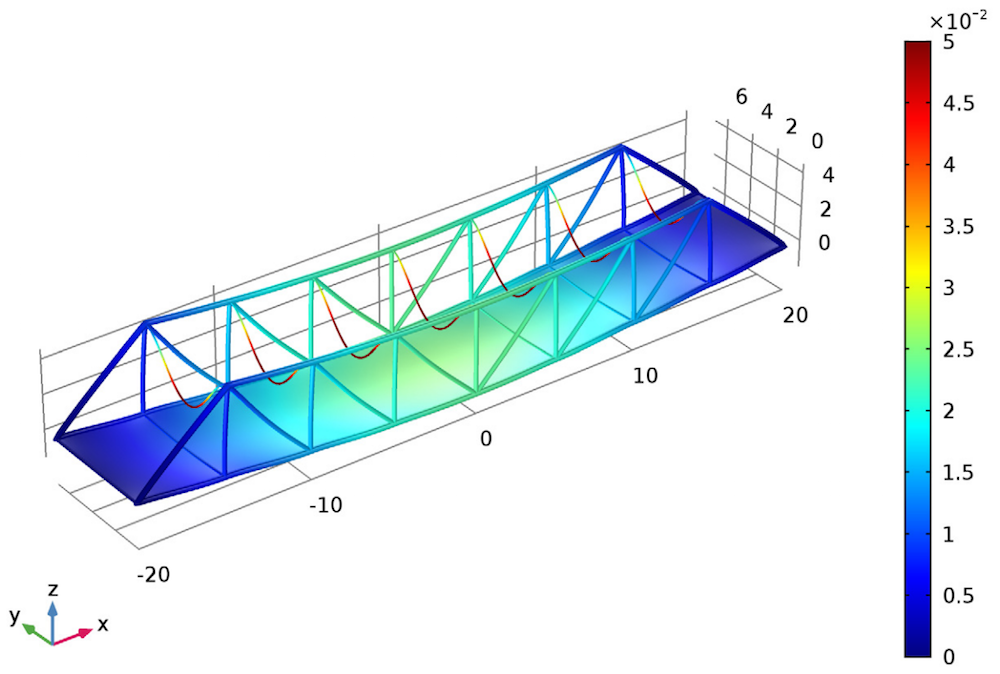
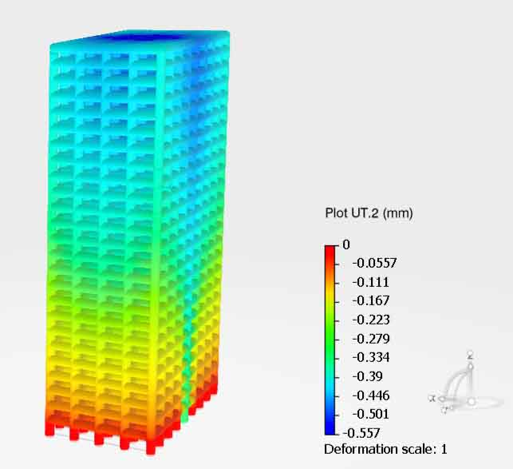
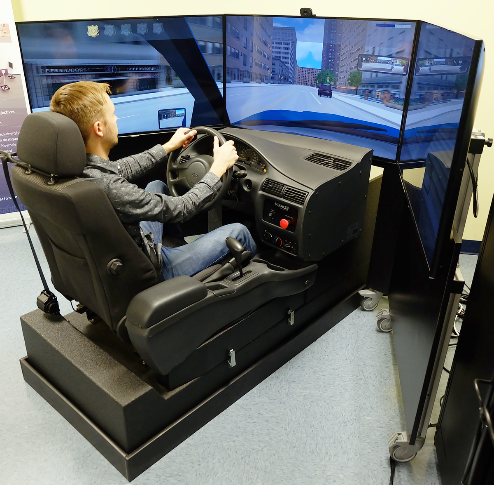
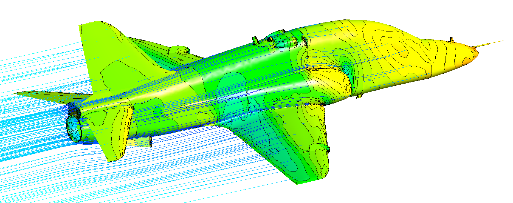
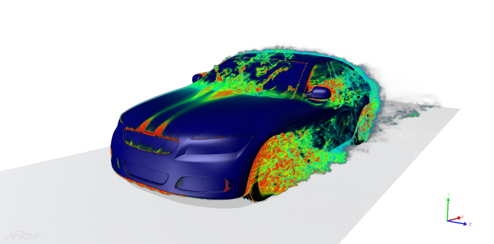
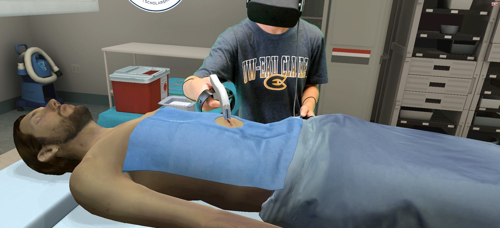
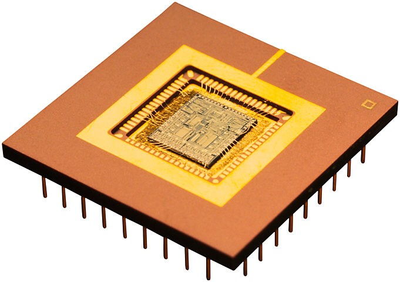
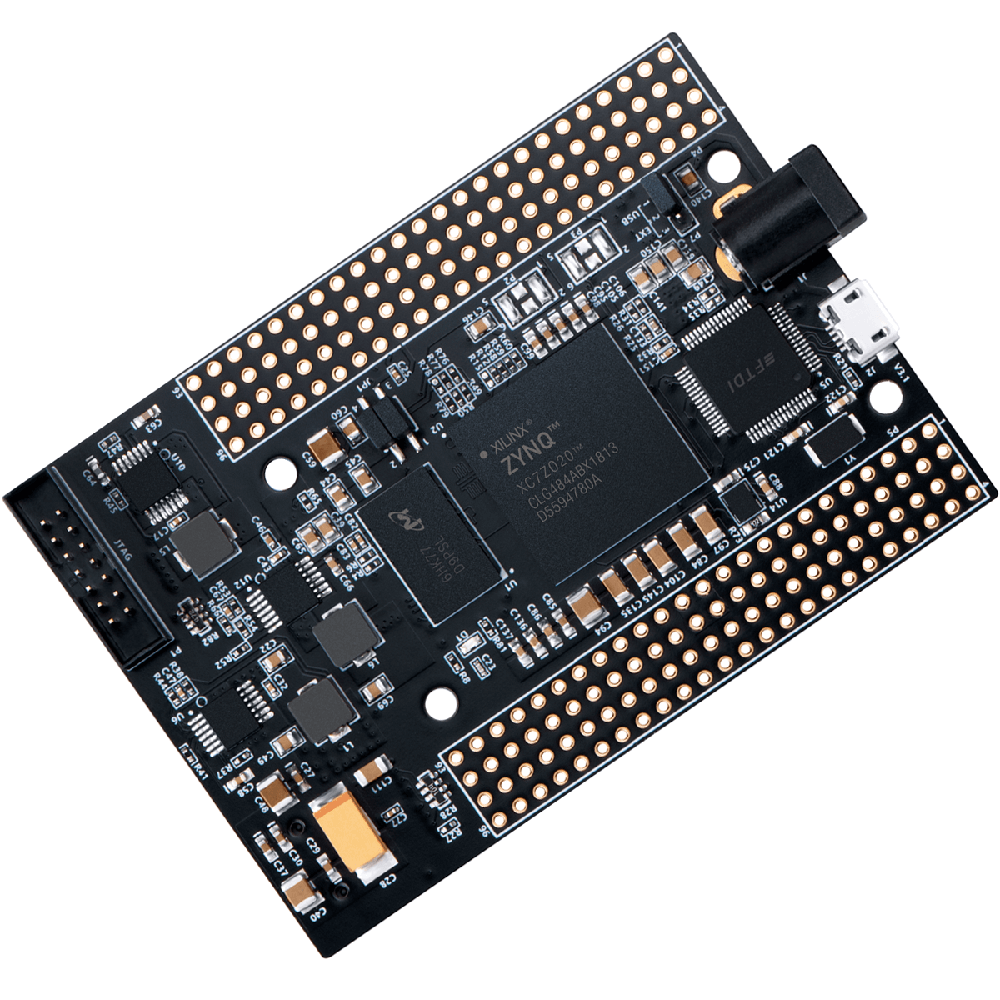

# Gentoo :

> Note : This Gentoo installation is completely manual, however you can find the installation script for automating this process on my github^[github.com/xradiation] page.

Disk partitioning using `fdisk` and mounting :

```bash
fdisk /dev/vda
mkfs.fat -F32 /dev/vda1
mkfs.ext4 /dev/vda2
mount /dev/vda2 /mnt/gentoo
```

Setting up the date and time since it is mandatory to sync time with servers to download Stage3 tarball :

```bash
ntpd -q -g
```

This can also be done manually :

```bash
date MMDDhhmmYYYY
```

Downloading the hardened no mutlilib tarball from `gentoo.org/downloads/` :

```bash
cd /mnt/gentoo
wget https://bouncer.gentoo.org/fetch/root/all/releases/amd64/autobuilds
/20201018T214503Z/hardened/stage3-amd64-hardened+nomultilib-20201018T214
503Z.tar.xz -o
tar xpvf stage3*.xz --xattrs-include='*.*' --numeric-owner
```

Next we're going to edit the `make.conf` portage configuration file using a text editor like :

```bash
vim etc/portage/make.conf
```

And make sure that the following variables exist and have the right values :

```bash
COMMON_FLAGS="-march=skylake -O2 -pipe"
MAKEOPTS="-j4"
ACCEPT_LICENSE="@FREE"
USE="-gui -kde -plasma -qt4 -qt5 -gnome -gtk -gtk-doc -X -css -clamav \
-cups -djvu -doc -emacs -systemd -3dfx -opengl -libnotify -lm-sensors \
-debug -ios -ipod -quicktime -sound -alsa -pulseaudio \
-firmware hardened pie"
```

Updating the mirror list in the chroot environment :

```bash
mirrorselect -i -o >> etc/portage/make.conf
mkdir -p etc/portage/repos.conf
cp usr/share/portage/config/repos.conf etc/portage/repos.conf/gentoo.conf
```

Coping DNS information from the live environment to the chroot :

```bash
cp -L /etc/resolv.conf etc/resolv.conf
```

Mounting filesystems :

```bash
mount --types proc /proc proc
mount --rbind {/sys sys,/dev dev}
mount --make-rslave {sys, dev}
```

Chrooting to the new environment :

```bash
chroot . /bin/bash
source /etc/profile
export PS1="(chroot) ${PS1}"
```

Mounting boot :

```bash
mount /dev/vda1 /boot
```

```bash
emerge --sync --quiet
```

Selecting the `default/linux/amd64/17.1/no-multilib/hardened/selinux (stable)` :

```bash
eselect profile list
eselect profile set 28
```

{#fig:genselprofile}

Updating the at world set :

> NOTE : this process may take a very long time ~24h in my case, depending on the hardware used to compile all the software and libraries required by the selected profile.

```bash
emerge -avuDN @world
```

Setting up the time zone :

>NOTE : all time zones can be found under `/usr/share/zoneinfo/` directory.

```bash
echo "Africa/Algiers" > /etc/timezone
emerge --config sys-libs/timezone-data
```

Locales setup :

```bash
echo "en_US.UTF-8 UTF-8" > /etc/locale.gen
locale-gen
eselect locale list
eselect locale set 3
env-update && source /etc/profile
export PS1="(chroot) ${PS1}"
```

Installation & Configuration of The Linux Kernel; This is going to be completely manual to reduce the kernel size as well as the kernel compile times :

```bash
emerge -a sys-kernel/gentoo-sources sys-apps/pciutils
cd /usr/src/linux
make menuconfig
```

{#fig:menuconfig}

The linux kernel configuration process is a long process hence it's out of the scope of this paper. The main menu is shown in [@fig:menuconfig]

> This kernel is built without kernel modules support otherwise `make modules_install` is needed, initramfs is also not required in this build.

```bash
make -j4 && make install
```

Editing `fstab` :

```bash
# get partitions uuids & append them to fstab
sudo blkid | grep -Eo "PARTUUID=\"[a-z0-9-]+\"" >> /etc/fstab

# edit fstab as needed
vim /etc/fstab
```

```bash
# /dev/vda1, this is the boot partition
PARTUUID=b268417b-1390-4821-9642-a0679b1dd56a   \
/boot   vfat    defaults,noauto,noatime 0 2

# /dev/vda2, this is the root partition
PARTUUID=996a556c-7629-4d71-801c-86f63b99c573   \
/       ext4    noatime                 0 1
```

Configuring server networking information :

```bash
echo "hostname=genserver" > /etc/conf.d/hostname
emerge -an net-misc/netifrc
echo "config_eth0=dhcp" > /etc/conf.d/net
cd /etc/init.d && ln -s net.lo net.eth0
rc-update add net.eth0 default
```

Setting the root password :

```bash
passwd
```

Installing system tools :

```bash
emerge -a sys-process/audit sys-fs/dosfstools sys-fs/e2fsprogs net-misc/dhcpcd
```

GRUB2 Installation & configuration :

```bash
echo 'GRUB_PLATFORMS="efi-64"' >> /etc/portage/make.conf
emerge -av sys-boot/grub:2
grub-install --target=x86_64-efi --efi-directory=/boot
grub-mkconfig -o /boot/grub/grub.cfg
```

Rebooting the system :

```bash
exit
cd && umount -l /mnt/gentoo/dev{/shm,/pts,}
umount -R /mnt/gentoo
reboot
```

After reboot, let's add a new user as an administrator :

```bash
useradd -m -G users,wheel -s /bin/bash user0
passwd user0
```

# SELinux Archlinux

As a normal user run the following :
> NOTE : that it's very important to run the makepkg -si as a normal user

```bash
pacman -S --needed git base-devel
git clone https://aur.archlinux.org/yay.git
cd yay
makepkg -si
```

To install selinux successfully one must install about ~33 packages in a certain order, which a delicate & error prone process for sure.

For the afore mentioned reason there is an installation script which will take care of downloading, compiling & installing every selinux tool in the order specified by the archlinux wiki for dependency reasons, the full project can be obtained by cloning the project's git repo over on github.com

It takes ages to fully install about ~2h in my case

```bash
git clone https://github.com/archlinuxhardened/selinux
cd selinux
./build_and_install_all.sh
```

Adding `security=selinux selinux=1` to `GRUB_CMDLINE_LINUX_DEFAULT` in `/etc/default/grub` as shown in figure bellow.

Rebuilding grub configuration file :

```bash
grub-mkconfig -o /boo/grub/grub.cfg
```

Creating `syslinux.cfg` under `/boot/syslinux/` and adding the following :

```bash
LABEL arch-selinux
         LINUX ../vmlinuz-linux-hardened
         APPEND root=/dev/sda2 ro security=selinux selinux=1
         INITRD ../initramfs-linux-hardened.img
```

Creating a new bootloader entry under `/boot/loader/entries/`, named `arch-selinux.conf` with the following content :

```bash
title Arch Linux SELinux
linux /vmlinuz-linux-selinux
initrd /initramfs-linux-selinux.img
options root=/dev/sda2 ro selinux=1 security=selinux
```

Checking that these two lines exist in `/etc/pam.d/system-login` :

```bash
# pam_selinux.so close should be the first session rule
session         required        pam_selinux.so close
```

And

```bash
# pam_selinux.so open should only be followed by sessions to be executed in the user context
session         required        pam_selinux.so open
```

Installing the Archlinux reference policy by navigating to `/etc/selinux/refpolicy/src/policy` and run the following :

```bash
make bare
make conf
make install
```

After a successful build, load the policy

```bash
make load
```

Then create the file `/etc/selinux/config` if does not already exist, note that it's possible to omit the comment lines :

```bash
# This file controls the state of SELinux on the system.
# SELINUX= can take one of these three values:
#       enforcing - SELinux security policy is enforced.
#                   Set this value once you know for sure that SELinux is configured the way you like it and that your system is ready for deployment
#       permissive - SELinux prints warnings instead of enforcing.
#                    Use this to customise your SELinux policies and booleans prior to deployment. Recommended during policy development.
#       disabled - No SELinux policy is loaded.
#                  This is not a recommended setting, for it may cause problems with file labelling
SELINUX=permissive
# SELINUXTYPE= takes the name of SELinux policy to
# be used. Current options are:
#       refpolicy (vanilla reference policy)
#       <custompolicy> - Substitute <custompolicy> with the name of any custom policy you choose to load
SELINUXTYPE=refpolicy
```

> Setting selinux to `permissive` is mandatory, since the filesystem isn't labeled yet. Setting it to `enforcing` will potentially prevent system boot.

Now reboot the system, and run :

```bash
restorecon -r /
```

This will relable the entire filesystem


# Gentoo docker

```bash
rc_cgroup_controller="YES"
```

```bash
rc-update add {containerd,docker}
rc-service {containerd,docker} start
```

# SECTION I : Simulation & Emulation

### Introduction

Simulation and Emulation a couple of terms that most of us take for granted these days, and generally use them interchangeably thinking they represent the same idea, but do we really understand what are the fundamental differences in two of the most fundamental concepts in computer science ?

Let's start with a simple yet powerful example, the terminology of a photograph, based on the fact that it is **"a grid of colors on paper or screen"** makes it an emulation since it captures the functionality that we need as close to reality as possible i.e how every thing looked at that very moment or time.

However a simulation at the other hand of that same moment would be achieved by reconstructing the entire scene in a sandboxed environment, that means atoms, forces. . . etc or at a higher level polygons or 3D models of the objects, people... and so on, of course this wouldn't look exactly the same as the photograph would, and this is why it simulates the real thing.

So obviously emulation is used since it does what we need in the most realistic way **possible**, so it looks as if we're looking or using or more generally interacting with real thing. Nevertheless this is still entirely dependent on the area of interest where this might not be the same case considering the broad spectrum where these terms can be used.

### Simulation

#### Definition

> **"To give or assume the appearance or effect of often with the intent to deceive."** Merriam-webster^[https://www.merriam-webster.com]

Simulating is building a model that can be *manipulated* to answer a question(s). It is also a model of target system made to dynamically represent it's behavior under different conditions, it's based on mathematical models in computer programs.

In general a simulation is an approximation of a system that represents it's operation over time, it tries to go as deep as possible imitating the root causes **key characteristics** of the simulated artifact, by reconstructing the simulated object in an external environment.

In practice a Simulation is used in case the target system cannot be operated, since it's under **active development** e.g *new CPU architechture, games console...* or a **one-time project** such as *new hardware, rocket launch tests, dangerous weapon. . .* or it's merely impossible to do in reality; As well as event predictions e.g *weather, geology. . .* or any nature related science.

The simulation level of perfection is called the simulation **"Fidelity"** level, and it can be one of three levels *[ Low, Medium, High ]*, depending on how close the simulation is to the target system.

> Note : Realistically the term Simulation has a wide range of representations depending on the context it's used under, in this paper we'll be taking the computer science representation, unless noted otherways.

#### Simulation Background

Historically Simulation has been used in many science disciplines, this type of activity mainly started right after **World War II**^[1945] and it grew since then to cover a broader range of sciences like physics, particle physics, fluid dynamics, biology, virology, sociology and more, architechture for example was and still using building simulation by making small models using paper before 3d software^[Such as AutoCAD, 3DS Max, Civil 3D, Revit, Sketchup and more] enabled advanced simulation features.

From the Computer Science point of view a simulation is a program that runs on a computer & takes as it's input the state and the sum of input data at time **"t-1"** of the simulated system in order to compute the required outputs which are the inputs of the simulated system which in return gives back the next state in **"t+1"** and so on.

$$S_t=s(S_{t-1},\ \sum{i_{t-1}})$$

Where :

> *s(S, i)* is the state function

> *S~t-1~* the old state

> *S~t~* the new state

> *i*~t-1~ the input at *t-1*

One extremely popular and simple example that is worth noting to learn about simulations is the simulation/game **"John Conway Game Of Life"**^[https://copy.sh/life/] .


#### Simulation Types

##### Software Simulation

+ **Stand Alone :**

It's based on single workstation/server, hence this type is overall focused on low duty simulations.

+ **Distributed :**

Also called DIS^[Distributed Interactive Simulation ], it's an IEEE^[The Institute of Electrical and Electronics Engineers] standard developed by SISO^[Simulations Interoperability Standards Group] Group, DIS is a network protocol that was mainly developed for military virtual world real time simulations, it uses PDUs^[Protocol Data Units] to exchange various forms of data about the 3D battle field for military applications.

One implementation is the Open Source Project **"open-dis"** ^[open-dis.org] organization, that aims to implement the DIS protocol in different languages such as *[C++, Python, Java...]* and making it available for general public use under the **"BSD-2-Clause License"** for most of the implementations.

+ **Parallel :**

Supercomputers are used in this type to achieve an in imaginable amount of FLOPS^[Floating Point Operations Per Second] to simulate events such as the creation of the universe, protine folding and a lot of other natural fenomena.

+ **Interoperable :**

SaaS (Simulation as a Service) :
Simulation as Service is a subtype of "Software as a Service" it's an online service that offers computational power to the client in order to run extremely complex simulations in their servers or supercomputers, the client interfaces with the simulation using the SaaS provider web interface "UI".
"OnScale" is SaaS simulation provider.

##### Hardware Simulation

On most of the cases hardware simulation is mixed with software simulation for data analysis. They are often based on VR ( Virtual Riality ) and/or AR ( Augmented Reality ) technologies for smooth human interaction with the simulation

This family includes :

+ Flight Simulators
+ Driving Simulators
+ Space Simulators


#### Applications :

- Scientific models
- Architectural design

{width=50%}
{width=50%}

- Training and Testing

{width=60%}
{width=40%}

- Video Games
- Prototyping & Testing

{width=50%}
{width=50%}

- Health care applications

{width=75%}


### Emulation

#### Definition

To emulate means to be like or beat the emulated object or system, in it's pure *computer science* sense it describes the ability to make the *emulated system* run on a different **environment/architecture** or hardware as is without modification, meaning *"faking the original environment"*.

The emulation is a **software translation layer** or in other terms a *"program"* that sets between the **target and platform** we want to run and the host operating system which in turn is in control of the underlying physical hardware. This layer is able to **translate** foreign architecture **instructions** of the emulated program to instructions that the host CPU can **understand** "is able to execute" and with that we're able to emulate another type of hardware that the program is expecting to run on top of, therefore making a **high compatibility environment** for the target software to run in.

For instance if a program *natively* runs on system **X** and does not run on the system **Y**, we emulate **X** in **Y** and run the program in the emulation of system **X** which is emulated on system **Y**.

In a lot of cases the emulated software has the ability to considerably outperform it self on the original hardware in other words it can run with higher performance, resolution & stability.

#### Background

Now since Definitions don't always make it clear what emulation actually is let's take a look at how it all started what is it and how it even works?

Emulation is done by mimicking the underlying hardware for a given software to make it run on any environment. The whole idea was initiated by **IBM**^[International Business Machines] around 1995 as the two projects **YSE**^[Yorktown Simulation Engine] and **EVE**^[Engineering Verification Engine]  designed for hardware emulation purposes.

On the software emulation side it was followed by **MAME**^[Multi Arcade Machine Emulator] which is an open source arcade game consoles software emulator , designed by *Nichola Samorya* Released on the 05th of February of 1997. Launched first on **MSDOS** platform and later ported to **Unix** like operating systems, it was originally written in **C** then ported to **C++** for better code quality.

Emulators are able emulate a wide variety of hardware such as graphics cards, CPU architectures, sound cards, chipsets, memory management, storage technologies and nearly every single hardware and software combination possible.

#### Types of emulators


Mainly emulation splits into two subsets, Hardware & Software emulation.
Depending on the emulation requirements one or the other is used, since every type presents it's own set of advantages and disadvantages.

##### Hardware emulators

The idea is emulating hardware with an equivalent or different more general purpose hardware, it's mostly used in prototyping & testing of under design and construction hardware architectures.

For hardware emulation purposes the following methods are often used :

- **ASIC :**

ASIC^[Application Specific Integrated Circuit]s are a type of hardware that is made specifically for a particular type of computational work loads, this means that the performance/power consumption ratio is really high compared to using other general purpose hardware. In General ASICs are being used quit extensively in crypto currency mining due to it's efficiency.

{width=75%}


- **FPGA :**

FPGA^[Field Programmable Gate Arrays]s as opposed are general purpose hardware, in theory they are able to emulate any type or architecture of ever possible provided that there is enough of them. FPGAs are basically nothing more that a bunch of digital logic gates stacked together to form a programmable silicon chip that is able to mimic any kind of hardware chip that is of an equivalent or lower complexity.

{width=75%}

##### Software emulators

Software emulators aim at recreating the real life behavior of the emulated system, with the highest performance possible, this branch includes :

+ **Video Game Consoles** :

+-------+-------------------------------+
| PCSX2 | Playstation 2 emulator for PC |
+-------+-------------------------------+
| Cemu  | Wii U emulator for Pc         |
+-------+-------------------------------+

+ **Network** :

+---------------+---------------------------------------------------------+
| Packet Tracer | Cisco's Learning & testing Network Emulator             |
+---------------+---------------------------------------------------------+
| GNS3          | Graphical Network Simulator (User Emulation in backend) |
+---------------+---------------------------------------------------------+
| EVE-ng        | Emulated Virtual Environment - Next Generation          |
+---------------+---------------------------------------------------------+

+ **CPU** :

+--------+-------------------------------------------+
| QEMU   | supports very wide range of architectures |
+--------+-------------------------------------------+
| BOCHS  | x86 & x86_64 instruction set emulator     |
+--------+-------------------------------------------+
| DOSBOX | x86 Disk Operating System DOS machine     |
+--------+-------------------------------------------+

+ **Operating Systems** :

+-----------------------------------+--------------------------------------------------------------------------+
| WINE^[Wine Is Not an Emulator]    | technically WINE is a compatibility layer for Windows software on linux  |
+-----------------------------------+--------------------------------------------------------------------------+
| Darling                           | technically Darling is a compatibility layer for MacOS software on linux |
+-----------------------------------+--------------------------------------------------------------------------+
| BlueStacks                        | Android emulator for Pc                                                  |
+-----------------------------------+--------------------------------------------------------------------------+
| Cygwin                            | Linux based operating system on Windows                                  |
+-----------------------------------+--------------------------------------------------------------------------+
| WSL^[Windows Subsystem for Linux] | introduced on Windows10, is linux on windows terminal                    |
+-----------------------------------+--------------------------------------------------------------------------+


#### Applications

- Running programs that are meant for other hardware Architectures
- Running Multiple Operating Systems on the same hardware
- Running legacy firmware

#### Pros & Cons

- **Pros :**

- Higher *customization* ability
- Keeps old hardware and software *alive*
- Helps in *easing the development* process and costs
- Most likely to achieve *higher performance*
- The sky is the limit on emulation ability


- **Cons :**

- Slower than real hardware in most cases if *not optimized*
- Require *high performance hardware*
- Possibility of *compatibility issues*
- Extremely *complicated development process*
- Time consuming process
- Possible *legal issues* in some cases

-->

