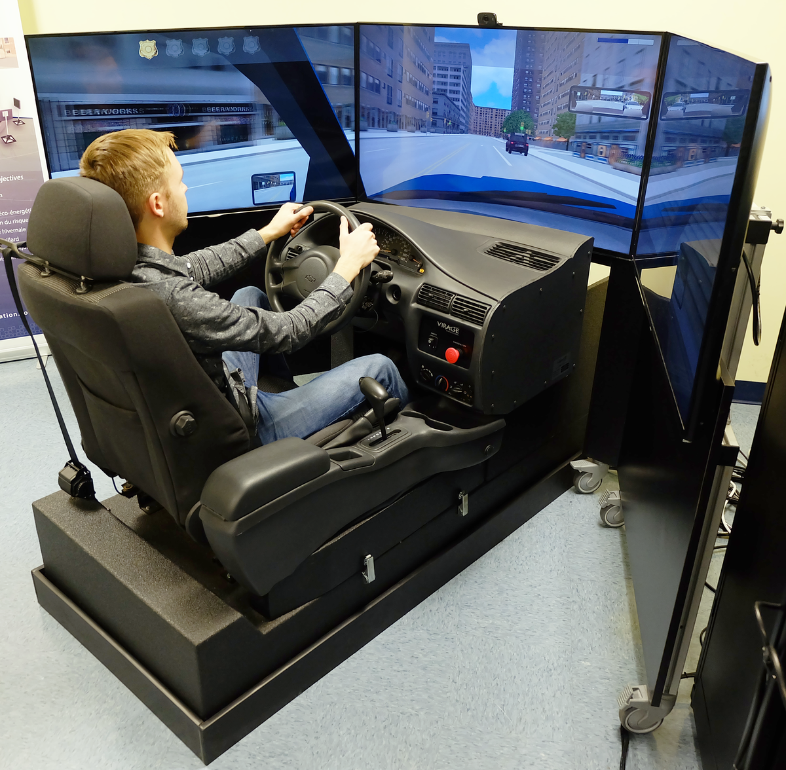
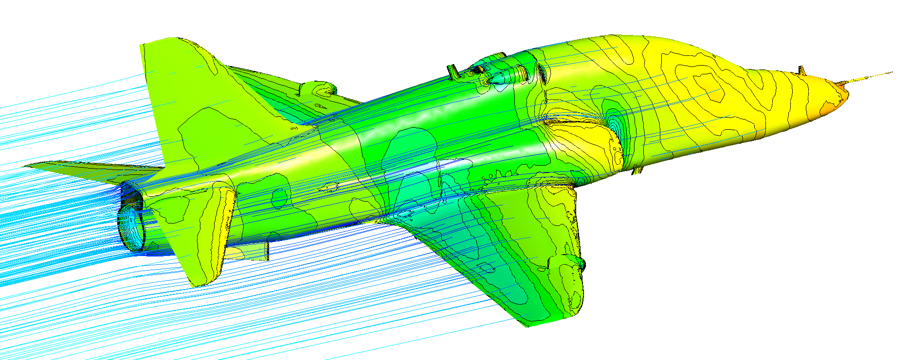
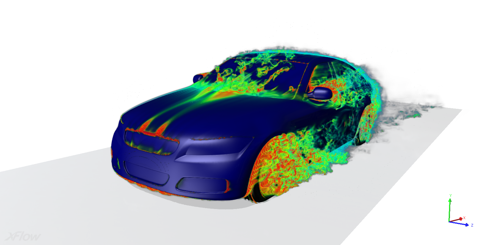
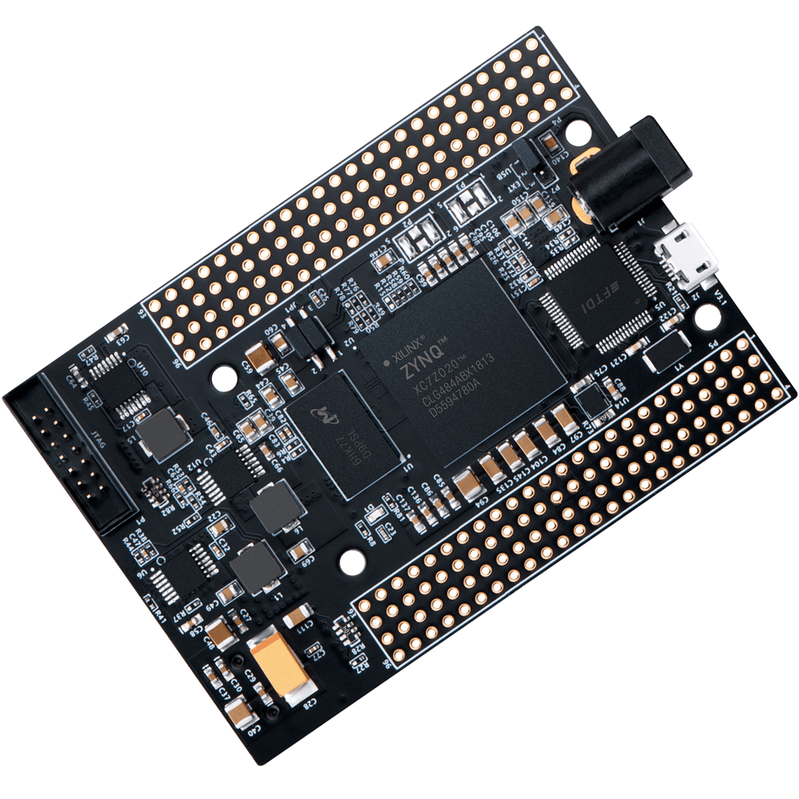

## SECTION I: Simulation et émulation

### Introduction :

Simulation et émulation sont quelques termes que la plupart d'entre nous tiennent pour acquis ces jours-ci et les utilisent généralement de manière interchangeable en pensant qu'ils représentent la même idée, mais comprenons-nous vraiment quelles sont les différences fondamentales entre deux des concepts les plus fondamentaux de l'informatique?

Commençons par un exemple simple mais puissant, la terminologie d'une photographie, basée sur le fait qu'il s'agit **"d'une grille de couleurs sur papier ou écran"** en fait une émulation car elle capture au plus près les fonctionnalités dont nous avons besoin à la réalité que possible, c'est-à-dire comment chaque chose regardait ce moment ou ce moment précis.

Cependant une simulation à l'inverse de ce même moment serait réalisée en reconstruisant la scène entière dans un environnement sandbox, c'est-à-dire des atomes, des forces ... etc ou à un niveau supérieur des polygones ou des modèles 3D des objets, des personnes ... et ainsi de suite, bien sûr, cela ne ressemblerait pas exactement à la photographie, et c'est pourquoi elle simule la réalité par un niveau de fidélité.

Donc, évidemment, l'émulation est utilisée car elle fait ce dont nous avons besoin de la manière la plus réaliste **possible**, donc il semble que nous cherchions, utilisons ou interagissons plus généralement avec des choses réelles. Néanmoins, cela dépend toujours entièrement du domaine d'intérêt où ce n'est peut-être pas le même cas compte tenu du large spectre où ces termes peuvent être utilisés.

### Simulation:

#### Définition:

> **"Donner ou assumer l'apparence ou l'effet souvent avec l'intention de tromper."** Merriam-webster^[https://www.merriam-webster.com]

Simuler, c'est construire un modèle qui peut être *manipulé* pour répondre à une ou plusieurs questions. C'est aussi un modèle de système cible fait pour représenter dynamiquement son comportement dans différentes conditions, il est basé sur des modèles mathématiques dans des programmes informatiques.

En général, une simulation est une approximation d'un système qui représente son fonctionnement par rapport au temps, elle essaie d'aller aussi loin que possible en imitant les causes profondes **caractéristiques clés** de l'artefact simulé, en reconstruisant l'objet simulé dans un environnement externe.

En pratique, une simulation est utilisée au cas où le système cible ne peut pas être utilisé, car il est en **en actif développement** par exemple *nouvelle architecture CPU, console de jeux ...* ou un **projet unique** tel que *nouveau matériel, arme dangereuse ...* ou c'est simplement impossible à faire en réalité; Ainsi que des prévisions d'événements, par exemple *météo, géologie ...* ou toute science liée à la nature.

Le niveau de perfection de la simulation est appelé le niveau de **"Fidélité"**, et il peut être l'un des trois niveaux *[Faible, Moyen ou Élevé]*, selon la proximité de la simulation par rapport au système cible.

> Remarque: de manière réaliste, le terme Simulation a un large éventail de représentations en fonction du contexte dans lequel il est utilisé, dans cet article, nous prendrons la représentation informatique seulement.

#### Contexte de simulation:

La simulation historique a été utilisée dans de nombreuses disciplines scientifiques, ce type d'activité a principalement commencé juste après la **Seconde Guerre mondiale** [1945] et s'est développé depuis pour couvrir un plus large éventail de sciences comme la physique, la physique des particules, la dynamique des fluides, la biologie, la virologie, la sociologie et plus encore, l'architecture par exemple était et utilise toujours la simulation de bâtiment en réalisant de petits modèles à l'aide de papier avant les logiciels 3D Tels qu'AutoCAD, 3DS Max, Civil 3D, Revit, Sketchup et plus activaient des fonctions de simulation avancées.

Du point de vue de l'informatique, une simulation est un programme qui s'exécute sur un ordinateur et prend en entrée l'état et la somme des données d'entrée au moment **"t - 1"** du système simulé afin de calculer le les sorties requises qui sont les entrées du système simulé qui en retour renvoie l'état suivant dans **"t + 1"** et ainsi de suite.

$$S_t=s(S_{t-1},\ \sum{i_{t-1}})$$

Où :

> *s(S, i)* est la fonction d'état

> *S~t-1~* l'ancien état

> *S~t~* le nouvel état

> *i*~t-1~ l'entrée à *t-1*

Un exemple extrêmement populaire et simple qui mérite d'être noté pour en savoir plus sur les simulations est la simulation / jeu **"John Conway Game Of Life"**^[https://copy.sh/life/].

#### Types de simulation:

##### Simulation logicielle: {-}

+ **Autonome:**

Il est basé sur un seul poste de travail / serveur, ce type est donc globalement axé sur les simulations à faible charge.

+ **Distribué:**

Aussi appelé DIS^[Distributed Interactive Simulation], il s'agit d'un standard IEEE^[The Institute of Electrical and Electronics Engineers] développé par le groupe SISO^[Simulations Interoperability Standards Group]. DIS est un protocole réseau qui a été principalement développé pour le monde virtuel militaire. Simulations temporelles, il utilise des PDU^[Protocol Data Units] pour échanger diverses formes de données sur le champ de bataille 3D pour des applications militaires.

Une implémentation est l'organisation Open Source Project **"open-dis"**^[open-dis.org], qui vise à implémenter le protocole DIS dans différents langages tels que *[C ++, Python, Java ...]* et le rendre disponible pour un usage public général sous la **"Licence BSD-2-Clause"** pour la plupart des implémentations.

+ **Parallèle:**

Les super ordinateurs sont utilisés dans ce type, pour des calcules extrêmement avancées dans les domaines scientifiques tell que physique, chimie, mathématiques etc.

+ **Interopérable:**

Simulation as Service est un sous-type de "Software as a Service", c'est un service en ligne qui offre une puissance de calcul au client afin d'exécuter des simulations extrêmement complexes dans leurs serveurs ou supercalculateurs, le client s'interface avec la simulation en utilisant l'interface web du fournisseur SaaS "UI".

##### Simulation matérielle: {-}

Dans la plupart des cas, la simulation matérielle est mélangée à la simulation logicielle pour l'analyse des données.
Ils sont souvent basés sur les technologies VR (Virtual Riality) et/ou AR (Augmented Reality) pour une interaction humaine fluide avec la simulation. Cette famille comprend:

+ Simulateurs de vol
+ Simulateurs de conduite
+ Simulateurs spatiaux

Logiciel spécialisé pour la simulation mécanique, des fluides, architecture tell que :

+ SolidWorks
- Mathlab
- Wolfram Mathematica

et plus.

#### Applications :

- Modèles scientifiques
- Conception architecturale

{width=50%}
{width=50%}

- Formation et tests

{width=60%}
{width=40%}

- Jeux vidéos
- Prototypage et tests

{width=50%}
{width=50%}

- Applications de soins de santé

{width=75%}

### Émulation:

#### Définition:

Émuler signifie être comme ou battre l'objet ou le système émulé, dans son sens pur de *l'informatique*, cela décrit la capacité de faire fonctionner le *système émulé* sur un **environnement / architecture** ou **matériel** différent sans modification, signifiant *"simuler l'environnement d'origine"*.

L'émulation est une **couche logicielle traduction** ou en d'autres termes un *"programme"* qui définit entre la **cible et la plate-forme** que nous voulons exécuter et le système d'exploitation hôte qui à son tour contrôle le matériel physique sous-jacent. Cette couche est capable de **traduire** l'architecture étrangère **les instructions** du programme émulé en instructions que le processeur hôte peut **comprendre** "est capable d'exécuter" et avec cela nous pouvons émuler un autre type du matériel sur lequel le programme s'attend à s'exécuter, créant ainsi un environnement **élevé compatibilité** pour le logiciel cible à exécuter.

Par exemple, si un programme *nativement* s'exécute sur le système **X** et ne s'exécute pas sur le système **Y**, nous émulons **X ** dans **Y** et exécutons le programme dans l'émulation de système **X** qui est émulé sur le système **Y**.

Dans de nombreux cas, le logiciel émulé a la capacité de se surpasser considérablement sur le matériel d'origine, en d'autres termes, il peut fonctionner avec des performances, une résolution et une stabilité plus élevées.

Maintenant que les définitions ne précisent pas toujours ce qu'est réellement l'émulation, voyons comment tout a commencé, qu'est-ce que c'est et comment cela fonctionne même?

#### Contexte :

L'émulation est effectuée en imitant le matériel sous-jacent d'un logiciel donné pour le faire fonctionner sur n'importe quel environnement. Toute l'idée a été lancée par **IBM**^[International Business Machines] vers 1995, alors que les deux projets **YSE**^[Yorktown Simulation Engine] et **EVE**^[Engineering Verification Engine] sont conçus pour l'émulation matérielle.

Du côté de l'émulation logicielle, il a été suivi de **MAME**^[Multipel Arcade Machine Emulator] qui est un émulateur de logiciel open source pour consoles de jeux d'arcade, conçu par *Nichola Samorya* Sorti le 05 février 1997. Lancé en premier le **Plateforme MSDOS** et portée plus tard sous les systèmes d'exploitation **Unix**,  elle a été initialement écrite en **C** puis portée en **C++** pour une meilleure qualité de code.

Les émulateurs peuvent émuler une grande variété de matériels tels que les cartes graphiques, les architectures de processeurs, les cartes son, les chipsets, la gestion de la mémoire, les technologies de stockage et presque toutes les combinaisons matérielles et logicielles possibles.

#### Types d'émulateurs:

L'émulation se divise principalement en deux sous-ensembles, l'émulation matérielle et logicielle.
En fonction des besoins d'émulation, l'un ou l'autre est utilisé, car chaque type présente son propre ensemble d'avantages et d'inconvénients.

##### Émulateurs matériels: {-}

L'idée est d'émuler du matériel avec un matériel équivalent ou différent plus général, il est principalement utilisé dans le prototypage et les tests d'architectures matérielles en cours de conception et de construction.

À des fins d'émulation matérielle, les méthodes suivantes sont souvent utilisées:

- **ASIC: **

Les ASIC^[Application Specific Integrated Circuit] sont un type de matériel spécialement conçu pour un type particulier de charges de travail cumulées, ce qui signifie que le rapport performances / consommation d'énergie est vraiment élevé par rapport à l'utilisation d'autres matériels à usage général. En général, les ASIC sont largement utilisés dans l'extraction de crypto-monnaie en raison de leur efficacité.

{width=75%}

- **FPGA: **

Les FPGA^[Field Programmable Gate Arrays] sont des matériels à usage général, en théorie, ils sont capables d'émuler n'importe quel type ou architecture possible à condition qu'il y en ait assez. Les FPGA ne sont fondamentalement rien de plus qu'un tas de portes logiques numériques empilées pour former une puce de silicium programmable capable d'imiter tout type de puce matérielle d'une complexité équivalente ou inférieure.

{width=75%}

##### Émulateurs logiciels: {-}

Les émulateurs logiciels visent à recréer le comportement réel du système émulé, avec les performances les plus élevées possible, cette branche comprend:

Software emulators aim at recreating the real life behavior of the emulated system, with the highest performance possible, this branch includes :

+ **Consoles de jeux vidéo** :

+-------+-------------------------------+
| PCSX2 | Emulateur Playstation         |
+-------+-------------------------------+
| Cemu  | emulateur Wii U               |
+-------+-------------------------------+

+ **Réseaux** :

+---------------+---------------------------------------------------------+
| Packet Tracer | Émulateur de réseau d'apprentissage et de test de Cisco |
+---------------+---------------------------------------------------------+
| GNS3          | Graphical Network Simulator (Par Emulation)             |
+---------------+---------------------------------------------------------+
| EVE-ng        | Emulated Virtual Environment - Next Generation          |
+---------------+---------------------------------------------------------+

+ **CPU** :

+--------+-------------------------------------------+
| QEMU   | emulateur d'architectures                 |
+--------+-------------------------------------------+
| BOCHS  | x86 & x86_64 instruction set emulator     |
+--------+-------------------------------------------+
| DOSBOX | x86 Disk Operating System DOS             |
+--------+-------------------------------------------+

+ **Systèmes d'exploitation** :

+-----------------------------------+--------------------------------------------------------------------------+
| WINE^[Wine Is Not an Emulator]    | WINE est une couche de compatibilité pour logiciels Windows sur Linux    |
+-----------------------------------+--------------------------------------------------------------------------+
| Darling                           | Darling est une couche de compatibilité pour logiciels MacOS sous Linux  |
+-----------------------------------+--------------------------------------------------------------------------+
| BlueStacks                        | Emulateur Android                                                        |
+-----------------------------------+--------------------------------------------------------------------------+
| Cygwin                            | Système d'exploitation Linux sur Windows                                 |
+-----------------------------------+--------------------------------------------------------------------------+
| WSL^[Windows Subsystem for Linux] | Windows Subsystem for Linux                                              |
+-----------------------------------+--------------------------------------------------------------------------+

#### Applications	:

- Exécution de programmes destinés à d'autres architectures matérielles
- Exécution de plusieurs systèmes d'exploitation sur le même matériel
- Exécution du firmware hérité

#### Avantages et inconvénients:

##### Les inconvénients :{-}

- Plus lent que le matériel réel dans la plupart des cas si non optimisé
- Nécessite matériel sophistiqués
- Possibilité de problèmes de compatibilité
- Extrêmement compliqué dans la processus de développement
- Processus chronophage
- Problèmes juridiques possibles dans certains cas

##### Avantages :{-}

- Capacité de *personnalisation* supérieure
- Conserve l'ancien matériel et les logiciels *en vie*
- Aide à *faciliter* le développement et les coûts
- Le plus susceptible d'atteindre *plus performace*
- Le ciel est la limite de la capacité d'émulation

