# General Introduction

## Introduction

In todays world digital life is a crucial part for every human being daily life. Social media networks such as facebook, instagram, twitter & linkedin are in a sense vital these days.
Further more we have cloud services providers on the enterprise world presented by technology leaders like AWS^[Amazon Web Services], Linode & Alibaba Cloud services amongst others; This also includes a heap of online banking & shopping and much more **aaS**^[as a Service] providers, which are all based on information technology systems and the ability to **save, secure** & **serve data**.

<div id="bigfive" style="centered">
{#fig:amazon width=20%}
{#fig:apple width=20%}
{#fig:facebook width=20%}
{#fig:google width=20%}
{#fig:microsoft width=14%}
</div>

The giant technology companies of our modern society also known as the big five, **Amazon, Apple, Facebook, Google & Microsoft** are said to be in hold of a noteworthy^[Specific data size information not available to the public] deal of the global aggregate information quantity, and it's by no means a straightforward process to effectively and efficiently manage these huge data mines without the proper underling *secure, coordinated & fast* infrastructures. In such circumstances the ability to handle massive amounts of data flow is fatal, therefore stability, scalability and reliability is critical which require a sophisticated near perfection pipelining systems in every single aspect. Consequently, to achieve this high level of sophistication, some of the latest bleeding edge technologies in the field must be leveraged. That said one of the most valuable arms that are being used to accomplish this goal is the **Containerization technology** or just **Containerization** for short, it is one the most important key elements in data centers all over the globe; However by doing so a lot of questions will arise and as it's been well known, with the latest and greatest comes the worst in terms of security risks and vulnerabilities that must be coped with.

> **"A flaw in the host kernel could allow a process within a container to break out and take over the system."**

Is one way a security researcher described how insecure containers can potentially be as opposed to good old virtual machines.


## Problematic

Containerization technology must be deployed in our datacenters due to the great deal of features and capabilities that no other technology will, but due to it's relatively young age it's not really that wide spread as it should be and the main factor in that is correlated to the lack of the necessary knowledge & documentation around some advanced or even basic features. The other side of the issue is that most system administrator don't actually want to leave their comfort zone, falling back to virtualizaion in order to not have to deal with the emerging issues of this technology mainly the security aspect of it.

In today's cyber security community it is a fact that Containers and Containerization in general is still isn't mature enough in a cyber security aspect to be deployed directly in the absence of any kind of external security measures, and even with that in place containerization deployments are still vulnerable to an external sources of threat which are completely out of their own control.

On the 25th of April 2019 a containerization images database called "Dockerhub"^[https://hub.docker.com] has been breached by an unknown attacker as stated in a followup article by **hackernews**^[https://news.ycombinator.com] right after the disclosure,

> **" Docker Hub, one of the largest cloud-based library of Docker container images, has suffered a data breach after an unknown attacker gained access to the company's single Hub database. "**

After investigating the incident Dockerhub team reacted as quickly as possible to prevent any further losses and warned it's users :

> **"On Thursday, April 25th, 2019, we discovered unauthorized access to a single Hub database storing a subset of non-financial user data. Upon discovery, we acted quickly to intervene and secure the site."**

And regarding the damages caused, the article stated :

> **" The breach reportedly exposed sensitive information for nearly 190,000 Hub users (that's less than 5 percent of total users), including usernames and hashed passwords for a small percentage of the affected users, as well as Github and Bitbucket tokens for Docker repositories. "**

The company didn't give any further information about how it's database was breached.

This type of *cyber attacks* are in general fatal since they target a publicly trusted distribution system, responsible for supplying base images all around the world where it's used in multitude of applications like for example banking systems, military bases and so on, which will be under the hacker's control. This is one of many cases that shows how delicate containerization infrastructure really is.

At this point we're left with some major questions :

- Is Containerization really that unsecure ?
- How to use it correctly ?
- How to provide an environment that is risk free for this relatively young technology ?
- What are the tools that are on our reach at this moment that are going to help us mitigate this kind of malicious events in the future ?


## Methodology

In order to dive deeper & investigate these questions a variety of resources has been used alongside some techniques to test and validate concepts and ideas.

Generally speaking the data in question is mostly **qualitative**, that is it's based on descriptions and definitions that revolved around the topic at hand which is mainly how to deploy a containerized environment & what are the best practices to secure its components, however the data collection was by no means randomly done, every single bit of information was extensively analyzed and tested as much as possible in both hard/software-wise to make sure that it was up to the level of validity that in my humble opinion is deemed to be acceptable as a set of standard cybersecurity best practices and deployment techniques.

Every single data source used to build this paper is included at the **"Bibliography" SECTION** of the last **CHAPTER** on this paper.

I deem the Linux manual pages i.e the **`man`** as one of the & most trustworthy roots of valid and testable data on this topic, it's certainly checkable on every aspect at every time, unless major changes will be committed to software at or after the time at which this paper has been published publicly, therefor every single software version that was used in this work is included.

### Hardware :

+-----------+-------------------------+
| Component | Model                   |
+===========+=========================+
| Laptop    | Lenovo Thinkpad X1 Yoga |
+-----------+-------------------------+
| RAM       | 16 GB                   |
+-----------+-------------------------+
| CPU       | i7 6600U                |
+-----------+-------------------------+

: Used\ Hardware {#tbl:Used_Hardware}

### Software :

+--------------+-------------------------------+
| Software     | Version                       |
+==============+===============================+
| Linux        | Linux pc 5.7.2-arch1-1        |
+--------------+-------------------------------+
| Distribution | Archlinux                     |
+--------------+-------------------------------+
| Qemu         | QEMU emulator version 5.0.0   |
+--------------+-------------------------------+
| Libvirt      | libvirtd (libvirt) 6.5.0      |
+--------------+-------------------------------+
| Virtmanager  | Virtual Machine Manager 2.2.1 |
+--------------+-------------------------------+
| Libguestfs   | libguestfs 1.42.0-2           |
+--------------+-------------------------------+
| Openvswitch  |                               |
+--------------+-------------------------------+
| Docker       |                               |
+--------------+-------------------------------+

: Used\ Software {#tbl:used_software}

## Objectives

### Main

1. Understanding the basic concepts about the topic
   i. Simulation
   ii. Emulation
   iii. Virtualization
   iv. Containerization
1. Setting up Qemu/kvm virtualizaion to host
   i. Archlinux virtualization guest with Nested Qemu/kvm hypervisor with Web UI
   ii. Fedora containerization guest
1. Setting up Docker in a virtualized environment
1. Containerization guest/host hardening

### Auxiliary

1. Making Qemu easier to learn by using a web interface
1. Setting up a secure environment for docker containers
1. Disk image manipulation from the command line

## Company

ARES^[https://www.aresalgerie.com/] Algeria was created in 2003 following the desire to set up the company ARES France on the Algerian territory, the latter was part of one of the best (computer engineering services company) in France. Starting from late 2008 ARES Algeria is now a 100% Algerian company. ARES Algeria is specialized in the marketing and implementation of integrated IT solutions for companies and large administrations. It is involved in the integration of IT services in different sectors on the Algerian market.

ARES Algeria presents an end-to-end solutions portfolio integrating active and passive equipment, software, and specialized services, for all infrastructure needs: Virtualization, convergence, and cloud.

They aim at providing support to their clients and future clients in their digital transformation and to provide innovative solutions in the modernization of their business solutions. ARES team is a multidisciplinary, specialized, trained and certified team on the different technologies that they support. They Also have an in-house demo platform that is being used to test the different solutions and present them to their customers.

Check them out at :

> https://www.aresalgerie.com/


# Concepts

## Introduction

Arguably a good understanding of any topic is required to achieve any admirable accomplishment in that particular filed, And in some cases this involves making the somewhat close concepts distinct from the main subject of interest.

In that context, containerization is not different it clearly overlaps with a couple of similar ideas in computer science, rendering any attempt to grasp its notions associated strongly with adjacent concepts.
Throughout this chapter we'll be exploring what makes containerization technology standout apart from other similar technologies such as virtualizaion.

In the near past IT services were deployed straight on top of **physical hardware**, although this approach was significantly easier it was clearly a waste of resources across the board. Servers obviously wasn't running at their full performance, **CPU & RAM** usage used to be low most of the time, Storage devices weren't being used in the most efficient way possible let alone the power consumption. In short computing power is getting wasted.

This situation pushed the engineers to think in a completely different way to find an more optimized method to address this problem.

As a possible solution for this issue **"Virtualization technology"** was invented and used, by using this relatively new technology at the time service providers were able to remarkably reduce **server ideling** time, which allowed system administrators a much higher ability to manage servers, however *"something was still not right, with this concept"* the engineers thought, or at least it wasn't a complete solution yet. They went back to the design board to figure out what is it that is wrong and how to go about solving it.

After a deep analysis of the issue they figured, why spinning multiple VMs of the same base operating system for every single service/software we want to run why not using only a **single instance** of the same operating system and somehow manage to split it **internally** to allow for multiple software to run without interfering with each other, and that is what we call **"Containerization technology"**.

So how each of **"Virtualization"** & **"Containerization"** technologies work and what are the essential differences amongst the two ? This it the question that we'll discuss in this SECTION.

## SECTION I : Virtualization & Containerization

### Virtualization

#### Definition

Multiplexing resources
Pure virtualization is about **resource management** by multiplexing them along side **process isolation**, it basically works by splitting resources of a single or multiple **host machine(s)** into multiple **software isolated guests** which are called **"Virtual Machines"** or **VM**s for short, these guests must be of the same architecture as the host they are virtualized on top of.

It leverages the CPU **virtualization instrucion set** to run guest instructions directly on the CPU, by taking advantage of **accelerated** virtualization, virtual machines are able to achieve high levels of performance, in case were the host's CPU lacks virtualization compatibility, it will fall back to **Software Virtualization** instead which results in a much lower performance.

Is a technology that allows for running multiple operating systems on the same host using the same hardware, it uses emulation in order emulate hardware as virtual hardware on the host which will appear as physical in the guest operating systems, the key feature of virtualization is the ability to run multiple operating systems under the same hypervisor.

#### Background

Virtualization appeared in the 1960s related to the relatively popular multiuser "mainframes" such as **"IBM S/360, S/370"** and **"DEC PDP-10"**, Obviously at the time user isolation was an essential requirement due to the fundamental nature of the mainframes. At that point in time Virtualization was completely disregarded due the development of **MULTIX & UNIX** and **UNIX like Operating Systems**^[BSD, Linux...] in general which solved the users/processes isolation & separation concerns by implementing time-sharing.

In 1974 **"Popek and Goldberg"** wrote a paper at *Harvard University* called **"Formal Requirements for Virtualizable Third Generation Architectures"**, which laid down the *fundamental Virtualization Principles* stating the folowing :

> First the efficiency principle, *" All innocuous instructions are executed by the hardware directly, with no intervention at all on the part of the control program. "*

Specifying that the virtual machine instructions must run directly on the hardware without any intervention from the VMM^[Virtual Machine Monitor] which is essential to achieve the same performance as running directly on top of physical hardware.

> Secondly the Resource Control principle, *" It must be impossible for that arbitrary program to affect the system resources, i.e. memory, available to it; the allocator of the control program is to be invoked upon any attempt. "*

That states that the VMM must be in full control of the virtualized resources so that the virtual machine code is not able to alter any aspect outside of the environment allocated to it by the VMM and any malicious instruction is trapped otherways.

> Thirdly the equivalence principle, *" Any program K executing with a control program resident, with two possible exceptions, performs in a manner indistinguishable from the case when the control program did not exist and K had whatever freedom of access to privileged instructions that the programmer had intended. "*

That is the virtual machines should have identical "equivalent" behavior running inside of the VMM as if it's running on bare-metal directly.

These principles became the blueprint of Virtualization capable hardware, however this didn't happen until few years later.

Forwarding to 1990s server owners found themselves in a major hardware under-use in other words "waste", since different software wasn't compatible with different vendors hardware which forced them to use a server for every task or service they are running, this caused a lot of servers to run for what was virtually nothing, which caused the real virtualization takeoff and thereof cloud-computing ecosystems.


#### Components

##### Host

The base hardware that the hypervisor is installed on top of *(usually physical but doesn't have to be)* in order to split and manage its resources among the Virtual Machines, notice that the total sum of the guest and the hypervisor resource consumption of a given type cannot under any circumstance exceed the available physical resources of the same type on the host.

The Host is in charge of providing resources such as CPU, Memory, Buses, Storage, Networking, external I/O, to the Virtual Machines through the hypervisor which abstracts these resources from the guests most of the time.

##### Hypervisor

The Hypervisor or VMM as it is usually called, is in essence the software layer that sits on top of the host's physical hardware and is responsible for the physical resources separation & allocation to virtual resources from the Host as needed to Guests, it's also responsible for the Creation, Monitoring & management of the Virtual Machines it hypervises.

###### hypervisor types :{-}

- **Type 1 Hypervisor :**

Also known as Bare-metal or Native Hypervisor, it's the first type VMM since it's installed directly on the host hardware, it is a specialized operating system made from the ground up for virtualization purposes.
Type 1 renders the host machine a Virtualization platform only so in most of the cases it's not possible to be used for other intents, this makes Bare-metal hypervisors an extremly high performance hypervisors compared to the what other types has to offer.
They're generaly lightwight operating systems, with bare bones user interface ( UI ) for setting up the essential parameters such as server networking " ip , netmask, dns, domain name ", Administrator Credentials, updates, management Console "shell".

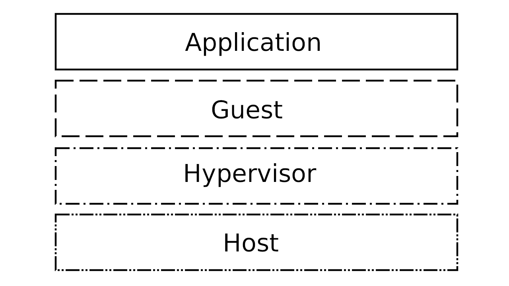{#fig:type1hyp width=100%}

Some of the type one hypervisors include :

+-------------------+-----------------------+----------------+
| Hypervisor        | Base Operating System | Licenseing     |
+===================+=======================+================+
| KVM               | Linux                 | Free           |
+-------------------+-----------------------+----------------+
| VMM/VMD           | OpenBSD               | Free           |
+-------------------+-----------------------+----------------+
| Bhyve             | FreeBSD               | Free           |
+-------------------+-----------------------+----------------+
| OpenVZ            | Linux                 | Free           |
+-------------------+-----------------------+----------------+
| Xen Project       | Linux/BSD             | Payed          |
+-------------------+-----------------------+----------------+
| Citrix Hypervisor | Linux                 | Payed          |
+-------------------+-----------------------+----------------+
| XCP-ng            | Linux                 | Free           |
+-------------------+-----------------------+----------------+
| Proxmox           | Linux                 | Free           |
+-------------------+-----------------------+----------------+
| Oracle VM         | Custom                | Payed          |
+-------------------+-----------------------+----------------+
| Microsoft Hyper-V | Windows               | Payed          |
+-------------------+-----------------------+----------------+
| VMware ESX/ESXi   | Custom/Propreitary    | Payed          |
+-------------------+-----------------------+----------------+

: First Type Hypervisors {#tbl:type1_hyp}


- **Type 2 Hypervisor:**

Also called **Hosted Hypervisor** this Type is installed on top of perinstalled operating system on the host machine, hence the "Type 2" it's also called a Hosted Hypervisor. The nature of being installed on top of an preexisting operating system causes this type to have relatively lower performance because of the multiple layers of software which introduces a significant deal of latency in execution.

Being an application which Graphical User Interface in most of the cases, They provide an easier way to manage the Virtualization environment, this is specificaly usefull for unexperienced individuals and small to medium sized companies.

As far as features goes, this type obviously lacks a lot of what enterprise grade hypervisors has to offer

{#fig:type2hyp width=90%}

Some type 2 hypervisors :

+--------------------+---------------------+
| Hypervisor         | Operating System    |
+====================+=====================+
| Gnome Boxes        | Linux               |
+--------------------+---------------------+
| Oracle VirtualBox  | Linux/Windows       |
+--------------------+---------------------+
| VMware Workstation | Linux/Windows/Macos |
+--------------------+---------------------+
| VMware Player      | Linux/Windows/Macos |
+--------------------+---------------------+
| VMware Fusion      | Linux/Windows/Macos |
+--------------------+---------------------+

: Second Type Hypervisors {#tbl:type2_hyp}

- **Diffrences :**

The comparison diagram bellow shows clearly that type 2 hypervisors have one additional layer as opposed to type 1 hypervisors.

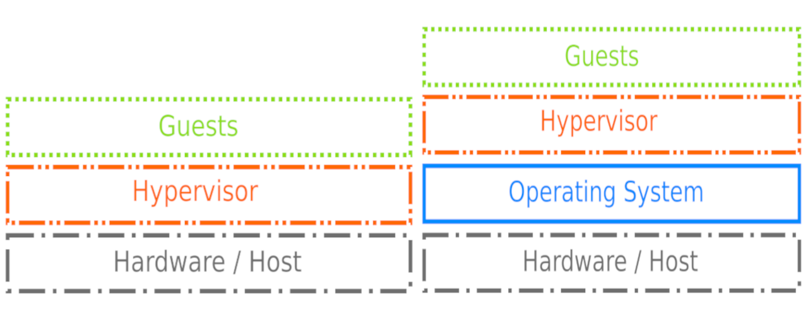{#fig:type1vs2 width=105%}

This makes type 2 hypervisors slower by definition since all system calls have to go through the Operating System then to the Kernel before it reaches the hardware which will certainly showup as a performance hit at the guests level, This overhead is unavoidable in that case.


- **Hybrid Hypervisor :**

Hybrid hypervisors is a type that is capable of running on both secnarios. That is, straight on hardware without any underling Operating System, Or installed alongside other software on top of a presetup Operating System.

The only Hypervisor that falles ender this category is **Qemu/KVM**.

##### Guest

Also called Virtual Machine or VM for short, is the operating system or software that is installed and managed by the hypervisor each VM has its own resources , in enterprise environments each VM represents a hosted standalone service.

#### Types

Virtualization splits to three main branches each one with it's own set of properties, however they aren't mutually exclusive.

- **Para-Virtualization :**

In This type of virtualization the guest operating system must be modified in order to be virtualized hence why it's also called **"OS Assisted"** Virtualization, these modifications are drivers or patches that must be applied at the kernel level on the guest OS.

This technology was developed by XEN and it used to be called **paravirt-ops**, **Para-** is a Greek word that stands for "with" & "alongside", which explains the principle of paravirtualization.

These patches replaces the most sensitive not virtualizable instructions in the guest ISA^[Instruction Set Architecture], this opens a communication channel between the guest and the hypervisor, since the guests are running on **Ring 3** least privilege mode they are not capable of executing hardware `syscalls` directly, for instance some hardware  instructions or `syscalls` such as memory management, interrupt handler are replaced with it's equivalent hypervisor calls or `hypercalls` so that they're traped by the VMM, the hypervisor then executes the guest's instructions on the hardware then returns the results to the source VM.

{#fig:paravirt width=100% }

A clear downside of paravirtualization is that is can't run unmodified guests such as old operating systems or completely new ones until support is added.


- **Full-Virtualization :**

The guests under full virtualization run completely unmodified, which means the guests are not aware that they are being virtualized at all, this is achieved by running the guest instructions using **Binary Translation** on run-time for privileged not virtualizable instruction along side **Shadow Page Table** for memory management, however userspace instructions run directly on the hardware.

Binary translation was developed by VMware in order to make x86 platform virtualizable, which it was said to be impossible back then.

This works by Trapping & Translating the guest's high privilege instructions at the guest run-time, so that if the guest issued a high privileged `syscall` it will be trapped and Translated to a sequence of low privilege instructions by The VMM so that it can be executed on the virtual hardware.

{#fig:fullvirt width=100%}

It uses an instruction cache to keep the most recent translated instructions in order to improve performance at the cost of memory usage.

As shown in the figure above [@fig:fullvirt] this model uses the processor ring protection modes to isolate/protect the virtualization components from any tampering or malicious behavior.

- **Hardware Assisted Virtualization :**

Here the hardware is responsible for catching the sensitive instructions and redirecting them back to the Hypervisor, in this case any privileged instruction will flag a hardware interrupt. This support is actually built into the processors them selfs rather than being a software implementation, its also called hardware acceleration, it uses both Intel VT-x & AMD AMD-V hardware virtualization interface and IOMMU^[Input Output Memory Management Unit] for handling IO virtualization and Intel EPT^[Extended Page Tables] & AMD RVI^[Rapid Virtualization Indexing] for fast TLB^[Translation Lookaside Buffer] and memory access.

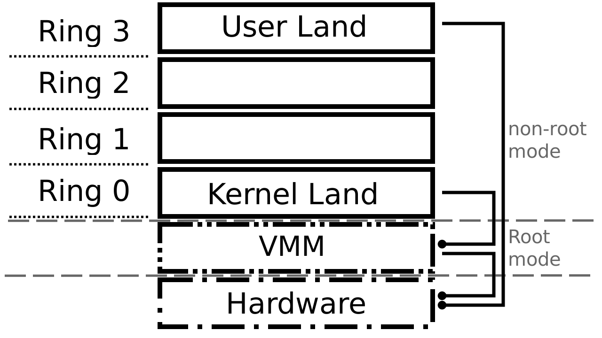{#fig:hardvirt width=100%}

The Hypervisor runs on privilege mode bellow Ring 0 which is called *Ring 0P Privileged root mode*, Since the hardware it self is assisting the hypervisor. While the guests run on a mode called *Ring 0D De-privileged non-root mode* on top of the Hypervisor's privilege mode, which is theoretically Ring 0 as far as the guest OS is concerned.


- **Virtualization Differences Table :**

+---------------------+-----------------------------------+
| Method              | Mode                              |
+=====================+===================================+
| Para-Virtualization | Guest Modification, Hypercalls    |
+---------------------+-----------------------------------+
| Full-Virtualization | Binary Translation at run time    |
+---------------------+-----------------------------------+
| Hardware-Assisted   | VT-x & AMD-V ISA Ring0P & Ring 0D |
+---------------------+-----------------------------------+

#### Features

- **Snapshots :**

The ability to save the current state of the guest to the system storage, this functionality helps in case a guest is facing a failure after an update or a malicious software installation in which case the system administrator will have the ability to restore a clean known working Snapshot.

- **Migration :**

Migration adds the ability to move guest virtual machines from a host to another, and it can be done in three different ways

- **cold** : Completely shuting down the guest VM rendering it unoperational during the migration process
- **warm** : Pausing the VM while migrating, this will cause a minor down time
- **live** : No down time at all, the VM is migrated without any interruption in the services it's running

- **Nested Virtualization :**

The ability to recursively run VMs within each other, this functionality require hardware support.

- **Failover :**

Failover is a safety mechanism to switch back to in case of a failure in the main virtualization infrastructure or one of its components.

- **High Availability :**

High Availability relays heavily on Load Balancing to make sure that any functionality will be available to the clients no matter what, This happens by switching the load from unhealthy infrastructure components to the more capable ones.

<!--
- **Storage Virtualization :**
- **Data Virtualization :**
- **Desktop Virtualization :**
- **Server Virtualization :**
- **Operating System Virtualization :**
- **Network Functions Virtualization :**
-->

#### Pros & Cons :

- **Pros :**

- High Security
- High Isolation
- Stability
- Compatibility

- **Cons :**

- High resource usage
- High boot times in general
- Slightly harder to maintain

### Containerization

#### Introduction

Instead of overloading the infrastructure with heaps of duplicate and mostly identical virtual machines, the tech industry have gone the containerization path. Obviously this move is driven by the need for an faster, lighter wight, manageable & maintainable and hopefully secure development, distribution & deployment model.

As the virtualization little brother containerization have become the defacto standard for software development all around the tech industry, at this point this relatively new technology is changing how software is being written and distributed for ever.

Next we'll see what exactly it is? How it works? And what we can use it for?

#### Definition

A container is striped out version of an application or operating system whether it is Unix-like or windows. The most important aspect of a container is that it has no kernel as opposed to virtual machines that comes prepacked since it's installed from an `iso` image or a `pxe` server; This makes containers that run on a particular host with a specific architecture, kernel/architecture dependent on that host.

Containerization **engine** or **container runtime** are the "hypervisors" in the world of containerization, these engines can be a daemon running as a background process like *Dockers'* *dockerd* or a user space tool to manage containers as system processes like RedHats' **Podman**. Another important aspect of containers is that they default to support only one application per container, and this propriety is called **"immutability"** so since containers are immutable by design, any improvements are done to the base image will completely replace the currently running container by simply destroying the old container and spinning the new one from the updated base image. In another spectrum a virtual machine is created to last as long as it possibly can by periodic maintenance and cleaning; A container is the complete opposite of that, a container is started to only accomplish a single task, once that's done it gets destroyed instantly this model is called **Microservices**.

Another one of the biggest selling points of containerization technology is the startup/shutdown time, while a virtual machine can take from 30-60 seconds or even more in some cases to boot and be completely usable, containers take a fraction of this time at 1-2 seconds. Due to the size difference since usually a VM is few Gigabytes large ~1-5GB in the bast of cases where it's purposefully built, however containers are by principle has a much lighter weight in the order of Megabytes, & also to a container doesn't need to start a kernel to handle hardwaer, I/O ... since it's already running, the container run time create the **Namespaces** and the **Cgroups** for that container & run it like a system process.

At the end it's worth noting that even though the two terms Containerization & Virtualization may appear as the same thing at first, although in reality Containerization is not related that much to Virtualization in most aspects, they are fundamentally different in a lot of cases. However containerization can be called OS-level virtualization since it does not virtualize the hardware for it's "guests" but uses the host's operating system as a base to run.

#### Background

The most basic containerization example can be found in any manual install of a Unix-like Operating System as a step called *chrooting* or changing root this is done by using the `chroot` program, What this essentially does is setting the root of the filesystem or `/` to a different directory in the parent rootfs, now the processes in the new root can't possibly know about the contents of the parent root or that it even exists, providing filesystem isolation. This makes `chroot` that was developed in 1979 under `Unix v7` the first ancestor of a container runtime.

Two decades later the *FreeBSD* foundation launched it's own project called **Jails**^[https://www.freebsd.org/doc/handbook/jails.html] in the early 2000s & after a year followed by *Linux* **Linux VServer** in 2001 bringing *jails*-like features to the Linux land. *Solaris* launched it's own containerization product **Solaris Containers** around 2004. Followed by a Linux kernel patch called **OpenVZ** a year later. Then the well known **LXC/LXD**^[Linux Containers https://linuxcontainers.org/]  with full **cgourps** and **namesapces** support, shortly afterwards in 2008.

<div id="bigfive" style="centered">
{#fig:docker width=25%}
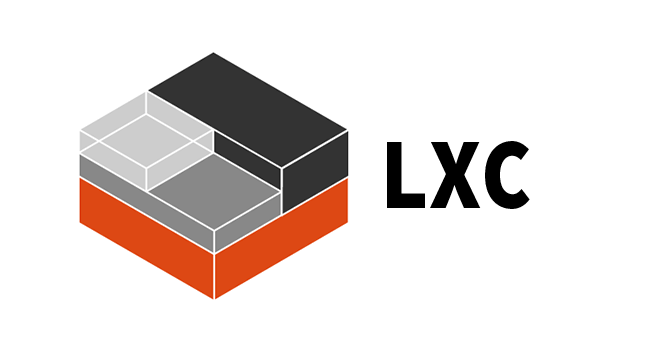{#fig:lxc width=35%}
{#fig:ovs width=17%}
</div>

Docker is one of most successful project and represents a one of the most successful containerization milestones started in 2013 by google bootstrapping of of LXC library `liblxc` at first then switching to it's own library `libcontainer`; After a few monthes later **CoreOS Rocket** which is also called **rkt** launched starting the daemonless campaign; Shortly followed by *Project Atomic* has more of a deeper security focus than any of the formerly mentioned products.

<div id="bigfive" style="centered">
{#fig:cos width=14%}
{#fig:rkt width=14%}
{#fig:atomic width=15%}
</div>

#### Orchestrators

It's difficult to talk about containers without mentioning containerization orchestrators, take a look at any high performance large scale network and chances are you'll find one of these under the hood, they basically are a management & automation frameworks that makes working with containers easier even at an enterprise scale infrastructures.

Orchestrators provide many useful features that simply can not be over looked particularly in enterprise environments where every task is a challenge

- Health monitoring
- Self healing
- Load balancing
- Resource management
- Configuration
- Provisioning
- Scaling

Some of well known orchestration frameworks include

<div id="bigfive" style="centered">
{#fig:kublogo width=15%}
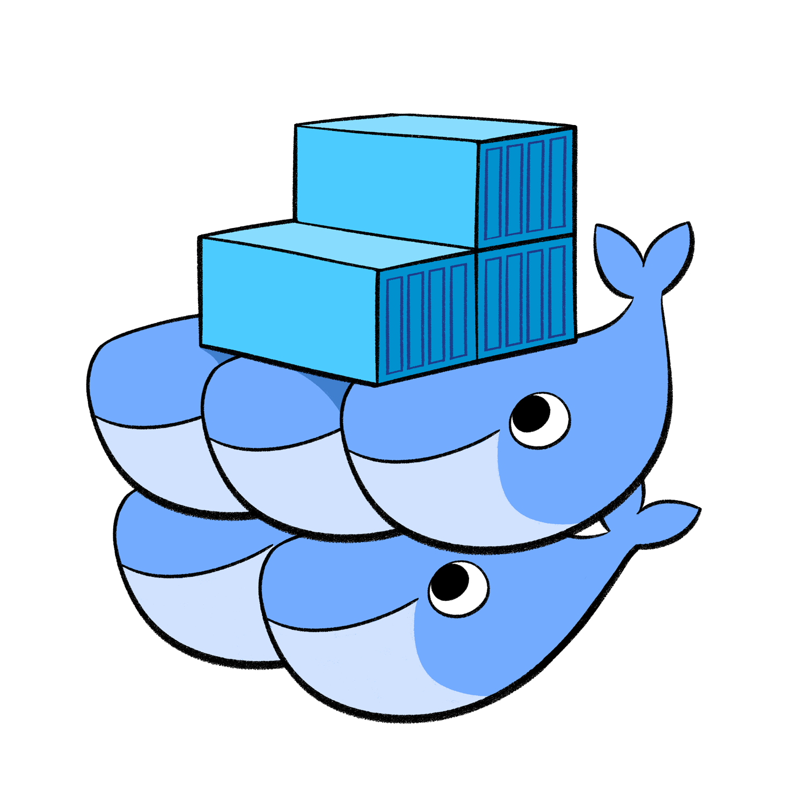{#fig:swarmlogo width=20%}
{#fig:acs width=17%}
{#fig:ost width=13%}
{#fig:meslogo width=35%}
</div>

- **Amazon Container Service :** Also known as **ACS**

- **Openshift :** Containers orchestrator developed by RedHat

- **Kubernetes :**
Is an open-source container orchestrator project originally started by google in order to simplify deployment, management & scaling of containeraized environments at google's datacenters.

- **Mesos :**
Initiated and developed by twitter and is now being maintained by apache, is yet another open-source project that aims at abstracting the hardware completely and presenting it as giant pool of resources to virtualized / containeraized systems alike.

- **Docker Swarm :**
As the name suggests swarm is for docker containers, for clustering a pool of hosts into a virtual single host.

#### Container in VM ?

To put it simply for security reasons, since containerization solutions in general are significantly less secure than their virtualization counterparts,  this is the main reason why the end user should absolutely cautious with services that are exposed to any untrusted network such as the internet under all circumstances.

And generally speaking nearly all governmental entities advice against deploying containers without taking a set of security measures to reduce the attack surface of your systems; In 2017 **NIST** or the National Institute of Standards and Technologies^[https://www.nist.gov] laid out the reasons why containerization is not suited for sensitive applications and how it can be used alongside VMs to tighten the security. And this paragraph explains exactly why isolation is required

> *" Although containers are sometimes thought of as the next phase of virtualization, surpassing hardware virtualization, the reality for most organizations is less about revolution than evolution. Containers and hardware virtualization not only can, but very frequently do, coexist well and actually enhance each other’s capabilities. VMs provide many benefits, such as strong isolation, OS automation, and a wide and deep ecosystem of solutions. Organizations do not need to make a choice between containers and VMs. Instead, organizations can continue to use VMs to deploy, partition, and manage their hard "*

The other thing that they mention is why traditional security measures such as firewalls wont work for securing containers

> NIST SP 800-190 Page-25 *" Container management includes security management and monitoring. However, security controls designed for non-container environments are often not well suited for use with containers. For example, consider security controls that take IP addresses into account. This works well for VMs and bare metal servers with static IP addresses that remain the same for months or years. Conversely, containers are typically allocated IP addresses by orchestrators, and because containers are created and destroyed much more frequently than VMs, these IP addresses change frequently over time as well. This makes it difficult or impossible to protect containers using security techniques that rely on static IP addresses, such as firewall rule sets filtering traffic based on IP address. Additionally, a container network can include communications between containers on the same node, across different nodes, and even across clouds "*

And to end our question, here is a quote straight from docker documentation

> *" ... if you instrument Docker from a web server to provision containers through an API, you should be even more careful than usual with parameter checking, to make sure that a malicious user cannot pass crafted parameters causing Docker to create arbitrary containers. "*

> *" For this reason, the REST API endpoint (used by the Docker CLI to communicate with the Docker daemon) changed in Docker 0.5.2, and now uses a UNIX socket instead of a TCP socket bound on 127.0.0.1 (the latter being prone to cross-site request forgery attacks if you happen to run Docker directly on your local machine, outside of a VM). "*

# Security

## Introduction

*"Containers Do Not Contain"* a sentence that every security researcher will tell you when asked about the subject of containerization security, negating the illusion that the name *Container* might give. The issue around containerization is that a lot of people think that it's a super fast virtualization solution with the same security advantages and isolation.
This misinterpretation leads to the worst incomes in most of the cases. So what exactly is not secure about containerization ?

In the previous chapters we have discussed that containerization technology is not as safe as we thought it is at least when used improperly, however we've only scratched the surface of why that is. In the following chapter we're going to take a deep dive in the subject and hopefully see exactly why, and what we can do about it.

## SECTION 1 : Threats

### Kernel Exploits

As we've seen earlier, containers use the same kernel as the host OS does, this fact is a security nightmare since in case of kernel panic in any container all other containers including the host machine it self will be effected.

### Denial-Of-Service Attacks

Unlike a virtual machine a container has unrestricted access to all system resources such as CPU, RAM & Storage, a malicious or a badly configured container could conduct a DOS attack on other processes on the host system causing resource starvation.

### Root in = Root out

Running the root user inside a container is exactly the same as running as root in the host system. This security flaw opens a lot of possibilities for hackers.

### Privilege Escalation

The ability to forcefully switch users by exploiting vulnerabilities in the target system. Paired with *"root in = root out"* this attack can have unpleasant consequences.

- **Horizontal Privesc :** The intruder is able to switch users with the same privilege levels, this allows for private data access such as home directories.

{#fig:hpresc width=100%}

- **Vertical Privesc :** The intruder is able to escalate privileges to higher levels such as the *root* user in order to gain full access and control over the system.

{#fig:vpresc width=100%}

### Breakouts

As known as sandbox escapes, is the fact that an attacker could get access and control over a container and exploiting a vulnerability in it in order to get out in two ways :

- **Horizontal escalation :** It starts by the attacker gaining access to one of the containers on the host and continues by compromising other containers and processes with the same privilege level.

{#fig:horesc width=100%}

- **Vertical escalation :** where the attacker is able to breakout to the host system by exploiting a vulnerability in already compromised container or by horizontally escalating to another vulnerable container.

{#fig:vertesc width=100%}

This type of attacks gets even worst knowing that if the attacker has been able to get root access in any of containers and managed to escape out to the host, he will run at the same privilege level he used to in the container in this case root access over the host.

### Poisoning :

This happens when downloading base images from an unknown / untrusted source(s), these images may contain malware, spyware and any kind of malicious payloads that are extremely difficult to detect & identify without full analysis of the image.
Deploying a poisoned image will put the entire host system at risk.

### Secret Compromise :

Hard coded plain text *Usernames/Passphrases, SSL certificates, SSH keys* in containers are a major security flaw, for instance if the container needs access to a database to fetch or store some data it will most likely require a passphrase to interact with the database API. A hacker in this case will have an easy time getting those secret keys right after compromising the container or even over the network.

## SECTION 2 : Guidelines

A container can be as secure as a VM and in some cases even more if and only if some security rules & practices are honored, But "over security" will never hurt any one since nothing is secure.

### Namespaces :

Namespaces are one of most important security components in the Linux kernel starting from the version 3.8 , A Namespace is an isolated "environment" where every element has a unique name regardless of other namespaces. Even though namespaces can not be directly controlled by the user it's important to understand them since the containerization is based on namespacing.

- **Process ID :** for example the init system is PID 1 in unix likes operating systems, when using a PIDNamespace every container has it's own PIDs starting from PID 1 without conflicting with the host or any container.

#### Namespaces Types :

+-----------+-----------------+--------------------------------------+
| Namespace | Flag            | Isolates                             |
+===========+=================+======================================+
| Cgroup    | CLONE_NEWCGROUP | Ctroup root directory                |
+-----------+-----------------+--------------------------------------+
| IPC       | CLONE_NEWIPC    | System V IPC,POSIX message queues    |
+-----------+-----------------+--------------------------------------+
| Network   | CLONE_NEWNET    | Network devices, stacks, ports, etc. |
+-----------+-----------------+--------------------------------------+
| Mount     | CLONE_NEWNS     | Mount points                         |
+-----------+-----------------+--------------------------------------+
| PID       | CLONE_NEWPID    | Process IDs                          |
+-----------+-----------------+--------------------------------------+
| Time      | CLONE_NEWTIME   | Boot and monotonic, clocks           |
+-----------+-----------------+--------------------------------------+
| User      | CLONE_NEWUSER   | User andgroup IDs                    |
+-----------+-----------------+--------------------------------------+
| UTS       | CLONE_NEWUTS    | Hostname and NIS, domain name        |
+-----------+-----------------+--------------------------------------+


- **User/Group ID :** UIDs & GIDs are also namespaced under every container to avoid conflicts.

- **Mount :** Mounts are namespaced as well

- **IPC :**^[Interprocess Communication] Offers namespacing for *System V* and *POSIX Messages* inter process communications

- **Network :**

Network namespacing is used extensively in containerization, And its the key component that makes networking significantly more flexible and convenient to use. Its what makes deploying multiple services on the same host system possible.

Of course this is handled automatically by the containerization engine at run time, but they can be used out of that context in other networking tasks; Here is a simple and straightforward example of using network namespacing

```bash
# create two network namespaces ns0, ns1
ip netns add [ns0]
ip netns add [ns1]

# check that they exist
ip netns list

# creating virtual ethernet pair
ip link add [veth0] type veth peer [veth1]

# check
ip link list

# adding each pair to namespace
ip link set [veth0] netns [ns0]
ip link set [veth1] netns [ns1]

# now if we do, we don't see the interfaces any more
ip link list

# instead we do, to run the command inside the namespace
ip netns exec [ns0] ip link list
ip netns exec [ns1] ip link list

# ip address configuration
ip netns exec [ns0] ip addr add [192.168.1.1/24] dev [veth0]
ip netns exec [ns1] ip addr add [192.168.2.1/24] dev [veth1]

# bring them up
ip netns exec [ns0] ip link set [veth0] up`
ip netns exec [ns1] ip link set [veth1] up
```

### Cgroups

#### Definition

*cgroups* or *control groups* is a Resource Management linux kernel mechanism, started by Google in 2006 then ended up in the main stream kernel a year later in 2007.

They allow the system administrator to control, limit & monitor various types of resources through kernel pseudo-filesystem known as cgroupfs. Multiple subsystems so-called *resource controllers* allow for a fain grained control over resources in a hierarchical manner, such as the number of CPU shares, memory limit, Block Device I/O, Typed network packets. All in a per process basis, This dramatically increases the systems performance and more importantly, security.

So one may ask, what cgroups has to do with containers ? And the answer is a lot. At this point it's clear that containerization in general is based around separation & isolation and cgroups takes this concept even further by restricting resource access as necessary for each running container, this has the benefit of preventing resource starvation as well as kernel panics in case of a buggy container that has for example a memory leak or DOS attack leading the entire host to go down.

#### Usage

Cgroups can be used in the docker CLI as flags or in the `docker-compose.yml` file, and in both ways they mean the same thing since each docker flag has it's compose equivalent

##### CPU Limits {-}

i. **Docker CLI**

```bash
--cpus
```

> How much CPU cores are available to the container

```bash
--cpuset-cpus
```

> Which CPUs the container's entrypoint is going to run on, it can be a single CPU core `0`, a range of cores `0-3` or multiple cores `0,3`


```bash
--cpu-shares
```

> Softly set CPU time allocation per container basis, this is analogous to the QOS networking feature. This can be a value between `0` and `1024` [0, 1024]. Please note that CPU shares involves complex calculations especially if CPU cores > 1


```bash
--pids-limit
```

> Process identification limits is self explanatory, it limits the number of process id's a container can fork to. This is really useful against DOS attacks targeting system resources & the process table in particular.

ii. **Docker Compose**

```yaml
cpu_count:
cpu_percent:
cpus:
cpu_shares:
cpu_quota:
cpu_period:
cpuset:
```

##### Memory Limits {-}

i. **Docker CLI**


```bash
--memory
```

> The maximum amount of memory that the container can reach

```bash
--memory-swap
```

> The amount of memory the container is allowed to swap

```bash
--memory-swappiness
```

> The percentage of swapable container memory

```bash
--memory-reservation
```

> In case of memory stress on the host drop back to this soft limit

```bash
--kernel-memory
```

> Set the amount of kernel memory a container can use

ii. **Docker Compose**

```yaml
cgroup_parent:
mem_limit:
memswap_limit:
memswapiness:
mem_reservation:
```

### Capabilities

As the name suggests, capabilities allow for fine grained control over privileges by braking them up into multiple modules each of which is responsible for granting / denying what the software can do with that particular capability. To check the full list of capabilities `man capabilities`.

i. **Docker CLI**


To add a said capability to a docker container the flag `--cap-add` is used, on the other hand to drop any capability use `--cap-drop`

```bash
docker --cap-drop
docker --cap-add
```

ii. **Docker Compose**

Alternatively, set the flags bellow in `docker-compose.yml` of a container file

```yaml
cap-drop:
cap-add:
```

### Access Control :

Taking a look at access control systems, one of the most dangerous things in any operating system out there is the permissions system this is because any process started by a given user will completely inherit that user's permissions and will have access to every thing that he's able to access. This problem is unfortunately fundamental in how Discretionary Access Controls DAC mechanism work.

To address this issue another access control system must be used, not necessarily completely eliminating DAC system and replacing it but by adding another layer on top of it; This layer is called MAC Mandatory Access Controls.

The are multiple Mandatory Access Control systems out there such as **Apparmor**, **Tomoyo** & **SELinux**. However we'll be using **SELinux** exclusively in this paper for consistency reasons.

#### SELinux :

{#fig:selogo width=25%}

##### Definition :

Security Enhanced Linux is a set of Linux kernel patches as LSM^[Linux Security Modules] or *Linux Security Modules* and associated tools developed by the NSA^[National Security Agency]  released the year 2000 and merged in the main stream kernel tree in 2003.

SELinux is mainly used by USAs Department Of Defence aka DoD, Therefor the policies makes heavy use of a security model called *Mandatory Access Controls* or MAC^[Mandatory Access Controls] for short. The default access control mechanism on any standard linux based operating system is DAC^[Discretionary Access Controls] which stands for *Discretionary Access Controls*, SELinux enhances the former by adding MAC rules which allow for a much higher security threshold, the advantage is that policies are strictly applied upon the users.

To further understand MAC rules let's take an example of root SUID program. Under DAC access rules running this program will spawn a process with full system access as the root user allowing for privilege escalation in case of compromise, However if the correct MAC rules are enforced by SELinux policies the spawned process will be limited to only what it's supposed to access in the policies no mater whats the privilege level is.

##### Background :

SELinux is a labeling system to identify Processes as well as Files, Directories and System Objects. A policy is used to control the access between labeled processes and objects, the rules are enforced by the kernel.

These labels are grouped in SELinux Contexts and they consist of four elements or labels :

> user:role:type:level

After the DAC allow access, the MAC will be evaluated based on AVC the *Access Vector Cache* the permissions / restrictions which are applied on subject -> action -> object requests, in case of a cache miss the SELinux security Server is requested which is a relatively slower operation, the control access action then is cached under the VAC for performance reasons.

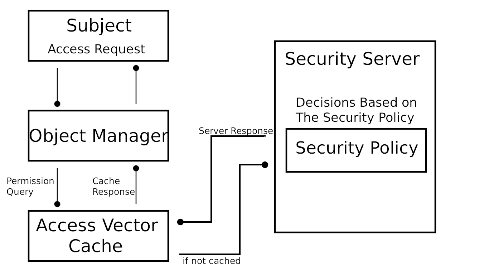{#fig:selinux_query width=100%}

In case the access is denied based on DAC, MAC will never be checked. Likewise if no allow policy is found the default access control action is applied; And that is, access denied.

##### Security Policy Type :

Multiple policy types are used in order for SELinux to make the access decisions by granting or denying access base on the policy rules of the policy type of choice :

- **Type Enforcement (TE)**

> This model links a label to each process called a domain and label called a type to each object however internally the is no difference between a process *domain* and a file *type* since to SELinux they're both a *type*, the SELinux policy rules then define which domains SELinux will grant access to which objects based on the associated types.

> The type is represented by the 3rd field and is suffixed with \_t as follows

> user_u:role_r:**type_t**:level

- **Role Based Access Control (RBAC)**

> Each SELinux user is associated with a set of roles each of which enables the user to access a set of TE domains. For example the user *user0* which is in the *staff_u* SELinux user is able to take the *webadm_r, dbadm_r, viradm_r*, under the *webadm_r* the *user0* is able to administer the web server, when *user0* switches to the *viradm_r* he will be no longer web administrator but a virtualization administrator, and the same goes for database administrator *dbadm_r*.

> The role is represented by the 2nd field and it's suffixed with \_r as shown

> **user_u**:**role_r**:type_t:level

- **Multi Level Security (MLS)**

> This technology is based on BLP^[Bell-La & Padula] security model, which takes access control decision based on the subject clearance label in order to apply the least privilege principle; For example it can be structured  like the four security levels *TopSecret, Secret, Classified & Unclassified*, where a subject with the *Secret* clearance have read access on lower clearance levels only, *Classified* in this case, and write access on higher levels clearance *TopSecret* only, This structure is not mandatory since there can be more or less levels depending on use case, but it's a common classification.

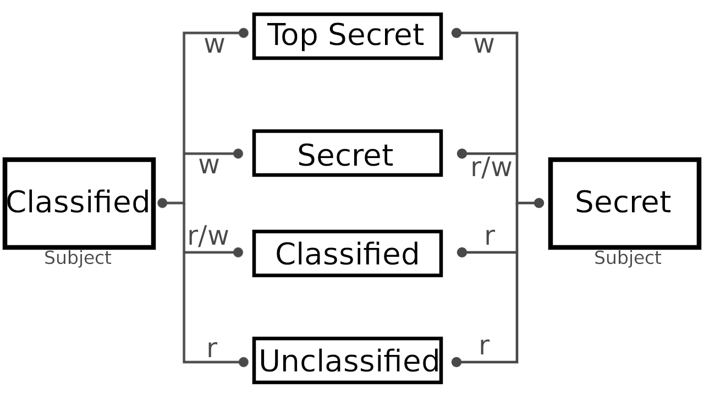{#fig:lapadula}

> The principle is simply called *Read Down, Write Up* or alternatively *No Read Up, No Write Down*, as illustrated in the figure [@fig:lapadula].

> user_u:role_r:type_t:**level**


- **Multi Category Security (MCS)**

> categories enable the separation between different departments, organizations etc. For instance if the access is allowed for TopSecret Security Level in department (A) category but not department (B) category. In fact this terminology can be directly projected to the virtualization & containerization world, since all the guest children process will have the same TE label say *cont_t* inheriting the starting parent process type, hence the ability for them to read and write each others image flies of type *cont_img_t* which allow VMs or containers to read and write each others data. This scenario will make the perfect use case of the **MCS** scheme by assigning every guest a unique category level along side it's own image file and restrict any allowed actions to only matching categories.

> The **MCS** filed is appended to the **MLS** filed as follows :

> user_u:role_r:type_t:**level:c**

##### Operation Modes :

SELinux main configuration file is `/etc/selinux/config` which contain the most basic variables :

```bash
# This file controls the state of SELinux on the system on boot.

# SELINUX can take one of these three values:
#       enforcing - SELinux security policy is enforced.
#       permissive - SELinux prints warnings instead of enforcing.
#       disabled - No SELinux policy is loaded.
SELINUX=permissive

# SELINUXTYPE can take one of these four values:
#       targeted - Only targeted network daemons are protected.
#       strict   - Full SELinux protection.
#       mls      - Full SELinux protection with Multi-Level Security
#       mcs      - Full SELinux protection with Multi-Category Security
#                  (mls, but only one sensitivity level)
SELINUXTYPE=targeted
```

`SELINUX` variables has three possible values operation modes :

- **Enforcing**

> In Enforcing mode SELinux policy rules are applied and any unauthorized access is denied by the kernel, the denials are also cached under the AVC and logged by auditd, syslogd, journalctl for further analysis.

- **Permissive**

> Permissive mode will log any AVC denials exactly as if access was forbidden, However the action will still succeed since SELinux will transparently monitor and log any unauthorized actions. This mode greatly improves troubleshooting tasks for SELinux policy writers and developers.

- **Disabled**

> As it's name implies under the *Disabled* mode SELinux will be completely turned off, No logging will be available even if unauthorized actions were to happen. This mode is not recommended since it may cause issues in SELinux contexts causing various problems the next time SELinux is switched back on.

There is also the `SELINUXTYPE` variable which is responsible for the SELinux Security policy type :

- **Targeted**

> The *Targeted* security policy will target only a subset of the system subjects and objects specifically those with a hight security risk such as publicly exposed services by isolating them to *Confined* SELinux contexts, the rest of the system will be treated as *Unconfined* domains where only DAC rules will be applied. It's worth noting that if and *Unconfined* subject runs a process under *Confinement* the policy rules of the process will be enforced on the subject.

- **Strict**

> The *Strict* security policy will enforce SELinux policy rules on every subject and object on the system.

- **MLS**

> **MLS** security policy type will make use of the 4th field of the SELinux context labels i.e the *level* label, Enabling clearance levels access control for fine grained control over the system's subjects actions over the objects.

- **MCS**

> Enabling MCS is required only on some particular edge cases like stated earlier, like for *Virtualization* & *Containerization* where MLS is not enough.

##### CLI :

To automatically relable the system in case it was set on `Disabled` under RedHat specific distributions create `.autorelable` in `/` and reboot after it's done relableling all the file system run the command `setenforce 1` to make sure SELinux is up and running if `sestatus` shows' that it's in `permissive` mode. The relabling process is done in case of a mislabeling issue or a policy change.

- **The `Z` Flag**

One of the most important tools in the operating systems that support SELinux is that nearly all user space utilities include the `-Z` flag which allow the user to check SELinux labels for the objects that this tool operate with.

```bash
ls -lZ
ps aux -Z
id -Z
```

- **setenforce**

This tool allow to switch SELinux `ON & OFF` on the fly without the need to edit `/etc/selinux/config` and change the `SELINUX=` variable.

`setenforce 0` will turn SELinux debugging mode on, so that it will only generate logs whithout actually enforcing the policy.

`setenforce 1` will enable SELinux in enforcing mode and any unauthorized access is denied.

- **selinux 0**

This will completely disable selinux so any new content will have no labels, however this is not a good idea since selinux will not work without labeled objects if enabled back on instead selinux will relabel the entire file system, unless the unlabeled objects are relabled manually before switching selinux on.

- **sestatus**

Check the status of SELinux in the host, like what mode it's set on and what type of policy is specified.

- **seinfo**

Information

- **setsebool**

Used to set selinux booleans, to list all available booleans

```bash
# See the full list of SELinux Booleans
semanage boolean --list

# Set the `httpd_can_sendmail` boolean on
setsebool -P httpd_can_sendmail 1
```

- **chcon**

Apply temporary changes to context and range if desired, these change does not survive across reboots or `restorecon` command execution.

```bash
chcon -t type_t file_name
# or with '-R' for dirs
chcon -R -t type_t dir_name
```

- **semanage**

To manage selinux types like, file contexts with `fcontext` and `login, user, port...` in a persistent manner even after relableling the filesystem or restoring contexts using `restorecon` unless `-F` is used to force the restore.

First setting the new file context with `fcontext`, parameter `-a` to add a record, `-t` for type then the type followed by the absolute path to the file or directory :

```bash
semanage fcontext -a -t [TYPE] [ABS_PATH_REGEX]
semanage fcontext -a -t httpd_sys_content_t '/srv/http(/.*)?'
```

{width=4%}
Note: The absolute path is required to avoid mislabelling after a file system relabel. And for more [ABS_PATH_REGEX] examples take a look at `/etc/selinux/[SELINUXTYPE]/contexts/
files/file_contexts`.

\

However the `semanage ` command is not going to apply the changes to file directly, instead it will be added to the default locally managed file contexts under `/etc/selinux/[SELINUXTYPE]/contexts/files/file_contexts.local`, hence `restorecon` is called to apply the changes to the disk `inodes`

```bash
restorecon -v [ABS_PATH]
# or with '-R' for dirs
restorecon -v -R [ABS_PATH]
```


{width=4%}
Note: Here the absolute path [ABS_PATH] is used instead of it's regular expression [ABS_PATH_REGEX].

- **restorecon**

Restore contexts based on the selected policy default file contexts file under `/etc/selinux/[SELINUXTYPE]/contexts/files/` by applying the `semanage` setting on the inodes from the system defaults access control file.

- **setfiles**

The same as `restorecon` but works for the entire filesystem in order to *label* or *relabel* the system tree based on the default file contexts `/etc/selinux/[SELINUXTYPE]/contexts/files/`.

- **matchpathcon**

Check if the file or directory context matches correctly SELinux files context as defined under `/etc/selinux/[SELINUXTYPE]/files/`, if the context does not match a message will be appear showing the current context and what context it's supposed to be.

```bash
matchpathcon -V /home/user/*
```

- **newrole**

Allows the user to change between multiple roles as long as the SELinux policy grants it

- **sepolicy**

Manage SELinux policies

+-------------+-------------------------------------+
| Parameter   | Description                         |
+=============+=====================================+
| boolean     | SELinux booleans description        |
+-------------+-------------------------------------+
| generate    | Generate SELinux policy template    |
+-------------+-------------------------------------+
| communicate | Domain communication state          |
+-------------+-------------------------------------+
| network     | Query network information           |
+-------------+-------------------------------------+
| transition  | Generate proccess transition report |
+-------------+-------------------------------------+
| interface   | List SELinux policy interfaces      |
+-------------+-------------------------------------+
| manpage     | Generate policy manual pages        |
+-------------+-------------------------------------+
| gui         | Policy graphical user interface     |
+-------------+-------------------------------------+

: sepolicy parameters {#tbl:sepolicy_parm}

```bash
# Will print ssh port
sepolicy network -t ssh_port_t
```


For troubleshooting there are few selinux commands that can make it much easier :

- **autid2allow**

```bash
# This will show a diagnostics message with the booleans to turn on
grep ftp /var/log/audit/audit.log | autid2allow
```

- **setroubleshoot**


<!-- Only run container images from trusted parties.
Container applications should drop privileges or run without privileges whenever possible.
Make sure the kernel is always updated with the latest security fixes; the security kernel is critical.
Make sure you have support teams watching for security flaws in the kernel.
Use a good quality supported host system for running the containers, with regular security updates.
Do not disable security features of the host operating system.
Examine your container images for security flaws and make sure the provider fixes them in a timely manner. -->

<!--Drop privileges as quickly as possible
Run your services as non-root whenever possible
Treat root within a container as if it is root outside of the container-->


# Technologies

## Introduction :

In this chapter we'll be seeing what are the different software solutions that we're going to be using during the application phase, This includes software on the Host as well as the Guests.


## SECTION 1 : Operating Systems

### Linux :

Linux is an open source kernel developed by *Linus Torvalds*. The kernel by it self isn't of much use to the end users, this makes userspace utilities a requirement for full system functionality and Linux is distributed mainly with the GNU project core utils what makes a lot of people think of GNU/Linux when they say Linux.

<div id="linux" style="centered">
{width=10%}
{width=35%}
{width=33%}
</div>

The specific distribution that we're going to use in the host system as well as the Qemu/KVM web UI is called Archlinux^[archlinux.org], which is Linux distribution that is based on the rolling-release model.

> Arch Linux is an independently developed, x86-64 general-purpose GNU/Linux distribution that strives to provide the latest stable versions of most software by following a rolling-release model. The default installation is a minimal base system, configured by the user to only add what is purposely required.

Fedora^[fedoraproject.org] is a RedHat development distribution made specificaly for the latest software versions. Just as Archlinux, Fedora is a rolling-release distribution.

> The Fedora Project is a community of people working together to build a free and open source software platform and to collaborate on and share user-focused solutions built on that platform. Or, in plain English, we make an operating system and we make it easy for you do useful stuff with it.


## SECTION 2 : Virtualization

### Qemu :

{width=20%}

#### Definition :

QEMU^[Quick EMUlator] short for is a generic and FOSS^[Free & Open Source Software] Project machine emulator and virtualizer.
Qemu is an emulator that is capable of emulating all sorts of hardware architecturs, in an x86_64 architecture the KVM kernel module can be used to significantly accelerate the virtualizaion.

When used as a machine emulator, QEMU can run OSs and programs made for one machine (e.g. an ARM ) on a different machine (e.g. PC x86) so that for example we can emulate and android device.By using dynamic translation, it achieves near native performance by providing a set of hardware and device models to the guest OS, this means that the emulated OS runs as if it's on real hardware.

QEMU a specific CPU instructions to run as fast as possible, they are called hardware-assisted virtualization on intel cpus VT-x and AMD-V on AMD cpus

As a virtualizer, QEMU achieves near native performance by executing the guest code directly on the host processing unit. QEMU supports virtualization when executing under the Xen hypervisor or using the KVM kernel module in Linux. When using KVM, QEMU can emulate the following architecturs; x86, server and embedded PowerPC, 64-bit POWER, S390, 32-bit and 64-bit ARM, and MIPS guests.

#### CLI :

The qemu cli is an endless sea of arguments and parameters all of which serves a specific purpose, however we'll be taking a look at the most useful parameters for x86 & x86_64 systems virtualization, the specific command used is,

`$ -qemu-system-x86_64`

##### Central Processing Unit : {-}

Fist of all the cpu model must be selected and that is achieved with the *-cpu* flag, to list all available model under the x86_64 architecture run :

`$ qemu-system-x86_64 -cpu help`

For the same configuration as the host machine one can use `-cpu host` .

Setting the number of processing units is done using the `-smp` flag, or *Symmetric Multiprocessing*. Which emulates multiple processing units connected to the same main memory. This flag takes multiple comma separated parameters in the format *parameter0=value0, parameter1=value0* .

The `-smp` flag takes the following parameters as arguments :

+-----------+------------------------------+
| Parameter | Function                     |
+===========+==============================+
| cpus      | The number of CPU packages   |
+-----------+------------------------------+
| dies      | Dies per CPU package         |
+-----------+------------------------------+
| cores     | Cores per CPU die            |
+-----------+------------------------------+
| threads   | Threads per core             |
+-----------+------------------------------+
| sockets   | Cpu sockets per mother board |
+-----------+------------------------------+
| maxcpus   | Maximum hotpluggable CPUs    |
+-----------+------------------------------+

: Qemu CPU Parameters {#tbl:qemu_cpu_param}

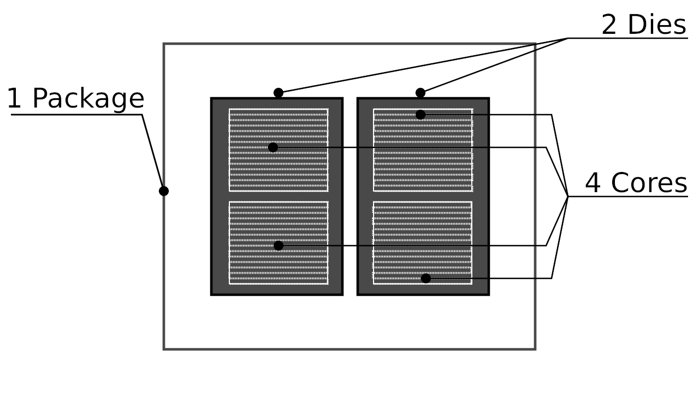{#fig:cpudiagram width=100%}

As illustrated [@fig:cpudiagram].

##### Main Memory : {-}

To specify the amount of startup Main Memory the flag `-m` is used, this flag take 3 comma separated parameters :

+-----------+-----------------------------------------+
| Parameter | Function                                |
+===========+=========================================+
| size      | Memory Amount in Megabytes              |
+-----------+-----------------------------------------+
| slots     | Number of additional hotpluggable slots |
+-----------+-----------------------------------------+
| maxmem    | Maximum amount of hotpluggable memory   |
+-----------+-----------------------------------------+

: Qemu Ram Parameters {#tbl:qemu_mem_param}

The *size* parameter can optionally take *K, M, G, T, P, E* suffixes for { *Kilo, Mega, Giga, Tera, Peta, Exa* }Bytes respectively.

##### Machine Type : {-}

The machine type specifies the motherboard chipset type. The flag is *-machine* it has 10 parameters, however we're only interested in one parameter:

The *accel* parameter can take one of the following values :

+-----------+------------------------+-------------------------------+
| Parameter | Function               | Values                        |
+===========+========================+===============================+
| accel     | Teh accelerator to use | kvm, xen, hax, hvf, whpx, tcg |
+-----------+------------------------+-------------------------------+

: Qemu Acceleration Parameters {#tbl:qemu_accel_param}


{width=4%}
Note that for full *kvm* acceleration the flag `-machine accel=kvm` is used in conjunction with `-enable-kvm` flag.

##### Storage : {-}

First a disk image must be created if it doesn't exist which is done using `qemu-img` command :

`$ qemu-img create -f [format] [image_name] [size]`

Where `[format]` is the desired format for the image file e.g *qcow2, qcow, qed, vmdk ...* , & `[size]` is the disk space to allocate for the image.


{width=4%}
Note that the image size can be Thinprovisioned or Thikprovisioned depending on the use case. By default `qemu-img` creates Thinprovisioned image files unless told to do otherwise by using the `preallocation` option .

\

Here are two disk image format with the corresponding `preallocation` values :

+--------------+-----------------------------+
| Image Format | Preallocation Values        |
+==============+=============================+
| qcow2        | full, falloc, metadate, off |
+--------------+-----------------------------+
| raw          | full, falloc, off           |
+--------------+-----------------------------+

: Qemu Storage Formats {#tbl:qemu_sto_fmt}

There are multiple ways to initiate a storage device in qemu, the most straightforward is the `-drive` flag which takes the following parameters :

+-----------+---------------------+--------------------------------------------------+
| Parameter | Function            | Values                                           |
+===========+=====================+==================================================+
| file      | The disk image file | Path to image file                               |
+-----------+---------------------+--------------------------------------------------+
| if        | Interface type      | ide, scsi, sd, mtd, floppy, pflash, virtio, none |
+-----------+---------------------+--------------------------------------------------+
| media     | Media Type          | disk, cdrom                                      |
+-----------+---------------------+--------------------------------------------------+
| format    | Image format        | qcow2, raw, qed ... etc                          |
+-----------+---------------------+--------------------------------------------------+
| snapshot  | Toggle snapshots    | on, off                                          |
+-----------+---------------------+--------------------------------------------------+

: Qemu Storage Initialization {#tbl:qemu_sto_decl}

Another simple way to initiate a block device is to use `-hda, -hdb, -hdc, -hdd` flags for storage device and `-cdrom, -fda, -fdb` for CDs & Floppy disks respectively. Note that this set of flags take a path to a disk image file with no parameters required.

Snapshots are one of the most important aspects of virtualization environments :

`$ qemu-img create -f qcow2 -b origin.qcow2 origin_snap.qcow2`

##### Audio : {-}

Audio setup is done through the `-soundhw` flag, this flag's parameters are the sound card models supported. All The supported sound cards can be listed with the command :

```bash
qemu-system-x86_64 -soundhw help
```

For the Qemu version used these are the supported ones :

+-----------+---------------------------+
| Parameter | Function                  |
+===========+===========================+
| sb16      | Creative Sound Blaster 16 |
+-----------+---------------------------+
| es1370    | ENSONIQ AudioPCI ES1370   |
+-----------+---------------------------+
| ac97      | Intel 82801AA AC97 Audio  |
+-----------+---------------------------+
| adlib     | Yamaha YM3812 (OPL2)      |
+-----------+---------------------------+
| gus       | Gravis Ultrasound GF1     |
+-----------+---------------------------+
| cs4231a   | CS4231A                   |
+-----------+---------------------------+
| hda       | Intel HD Audio            |
+-----------+---------------------------+
| pcspk     | PC speaker                |
+-----------+---------------------------+

: Qemu Audio Parameters {#tbl:qemu_audio_param}


{width=4%}
Note that the most advanced way is to use the `-audiodev` flag, which is out of the scope for this paper.

##### Network : {-}

By default Qemu uses *user* networking mode which needs no privileges to run and it starts automatically with each VM, keep in mind that ICMP protocol does not work under *user* mode networking. The default address range for this network is `10.0.2.0/24` i.e `255.255.255.0` subnetmask, with the addresses `10.0.2.2`, `10.0.2.3`, `10.0.2.4` for *Gateway*, *DNS* & *SMB*(Optional) respectively, The guests are assigned addresses by the built-in DHCP server and start from `10.0.2.15` onwards.

\

{width=4%}
Note that the default Qemu address range can be changed by using the `-netdiv` flag parameters as `net=` & `dhcpstart=` . And networking can be completely disabled as `-nic none` .

For any advanced networking configuration a backend & frontend are required hence must be created and configured, The networking backend is responsible for reading / writing packets from the forntend which is the VM network interface.

Setting up Qemu network backend is done via the `-netdev` flag, there are multiple choices depending on the needs :

+---------+----------------------------+
| Backend | Function                   |
+=========+============================+
| user    | User mode network          |
+---------+----------------------------+
| tap     | Tap interface networking   |
+---------+----------------------------+
| bridge  | Bridg interface networking |
+---------+----------------------------+

: Qemu Network Parameters {#tbl:qemu_net_param}

To add a macvtap interface to a qemu VM :

```bash
-net nic,model=virtio,macaddr=4e:04:d0:76:ce:07
-net tap,fd=3 3<>/dev/tap6
```

With a startup & shutdown scripts we can start and stop the *macvtap* interface as the VM starts and stops

```bash
#!/bin/bash

ip link add link [interface] name [macvtap0] type macvtap mode bridge
ip link set [macvtap0] up
chown :kvm /dev/tap0
```

`-nic`
`-net`
`-netdev`

##### Graphics & Display : {-}

Qemu is able to emulate multiple graphic cards backends. To specify one use the `-vga` flag :

+-----------+---------------------------------+
| Parameter | Function                        |
+===========+=================================+
| virtio    | Virtio VGA output               |
+-----------+---------------------------------+
| std       | Standard VGA                    |
+-----------+---------------------------------+
| qxl       | QXL VGA                         |
+-----------+---------------------------------+
| xenfb     | Xen paravirtualized Framebuffer |
+-----------+---------------------------------+
| cirrus    | Cirrus VGA                      |
+-----------+---------------------------------+
| vmware    | Vmware SVGA output              |
+-----------+---------------------------------+
| none      | No Graphics                     |
+-----------+---------------------------------+

: Qemu GPU Parameters {#tbl:qemu_gpu_param}

For a display output the `-display` flag is used with the following possible values :

+--------+--------------------------------------+
| Values | Function                             |
+========+======================================+
| gtk    | Use a gtk window as graphical output |
+--------+--------------------------------------+
| vnc    | Use the vnc protocol                 |
+--------+--------------------------------------+
| curses | Output in text curses/ncurses mode   |
+--------+--------------------------------------+
| none   | No graphical output                  |
+--------+--------------------------------------+

: Qemu Display Parameters {#tbl:qemu_disp_param}

This list is not exhaustive, for the full argument list use the command :

`$ -qemu-system-x86_64 -display help`

##### Random Number Generator : {-}

If a real *RNG* is required for example for cryptographic key generation inside a particular VM, It's possible to passthrough the hosts *RNG* using the `-object` flag :

`-object rng-random, id=id, filename=/dev/random`


### Kvm :

{width=40%}

Technically KVM^[Kernel-based Virtual Machine] or *Kernel-based Virtual Machine* is an open-source kernel module for the Linux kernel, it was announced in 2006 and merged with the main stream Linux kernel in 2007.

KVM provides it's hypervisor host such as QEMU with the ability to use hardware assisted virtualization by abstracting the underlying complexity of Intel-VT and AMD-V cpu virtualization extensions as a character device `/dev/kvm`, this essentially turns the host to a Type-1 / Bare-metal hypervisor.

Without the KVM support Qemu will fallback to software only emulation, hence several orders of magnitude slower virtualization.


### Libvirt :

{width=40%}

#### Definition :

It's an open-source virtualization management library that is capable of handling multiple virtualization backends, in this project it's a wrapper around the `qemu-system-x86_64` cli interface that is going to provide extra management functionality that Qemu/KVM is lacking.

Libvirt can be used to manage various backends such as *Qemu/KVM, LXC, Xen, Hyper-V, Bhyve* & *VMware ESXi*, while Qemu uses a cli syntax as configuration interface, libvirt is able to use cli as well as XML representation files to setup *Domains* which is the libvirt term for Virtual Machines.

There are two types of domains in libvirt *Transient* & *Persistent*, You can think of the former as being a pseudo-container it only exists when it's running and it gets destroyed instantly when turned off, The later however exists under any state.

As stated earlier Libvirt utilities can be used to manage the virtual environment in two manners, through the command line interface directly or by using XML description files, so we're going to be looking at both methods.


#### CLI :

Libvirt uses multiple cli tools to setup Domain resources, The main tool is `virsh` or virtualization shell it can be used to *start, pause, shutdown, destroy* domains amongst other functionality.

To proceed using any of libvirt's utilities a connection must be established with the hypervisor, and Qemu in this case provide two options :

> `qemu:///system` : local connection as root ( high privilege level )

> `qemu:///session` : local connection as regular user ( low privilege level )


{width=4%}
Note : During the rest of this paper a connection to `qemu:///system` URI is always assumed to be established, hence it wont be mentioned for the sake of simplicity.

##### Domain Creation : {-}

To make thing much simpler let's look at an example command :

```bash
virt-install \
--connect qemu:///system \
--virt-type kvm \
--name guest0 \
--ram 2048 \
--disk path=/path/to/disk/image,size=80G \
--vnc \
--cdrom /path/to/cdrom \
--network network=default,mac=aa:bb:cc:dd:ee:ff
```

This command will create a domain named *guest0*

##### Central Processing Unit : {-}

The `--cpu` parameter of the `virt-install` tool, and the `<vcpu></vcpu>` XML tag

##### Main Memory : {-}

The flag `--ram` is used to specify the amount of RAM needed for a guest.

##### Storage : {-}

Libvirt uses a concept called storage *pool* & *volume*, a *pool* is a reserved disk space to store the *volumes* which are the gusts disk images. The *pool* can also be transient or persistent, a transient pool will be destroyed as soon as it's not needed any more, in the other hand a persistent pool will survive until it's explicitly destroyed. Both types of pool can be initiated by the `pool-create*` and the `pool-define*` commands in the `virsh` interpreter.

- **Pools**

In order to create a disk image a storage pool must be available, to create local pool directory :

```bash
pool-define-as --name [pool_name] --type dir --target [/path/to/dir]
```

- **Volumes**

Volumes can be created in two ways, by using `vol-create` and the `vol-create-as` commands the former require an XML file with a description of the `<disk>` element, the later reads input from stdin as parameters.

```bash
# the explicit way
vol-create-as --format [format] --pool [pool_name] --name [vol_name] --capacity [50G]

# the short version
vol-create-as --format [format] [pool_name] [vol_name] [50G]
```

- **Snapshots**

All the libvirt snapshot utilities are in the format `snapshot-*`, Snapshots can be created as follows :

```bash
snapshot-create-as
```


##### Migration : {-}

Is one of the features that libvirt adds to Qemu, libvirt is capable of doing *Hot*, *Warm* & *Cold* migration seamlessly. Though this operation is only possible if the following conditions are met :

- Domain's storage is shared amongst the hosts such as NFS.
- The destination host CPU is capable of supporting the domain's CPU configuration.
- The source and destination hosts run the same hypervisor version.
- Identical Network configuration.

Multiple migration variations are supported :

+-----------------+-------------------------------------+
| Migration       | Function                            |
+=================+=====================================+
| Standard        | The domain is suspended and resumed |
+-----------------+-------------------------------------+
| Peer-to-Peer    | Hosts direct communication          |
+-----------------+-------------------------------------+
| Tunnelled       | Tunnel creation sush as SSH         |
+-----------------+-------------------------------------+
| Live / Non-live | Live migration withou interruption  |
+-----------------+-------------------------------------+
| Direct          | Done by completely hypervisor       |
+-----------------+-------------------------------------+

: Libvirt Migration Parameters {#tbl:lvirt_mig_param}


#### XML :

Obviously using the libvirt cli only isn't a scalable option, and this is why XML files can be used to deploy and manage the virtualization environment .


##### Domain Initialization : {-}

- The main element for creating a new domain is the `<domain>` :

```xml
<domain></domain>
```

It takes tow attributes :

+-----------+------------------------+-------------------------+
| Attribute | Function               | Values                  |
+===========+========================+=========================+
| type      | The hypervisor         | kvm, qemu, xen, lxc ... |
+-----------+------------------------+-------------------------+
| id        | ID for running domains |                         |
+-----------+------------------------+-------------------------+

: Libvirt Domain Tag {#tbl:lvirt_dom_tag}

And multiple subelements, the most useful ones are :

+-------------+------------------------------------------+
| Subelement  | Function                                 |
+=============+==========================================+
| name        | The VM name                              |
+-------------+------------------------------------------+
| uuid        | Universal Unique Identifier              |
+-------------+------------------------------------------+
| description | VM description                           |
+-------------+------------------------------------------+
| metadate    | Used by other software to store metadate |
+-------------+------------------------------------------+

: Libvirt Domain Subtags {#tbl:lvirt_dom_subtags}

- The next element is the `<os>` element :

```xml
<os></os>
```

It has one attribute :

+-----------+------------------------+-----------+
| Attribute | Function               | Values    |
+===========+========================+===========+
| firmware  | The boot firmware type | bios, efi |
+-----------+------------------------+-----------+

: Libvirt OS Tag {#tbl:lvirt_os_tag}

And many subelements are supported as well :

+------------+-----------+------------------+------------------------+
| Subelement | Attribute | Function         | Values                 |
+============+===========+==================+========================+
| boot       | dev       | Boot device      | hd, cdrom, network, fd |
+------------+-----------+------------------+------------------------+
| bootmenu   | enable    | Toggle boot menu | on, off                |
+------------+-----------+------------------+------------------------+
|            | timeout   | Boot menu delay  | time in ms             |
+------------+-----------+------------------+------------------------+
| type       |           |                  | hvm, linux(not really) |
+------------+-----------+------------------+------------------------+
|            | arch      | Architecture     | x86_64...              |
+------------+-----------+------------------+------------------------+
|            | machine   | Machine type     | pc-q35, pc-i440fx...   |
+------------+-----------+------------------+------------------------+

: Libvirt OS Subtags {#tbl:lvirt_os_subtags}


##### Central Processing Unit : {-}


The element tag for adding a new CPU model to a domain is :

```xml
<cpu></cpu>
```

Attribute supports :

+-----------+---------------------+--------------------------------------+
| Attribute | Function            | Values                               |
+===========+=====================+======================================+
| match     | CPU matching policy | minimum, exact(default), strict      |
+-----------+---------------------+--------------------------------------+
| check     | Verify the match    | none, partial, full                  |
+-----------+---------------------+--------------------------------------+
| mode      | Mimic host's CPU    | custom, host-model, host-passthrough |
+-----------+---------------------+--------------------------------------+

: Libvirt CPU Tag {#tbl:lvirt_cpu_tag}

Available subelements are :

+------------+-----------+--------------------+
| Subelement | Attribute | Function           |
+============+===========+====================+
| model      |           | CPU model          |
+------------+-----------+--------------------+
| vendor     |           | CPU vendor         |
+------------+-----------+--------------------+
| feature    | policy    | Feature state      |
+------------+-----------+--------------------+
| cache      | level     | Select cache level |
+------------+-----------+--------------------+
|            | mode      | Action on cache    |
+------------+-----------+--------------------+
| topology   | sockets   | sockets            |
+------------+-----------+--------------------+
|            | dies      | dies               |
+------------+-----------+--------------------+
|            | cores     | cores              |
+------------+-----------+--------------------+
|            | threads   | of threads         |
+------------+-----------+--------------------+

: Libvirt CPU Subtags {#tbl:lvirt_cpu_subtags}

```xml
<vcpu><vcpu/>
```

With the following attributes :

+-----------+-------------------------------+--------------+
| Attribute | Function                      | Values       |
+===========+===============================+==============+
| placement | Pin domain processes to vcpus | static, auto |
+-----------+-------------------------------+--------------+

: Libvirt VCPU Tag {#tbl:lvirt_vcpu_tag}

There is also the tags bellow for advanced fine tunning configuration such as NUMA and multiple physical CPUs, however this is an out of the scope of this paper :

```xml
<cpus>
 <vcpu id='' enabled='' hotpluggable=''/>
</vcpus>
```

And for fine grained tunning :

```xml
<cputune>
</cputune>
```


##### Main Memory : {-}

To set RAM amount the following elements are used :

This element sets the maximum upper bound memory amount that the domain can reach including any hotpluggable RAM.

```xml
<maxMemory></maxMemory>
```

Another element is :

```xml
<memory></memory>
```

Which sets the maximum boot memory this size can be increased until it reaches the value specified by `<maxMemory>` element.

Both of the element take the following attributes :

+-----------+----------------+----------------------------------------+
| Attribute | Function       | Values                                 |
+===========+================+========================================+
| unit      | RAM value unit | b, KB, k(default), MB, M, GB, G, TB, T |
+-----------+----------------+----------------------------------------+
| slots     | RAM slots      |                                        |
+-----------+----------------+----------------------------------------+

: Libvirt Memory Tag {#tbl:lvirt_mem_tag}

Additionally the element :

```xml
<currentMemory>
</currentMemory>
```

Can be added to set the guest's real allocation of RAM, if this value is less than the `<maxMemory>` value, ballooning will be able to rise it to the max value depending on the workload.


##### Storage : {-}

- **Pools**

Storage pools can be created by using an XML file with the `<pool>` element :

```xml
<pool type="dir">
  <name>pool_name</name>
  <target>
    <path>/path/to/dir</path>
  </target>
</pool>
```

```bash
pool-define pool.xml
```

- **Volumes**

Volume creation in XML representation :

```xml
<volume>
  <name>vol_name</name>
  <capacity>50G</capacity>
  <allocation>0</allocation>
  <target>
    <format type="qcow2"/>
  </target>
</volume>
```

```bash
vol-create vol.xml
```

Add the created Volume to the domain XML representation the element `<disk>` is used under the parent element `<devices>` :

```xml
<disk>
</disk>
```

This element support the following set of attributes :

+-----------+---------------+-----------------------------------------+
| Attribute | Function      | Values                                  |
+===========+===============+=========================================+
| type      | Disk type     | file, block, dir, network, volume, nvme |
+-----------+---------------+-----------------------------------------+
| device    | Exposed as    | disk, cdrom, floppy, lun                |
+-----------+---------------+-----------------------------------------+
| snapshot  | Snapshot type | internal, external, no                  |
+-----------+---------------+-----------------------------------------+

: Libvirt Disk Tag {#tbl:lvirt_disk_tag}

The `<disk>` element supports the following subelements :

+------------+-----------+-------------------------+----------------------+
| Subelement | Attribute | Function                | Values               |
+============+===========+=========================+======================+
| source     | file      | Disk path               |                      |
+------------+-----------+-------------------------+----------------------+
|            | block     | Host blockdev path      |                      |
+------------+-----------+-------------------------+----------------------+
|            | dir       | Dir path to use as disk |                      |
+------------+-----------+-------------------------+----------------------+
| target     | dev       | Device name             | sda, hda, vdb...     |
+------------+-----------+-------------------------+----------------------+
|            | bus       | Dvice bus               | ide, scsi, virtio... |
+------------+-----------+-------------------------+----------------------+
| driver     | name      | Disk driver name        | tap, qemu            |
+------------+-----------+-------------------------+----------------------+
|            | type      | Driver type             | aio, raw, qcow2 ...  |
+------------+-----------+-------------------------+----------------------+
| readonly   |           | Don't modify            |                      |
+------------+-----------+-------------------------+----------------------+

: Libvirt Disk Subtags {#tbl:lvirt_disk_subtags}

See the example bellow for `<disk>` element usage sample :

```xml
<disk type='file' device='disk'>
  <driver name='qemu' type='raw'/>
  <source file='/path/to/disk/image'/>
  <target dev='vda' bus='virtio'/>
</disk>
```


##### Networking : {-}

A network interface can be added using the `<interface></interface>` tags with the `type=""` attribute which supports multiple values :

+---------+---------------------------------------+
| Value   | Function                              |
+=========+=======================================+
| direct  | For direct connection such as Macvtap |
+---------+---------------------------------------+
| network | Attach to a pre configured network    |
+---------+---------------------------------------+
| bridge  | Connect to a bridge device            |
+---------+---------------------------------------+
| user    | Qemu user networking mode SLiRP       |
+---------+---------------------------------------+

: Libvirt Interface Tag {#tbl:lvirt_if_tag}

##### Display : {-}

This is done through the `<graphics>` element which is a child of `<devices>` tag, the former supports the following attributes :

+-----------+-------------+------------------------------------------------------+
| Attribute | Function    | Values                                               |
+===========+=============+======================================================+
| type      | Output type | sdl, vnc, spice, rdp, desktop, egl-headless, network |
+-----------+-------------+------------------------------------------------------+
| port      | Output port | Port number for remote types                         |
+-----------+-------------+------------------------------------------------------+

: Libvirt Graphics Tag {#tbl:lvirt_disp_tag}

##### Graphics Card : {-}

To specify the GPU characteristics the element `<video>` can be used, this element is a child of the `<devices>` element.

This element supports the following subelements :

+--------------+-----------+----------+---------------------------------------------------------------------+
| Subelement   | Attribute | Function | Value                                                               |
+==============+===========+==========+=====================================================================+
| model        | type      | GPU type | vga, cirrus, vmvga, xen, vbox, qxl, virtio, gop, bochs, rambf, none |
+--------------+-----------+----------+---------------------------------------------------------------------+
| acceleration | accel2d   | 2D Accel | yes, no                                                             |
+--------------+-----------+----------+---------------------------------------------------------------------+
|              | accel3d   | 3D Accel | yes, no                                                             |
+--------------+-----------+----------+---------------------------------------------------------------------+

: Libvirt Video Tag {#tbl:lvirt_gpu_tag}

##### Full Domain XML : {-}

This is full XML representation output of the command `virsh --connect=qemu:///system` then on the virsh prompt :

`edit archlinux`

\

{width=4%}
Note that the environment variable `$EDITOR` will define the editor used to edit XML, in this case `$EDITOR=nvim`

\

The domain in question is an *Archlinux* guest, let's break it down to multiple sections and see what each section does :

This section defines a domain with KVM as a hypervisor the domain is named *archlinux* with a Universal Unique Identifier *uuid* which is a unique fingerprint for that specific domain, the `<metadata>` tag is used by other applications to store Metadata :

```xml
<domain type='kvm'>
  <name>archlinux</name>
  <uuid>9f719c2b-79f0-4192-89ec-2c78844a72ce</uuid>
  <metadata>
    <libosinfo:libosinfo xmlns:libosinfo="http://libosinfo.org/xmlns/libvirt/domain/1.0">
      <libosinfo:os id="http://archlinux.org/archlinux/rolling"/>
    </libosinfo:libosinfo>
  </metadata>
```

Setting the RAM amount to 4GB in `<memory></memory>` & `<currentMemory></currentMemory>` tags, and 2 virtual CPU cores in `<vcpu></vcpu>` tags :

```xml
  <memory unit='KiB'>4194304</memory>
  <currentMemory unit='KiB'>4194304</currentMemory>
  <vcpu placement='static'>2</vcpu>
```

The `<os></os>` tag specifies the machine architecture as x86_64 aka AMD64 and the machine type to `pc-q35-5.0` which is equivalent to the `qemu-system-x86_64 -machine` command, it also sets the boot device as `hd` or hard drive :

```xml
  <os>
    <type arch='x86_64' machine='pc-q35-5.0'>hvm</type>
    <boot dev='hd'/>
  </os>
```

The `<features></features>` tag provide the ability to turn CPU features on or off as needed, `<acpi/>` is a self closing tag with adds power management features to the domain this allow for features such as *Graceful Shutdown* to work. `<apic/>` enables *Programmable IRQ management* that is Interrupt Requests, The last tag `<vmport/>` with the `state` set to `off` disables VMware input/output ports for the current domain :

```xml
  <features>
    <acpi/>
    <apic/>
    <vmport state='off'/>
  </features>
```

The `<cpu/>` is a self closing tag which specifies the CPU model :

```xml
  <cpu mode='host-model' check='partial'/>
```

The `<clock></clock>` tag sets the guest system clock to UTC^[Coordinated Universal Time], it selects three timers

- `rtc`^[Real Time Clock], set its `tickpolicy` to `catchup`, in case of a delay increase the clock rate unit guest rtc = host rtc.
- `pit`^[Programmable Interval Timer], sets the `tickpolicy` to `delay`, which is going to keep the guests clock delayed.
- `hpet`^[High Precision Event Timer]

```xml
  <clock offset='utc'>
    <timer name='rtc' tickpolicy='catchup'/>
    <timer name='pit' tickpolicy='delay'/>
    <timer name='hpet' present='no'/>
  </clock>
```

Next is the `<on_poweroff>`, `<on_reboot>` & `<on_crash>` tags, and they specify the action to take in case of *poweroff*, *reboot* & a system *crash* :

```xml
  <on_poweroff>destroy</on_poweroff>
  <on_reboot>restart</on_reboot>
  <on_crash>destroy</on_crash>
```

The `<pm></pm>` tag stands for *power management*, turning off both `suspend-to-mem` & `suspend-to-disk` which will prevent the domain from *Suspending* and *Hibernating* :

```xml
  <pm>
    <suspend-to-mem enabled='no'/>
    <suspend-to-disk enabled='no'/>
  </pm>

```

To the `<devices></devices>` tag which will be the parent for all domain devices :

```xml
  <devices>
```

The `<emulator></emulator>` tag sets the path to the hypervisor, in this case `qemu-system-x86_64`:

```xml
   <emulator>/usr/bin/qemu-system-x86_64</emulator>
```

Setting the image disk files to be used by the domain :

```xml
   <disk type='file' device='disk'>
     <driver name='qemu' type='qcow2'/>
     <source file='/home/user/.vms/arch.qcow2'/>
     <target dev='vda' bus='virtio'/>
     <address type='pci' domain='0x0000' bus='0x04' slot='0x00' function='0x0'/>
   </disk>
```

Network interface configuration, by creating `<interface></interface>` tag of type *network* then setting the *mac* address, the network *source* and the card *model* to *virtio* and the card address on the pci bus :

```xml
   <interface type='network'>
     <mac address='52:54:00:eb:82:d0'/>
     <source network='default'/>
     <model type='virtio'/>
     <address type='pci' domain='0x0000' bus='0x08' slot='0x00' function='0x0'/>
   </interface>
```

```xml
<input type='mouse' bus='ps2'/>
<input type='keyboard' bus='ps2'/>
```

This is for setting the graphical output (Display) to use the *Spice* protocol with an automatically selected port number, set the client to listen on the localhost with image compression turned off :

```xml
<graphics type='spice' autoport='yes'>
  <listen type='address'/>
  <image compression='off'/>
</graphics>
```

Sound configuration through the `<sound></sound>` tags, selecting the sound card model as `ich9` and setting the card's address on the PCI bus :

```xml
<sound model='ich9'>
  <address type='pci' domain='0x0000' bus='0x00' slot='0x1b' function='0x0'/>
</sound>
```

The next segment is for setting the Graphics Card model to `qxl`, RAM to 64KB (Primary) the VRAM amount to 64KB (Secondary) & the VGA framebuffer to 16KB with 1 output and consider this Video Card as the primary one :

```xml
<video>
  <model type='qxl' ram='65536' vram='65536' vgamem='16384' heads='1' primary='yes'/>
  <address type='pci' domain='0x0000' bus='0x00' slot='0x01' function='0x0'/>
</video>
```

This parts is for Memory Balloon configuration, which enables the host increase / decrease the guests memory as needed :

```xml
<memballoon model='virtio'>
  <address type='pci' domain='0x0000' bus='0x05' slot='0x00' function='0x0'/>
</memballoon>
```

Passingthrough the host's Random Number Generator to the domain :

```xml
<rng model='virtio'>
  <backend model='random'>/dev/urandom</backend>
  <address type='pci' domain='0x0000' bus='0x06' slot='0x00' function='0x0'/>
</rng>
```

Finally the closing tags for `<devices>` and `<domain>` :

```xml
  </devices>
</domain>
```

### Libguestfs :

{width=25%}

As its name implies it is a library that is focused on gust virtual machine file system modification, i.e performing any possible operations on guests disk images with a set of command line tools, libguestfs is an open source project that is developed and maintained by **RedHat** and the open source **community** & it's written in the **C** programming language.

A set of the most important operations that can be done is follows:

- Creating disk images from scratch
- Editing disk images
- Resizing
- Cloning
- Backups
- Building
- Formating

LIBGUESTFS is able to access pretty much any existing disk image format ever known, including proprietary formats such as VM-ware's **vmdk** and Hyper-V formats, the main goal behind LIBGUESTFS is to make  a scriptable interface to intereact with various disk image formats, the following list is the full CLI command list for LIBGUESTFS :

#### Using guestfish

The `guestfish` command is interactive shell that can be used directly to manage disk images or by passing command line parameters to perform the required actions.

```bash
# the image format can be added
guestfish --format=qcow2 --add /path/to/image.qcow2
# short version
guestfish --format=qcow2 -a /path/to/image.qcow2

# if the format isn't specified
# libguestfs will auto detect it
guestfish -a /path/to/image.qcow2

# mounting read only, read write
guestfish --ro --mount /dev/sdaX:/ -a /path/to/image.qcow2
guestfish --rw --mount /dev/sdaX:/ -a /path/to/image.qcow2
# short versions
guestfish --ro -m /dev/sdaX:/ -a /path/to/image.qcow2
guestfish --rw -m /dev/sdaX:/ -a /path/to/image.qcow2

# connect to a libvirt domain
guestfish --connect qemu:///system --domain dom_name
# the short version
guestfish -c qemu:///system -d dom_name

# copy files in and out
virt-copy-out -a ~/.vms/image.qcow2 /path/to/guest/file /path/to/host/dir
virt-copy-in -a ~/.vms/arch.qcow2 /path/to/host/file /path/to/guest/dir
```

#### Scripting

Pure libguestfs script to copy files in and out of disk image directly :

```bash
#!/usr/bin/guestfish -f

# this script will copy a file form the host
# to the guest, and another file the other way
# around.

add-drive /home/user/.vms/image.qcow2
run
mount /dev/sda1 /
copy-in /path/to/host/file /path/to/target/dir
copy-out /path/to/guest/file /path/to/host/target/dir
umount /dev/sda1
shutdown
exit
```

It can be used from within shell scripts either :

```bash

#!/bin/bash

guestfish << _EOF_
add-drive /home/user/.vms/image.qcow2
run
mount /dev/sda1 /
copy-in /path/to/host/file /path/to/target/dir
copy-out /path/to/guest/file /path/to/host/target/dir
umount /dev/sda1
shutdown
exit
_EOF_
```

#### Full Utility List

The complete list of *libguestfs* utilities is represented at the table [@tbl:lgfs_tools], along side a Function column describing the purpose of each one.

+---------------------------------+-------------------------------------------------------------+
| Utility                         | Function                                                    |
+=================================+=============================================================+
| guestfs                         | main API documentation                                      |
+---------------------------------+-------------------------------------------------------------+
| guestfish                       | interactive shell                                           |
+---------------------------------+-------------------------------------------------------------+
| guestmount                      | mount guest filesystem in host                              |
+---------------------------------+-------------------------------------------------------------+
| guestunmount                    | unmount guest filesystem                                    |
+---------------------------------+-------------------------------------------------------------+
| virt-alignment-scan             | check alignment of virtual machine partitions               |
+---------------------------------+-------------------------------------------------------------+
| virt-builder                    | quick image builder                                         |
+---------------------------------+-------------------------------------------------------------+
| virt-builder-repository         | create virt-builder repositories                            |
+---------------------------------+-------------------------------------------------------------+
| virt-cat                        | display a file                                              |
+---------------------------------+-------------------------------------------------------------+
| virt-copy-in                    | copy files and directories into a VM                        |
+---------------------------------+-------------------------------------------------------------+
| virt-copy-out                   | copy files and directories out of a VM                      |
+---------------------------------+-------------------------------------------------------------+
| virt-customize                  | customize virtual machines                                  |
+---------------------------------+-------------------------------------------------------------+
| virt-df                         | free space                                                  |
+---------------------------------+-------------------------------------------------------------+
| virt-dib                        | safe diskimage-builder                                      |
+---------------------------------+-------------------------------------------------------------+
| virt-diff                       | differences                                                 |
+---------------------------------+-------------------------------------------------------------+
| virt-edit                       | edit a file                                                 |
+---------------------------------+-------------------------------------------------------------+
| virt-filesystems                | display information about filesystems, devices, LVM         |
+---------------------------------+-------------------------------------------------------------+
| virt-format                     | erase and make blank disks                                  |
+---------------------------------+-------------------------------------------------------------+
| virt-get-kernel                 | get kernel from disk                                        |
+---------------------------------+-------------------------------------------------------------+
| virt-inspector                  | inspect VM images                                           |
+---------------------------------+-------------------------------------------------------------+
| virt-list-filesystems           | list filesystems                                            |
+---------------------------------+-------------------------------------------------------------+
| virt-list-partitions            | list partitions                                             |
+---------------------------------+-------------------------------------------------------------+
| virt-log                        | display log files                                           |
+---------------------------------+-------------------------------------------------------------+
| virt-ls                         | list files                                                  |
+---------------------------------+-------------------------------------------------------------+
| virt-make-fs                    | make a filesystem                                           |
+---------------------------------+-------------------------------------------------------------+
| virt-p2v                        | convert physical machine to run on KVM                      |
+---------------------------------+-------------------------------------------------------------+
| virt-p2v-make-disk              | make P2V ISO                                                |
+---------------------------------+-------------------------------------------------------------+
| virt-p2v-make-kickstart         | make P2V kickstart                                          |
+---------------------------------+-------------------------------------------------------------+
| virt-rescue                     | rescue shell                                                |
+---------------------------------+-------------------------------------------------------------+
| virt-resize                     | resize virtual machines                                     |
+---------------------------------+-------------------------------------------------------------+
| virt-sparsify                   | make virtual machines sparse (thin-provisioned)             |
+---------------------------------+-------------------------------------------------------------+
| virt-sysprep                    | unconfigure a virtual machine before cloning                |
+---------------------------------+-------------------------------------------------------------+
| virt-tail                       | follow log file                                             |
+---------------------------------+-------------------------------------------------------------+
| virt-tar                        | archive and upload files                                    |
+---------------------------------+-------------------------------------------------------------+
| virt-tar-in                     | archive and upload files                                    |
+---------------------------------+-------------------------------------------------------------+
| virt-tar-out                    | archive and download files                                  |
+---------------------------------+-------------------------------------------------------------+
| virt-v2v                        | convert guest to run on KVM                                 |
+---------------------------------+-------------------------------------------------------------+
| virt-win-reg                    | export and merge Windows Registry keys                      |
+---------------------------------+-------------------------------------------------------------+
| libguestfs-test-tool            | test libguestfs                                             |
+---------------------------------+-------------------------------------------------------------+
| libguestfs-make-fixed-appliance | make libguestfs fixed appliance                             |
+---------------------------------+-------------------------------------------------------------+
| hivex                           | extract Windows Registry hive                               |
+---------------------------------+-------------------------------------------------------------+
| hivexregedit                    | merge and export Registry changes from regedit-format files |
+---------------------------------+-------------------------------------------------------------+
| hivexsh                         | Windows Registry hive shell                                 |
+---------------------------------+-------------------------------------------------------------+
| hivexml                         | convert Windows Registry hive to XML                        |
+---------------------------------+-------------------------------------------------------------+
| hivexget                        | extract data from Windows Registry hive                     |
+---------------------------------+-------------------------------------------------------------+
| febootstrap                     | tool for building supermin appliances                       |
+---------------------------------+-------------------------------------------------------------+
| febootstrap-supermin-helper     | febootstrap helper                                          |
+---------------------------------+-------------------------------------------------------------+
| supermin                        | tool for building supermin appliances                       |
+---------------------------------+-------------------------------------------------------------+
| supermin-helper                 | supermin helper                                             |
+---------------------------------+-------------------------------------------------------------+
| guestfsd                        | guestfs daemon                                              |
+---------------------------------+-------------------------------------------------------------+

: Libguestfs Utilities {#tbl:lgfs_tools}

## SECTION 3 : Containerization

### Docker :

#### Definition :

Docker is the one of the most popular containerization engines, and is the tool that we are going to be using through out this paper to deploy, manage and monitor containers. And this is a brief description from their website^[www.docker.com/why-docker].

> Developing apps today requires so much more than writing code. Multiple languages, frameworks, architectures, and discontinuous interfaces between tools for each lifecycle stage creates enormous complexity. Docker simplifies and accelerates your workflow, while giving developers the freedom to innovate with their choice of tools, application stacks, and deployment environments for each project.

{width=35%}


#### CLI :

The main tool to manage docker containers is the `docker` utility followed by a set of Commands each of which allow the administrator to manage a specific aspect of the containerization infrastructure.

##### Container Management : {-}

The `docker` tool has a heap of commands that can be used to manage all the important aspect of both images & containers alike, the following table lists and describes the most used ones in the next sections. For the full list see `docker --help` and `docker [COMMAND] --help` for a specific command's manual

+-----------+----------------------------------------+
| Parameter | Description                            |
+-----------+----------------------------------------+
| attach    | Attach stdin,out or error to container |
+-----------+----------------------------------------+
| context   | Manage docker contexts                 |
+-----------+----------------------------------------+
| exec      | Run a command in container             |
+-----------+----------------------------------------+
| rm        | Delete a container                     |
+-----------+----------------------------------------+
| build     | Build image from Dockerfile            |
+-----------+----------------------------------------+
| cp        | Copy in and out of a container         |
+-----------+----------------------------------------+
| logs      | Show container logs                    |
+-----------+----------------------------------------+
| ps        | List running containers                |
+-----------+----------------------------------------+
| volume    | Manage storage volumes                 |
+-----------+----------------------------------------+
| inspect   | Inspect an object                      |
+-----------+----------------------------------------+
| network   | Manage networks                        |
+-----------+----------------------------------------+
| pull      | Fetch a docker image                   |
+-----------+----------------------------------------+
| run       | Start a container process              |
+-----------+----------------------------------------+
| stop      | Stop a running container               |
+-----------+----------------------------------------+
| start     | Start a stoped container               |
+-----------+----------------------------------------+
| pause     | Pause a running container              |
+-----------+----------------------------------------+
| unpause   | Unpause a paused container             |
+-----------+----------------------------------------+
| image     | Manage imgaes                          |
+-----------+----------------------------------------+
| imgaes    | Alias for "docker imgae ls"            |
+-----------+----------------------------------------+

This is a brief list of examples on how some of the command can be used.

```bash
# To download an image from *hub.docker.com* or any other public repository use :
docker pull [IMG_NAME]

# To run an image :
docker run [IMG_NAME]

# Assign a name to a container :
docker run --name [CONT_NAME]

# To list running container :
docker ps
docker ps -a

# To get an interactive shell inside a container :
docker exec -it [CONT_NAME | ID] [SHELL]
docker exec -it apache /bin/bash

# To stop a running container :
docker container sotp [CONT_NAME | ID]

# To remove a running container :
docker container rm [CONT_NAME | ID]

# Build a container from the `Dockerfile` in the current directory
docker build -t [REPO/IMG_NAME] .
```

##### Docker Networks : {-}

The main command used for managing and configuring docker networks is `docker network`, it takes it's own set of commands in the format bellow, the full list of the supported commands is in the table [@tbl:docker_network]

```bash
docker network [COMMAND]
```

+------------+---------------------------------------+
| COMMAND    | Description                           |
+============+=======================================+
| ls         | List available networks               |
+------------+---------------------------------------+
| inspect    | Show networks details                 |
+------------+---------------------------------------+
| connect    | Connect a container to a network      |
+------------+---------------------------------------+
| disconnect | Disconnect a container from a network |
+------------+---------------------------------------+
| create     | Create a network                      |
+------------+---------------------------------------+
| rm         | Remove a network                      |
+------------+---------------------------------------+
| prune      | Remove all unused networks            |
+------------+---------------------------------------+

: Docker Network {#tbl:docker_network}


To list the available networks on the host :

```bash
docker network ls
```

To create a network :

```bash
docker network create [net_name]
docker network create --driver [ bridge | ]
```

Inspect a network with :

```bash
docker network inspect [net_name]
```

To plug a container into an existing network :

```bash
docker run --net [net_name] [container]
```

Port mapping :

```bash
docker run -p 8888:80 [container]
```

Map random ports to exposed ports in the container :

```bash
docker run -P [container]
```

To remove a network :

```bash
docker network rm [net_name]
```

##### Volumes

Docker volumes allow for a very important feature in containerization, which is data persistence since they play the same role as the virtual storage devices in virtualization. A volume is a mapping from the host's filesystem to the container's, allowing the container to access this path on the host for reading, writing or both. Volume mounts take their access permissions by appending them to the mount in the following format `[VOL_NAME]:/path/in/container[:MOUNT_OPTS]`, the available options are `ro` for allow read access only, `rw` allow read & write access. Also mount options can be comma separated list in case of SELinux's `z` & `Z` flags.

Docker volumes can be created using the `-v` flag along side the `docker run` command, the also can be managed using the `volume` docker command. A volume can be mapped to the default docker volumes path `/var/lib/docker/volumes/` or to a *custom path* by omitting the leading `/` or not respectively.

```bash
# default mount
docker run -v vol:/path/in/container[:MOUNT_OPTS]

# custom mount point
docker run -v /path/in/host:/path/in/container[:MOUNT_OPTS]
```

+---------+-----------------------------+
| Options | Description                 |
+---------+-----------------------------+
| create  | Create a new volume         |
+---------+-----------------------------+
| inspect | Show volume details         |
+---------+-----------------------------+
| ls      | List volumes                |
+---------+-----------------------------+
| prune   | Delete all orphaned volumes |
+---------+-----------------------------+
| rm      | Delete a specific volume    |
+---------+-----------------------------+

In `docker-compose.yml` file the `volumes:` list are used to declare volumes in the following manner

```yaml
volumes:
  - /path/in/host:/path/in/container[:MOUNT_OPTS]
```

#### Dockerfile :

Dockerfiles are plain text files containing a list of commands just like shell scripts only with different syntax, these files automate docker image creation by breaking it into steps starting from an base image, the docker daemon runs the commands one after the other committing successful changes to the new image.

The following diagram show the required steps to get a running container, starting from the `Dockerfile` and finishing with a running container by deploying the *image* generated from the building process.

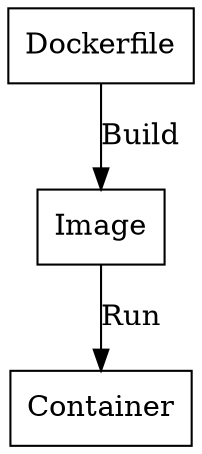
```graphviz
digraph {
    a [label=Dockerfile, shape=box]
    b [label=Image, shape=box]
    c [label=Container, shape=box]

    a -> b [label=Build]
    b -> c [label=Run]
}
```

To fully understand how dockerfiles internally work let's breakdown it's syntax rules :

+---------------+---------------------------------------------------------------------------------+
| Command       | Description                                                                     |
+===============+=================================================================================+
| FROM          | for selecting the base image to start building with                             |
+---------------+---------------------------------------------------------------------------------+
| MAINTAINER    | Image maintainer name                                                           |
+---------------+---------------------------------------------------------------------------------+
| WORKDIR       | Set current working directory                                                   |
+---------------+---------------------------------------------------------------------------------+
| ENTRYPOINT    | This is the default command to run every time the container is started          |
+---------------+---------------------------------------------------------------------------------+
| ENV           | Setting the environment variables for the container                             |
+---------------+---------------------------------------------------------------------------------+
| LABEL         | Adding metadate & description to the image                                      |
+---------------+---------------------------------------------------------------------------------+
| ARG           | Arguments to pass to the container's ENTRYPOINT                                 |
+---------------+---------------------------------------------------------------------------------+
| USER          | Set the user name and the group the next RUN, CMD & ENTRYPOINT will run as      |
+---------------+---------------------------------------------------------------------------------+
| VOLUME        | Create a mount point on the container                                           |
+---------------+---------------------------------------------------------------------------------+
| COPY          | Copy files from host filesystem to container filesystem                         |
+---------------+---------------------------------------------------------------------------------+
| RUN           | Run a command inside the container                                              |
+---------------+---------------------------------------------------------------------------------+
| ADD           | Add files from a remote url to the container                                    |
+---------------+---------------------------------------------------------------------------------+
| EXPOSE        | What ports need to be exposed in this container                                 |
+---------------+---------------------------------------------------------------------------------+
| CMD           | Command to run when the container if finally started after the building process |
+---------------+---------------------------------------------------------------------------------+
| Hashtag       | Comments start with a hash tag                                                  |
+---------------+---------------------------------------------------------------------------------+
| .dockerignore | This file causes the build command to ignore the directory it's located in      |
+---------------+---------------------------------------------------------------------------------+


{width=4%}
Note that the docker file must be named `Dockerfile` for `docker` command to be able to find it.

\

In the same directory as the `Dockerfile` or passing the flag `-t` with the `Dockerfile` **directory**, running the command :

```bash
docker build .
# or
docker build -f /path/to/dir
```

To save the new built image with a given name :

```bash
docker build -t repo/app
```

After the building process is completed check if the image exists :

```bash
docker images
```

#### Docker compose :

Compose plays an essential role in containerized applications deployments and management, Overall it allows for mass configuration & deployment of containers in as few key strokes as possible, which have proved to be in some ways a difficult task using plain docker CLI tools and at cases straight infeasible.

The `docker-compose` utility has a list of Commands that is similar to what `docker` tool has to offer, however the most useful feature of docker compose is the use of `docker-compose.yml` files; These files allow for more flexibility when configuring various parameters of each container, The table [@tbl:compose_yaml] lists elements of the `docker-compose.yml` file

+----------------+-----------------------------------------------+
| Key            | Value                                         |
+================+===============================================+
| version        | docker compose syntax version                 |
+----------------+-----------------------------------------------+
| volumes        | define volumes to use under services          |
+----------------+-----------------------------------------------+
| networks       | define networks to use under services         |
+----------------+-----------------------------------------------+
| services       | define services to deploy                     |
+----------------+-----------------------------------------------+
| deploy         | to deploy on a docker swarm                   |
+----------------+-----------------------------------------------+
| image          | base image repository and name                |
+----------------+-----------------------------------------------+
| command        | run this command instead of the default CMD   |
+----------------+-----------------------------------------------+
| build          | build from `Dockerfile`                       |
+----------------+-----------------------------------------------+
| context        | path to `Dockerfile` or URL (build)           |
+----------------+-----------------------------------------------+
| args           | build arguments (build)                       |
+----------------+-----------------------------------------------+
| target         | select a build stage to build (build)         |
+----------------+-----------------------------------------------+
| container_name | container instance name                       |
+----------------+-----------------------------------------------+
| ports          | forward ports to the host network             |
+----------------+-----------------------------------------------+
| expose         | expose ports to the container network only    |
+----------------+-----------------------------------------------+
| depends_on     | don't start until dependency start's          |
+----------------+-----------------------------------------------+
| environment    | export environment variables to the container |
+----------------+-----------------------------------------------+

: Docker Compose Yaml {#tbl:compose_yaml}


{width=4%}
Note: Both `docker-compose.yaml` and `docker-compose.yml` are considered to be correct, since `YAML` data serialization language format uses both `.yml` or `.yaml` extension. Although technically the `YAML` is an acronym for `Yaml isn't Markup Language`.

\

Bellow is simple docker compose file structure example :

```yaml
version:

    networks:

    volumes:

    services:
        image:
        container_name:
        ports:
        expose:
        networks:
        volumes:
        environment:
        depends_on:
        restart:
```


To start all the containers defined in a given compose configuration file simply run the command bellow, the `-d` option will run the containers in the background so the logs will not be redirected the `stout` of the current session :

```bash
# to start containers
docker-compose up -d
```

## SECTION 4 : Networking

### Openvswitch :

{width=20%}

#### Definition :

The Openvswitch project is open source Apache 2.0 license, multilayer production quality virtual switching framework. Designed with Virtualization in mind and supports all features available in hardware switches allowing for highly flexible networks.

Here are some of the features supported by Openvswitch, Please keep in mind that this list is not exhaustive.

- Interface Bonding
- LACP - Link Aggregation Control Protocol
- OpenFlow
- Qos - Quality Of Service
- 802.1Q VLAN support with trunk & access ports
- 802.1ag for Connectivity Fault Management
- 802.1D STP - Spanning Tree Protocol


#### CLI

The Openvswitch project is composed of three main components being the *Database, server & controller*. The *Database* holds network configuration & parameters, The *server* is responsible for network management and it interfaces with the kernel, Lastly the *controller* acts as the firmware for the switches

```bash
systemctl start ovs-vswitchd.services
systemctl enable ovs-vswitchd.services
```

The main tool for Openvswitch configuration is

```bash
ovs-vsctl
```

And the here are some of the most useful parameters with a description of each one

```bash
# create bridge
ovs-vsctl add-br [bridge_name]

# remove bridge
ovs-vsctl del-br [bridge_name]

# add port to bridge
ovs-vsctl add-port [bridge_name] [port_name]
# add port to physical hardware
ovs-vsctl add-port [bridge_name] [interface_name]

# delete port from bridge
ovs-vsctl add-port [bridge_name] [port_name]

# list bridges and ports
ovs-vsctl show

# assign a controller to a bridge
ovs-vsctl set-controller [bridge_name] [controller]

# enable spanning tree protocol
# requires infrastructure hardware support
ovs-vsctl set bridge [bridge_name] stp_enable=true
```

### Linux Virtual Interfaces

#### Definition

In order to provide an extremely flexible network configurations the Linux kernel has the ability to emulate multiple types of network interfaces in software.

#### Types

- **Tun/Tap**

Representing a Layer 3 & 2 device respectively in other words Routing & Bridging

- **Macvtap/Macvlan**

It supports multiple modes, *Bridge - VEPA - Passingthrough - Private* , To initiate a macvtap interface

```bash
ip link add link [int] name [name] type macvtap mode [mode]
```

- **Veth**

Veth is a pair of interfaces that acts exactly like an Ethernet cable with each end like an RJ45 connector,

```bash
ip link add dev [1st_pair_name] type veth peer name [2nd_pair_name]
```

- **Bridge**

Also called a Linux Bridge

```bash
ip link add [bridge_name] type bridge
```

# Application

## Introduction

This Chapter is dedicated to the setup phase on both the `Archlinux` virtualization host and the `Fedora` containerization guest. The process involves the installation and configuration of `Qemu, KVM, libvirt & virt-manager` on the host side as well as `selinux, docker, docker-compose & lxc` on the guest side of things, as shown in the setup diagram [@fig:netdiagram]

The steps are broken down to three sections two of which are dedicated for the *Installation & Configuration* specifically *SECTION 1 & SECTION 2* in order, And lastly ending with a *Testing* phase in *SECTION 3* where we'll be deploying some docker containers for useful services.

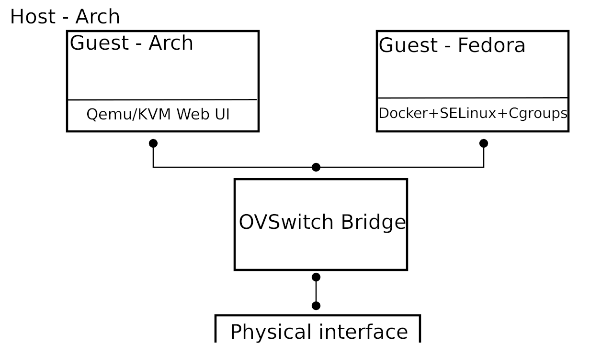{#fig:netdiagram}

Since the archlinux configuration is simple enough let's zoom in to the fedora box and see what services we'll deploy and how the data flow will look like between different docker containers.

As the diagram bellow is showing, there will be 5 docker containers in total 4 of which are backend services exposed only to the internal docker network, the other one of is a reverse proxy container that will map each domain request to a backend container based on the domain name. Although is't not shown in the diagram the DNS request will be resolved by the `BIND 9` DNS server which will also be installed and configured later on the fedora VM.

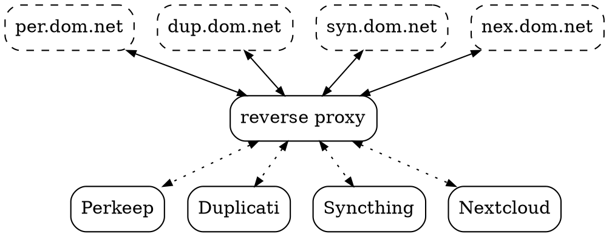
```graphviz
digraph {
    // graph [ dpi = 600 ];
    graph [concentrate=true];
    a [label="reverse proxy", shape=box, style=rounded]
    b [label=Perkeep, shape=box, style=rounded]
    c [label=Duplicati, shape=box, style=rounded]
    d [label=Syncthing, shape=box, style=rounded]
    e [label=Nextcloud, shape=box, style=rounded]
    f [label="per.dom.net", shape=box, style="rounded,dashed" ]
    g [label="dup.dom.net", shape=box, style="rounded,dashed" ]
    h [label="syn.dom.net", shape=box, style="rounded,dashed" ]
    i [label="nex.dom.net", shape=box, style="rounded,dashed" ]

    a -> { b c d e } [dir=both, arrowhead=normal, arrowtail=normal, arrowsize=0.7, style=dotted]
    { f g h i } -> a [dir=both, arrowhead=normal, arrowtail=normal, arrowsize=0.7]
    // b -> d
    // a -> a[label="oh!"]
}
```


## SECTION 1 : Host {#sec:host}

### Installation & Configuration

The first step that must be done before installing any virtualizaion software, is to check whether the host's CPU is capable of supporting hardware virtualizaion. The output should contain the keywords `vmx` or `svm` highlighted on the output if the target CPU has hardware virtualization support for `VT-x` or `AMD-v` respectively

```bash
# for intel CPUs
sort -u /proc/cpuinfo | grep --color vmx
lscpu | grep --color vmx

# for AMD CPUs
sort -u /proc/cpuinfo | grep --color svm
lscpu | grep --color svm

# for both vendors (if not sure what to use)
sort -u /proc/cpuinfo | grep --color -E '(vmx|svm)'
```

{width=4%}
Note: if no output is displayed, you might want to enable virtualization extensions in the BIOS or UEFI assuming it's supported.

\

After making sure that the CPU supports `HAV`^[Hardware Assisted Virtualization], let's install all the software needed to set up the host's virtualization environment on the `Archlinux` host

```bash
pacman -Syu qemu libvirt virt-manager virt-viewer openvswitch libguestfs
```

#### KVM

Check whether the `kvm` kernel module is enabled

```bash
lsmod | grep kvm
```

If no output is shown then `kvm` is disabled, to enable it along side the `nested` virtualization feature required for the Qemu/kvm web interface in the `Archlinux Guest`

```bash
# for intel
echo "options kvm-intel nested=1" > /etc/modprobe.d/kvm-intel.conf

# for amd
echo "options kvm-amd nested=1" > /etc/modprobe.d/kvm-amd.conf
```

Add the current user to the `kvm` group in order to allow the user to manage

```bash
usermod -aG kvm user
```

#### Libvirt

Enabling & starting the `libvirtd.service` service

```bash
# start sevice
systemctl start libvirtd.service
# enable it
systemctl enable libvirtd.service

# check whether it's running
systemctl is-active libvirtd.service
systemctl status libvirtd.service
```

Appending the current user to the libvirt group

```bash
usermod -aG libvirt user
```

We must create a storage pool first by creating a file `pool.xml` with the following content, this process must be only once then all disk image files will be in the created pool unless another pool is required

```xml
<pool type="dir">
  <name>.vms</name>
  <target>
    <path>/home/user/.vms</path>
  </target>
</pool>
```

```bash
# in the virsh interpreter
pool-define --file pool.xml

# or without an xml file
pool-define-as --name .vms --type dir --target /home/user/.vms
# the short version
pool-define-as .vms dir --target /home/user/.vms

# then build, start and autostart the pool
pool-start -- build --pool.vms
pool-autostart --pool .vms
```

Now we need to make network connectivity available for the guest VMs by using an Openvswitch bridge as a network. We start by creating the network definition `ovsbr-net.xml` file

```xml
<network>
    <name>ovsbr0</name>
    <forward mode="bridge"/>
    <bridge name="ovsbr0"/>
    <virtualport type="openvswitch"/>
</network>
```

```bash
# define the network
net-define --file ovsbr-net.xml

# check if the network exists
net-list --all

# start it and enable automatic start
net-start --network ovsbr-net
net-autostart --network ovsbr-net
```

#### Openvswitch

Enabling & starting `ovs-vswitchd.service` service to handle network configuration

```bash
# starting service
systemctl start ovs-vswitchd.service
# enabling it
systemctl enable ovs-vswitchd.service

# check whether it started successfuly
systemctl is-active ovs-vswitchd.service
systemctl status ovs-vswitchd.service
```

Initialization of the database for the first run only, this command has no effect if the DB is already initialized

```bash
ovs-vsctl init
```

Creating an Openvswitch bridge called `ovsbr0`, then assigning the ethernet physical interface `enp0s20f0u1 `to a vswitch port

```bash
ovs-vsctl add-br ovsbr0
ovs-vsctl add-port ovsbr0 enp0s20f0u1

# check
ovs-vsctl show
```

#### Fedora Guest Installation


- **Storage**

We'll start by creating a *thinprovisioned* or in other words a *sparse* *qcow2* format disk image of 100G in the `.vms` directory

```bash
# creating the disk image
qemu-img create -f qcow2 ~/.vms/fedora33.qcow2 100G
```


```bash
# Or by using virsh
vol-create-as --name fedora33.qcow2 --format qcow2 --pool .vms --capacity 100G
vol-list --pool .vms
```

Then creating a file `disk.xml` with the content bellow, and using `virsh` command `vol-create`


```xml
<!-- alternative way using libvirt xml file -->
<volume>
  <name>vol.qcow2</name>
  <capacity>107374182400</capacity>
  <allocation>0</allocation>
  <target>
    <format type="qcow2"/>
  </target>
</volume>
```

Now using `virsh --connect qemu:///system`

```bash
# in the virsh interpreter
connect qemu:///system
vol-create --file disk.xml --pool .vms

# or without an xml file
vol-create-as --format qcow2 --pool .vms --name fedora33.qcow2 --capacity 100G
# the short version
vol-create-as .vms fedora33.qcow2 100G
```

- **Network**

For the Qemu/kvm guests network connectivity, Openvswitch bridge `ovsbr0` is used. Add the next XML block in the guest configuration to connect to the OVS bridge regardless of the libvirt networks available

```xml
<interface type="bridge">
  <source bridge="ovsbr0"/>
  <virtualport type="openvswitch"/>
  <target dev="arch_port"/>
</interface>
```

Or connect the VM by crating and attaching a new interface to the `ovsbr0` network that we've created when installing `libvirt`

```bash
attach-interface --persistent --domain fedora33 --source ovsbr0 --type network
```

- **Starting**

To create & start the *fedora* VM we create a shell script with the following content and make it executable :

```bash
#!/bin/sh

 virt-install --connect qemu:///system \
  --name fedora33 \
  --memory 4096 \
  --vcpus 1 \
  --cpu host,secure=on \
  --features kvm.hidden.state=on \
  --cdrom /home/user/Downloads/Fedora-Server-dvd-x86_64-33-1.2.iso \
  --boot bootmenu.enable=on \
  --os-variant archlinux \
  --disk /home/user/.vms/fedora33.qcow2 \
  --network network=ovsbr0 \
  --os-variant detect=on \
  --hvm \
  --virt-type=kvm \
  --memballoon virtio \
  --rng /dev/urandom \
  --machine q35 \
  --events on_poweroff=destroy,on_reboot=restart,on_crash=destroy \
  --graphics vnc
```

Which can also be done using `qemu-system-x86_64` command, With `macvtap` interface instead *(which isn't covered in this paper)* and the command is

```bash
#!/bin/sh

/usr/bin/qemu-system-x86_64 \
    -monitor stdio \
    -smp 2,cores=2,threads=1,sockets=1 \
    -cpu host \
    -device intel-hda \
    -device hda-duplex \
    -vga virtio \
    -machine accel=kvm \
    -m 4096 \
    -drive file="/home/user/.vms/fedora33.qcow2",if=virtio,media=disk \
    -drive file="/home/user/Downloads/Fedora-Server-dvd-x86_64-33-1.2.iso",if=virtio,media=cdrom \
    -net nic,model=virtio,macaddr=$(cat /sys/class/net/tap_fed0/address) \
    -net tap,fd=3 3<>/dev/tap6 \
    -boot menu=on \
    -rtc base=localtime \
    -name "fedora"
```

- **Installation**

After starting the Qemu/kvm fedora 33 server edition VM from the installation iso, the installer will boot automatically to the Installation main menu as shown at [@fig:fedmenu]

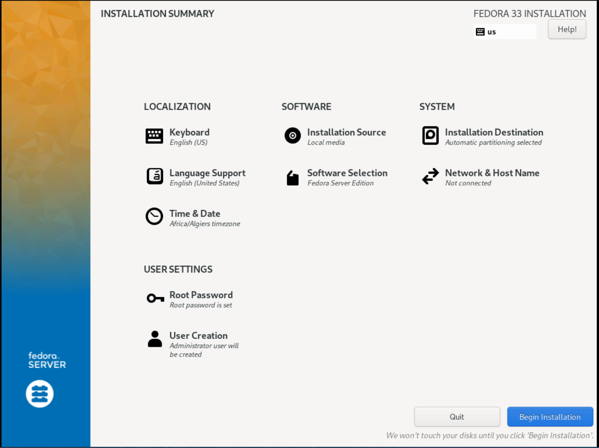{#fig:fedmenu}

The next thing is the users passwords configuration, by clicking on the *Root Password* menu and filling the form as needed by the system administrator [@fig:fedrootpass]

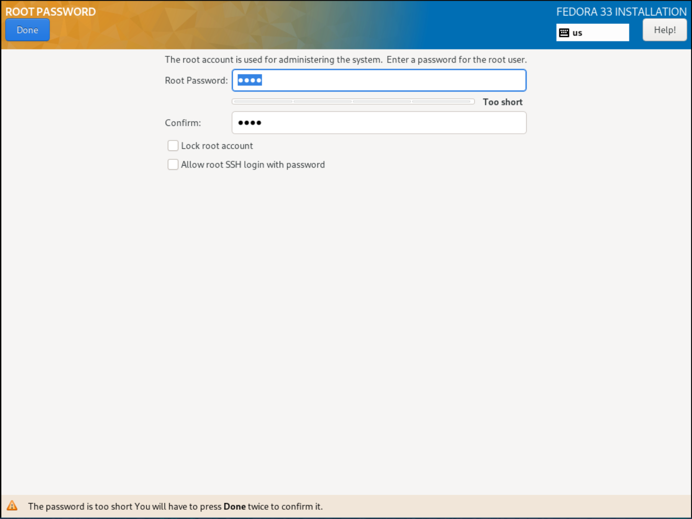{#fig:fedrootpass}

After that we'll create a user and give him administrative privileges by clicking on the *User Creation*, this step is highly recommended so that we don't login as root for security reasons [@fig:feduserpass]

{#fig:feduserpass}

The final step in the installation is to click on the *Begin Installation*, and the installer progress will be shown [@fig:fedprogress]

{#fig:fedprogress}

After the installation finishes reboot the server.

#### Archlinux Guest Installation

- **Storage**

```bash
# creating the disk image
qemu-img create -f qcow2 ~/.vms/arch.qcow2 100G
```

```bash
vol-create-as --name arch.qcow2 --format qcow2 --pool .vms_test --capacity 100G
vol-list --pool .vms
```

- **Network**

Add the next XML block in the guest configuration to connect to the OVS bridge regardless of the libvirt networks available

```xml
<interface type="bridge">
  <source bridge="ovsbr0"/>
  <virtualport type="openvswitch"/>
  <target dev="arch_port"/>
</interface>
```

Or connect the VM by crating and attaching a new interface to the `ovsbr0` network that we've created when installing `libvirt`

```bash
attach-interface --persistent --domain archlinux --source ovsbr0 --type network
```

- **Starting**

The final step is to create & start the VM with the required specifications by using the `virt-install` command with the right set of parameters

```bash
 virt-install --connect qemu:///system \
  --name arch \
  --memory 4096 \
  --vcpus 2 \
  --cpu host,secure=on \
  --features kvm.hidden.state=on \
  --cdrom /home/user/Downloads/archlinux-2020.05.01-x86_64.iso \
  --boot bootmenu.enable=on \
  --os-variant archlinux \
  --disk /home/user/.vms/arch.qcow2 \
  --network network=ovsbr0 \
  --os-variant detect=on \
  --hvm \
  --virt-type=kvm \
  --memballoon virtio \
  --rng /dev/urandom \
  --machine q35 \
  --events on_poweroff=destroy,on_reboot=restart,on_crash=destroy \
  --graphics vnc
```

Just as a side note, The VM can also be started by using Qemu directly with the following list of commands. However for networking we use a `macvtap` bridge instead of **OVS** which is less convenient is some cases depending on the setup

```bash
#!/bin/sh

/usr/bin/qemu-system-x86_64 \
    -monitor stdio \
    -smp 2,cores=2,threads=1,sockets=1 \
    -cpu host \
    -device intel-hda \
    -device hda-duplex \
    -vga virtio \
    -machine accel=kvm \
    -m 4096 \
    -drive file="/home/user/.vms/arch.qcow2 ",if=virtio,media=disk \
    -drive file="/home/user/Downloads/archlinux-2020.05.01-x86_64.iso ",if=virtio,media=cdrom \
    -net nic,model=virtio,macaddr=$(cat /sys/class/net/tap_arch0/address) \
    -net tap,fd=3 3<>/dev/tap6 \
    -boot menu=on \
    -rtc base=localtime \
    -name "fedora"
```

- **Installation**

When the VM boots, install **Archlinux** with the following command. Please keep in mind that this is by no means an **`Archlinux`** installation guide so this is just a brief list of the process's required commands

```bash

# Disk partitioning
fdisk /dev/vda
fdisk -l

# Partition formating
mkfs.ext4 /dev/{vda1,vda2}

# Mounting
mkdir /mnt/home
mount /dev/vda1 /mnt
mount /dev/vda2 /home

# Base system installation
pacstrap -i /mnt base linux linux-firmware sudo vim

# Fstab generation
genfstab -U -p /mnt >> /mnt/etc/fstab

# Chrooting to the new environment
arch-chroot /mnt /bin/bash

# Setting up the locale
echo "en_US.UTF-8 UTF-8" >> /etc/locale.gen
# Generating locale
locale-gen
echo "LANG=en_US.UTF-8" > /etc/locale.conf

# Choosing time zone
ln -sf /usr/share/zoneinfo/Africa/Algiers /etc/localtime
# Syncing the hardware clock
hwclock --systohc --utc

# Setting up the hostname & localhost
echo "archserver" > /etc/hostname
echo "127.0.0.1 localhost.localdomain archserver" > /etc/hosts

# Installation & starting network deamon
pacman -S NetworkManager
systemctl enable NetworkManager

# root password
passwd

# Installing & generating grub config
pacman -S grub
grub-install /dev/vda
grub-mkconfig -o /boot/grub/grub.cfg
exit

# Unmount filesystems & reboot
umount -R /mnt
reboot
```


## SECTION 2 : Guests {#sec:guests}

### Fedora Guest

#### Initial Setup

Check whether SELinux is running in enforcing mode by running `sestatus`, if it is switch it `off` for now so that we can configure the system without triggering AVCs

```bash
sestatus

# for some operations selinux must be in permissive mode
setenforce 0
```

When the server boots back up, login and update the package manager's cache and system software. This is important to get the latest security patches for various applications

```bash
yum update
```

We also need to install a small SELinux module to allow containers to access the docker daemon Unix domain socket `/var/run/docker.sock` without having SELinux blocking access. The modules can be found in `https://github.com/dpw/selinux-dockersock#selinux-dockersock`.

#### BIND DNS

Installing `BIND 9`^[Berkeley Internet Name Domain] also knows as `named` *DNS* server, is not mandatory but it will significantly reduce users confusion when multiple services share the same host with multiple exposed ports.

```bash
yum install bind
```

Edit `/etc/named.conf` and add *Forward* & *Reverse* lookup zone blocks, the full file content can be found under **Appendix A**

```javascript
zone "dom.net" IN {
type master;
file "forward.dom.net";
allow-update { none; };
};

zone "10.1.10.in-addr.arpa" IN {
type master;
file "reverse.dom.net";
allow-update { none; };
};
```

Then create the zone files under `/var/named/`

- Path `/var/named/forward.dom.net`

```yaml
$TTL 604800
@	IN	SOA	fedora.dom.net.	root.dom.net.	(
		2011071006	;serial
		604800		;refresh
		86400		;retry
		2419200		;expire
		806400 )		;min TTL

;
@		IN	NS	fedora.dom.net.
fedora		IN	A	10.1.10.2
arch		IN	A	10.1.10.3
nextcloud	IN	CNAME	fedora
nex		    IN	CNAME	fedora
duplicati	IN	CNAME	fedora
dup		    IN	CNAME	fedora
syncthing	IN	CNAME	fedora
syn		    IN	CNAME	fedora
perkeep		IN	CNAME	fedora
per		    IN	CNAME	fedora
```

- Path `/var/named/reverse.dom.net`

```yaml
$TTL 604800
@	IN	SOA	fedora.dom.net.	root.dom.net.	(
		2011071001	;serial
		604800		;refresh
		86400		;retry
		2419200		;expire
		806400 )		;min TTL

;
@	IN	NS	fedora.dom.net.
fedora	IN	A	10.1.10.2
2	IN	PTR	fedora.dom.net.
3	IN	PTR	arch.dom.net.
```

Checking the coherence of the configuration files

```bash
named-checkconf /etc/named.conf

named-checkzone forward.dom.net /var/named/forward.dom.net

named-checkzone reverse.dom.net /var/named/reverse.dom.net
```

If everything is fine and the previous step didn't produce any error messages, proceed and start the `named.service` systemd unit

```bash
systemctl enable --now named.service
```


#### Cgroups

Since fedora 33 switched from Cgroups V1 "Version 1" to Cgroups V2 "Version 2" there are a couple of options that the user have to choose from, This is due to the lack of support of Cgroups V2 from the docker engine.

The available options are to switch back to Cgroups V1 or use an alternative to docker which is maintained by RedHat called *Podman* this utility has pretty much the same syntax as *docker* making it a drop in replacement for docker in most of the use cases.

i. **Switching To Cgroups V1**

By editing the file `/etc/default/grub` and appending the kernel boot parameter `systemd.unified_cgroup_hierarchy=0` to the `GRUB_CMDLINE_LINUX` variable manually. Or by just using the `grubby` CLI utility to update the config

```bash
grubby --update-kernel=ALL \
--args="systemd.unified_cgroup_hierarchy=0"
```

ii. **Using Podman**

Obviously this paper is about `docker`, however if the user of `Cgroups V2` is desired, using `podman` is a drop in replacement for the `docker` utility since it uses the same CLI syntax as `docker` while being daemon less meaning that it doesn't require the `dockerd` daemon to be constantly running in the background in order for it to be able to manage, monitor & supervise container processes. The only draw back is that at the time of writing this text `podman-compose` is a separate project and it's not quite ready for production yet as it is still a WIP^[Work In Progress].

```bash
yum install podman podman-compose
```


#### Docker

{#fig:cont_topo width=100%}

Next let's install the containerization software, in this case this includes `docker` engine and `docker-compose`

```bash
yum install docker docker-compose
```

Add user to docker group in order for the unprivileged user to be able to control the docker deamon, without the need for root access

```bash
usermod -aG docker user
```

```bash
systemctl start docker.service
systemctl enable docker.service
```

Next we'll deploy a handful of docker containers for services that we need in production environment as well as homes and offices. The deployed containers are going to be behind a reverse proxy and reachable by using the URL format `service.dom.net` this will significantly improve the user friendliness when accessing the services, since other otherwise the user must remember the hosts and the container ports for each and every service which is daunting.

##### Nginx Reverse Proxy

The `nginx reverse proxy` will map every request to the `fedora` VM into a container port based on the requested host on the domain `dom.net` and this is done via the `VIRTUAL_HOST` environment variable on the container's docker-compose definition. The reverse proxy will also connect to the backends using `https` if the environment variable `VIRTUAL_PROTO` is set to the value `https`. If the backend expose more than one port the UI port can also be specified via `VIRTUAL_PORT`.

The reverse proxy container monitors the docker daemon for any running containers that have the environment variables described earlier by mounting the `dockerd` Unix domain socket `/var/run/docker.sock` as read only since there is no need for management capabilities.

For a secure `ssl/tls` connection the path `/etc/nginx/certs` can be populated by mounting a host directory containing the certificate & the private key files for each container in the form `service.dom.net.crt` and `service.dom.net.key` respectively, as well bridging the port number `443` to the host machine.

We have also to add a custom configuration file to `/etc/nginx/conf.d/` directory to allow large file uploads, since nearly all services relay on this feature. This is done by creating a file with any name like for example `proxy.conf` with the variable `client_max_body_size` set maximum value that we expect to upload to any of the services as a single file, which is in this case `2048M` which is equal to `2GB`; And mounting the custom configuration file to the reverse proxy `conf.d` directory.

```apache
client_max_body_size 2048M;
```

Lastly here is the complete `reverse_proxy` section in the `docker-compose.yml` file

```yaml
reverse_proxy:
   image: jwilder/nginx-proxy
   container_name: reverse_proxy
   ports:
     - 80:80
     - 443:443
   volumes:
     - /var/run/docker.sock:/var/run/docker.sock:ro
     - ./keys:/etc/nginx/certs:Z
     - ./proxy.conf:/etc/nginx/conf.d/proxy.conf:ro,Z
```

##### NextCloud

Nextcloud is productivity platform that allows an enterprise to collaborate more effectively by sharing *Document, Files, Email, Calendar ...* and so on, It also provides team chat and much more.

We can start the `Nextcloud` container in two ways, the first one is by using `docker` container management utility and the second method is by using `docker-compose`. The base image used is the `linuxserver/nextcloud` image since the `linuxserver` docker repository is well known for high quality uptodate and well maintained images.

First we create the user that the container is going to drop privileges to after it starts, the user is named `nextcloud` and has UID^[User Identifier] of `1002`.

```bash
useradd -u 1002 nextcloud
```

And here is the `nextcloud` service section of the `docker-compose.yml` file

```yaml
  nextcloud:
    image: ghcr.io/linuxserver/nextcloud
    container_name: nextcloud
    expose:
      - 443
    volumes:
      - /nextsqll/appdata:/config:Z
      - /nextsqll/data:/data:Z
    environment:
      - VIRTUAL_HOST=nextcloud.dom.net,nex.dom.net
      - VIRTUAL_PROTO=https
      - VIRTUAL_PORT=443
      - PUID=1002
      - PGID=1002
      - TZ=Africa/Algiers
    depends_on:
      - nextcloud_reverse_proxy
    restart: unless-stopped
```

Alternatively bellow is the `docker` utility of how to run this container

```bash
# docker
docker run --rm -d \
  --expose 443 \
  -v /nextsqll/appdata:/config:Z \
  -v /nextsqll/data:/data:Z \
  -e VIRTUAL_HOST=nextcloud.dom.net,nex.dom.net \
  -e VIRTUAL_PROTO=https \
  -e VIRTUAL_PORT=443 \
  -e PUID=1002 \
  -e PGID=1002 \
  -e TZ=Africa/Algiers \
  --name=nextcloud \
  --restart=unless-stopped \
ghcr.io/linuxserver/nextcloud
```


+-------------------------------------------------------------------------------------------------------------------------------------------------------------------------------------------------------------------------------------------------+
| {width=4%}Note: the `depends_on` is omitted when the container is started using the `docker` tool since it's started manually and the user should be able to start containers in the right order. |
+-------------------------------------------------------------------------------------------------------------------------------------------------------------------------------------------------------------------------------------------------+

\

+----------------------------------------------------------------------------------------------------------------------------------------------------------------------------------------------------------------------------------------------------------------------------------------------------------------------------------------------------------------------------------------------------------------------------------------------------------------------------------------------------------------------------------------------------------------------------------------------------------------------+
| {width=4%}Notice the **:Z** volume flags, these are used to automatically label the container's volumes with the right SELinux labels. This flag can be either upper case *Z* or lower case *z*, the difference is that the upper case *Z* adds MCS labels which makes the volume only accessible by the container that owns it, meaning that this volume is not shareable between containers. These mount options can be applied manually using `chcon -t container_file_t -l s0:c100,c200` where `c100,c200` is MCS label of the container. |
+----------------------------------------------------------------------------------------------------------------------------------------------------------------------------------------------------------------------------------------------------------------------------------------------------------------------------------------------------------------------------------------------------------------------------------------------------------------------------------------------------------------------------------------------------------------------------------------------------------------------+

\

Now to setting up secure communications with reverse proxy when users connect to the it since they will no more connect to the nextcloud instance directly the certificates must be used on the *nginx reverse proxy* side. And we'll start by copying certificate and private key from the next cloud container to the current project directory in the `keys` directory

```bash
docker cp nextcloud:/config/keys .
```

Renaming the certificate `cert.crt` as `nextcloud.dom.net.crt` and the private key `cert.key` as `nextcloud.dom.net.key`, since this is the format that the *nginx* is expecting in order to match each file in the `/etc/nginx/certs` to a unique service in the backend

```bash
mv cert.crt nextcloud.dom.net.crt
mv cert.key nextcloud.dom.net.key
```

We also have the short domain `nex.dom.net`, so we'll create two symbolic links from the `nextcloud.dom.net.crt` & `nextcloud.dom.net.key` pointing to `nex.dom.net.crt` & `nex.dom.net.key` respectively

```bash
ln -s nextcloud.dom.net.crt nex.dom.net.crt
ln -s nextcloud.dom.net.crt nex.dom.net.key
```

Adding the `nextcloud.dom.net` and `nex.dom.net` to the `/config/www/nextcloud/config/config.php` configuration file for the nextcloud instance to specify what domain it should trust and block any other connections. This can done multiple ways, we'll do it by accessing the container interactively and editing the file

```bash
docker exec -it nextcloud /bin/bash
```

```php
'trusted_domains' =>
   [
    'nextcloud.dom.net',
    'nex.dom.net',
    ],
```

##### Syncthing

Syncthing allows for a decentralized data synchronization over multiple devices, as the main project page^[https://syncthing.net/] describes it

> Syncthing is a continuous file synchronization program. It synchronizes files between two or more computers in real time, safely protected from prying eyes. Your data is your data alone and you deserve to choose where it is stored, whether it is shared with some third party, and how it's transmitted over the internet.


```yaml
  syncthing:
    image: syncthing/syncthing
    container_name: syncthing
    expose:
      - 8384
      - 22000
    volumes:
      - /syncthing:/var/syncthing:Z
    environment:
      - VIRTUAL_HOST=syncthing.dom.net,syn.dom.net
      - VIRTUAL_PROTO=https
      - VIRTUAL_PORT=8384
      - STGUIADDRESS=0.0.0.0:8384
    depends_on:
      - nextcloud_reverse_proxy
```

```bash
docker run --rm -d \
  --expose 8384 \
  --expose 22000 \
  -v /syncthing:/var/syncthing:Z \
  -e VIRTUAL_HOST=syncthing.dom.net,syn.dom.net \
  -e VIRTUAL_PROTO=https \
  -e VIRTUAL_PORT=8384 \
  -e STGUIADDRESS=0.0.0.0:8384 \
  --name=syncthing \
  syncthing/syncthing:latest
```

##### Duplicati

Duplicati is an open source online backup software capable of performing backups to many backends with support for backup encryption

> Backup files and folders with strong AES-256 encryption. Save space with incremental backups and data deduplication. Run backups on any machine through the web-based interface or via command line interface. Duplicati has a built-in scheduler and auto-updater.

```bash
useadd -u 1003 duplicati
```

```yaml
  duplicati:
    image: ghcr.io/linuxserver/duplicati
    container_name: duplicati
    expose:
      - 8200
    environment:
      - VIRTUAL_HOST=duplicati.dom.net,dup.dom.net
      - PUID=1003
      - PGID=1003
      - TZ=Africa/Algiers
    volumes:
      - /duplicati/config:/config:Z
      - /duplicati/backups:/backups:Z
      - /duplicati/source:/source:Z
    depends_on:
      - nextcloud_reverse_proxy
    restart: unless-stopped
```


```bash
docker run --rm -d \
  --expose 8200 \
  -v /duplicati/config:/config:Z \
  -v /duplicati/backups:/backups:Z \
  -v /duplicati/source:/source:Z \
  -e VIRTUAL_HOST=duplicati.dom.net,dup.dom.net \
  -e PUID=1003 \
  -e PGID=1003 \
  -e TZ=Africa/Algiers \
  --name=duplicati \
  --restart=unless-stopped \
duplicati/duplicati:latest
```


##### Perkeep

`Perkeep` stands for *Permanent* & *Keep* which is a backup software built from the ground up for storing data in custom structure that is consistent and readable over time.

`Perkeep` will allow us to see and example of how to build a custom image and deploy it. To build `perkeep` we'll need a `Dockerfile` containing the steps that `docker build` should follow in order to generate a usable base image, which in this case looks like this

```dockerfile
FROM archlinux
LABEL maintainer="guenfafhichem@protonmail.com"
ENV HOME=/home/perkeep
RUN pacman -Syu git go --noconfirm && \
	useradd -m -s /bin/bash perkeep && \
	git clone "https://github.com/perkeep/perkeep.git" ${HOME}/perkeep.org && \
	pacman -Scc --noconfirm

WORKDIR ${HOME}/perkeep.org
RUN go run make.go && \
	rm -rf ${HOME}/perkeep.org && \
	chown -R perkeep ${HOME}/go && \
	pacman -Rns go git --noconfirm

WORKDIR ${HOME}/go/bin
USER perkeep
#COPY server-config.json ${HOME}/.config/perkeep/server-config.json
ENTRYPOINT ["/home/perkeep/go/bin/perkeepd"]

EXPOSE 3179
```

Building the image is done via the `docker build` command, and passing the image title after the `-t` flag followed by the directory which contains the `Dockerfile` in this case `.` or the current directory

```bash
docker build -t xradiation/perkeep .
```

Then starting the resulting image using `docker-compose.yml` file

```yaml
version: "3.8"
services:

  perkeep:
    image: xradiation/perkeep:latest
    container_name: perkeep
    ports:
      - 3179:3179
```

##### Jellyfin

Jellyfin is Media Server that provide entertainment streaming services such as *Videos, Movies, Music ...* to start it we create a docker compose file `docker-compose.yml`

```bash
mkdir jellyfin; cd jellyfin
vim docker-compose.yml
```

Create a user for `jellyfin` to drop privileges to, and find out his user id in this case it was 1001

```bash
useradd -U -M jellyfin
id jellyfin
```

```yaml
version: "3.8"
services:
  jellyfin:
    image: jellyfin/jellyfin
    ports:
      - "8096:8096"
      - "8920:8920"
      - "1900:1900"
      - "7359:7359"
    container_name: jellyfin
    user: 1001:1001
    volumes:
      - /jellyfin/config:/config
      - /jellyfin/cache:/cache
      - /jellyfin/media:/media
      - /jellyfin/media2:/media2:ro
    restart: "unless-stopped"
```


```bash
docker-compose up -d
```

##### Portainer

The last container that we're going to deploy is `portainer/portainer-ce` which is a management and monitoring container that uses the `/var/run/docker.sock` Unix domain socket to communicate with the docker daemon.

```bash
docker run -d -p 9000:9000 -p 8000:8000 -v /portainer_data:/data:Z -v /var/run/docker.sock:/var/run/docker.sock --name=portainer --restart=always portainer/portainer-ce
```

Then we connect to the web management interface on the fedora host port `:9000`.

#### SELinux

At this point the containers which will need to connect to the docker daemon through the `dockerd` socket at `/run/docker.sock` will not be able to do so while SELinux is in `enforcing` mode since the types `container_t` is not allowed to perform the `connectto` action on object of type `container_runtime_t` anywhere in the policy.

In order to allow the reverse proxy container to connect to the docker Unix domain socket, we'll have to add new policy rules that will allow the processes with type `container_t` to do the action `connectto` on object of type `container_runtime_t` and `unix_stream_socket`. This will be done by generating a custom policy module using `audit2allow` SELinux tool, first we need to collect the AVCs generated from the denied accesses by starting the containers while in `permissive` mode.

```bash
setenforce 0
```

The following AVCs are the ones we're looking for under `/var/log/audit/audit.log`, let's save them to a separate file called `sock_allow.log`; As it's shown bellow `docker-gen` & `portainer` triggered two AVCs attempting to `connectto` the docker socket `/run/docker.sock`, as well as another AVC by the container `nginx` trying to `associate` in the `proc` pseudo-filesystem.

```bash
type=AVC msg=audit(1612094449.795:452): avc:  denied  { connectto } for  pid=1628
comm="docker-gen" path="/run/docker.sock" scontext=system_u:system_r:container_t:s0:c672,c722
tcontext=system_u:system_r:container_runtime_t:s0 tclass=unix_stream_socket permissive=1
type=AVC msg=audit(1612094884.764:493): avc:  denied  { connectto } for  pid=1268
comm="portainer" path="/run/docker.sock" scontext=system_u:system_r:container_t:s0:c213,c812
tcontext=system_u:system_r:container_runtime_t:s0 tclass=unix_stream_socket permissive=1
type=AVC msg=audit(1612101507.395:394): avc:  denied  { associate } for  pid=2193
comm="nginx" name="2" scontext=system_u:object_r:container_t:s0:c310,c901
tcontext=system_u:object_r:proc_t:s0 tclass=filesystem permissive=1
```

After the collection of the AVCs we're going to generate a policy module by using the `-M` flag and passing the module name followed by a redirect of the previously collected logs to the `audit2allow` utility

```bash
audit2allow -M my_sock_allow < sock_allow.log
```

Two files will appear `my_sock_allow.te` & `my_sock_allow.pp` the former is the humanly understandable ASCII policy form, and the latter is the precompiled version of the first one, the contents of the `my_sock_allow.te` are as follows

```bash
module my_sock_allow 1.0;

require {
	type container_runtime_t;
	type proc_t;
	type container_t;
	class unix_stream_socket connectto;
	class filesystem associate;
}

#============= container_t ==============
allow container_t container_runtime_t:unix_stream_socket connectto;
allow container_t proc_t:filesystem associate;
```

Now to load the new policy module we'll use a tool called `semodule` for *SELinux Module* management with the `-i` flag to *install* a new policy module then pass the compiled `my_sock_allow.pp` file as an argument

```bash
semodule -i my_sock_allow.pp
```

To make sure that our policy has been loaded successfully, let's check what modules are loaded by issuing the command bellow.

```bash
semanage module --list | grep my_sock_allow
```

When this is done, the reverse proxy container as well as portainer will be able to connect to the docker daemon even if SELinux is in `enforcing` mode.

```bash
setenforce 1
```

### Archlinux

#### Description

The `Archlinux` guest is going to host our Qemu/KVM web interface, Which will make working with or even learning how both of `Qemu` and `KVM` work much easier in general by exposing a simple interface that allow the user to Create & Start his own VM without even touching the CLI; once the VM is up the user will be prompted with the `VNC` Port that he is supposed to connect to using a `VNC` client of his choice, if the user doesn't have the `VNC` client installed he can head over to the `Downloads` page and grab a `VNC` client for his own platform whether that is *Linux, MacOs, Windows & Android*.

#### Installation & Configuration

Installing the **Apache** web server

```bash
pacman -Syu apache
```

Configuring the **Common Gateway Interface** for the web server in `httpd.conf`

```bash
vim /etc/httpd/conf/httpd.conf
```

Find this section Then add these two lines to enable CGI scripts under the directory `/srv/http/cgi-bin`, So with the changes it will look like this

```apache
<Directory "/srv/http/cgi-bin">
    AllowOverride None
    Options None
    Require all granted
+   Options +ExecCGI
+   AddHandler cgi-script .cgi
</Directory>
```

Next we'll copy the Web UI project directory to `/srv/http/` and copy the `CGI` scripts to `/srv/http/cgi-bin` directory. Then we create the `index.html` file in the web server's root directory and add redirect to the main web UI HTML page.

```bash
systemctl enable --now httpd.service
```

{width=4%}
Note: The web page html/javascript as well as the `CGI` scripts, are available over at my my git{hub,lab} account under the `BSD` license.

## SECTION 3 : Testing {#sec:test}

### Cgroups

Under this section we will test how cgroups will prevent attacks on resources such as `DOS` & `DDOS`, and even bugs in the software such as memory leaks.

#### Stress-ng

The Dockerfile will create an image based on `alpine linux` and install a resource stressing tool called `stress-ng`.

```dockerfile
FORM alpine
RUN apk add --no-cache stress-ng bash
ENTRYPOINT ["/bin/bash"]
```

Next let's start the container in interactive mode using the `docker` utility, and as the figure [@fig:str_high_zoom] shows the container is running. And we get a shell to the container

```bash
docker run --rm -it --name=stress xradiation/stress
```

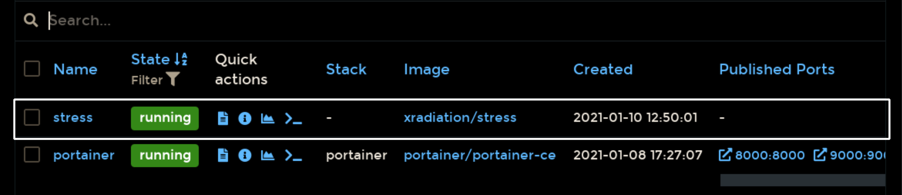{#fig:str_high_zoom width=100%}

Then click on the "graph" icon next to the `stress` container name to view the charts on resource consumption of that particular container such as *CPU* load *Memory* and *Network* Usage

{#fig:str_stats_zoom width=100%}

Before running the `stress-ng` tool let's see how much of the resources the `stress` container is using without any load, this is shown in [@fig:str_idle]; The container is using nearly no resources at all at `0.0%` CPU and `250KB` in both Memory and Cache

{#fig:str_idle width=100%}

<div id="bigfive" style="centered">
{#fig:str_mem_idle width=50%}
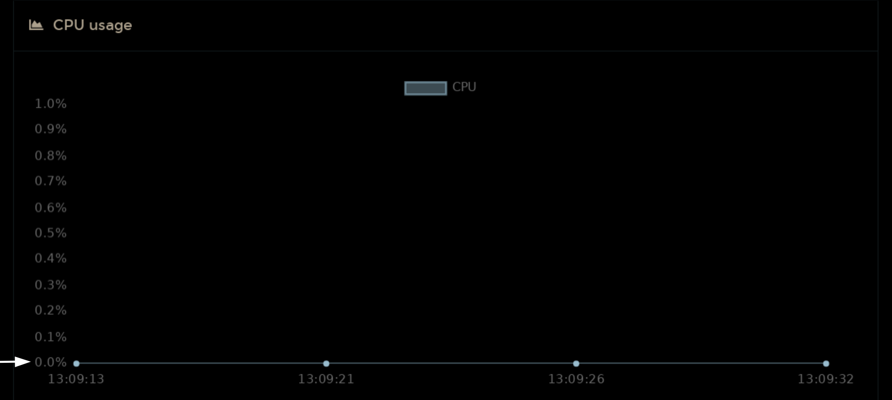{#fig:str_cpu_idle width=50%}
</div>

After getting the baseline of the container resource consumption, it's time to start the stress test and see how much resource it's going to take from the host machine without any custom `cgroup` rules. In the container's shell we type, this will start mapping and unmapping memory as much as the `--vm-bytes` flag requires


```bash
stress-ng --vm 4 --vm-bytes 256m
```

{#fig:str_cmd width=100%}

Let's observe the container usage and see how it changed. The figure [@fig:str_stress] show a drastic increase in both CPU & Memory usage at `200%` and `256MB` respectively, and since the VM has a total of 2 Cores this container is using all of them to run which slows down the host significantly.

{#fig:str_stress width=100%}

{width=4%}
Please note that this is not limited to `256MB`, by changing the `--vm-bytes` the stress test can use nearly all the available host memory.

\

By setting the `--vm-bytes` to `4096m` which is all the host's memory, the container is able to use all the *available* memory as shown in [@fig:str_full_mem]

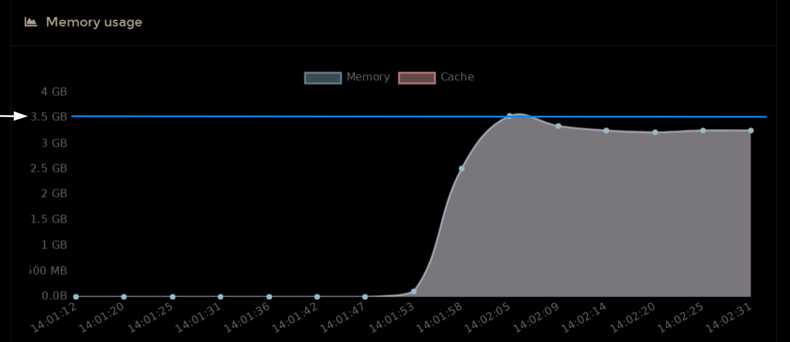{#fig:str_full_mem width=100%}

Now we'll restart the container with `cgroups` CPU and Memory limits of `25%` and `50MB` respectively, and run the same stress test as before

```bash
docker run --rm -it --name=stress --cpus=0.25 --memory=50m xradiation/stress
```

The same as the command above could be done using the `docker-compose.yml` file bellow

```yaml
version: "3.8"
services:
  stress:
    image: xradiation/stress
    container_name: stress
    cpus: 0.25
    mem_limit: 50m
    stdin_open: true
    tty: ture
```

In the containers shell we start the stress test using the `--vm` flag with the value of `4`, and `--vm-bytes` of `256m`

```bash
stress-ng --vm 4 --vm-bytes 256m
```

The figure [@fig:stc_cgrp] shows how the `cgroups` rules we used are limiting the resource usage to the values that we've specified earlier of `25%` CPU & `50MB` Memory usage

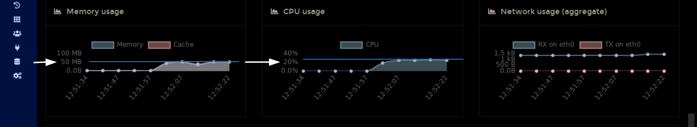{#fig:stc_cgrp width=100%}

<div id="bigfive" style="centered">
{#fig:stc_cgrp_mem width=50%}
{#fig:stc_cgrp_cpu width=50%}
</div>

#### Fork Bomb

Fork bomb container, will run recursively calling it self and forking indefinitely until the kernel's PID table is exhausted or the resources no longer support the load in which case the entire system will hang and try to free memory by calling the `OOMK` or the Out Of Memory Killer, and that can cause the system to crash if a core process is killed. This will simulate a `DOS` attack on the containerization host in two scenarios, The first one without having `cgroups` rules and the second one with tight `cgroups` rules on the target container.

```bash
docker run --rm -it alpine
:(){ : | :& }; :
```

### SELinux

To practically evaluate the benefits of using SELinux we'll spin a container and explicitly grant it full access to the host's filesystem root directory `/` in two scenarios. The first one is with SELinux in permissive mode `setenforce 0`, While the second one will be in SELinux's enforcing mode `setenforce 1`. In both scenarios will be messing with host's filesystem by creating and editing files in filesystem that in normal circumstances a container should never be able to even access in the first place; All while monitoring the `auditd` log files under `/var/log/audit/audit.log` for AVCs as they go by.
The point after this is to replicate a hacker's access to the file system through the container

#### Permissive

First of all SELinux must be in `permissive` mode, this will allow us to evaluate what would've happened to the host system in case SELinux is not there

```bash
setenforce 0
```

Then we start our rouge container with the name `setest` and mounting the host's filesystem root directory `/` to `/mnt` in the container process

```bash
docker run --rm -it --name=setest -v /:/mnt alpine
```

Now we'll need to get the SELinux contexts of the `setest` container processes, to make tracking the AVCs in `audit.log` file easier

```bash
ps auxZ | grep -m1 -E "container_t.*/bin/sh"
```

{#fig:setest_mcs width=100%}

```
system_u:system_r:container_r:s0:c65,c308 root 18064 0.0 0.0 1652 1072 ?   Ss+
21:36 0:00 /bin/sh
```


On another tty we start the `watch` command to repeat the command `tail -n20 /var/log/audit/audit.log | grep -E 'avc.*c65,c308'` every `2` seconds. The command will print the last 20 lines of `/var/log/audit/audit.log` then filters those lines for ones that contain `avc` followed by any thing then `c65,308` which are the MCS SELinux labels of the particular container that we want to trace; This will allow us to see the AVC denies as they are generated when we access files SELinux doesn't think we should.

```bash
comm="tail -n20 /var/log/audit/audit.log | grep -E 'avc.*c65,c308'"
watch $comm
```

{#fig:setest_watch width=100%}

In the container's shell let's create a directory in the root user home directory `/root` called `setest`

```bash
mkdir /mnt/root/setest
```

And sure enough we got 3 AVC denials in a row as shown in [@fig:setest_avc], The AVCs are saying that the command was `mkdir` by the user `root` which was trying to get the permissions `{ write }`, `{ add_name }` and `{ create }`; The source context is `scontext=system_u:system_r:container_t:s0:c65,c308` and the target context is `tcontext=system_u:object_r:admin_home_t:s0` which is a directory `tclass=dir` and the control action was `denied`; However even if the action was `"denied"` it succeeded regardless since `permissive=1` meaning that SELinux did not enforce the denial since it's not in enforcing mode.

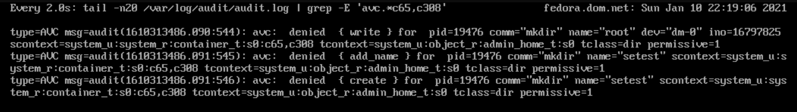{#fig:setest_avc width=100%}

```bash
type=AVC msg=audit(1610313486.090:544): avc:  denied  { write } for  pid=19476
comm="mkdir" name="root" dev="dm-0" ino=16797825
scontext=system_u:system_r:container_t:s0:c65,c308
tcontext=system_u:object_r:admin_home_t:s0 tclass=dir permissive=1

type=AVC msg=audit(1610313486.091:545): avc:  denied  { add_name } for  pid=19476
comm="mkdir" name="setest" scontext=system_u:system_r:container_t:s0:c65,c308
tcontext=system_u:object_r:admin_home_t:s0 tclass=dir permissive=1

type=AVC msg=audit(1610313486.091:546): avc:  denied  { create } for  pid=19476
comm="mkdir" name="setest" scontext=system_u:system_r:container_t:s0:c65,c308
tcontext=system_u:object_r:admin_home_t:s0 tclass=dir permissive=1
```

In this case what triggered the AVC denials was `TE` and `MCS` labels, since the subject of type `container_t` is not allowed to access objects of type `admin_home_t`, And even if it could the MCS labels doesn't match which would've prevented the access anyways.

#### Enforcing

Now let's switch SELinux back to enforcing mode by `setenforce 1` as well as momentarily disabling the don't audit rules with `semanage dontaudit off`, and launch the `setest` container in the same way we did earlier

```bash
docker run --rm -it --name=setest -v /:/mnt alpine
```

Get the container MCS labels, shown in [@fig:setest_mcs_enf.png]

```bash
ps auxZ | grep -m1 -E "container_t.*/bin/sh"
```

{#fig:setest_mcs_enf width=100%}

```
system_u:system_r:container_r:s0:c746,c839 root 21191 0.6 0.0 1652 4 ?   Ss+
22:49 0:00 /bin/sh
```

Start the `watch` command to grab any AVC denials

```bash
comm="tail -n20 /var/log/audit/audit.log | grep -E 'avc.*c746,c839'"
watch $comm
```

And try to delete the directory that we've created earlier`setest`, since the type of action doesn't really matter more than the fact that we are accessing a restricted area in the first place

```bash
rm -rf /mnt/root/setest
```

```bash
type=AVC msg=audit(1610316895.043:864): avc:  denied  { read } for  pid=25617
comm="rm" name="setest" dev="dm-0" ino=16798575
scontext=system_u:system_r:container_t:s0:c746,c839
tcontext=system_u:object_r:admin_home_t:s0 tclass=dir permissive=0
```

This time around it seems that we aren't able to even read the directory content `{ read }`, so we have no read nor write permissions. To make sure let's try to see the contents of the `/mnt/root` directory

```bash
ls /mnt/root
```

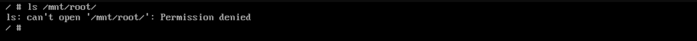{#fig:setest_permden width=100%}

And indeed we're not able to see the contents of the directory at all as shown in [@fig:setest_permden], and the following AVC deny popped up in the `audit.log` file. Notice how this time it's saying `permissive=0` meaning SELinux is in the enforcing mode and the deny action has been enforced on the access.

```bash
type=AVC msg=audit(1610316864.974:862): avc:  denied  { read } for  pid=25518
comm="ls" name="root" dev="dm-0" ino=16797825
scontext=system_u:system_r:container_t:s0:c746,c839
tcontext=system_u:object_r:admin_home_t:s0 tclass=dir permissive=0
```

{width=4%}
Let's switch the don't audit rules back on `semanage dontaudit on`, otherwise the `audit.log` will potentially be flooded with AVCs making it really hard to parse manually.

### Docker

#### Nextcloud

To connect to the `nextcloud` container connect to `nextcloud.dom.net` or `nex.dom.net`, in the web browser an you'll be greeted with the login & signup page

{#fig:nex_shot width=100%}
<div id="bigfive" style="centered">
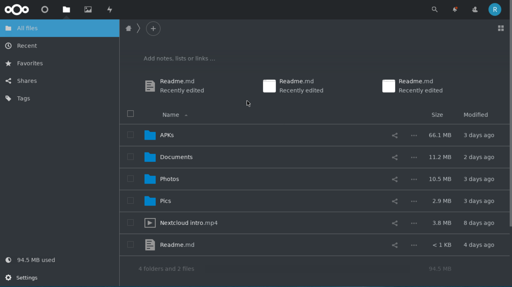{#fig:nex_files width=50%}
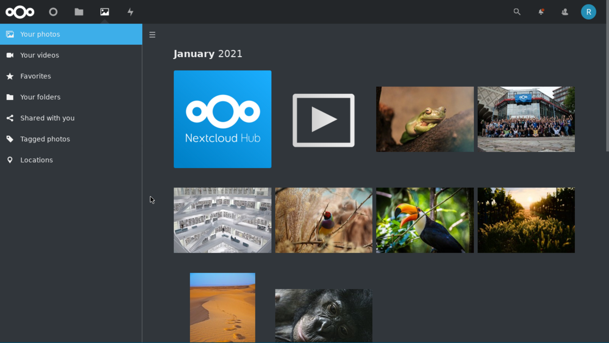{#fig:nex_photos width=50%}
</div>

#### Syncthing

To connect to the `syncthing` container connect to `syncthing.dom.net` or `syn.dom.net`, in the web browser an you'll be greeted with the login & signup page

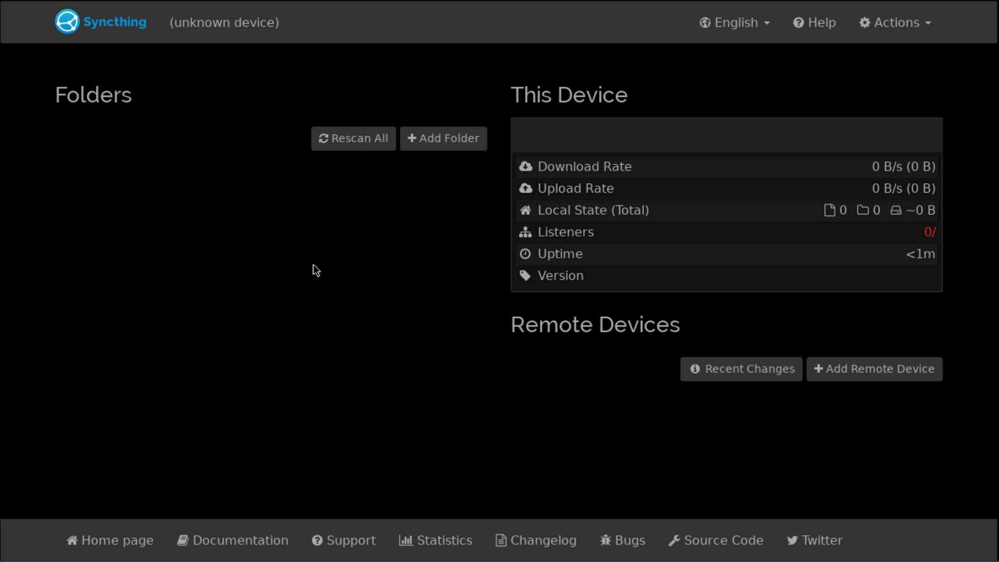{#fig:syn_shot width=100%}
<div id="bigfive" style="centered">
{#fig:syn_login width=50%}
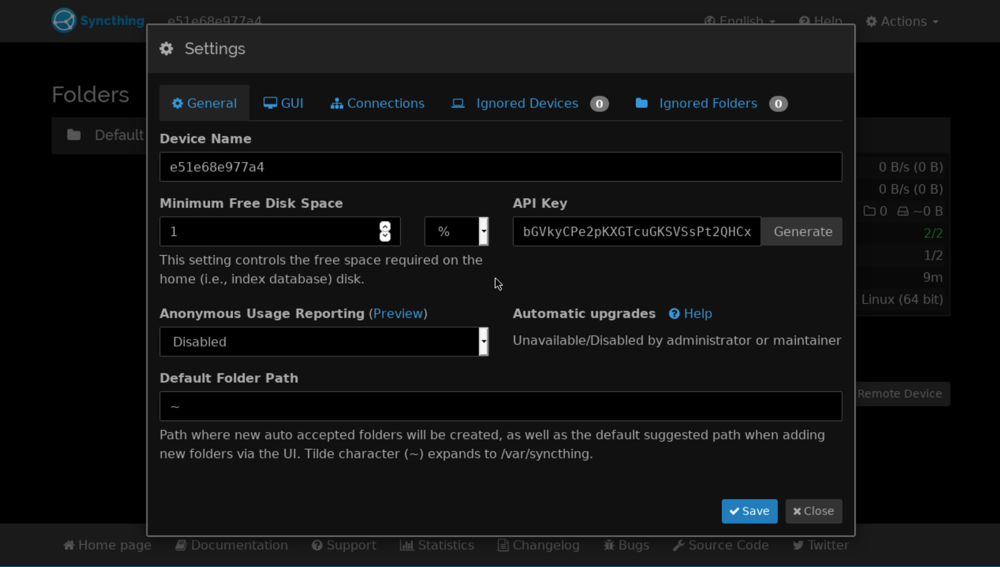{#fig:syn_set width=50%}
</div>

#### Duplicati

To connect to the `duplicati` container connect to `duplicati.dom.net` or `dup.dom.net`, in the web browser an you'll be greeted with the login & signup page

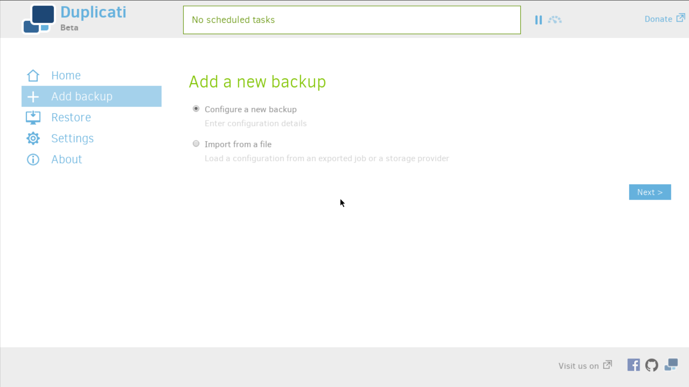{#fig:dup_addback width=100%}
<div id="bigfive" style="centered">
{#fig:dup_home width=50%}
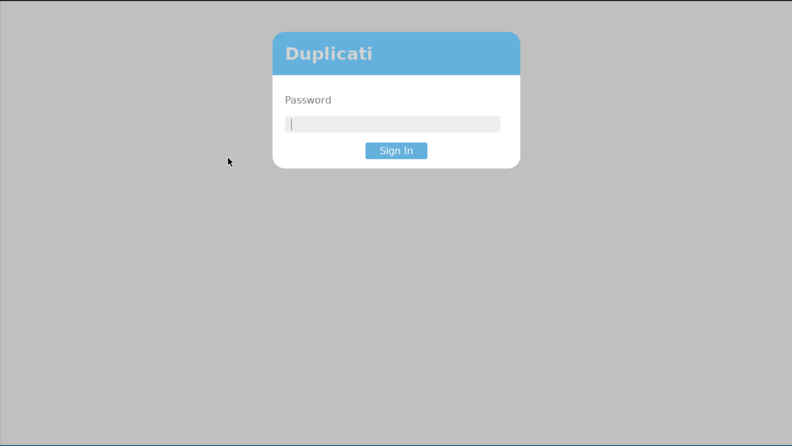{#fig:dup_shot width=50%}
</div>

#### Perkeep

To connect to the `perkeep` container connect to `perkeep.dom.net` or `per.dom.net`, in the web browser an you'll be greeted with the login & signup page

{#fig:per_shot width=100%}

#### Portainer

Portainer is a management & supervision container, hence making it accessible over exposed network interfaces isn't a sane idea obviously; so it's only accessible through `IP:PORT` combination and it's only running when monitoring is required meaning it should be possible to start remotely over SSH

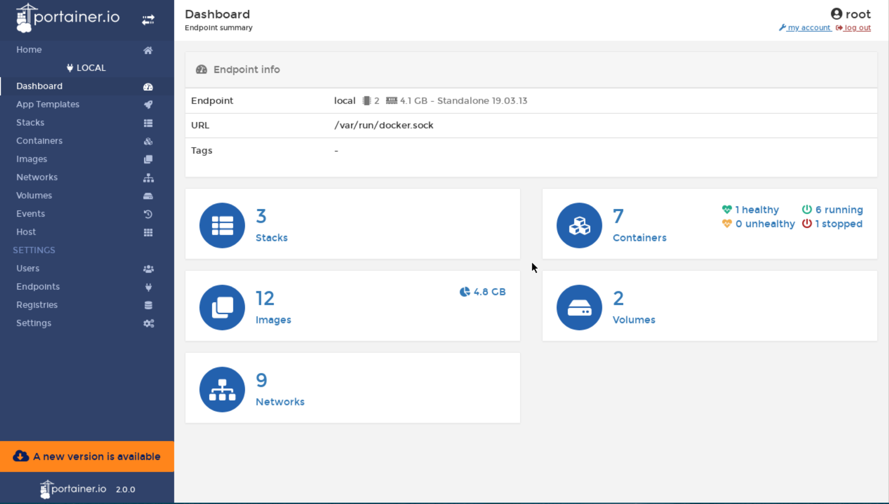{#fig:por_dash width=100%}
<div id="bigfive" style="centered">
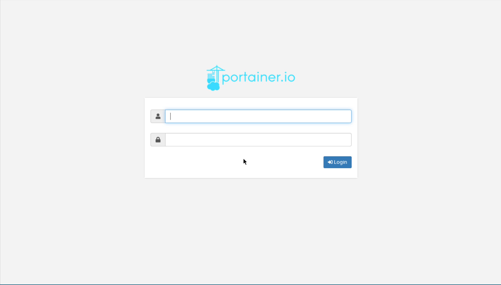{#fig:por_shot width=50%}
{#fig:por_cont width=50%}
</div>

### Qemu/KVM Web UI

Let's connect to the archlinux host using `http://arch.dom.net` and we should be greeted with the Virtual Machine creation form


{#fig:syn_shot width=100%}
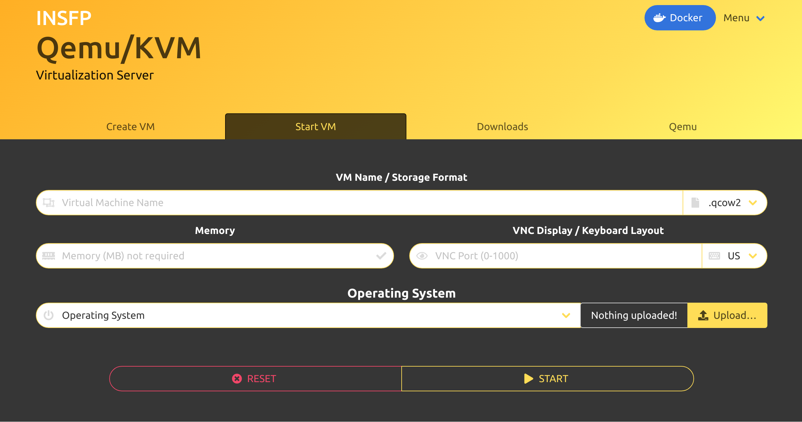{#fig:syn_login width=100%}
<div id="bigfive" style="centered">
{#fig:syn_set width=50%}
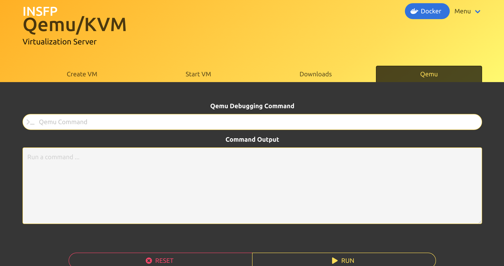{#fig:syn_set width=50%}
</div>

There is also a docker specific implementation that is still under development 

{#fig:syn_shot width=100%}

# Findings

## Findings

This CHAPTER is going to be a recap of what we've discussed throughout this paper :

- Containerization is an operating system level virtualizaion.
- Containers require isolation, preferably on multiple layers.
- Under Linux Qemu/kvm provides a relatively secure virtual environment.
- Linux virtualizaion stack relay on multiple complementary technologies, Qemu/kvm, libvirt, libguestfs.
- Using a Mandatory Access Control framework is a key element to a secure system overall & containerization.
- Mandatory Access Control systems are a requirement in untrusted environments.
- Resource limits provide a security mechanism against targeted & untargeted DOS attacks alike.

## Conclusions

At the end of this paper it's clear how important to make sure that your containerization infrastructure is as secure as possible by using the techniques described earlier, these kinds of counter measures not only saves the companies running the micro services but extends to the generally unaware client from falling into the hackers trapped containers, preventing a whole category of cyber crimes.

# Bibliography {-}

---
nocite: |
  @*
...

::: {#refs}
:::

# Appendix {-}

# BIND 9


```javascript

options {
	listen-on port 53 { 127.0.0.1; 10.1.10.2; };
	listen-on-v6 port 53 { ::1; };
	directory 	"/var/named";
	dump-file 	"/var/named/data/cache_dump.db";
	statistics-file "/var/named/data/named_stats.txt";
	memstatistics-file "/var/named/data/named_mem_stats.txt";
	secroots-file	"/var/named/data/named.secroots";
	recursing-file	"/var/named/data/named.recursing";
	allow-query     { localhost; 10.1.10.0/24; };

	recursion yes;

	dnssec-enable yes;
	dnssec-validation yes;

	managed-keys-directory "/var/named/dynamic";
	geoip-directory "/usr/share/GeoIP";

	pid-file "/run/named/named.pid";
	session-keyfile "/run/named/session.key";

	include "/etc/crypto-policies/back-ends/bind.config";
};

logging {
        channel default_debug {
                file "data/named.run";
                severity dynamic;
        };
};

zone "." IN {
	type hint;
	file "named.ca";
};

zone "dom.net" IN {
type master;
file "forward.dom.net";
allow-update { none; };
};

zone "10.1.10.in-addr.arpa" IN {
type master;
file "reverse.dom.net";
allow-update { none; };
};

include "/etc/named.rfc1912.zones";
include "/etc/named.root.key";
```
