# Introduction générale {-}

## Introduction {-}

Dans le monde d'aujourd'hui, la vie numérique est un élément vital de la vie quotidienne de chaque être humain. Les réseaux sociaux tels que Facebook, Instagram, Twitter et LinkedIn sont en un sens très importants dans nos jours.
De plus, nous avons des fournisseurs de services cloud sur le monde de l'entreprise présentés par des leaders technologiques comme AWS^[Amazon Web Services], Linode et Alibaba Cloud services entre autres; Cela inclut également un tas de services bancaires et d'achats en ligne et bien d'autres fournisseurs **aaS**^[en tant que service], tous basés sur des systèmes informatiques et la possibilité de **sauvegarder, sécuriser** et **servir** les données.

<div id="bigfive" style="centered">
{#fig:amazon width=20%}
{#fig:apple width=20%}
{#fig:facebook width=20%}
{#fig:google width=20%}
{#fig:microsoft width=14%}
</div>

Les entreprises technologiques géantes de notre société moderne, également connues sous le nom de Big Five, **Amazon, Apple, Facebook, Google et Microsoft** seraient en possession d'un accord remarquable^[Informations sur la taille des données spécifiques non accessibles au public] de la quantité globale d'informations agrégées, et ce n'est en aucun cas un processus simple pour gérer efficacement ces énormes mines de données sans les infrastructures sous-jacentes appropriées *sécurisées, coordonnées et rapides*. Dans de telles circonstances, la capacité à gérer des quantités massives de flux de données est fatale, par conséquent, la stabilité, l'évolutivité et la fiabilité sont essentielles, ce qui nécessite des systèmes de pipelining sophistiqués proches de la perfection dans chaque aspect. Par conséquent, pour atteindre ce haut niveau de sophistication, certaines des dernières technologies dans le domaine d'informatique doivent être mises à profit. Cela dit, l'une des armes les plus précieuses utilisées pour atteindre cet objectif est la **technologie de conteneurisation** ou simplement la **conteneurisation**, c'est l'un des éléments clés les plus importants dans les centres de données du monde entier; Cependant, ce faisant, de nombreuses questions se poseront et comme cela a été bien connu, avec le dernier et le plus grand vient le pire en termes de risques de sécurité et de vulnérabilités auxquels il faut faire face.

> **"Une faille dans le noyau hôte pourrait permettre à un processus dans un conteneur de se rompre et de prendre le contrôle du système." **

Est l'une des façons dont un chercheur en sécurité a décrit comment des conteneurs non sécurisés peuvent potentiellement être, associés à les VM ou les machines virtuelles.


## Problimatique {-}

La technologie de conteneurisation doit être déployée dans nos centres de données en raison du grand nombre de fonctionnalités et de capacités qu'aucune autre technologie ne le fera, mais en raison de son âge relativement jeune, elle n'est pas vraiment aussi répandue qu'elle devrait l'être et le principal facteur en est corrélé au manque de connaissances et de documentation nécessaires sur certaines fonctionnalités avancées ou même de base. L'autre aspect du problème est que la plupart des dministrateurs des système ne veulent pas réellement quitter leur zone de confort, retombant vers la virtualisation afin de ne pas avoir à traiter les problèmes émergents de cette technologie, principalement l'aspect sécurité de celle-ci.

\

Dans la communauté de la cybersécurité d'aujourd'hui, il est un fait que les conteneurs et la conteneurisation en général ne sont pas encore assez mûrs dans un aspect cybersec pour être déployés directement en l'absence de tout type de mesures de sécurité externes, et même avec cela en place, les déployeurs de conteneurisation sont toujours vulnérable à une source externe de menace qui échappe totalement à son contrôle.

Le 25 avril 2019, une base de données d'images de conteneurisation appelée "Dockerhub"^[Docker images https://hub.docker.com] a été violée par un attaquant inconnu comme indiqué dans un article de suivi de **hackernews**^[ycombinator @ https://news.ycombinator.com] juste après la divulgation,

> **"Docker Hub, l'une des plus grandes bibliothèques basées sur le cloud d'images de conteneurs Docker, a subi une violation de données après qu'un attaquant inconnu ait eu accès à la base de données Hub unique de l'entreprise."**

Après avoir surveillé l'incident, l'équipe Dockerhub a réagi le plus rapidement possible pour éviter d'autres pertes et a averti ses utilisateurs:

> **"Le jeudi 25 avril 2019, nous avons découvert un accès non autorisé à une seule base de données Hub stockant un sous-ensemble de données utilisateur non financières. Lors de la découverte, nous avons agi rapidement pour intervenir et sécuriser le site."**

Et concernant les dommages causés, l'article indiquait:

> **"La violation aurait exposé des informations sensibles pour près de 190000 utilisateurs du Hub (soit moins de 5% du nombre total d'utilisateurs), y compris les noms d'utilisateur et les mots de passe hachés pour un petit pourcentage des utilisateurs concernés, ainsi que des jetons Github et Bitbucket pour les référentiels Docker . "**

La société n'a pas donné plus d'informations sur la manière dont sa base de données a été violée.

Ce type de *cyber-attaques* est en général fatal car elles ciblent un système de distribution de confiance publique, chargé de fournir des images de base partout dans le monde où il est utilisé dans une multitude d'applications comme par exemple les systèmes bancaires, les bases militaires, etc. Être sous le contrôle du pirate informatique. C'est l'un des nombreux cas qui montre à quel point l'infrastructure de conteneurisation est délicate.

À ce stade, nous nous retrouvons avec quelques questions majeures:

- La conteneurisation est-elle vraiment aussi peu sécurisée?
- Comment l'utiliser correctement?
- Comment créer un environnement sans risque pour cette technologie relativement jeune?
- Quels sont les outils à notre portée en ce moment qui vont nous aider à atténuer ce genre d'événements malveillants à l'avenir?

## Méthodologie {-}

Afin d'approfondir ces questions, une variété de ressources a été utilisée avec certaines techniques pour tester et valider des concepts et des idées.

D'une manière générale, les données en question sont pour la plupart **qualitatives**, c'est-à-dire qu'elles sont basées sur des descriptions et des définitions qui ont tourné autour du sujet en question, à savoir **«Sécurité de la conteneurisation»**, mais la collecte de données n'a pas été faite au hasard, chaque information a été profondément analysée et testée autant que possible sur le plan matériel / logiciel pour s'assurer qu'elle était au niveau de validité qui, à mon avis, est considérée comme acceptable en tant qu'ensemble de cybersécurité normes et meilleurs pratiques.

Chaque source de données utilisée pour construire ce document est incluse dans la **SECTION «Bibliographie»** du dernier **CHAPITRE** de ce document.

Je considère que les pages de manuel Linux, c'est-à-dire la commande **"man"**, sont l'une des racines les plus fiables de données valides et testables sur ce sujet, elles sont certainement vérifiables sur tous les aspects à chaque fois, à moins que des changements majeurs ne soient apportés. Logiciel au moment ou après la publication de ce document publiquement, chaque version de logiciel unique qui a été utilisée dans ce travail est incluse.

### Matériel :

+-----------+-------------------------+
| Composant | Model                   |
+===========+=========================+
| LAPTOP    | Lenovo Thinkpad X1 Yoga |
+-----------+-------------------------+
| RAM       | 16 GB                   |
+-----------+-------------------------+
| CPU       | i7 6600U                |
+-----------+-------------------------+

: Matériel {#tbl:hardware\ table}

### Logiciel :

+--------------+-------------------------------+
| Logiciel     | Version                       |
+==============+===============================+
| LINUX        | Linux pc 5.7.2-arch1-1        |
+--------------+-------------------------------+
| DISTRIBUTION | Archlinux                     |
+--------------+-------------------------------+
| QEMU         | QEMU emulator version 5.0.0   |
+--------------+-------------------------------+
| LIBVIRT      | libvirtd (libvirt) 6.5.0      |
+--------------+-------------------------------+
| VIRTMANAGER  | Virtual Machine Manager 2.2.1 |
+--------------+-------------------------------+
| LIBGUESTFS   | libguestfs 1.42.0-2           |
+--------------+-------------------------------+
| OPENVSWITCH  | (Open vSwitch) 2.14.0         |
+--------------+-------------------------------+
|              | DB Schema 8.2.0               |
+--------------+-------------------------------+
| DOCKER       |                               |
+--------------+-------------------------------+
| LXC          |                               |
+--------------+-------------------------------+

: Logiciel {#tbl:Software\ table}

## Objectifs  {-}

### Principale

1. Comprendre les concepts de base du sujet
    i. Virtualisation
    ii. Conteneurisation
1. Configuration de la virtualisation Qemu / kvm sur l'hôte
    i. Machine Virtuel de virtualisation Archlinux avec hyperviseur Qemu / kvm imbriqué avec interface utilisateur Web
    ii. Machine Virtuel de conteneurisation Fedora avec Docker & docker compose
1. Configuration d'un environnement sécurisé pour les conteneurs Docker
1. Configuration de Docker dans un environnement virtualisé
1. Renforcement des VM^[Virtual Machine] / hôtes de la conteneurisation en utilisant
    i. SELinux
    ii. Cgroups

### Auxiliaire

1. Rendre Qemu plus facile à apprendre en utilisant une interface Web
1. Manipulation de l'image disque depuis la ligne de commande

## Entreprise {-}

ARES Algérie a été créée en 2003 suite à la volonté de créer la société ARES France sur le territoire algérien, cette dernière faisait partie de l'une des meilleures SSII (SSII) en France. A partir de fin 2008, ARES Algérie est désormais une entreprise 100% algérienne. ARES Algérie est spécialisée dans la commercialisation et la mise en œuvre de solutions informatiques intégrées pour les entreprises et les grandes administrations. Il intervient dans l'intégration de services informatiques dans différents secteurs du marché algérien.

ARES Algérie présente un portefeuille de solutions de bout en bout intégrant des équipements actifs et passifs, des logiciels et des services spécialisés, pour tous les besoins d'infrastructure: virtualisation, convergence et cloud.

Ils visent à accompagner leurs clients et futurs clients dans leur transformation digitale et à apporter des solutions innovantes dans la modernisation de leurs solutions métiers. L'équipe ARES est une équipe multidisciplinaire, spécialisée, formée et certifiée sur les différentes technologies qu'elle supporte. Ils disposent également d'une plateforme de démonstration interne qui est utilisée pour tester les différentes solutions et les présenter à leurs clients.


# Concepts

## Introduction

On peut soutenir qu'une bonne compréhension de n'importe quel sujet est nécessaire pour réaliser toute réalisation admirable dans ce domaine particulier, et dans certains cas, cela implique de distinguer les concepts quelque peu proches du sujet principal d'intérêt.

Dans ce contexte, la conteneurisation n'est pas différente, elle chevauche clairement quelques idées similaires en informatique, rendant toute tentative de saisir ses notions fortement associée à des concepts adjacents.
Tout au long de ce chapitre, nous explorerons ce qui distingue la technologie de conteneurisation des autres technologies similaires telles que la virtualisation.

\

Dans un passé proche, les services informatiques étaient déployés directement au-dessus du **matériel physique**, même si cette approche était nettement plus simple, c'était clairement un gaspillage de ressources à tous les niveaux. Les serveurs ne fonctionnaient évidemment pas à leur pleine performance, l'utilisation de **CPU & RAM** était la plupart du temps faible, les périphériques de stockage n'étaient pas utilisés de la manière la plus efficace possible, sans parler de la consommation d'énergie. En bref, la puissance de calcul est gaspillée.

Cette situation a poussé les ingénieurs à réfléchir d'une manière complètement différente pour trouver une méthode plus optimisée pour résoudre ce problème.

\

Comme solution possible à ce problème, la **"virtualisation"** a été inventée et utilisée, en utilisant cette technologie relativement nouvelle à l'époque, les fournisseurs de services étaient en mesure de réduire considérablement le temps de rest de **serveur**, ce qui permettait aux administrateurs système une capacité beaucoup plus élevée à gérer les serveurs, cependant *"quelque chose n'était toujours pas correct, avec ce concept"* pensèrent les ingénieurs, ou du moins ce n'était pas encore une solution complète. Ils sont retournés au conseil de conception pour déterminer ce qui ne va pas et comment y remédier.

Après une analyse approfondie du problème qu'ils ont compris, pourquoi faire allumez plusieurs machines virtuelles du même système d'exploitation de base pour chaque service / logiciel que nous voulons exécuter, pourquoi ne pas utiliser uniquement une **seule instance** du même système d'exploitation et gérer d'une manière ou d'une autre pour le diviser **en interne** pour permettre à plusieurs logiciels de s'exécuter sans interférer les uns avec les autres, et c'est ce que nous appelons **"Containerization"**.

\

Alors, comment fonctionnent chacune des technologies de **virtualisation** et **conteneurisation** et quelles sont les différences essentielles entre les deux? C'est le sujet auquel nous répondons dans la SECTION suivant.

## SECTION I: Virtualisation

### Définition

La virtualisation pure concerne la gestion et Multiplexage des ressources avec l'isolation des processus, elle fonctionne essentiellement en fractionnant les ressources d'un ou de plusieurs hôtes machine(s) en plusieurs logiciels isolés invités qui sont appelés **"Machines virtuelles"** ou **VM** en abrégé, ces invités doivent être de la même architecture que l'hôte sur lequel ils sont virtualisés.

Est une technologie qui permet d'exécuter des systèmes d'exploitation multipoints sur le même hôte en utilisant le même matériel, elle utilise l'émulation afin d'émuler le matériel en tant que matériel virtuel sur l'hôte qui apparaîtra comme physique dans les systèmes d'exploitation invités, la principale caractéristique de la virtualisation est la possibilité d'exécuter des systèmes d'exploitation multipel sous le même hyperviseur.

Il exploite les instructions de virtualisation de processeur pour exécuter les instructions des VM directement sur le processeur, en tirant parti de la virtualisation accélérée, les machines virtuelles sont capables d'atteindre des niveaux de performance élevés, au cas où le processeur de l'hôte serait manque de compatibilité avec la virtualisation, la virtualization logiciel est utilisée, ce qui entraîne des performances bien inférieures.


### Contexte

La virtualisation est apparue dans les années 1960 liée aux "mainframes" multi-utilisateurs relativement populaires tels que **"IBM S/360, S/370"** et **"DEC PDP-10"**, évidemment à l'époque l'isolement des utilisateurs était une exigence essentielle en raison de la nature fondamentale des mainframes. À ce moment-là, la virtualisation a été ignorée en raison du développement de **MULTIX & UNIX** et **UNIX like Operating Systems**^[BSD, Linux...] en général, ce qui a résolu les problèmes d'isolation et de séparation des utilisateurs & processus en mettant en œuvre le partage du temps.

En 1974, **"Popek and Goldberg"** a rédigé un article à *l'Université de Harvard* intitulé, **"Formal Requirements for Virtualizable Third Generation Architectures"** en anglais, ou **"Exigences formelles pour les architectures virtualisables de troisième génération"**, qui énonçait les principes *fondamentaux de la virtualisation* indiquant les :


> D'abord le principe d'efficacité, *"Toutes les instructions inoffensives sont exécutées directement par le matériel, sans aucune intervention du programme de contrôle."*

Spécifier que les instructions de la machine virtuelle doivent s'exécuter directement sur le matériel sans aucune intervention du VMM^[Virtual Machine Monitor] où le hyperviseur, ce qui est essentiel pour obtenir les mêmes performances que s'exécuter directement sur du matériel physique.

> Deuxièmement, le principe de contrôle des ressources, *"Il doit être impossible pour ce programme arbitraire d'affecter les ressources système, c'est-à-dire la mémoire, dont il dispose; l'allocateur du programme de contrôle doit être invoqué à toute tentative."*

Qui stipule que le VMM doit avoir le contrôle total des ressources virtualisées afin que le code de la machine virtuelle ne soit pas en mesure de modifier un aspect en dehors de l'environnement qui lui est alloué par le VMM et toute instruction malveillante est piégée autrement.

> Troisièmement le principe d'équivalence, *"Tout programme K s'exécutant avec un programme de contrôle résident, avec deux exceptions possibles, se comporte d'une manière indiscernable du cas où le programme de contrôle n'existait pas et K avait la liberté d'accès aux instructions privilégiées que le programmeur avait l'intention."*

C'est-à-dire que les machines virtuelles doivent avoir un comportement **équivalent** identique s'exécutant à l'intérieur du VMM comme s'il s'exécutait directement sur du matériel.

Ces principes sont devenus le modèle du matériel compatible avec la virtualisation, mais cela ne s'est pas produit quelques années plus tard.

Les propriétaires de serveurs des années 1990 se sont retrouvés dans une sous-utilisation matérielle majeure, c'est-à-dire du *gaspillage*, car différents logiciels n'étaient pas compatibles avec le matériel de différents fournisseurs, ce qui les obligeait à utiliser un serveur pour chaque tâche ou service qu'ils exécutaient, ce qui a causé un grand nombre de serveurs à fonctionner pour ce qui n'était pratiquement rien, ce qui a provoqué le véritable décollage de la virtualisation et des écosystèmes de cloud computing.

### Composants

#### Hôte

Le matériel physique sur lequel l'hyperviseur est installé afin de répartir et de gérer ses ressources entre les machines virtuelles, notez que la somme totale de la consommation des ressources des invités plus de l'hyperviseur d'un type^[CPU, RAM...] donné ne peut en aucun cas dépasser les ressources physiques disponibles du même type sur l'hôte.

\

L'hôte est chargé de fournir des ressources telles que le processeur, la mémoire, les bus, le stockage, la mise en réseau, les E/S externes, aux machines virtuelles via l'hyperviseur qui soustrait ces ressources aux invités la plupart du temps.

#### Hyperviseur

L'hyperviseur ou VMM, comme on l'appelle habituellement, est essentiellement la couche logicielle qui se trouve au-dessus du matériel physique de l'hôte et est responsable de la séparation des ressources physiques et de l'allocation aux ressources virtuelles de l'hôte au besoin vers les VM, il est également responsable de la création, la surveillance et la gestion des machines virtuelles qu'elle hypervise.

##### types d'hyperviseur: {-}

###### Hyperviseur de type 1

Aussi connu sous le nom de **Bare-metal** ou **Native Hypervisor**, c'est le premier type de VMM puisqu'il est installé directement sur le matériel hôte, c'est un système d'exploitation spécialisé conçu à partir de zéro à des fins de virtualisation.

Le type 1 fait de la machine hôte une plate-forme de virtualisation uniquement, donc dans la plupart des cas, il n'est pas possible d'être utilisé à d'autres fins, cela fait des hyperviseurs Bare-Metal des hyperviseurs extrêmement performants par rapport à ce que d'autres types ont à offrir.

Ce sont généralement des systèmes d'exploitation légers, avec une interface utilisateur **UI**^[User Interface] simple pour configurer les paramètres essentiels tels que la mise en réseau du serveur *"ip, netmask, dns, domain name"*, les informations d'identification de l'administrateur, les mises à jour, la console de gestion "shell" ... etc.

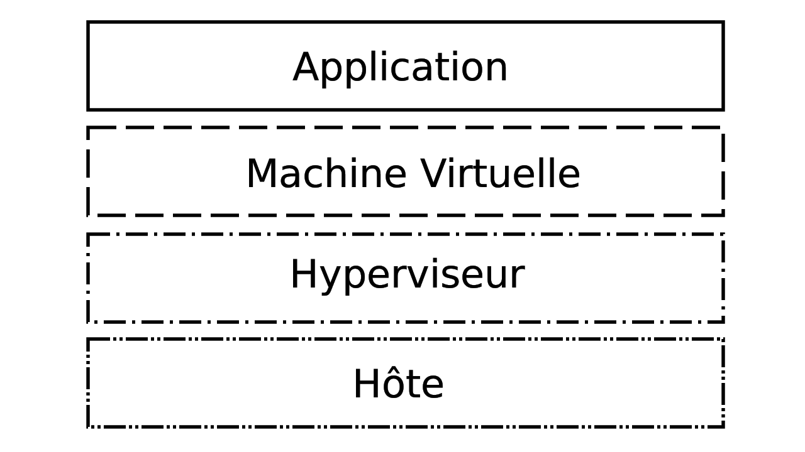{#fig:type1hyp width=75%}

Certains hyperviseurs de type 1 incluent:

+-------------------+-----------------------+----------------+
| Hyperviseur       | OS de Base            | License        |
+===================+=======================+================+
| KVM               | Linux                 | Libre          |
+-------------------+-----------------------+----------------+
| VMM/VMD           | OpenBSD               | Libre          |
+-------------------+-----------------------+----------------+
| Bhyve             | FreeBSD               | Libre          |
+-------------------+-----------------------+----------------+
| OpenVZ            | Linux                 | Libre          |
+-------------------+-----------------------+----------------+
| Xen Project       | Linux/BSD             | Paye           |
+-------------------+-----------------------+----------------+
| Citrix Hypervisor | Linux                 | Paye           |
+-------------------+-----------------------+----------------+
| XCP-ng            | Linux                 | Libre          |
+-------------------+-----------------------+----------------+
| Proxmox           | Linux                 | Libre          |
+-------------------+-----------------------+----------------+
| Oracle VM         | Custom                | Paye           |
+-------------------+-----------------------+----------------+
| Microsoft Hyper-V | Windows               | Paye           |
+-------------------+-----------------------+----------------+
| VMware ESX/ESXi   | Custom/Propreitary    | Paye           |
+-------------------+-----------------------+----------------+

: Hyperviseur Type1 {#tbl:type1_hyp}

###### Hyperviseur de type 2

Aussi appelé **Hyperviseur hébergé**, ce type est installé au-dessus du système d'exploitation installé sur la machine hôte.
La nature d'être installé sur un système d'exploitation préexistant fait que ce type a des performances relativement inférieures en raison des multiples couches de logiciels qui introduisent une latence significative dans l'exécution.

Étant une application qui interface utilisateur graphique dans la plupart des cas, ils fournissent un moyen plus facile de gérer l'environnement de virtualisation, ceci est particulièrement utile pour les individus inexpérimentés et les petites et moyennes entreprises.

En ce qui concerne les fonctionnalités, ce type manque évidemment beaucoup de ce que les hyperviseurs de qualité entreprise ont à offrir.

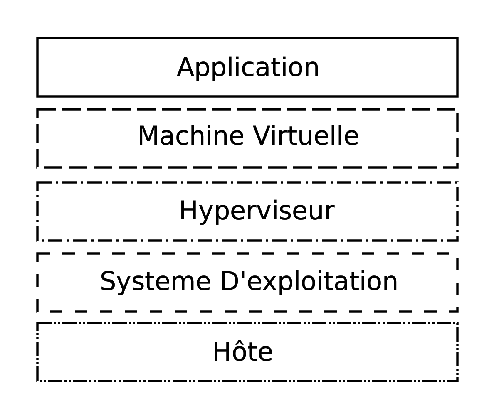{#fig:type2hyp width=75%}

Certains hyperviseurs de type 2:

+--------------------+---------------------+
| Hyperviseur        | OS                  |
+====================+=====================+
| Gnome Boxes        | Linux               |
+--------------------+---------------------+
| Oracle VirtualBox  | Linux/Windows       |
+--------------------+---------------------+
| VMware Workstation | Linux/Windows/Macos |
+--------------------+---------------------+
| VMware Player      | Linux/Windows/Macos |
+--------------------+---------------------+
| VMware Fusion      | Linux/Windows/Macos |
+--------------------+---------------------+

: Hyperviseur Type2 {#tbl:type2_hyp}

- **Différences:**
Le diagramme de comparaison ci-dessous montre clairement que les hyperviseurs de type 2 ont une couche supplémentaire par opposition aux hyperviseurs de type 1.

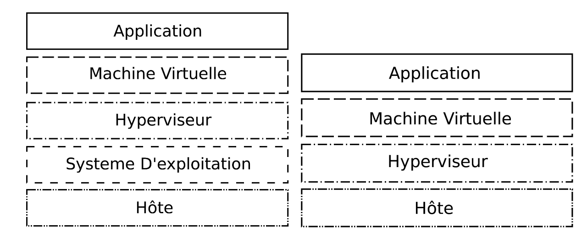{#fig:type1vs2 width=105%}

Cela rend les hyperviseurs de type 2 plus lents par définition puisque tous les appels système doivent passer par le système d'exploitation puis vers le noyau avant d'atteindre le matériel qui apparaîtra certainement comme un impact sur les performances au niveau des machines virtuel, Cette surcharge est inévitable dans ce cas.

###### Hyperviseur hybride

Les hyperviseurs hybrides sont un type capable de fonctionner sur les deux scénarios. Autrement dit, directement sur le matériel sans aucun système d'exploitation sous-jacent, Ou installé avec d'autres logiciels au-dessus d'un système d'exploitation prédéfini. Le seul hyperviseur qui tombe dans cette catégorie est **Qemu/KVM**.

#### Guest

Aussi appelé Virtual Machine ou VM en abrégé, est le système d'exploitation ou le logiciel qui est installé et géré par l'hyperviseur, chaque VM a ses propres ressources, dans les environnements d'entreprise, chaque VM représente un service.

### Les types

La virtualisation se divise en trois branches principales, chacune avec son propre ensemble de propriétés, mais elles ne s'excluent pas mutuellement.

#### Para-virtualisation

Dans ce type de virtualisation, le système d'exploitation invité doit être modifié afin d'être virtualisé, d'où la raison pour laquelle il est également appelé **Virtualisation "OS Assistée"**, ces modifications sont des pilotes ou des correctifs qui doivent être appliqués au niveau du noyau sur l'OS VM .

Cette technologie a été développée par Xen et elle s'appelait autrefois paravirt-ops, **Para-** est un mot grec qui signifie "avec" & "à côté", qui explique le principe de la paravirtualisation.

Ces correctifs remplacent les instructions les plus sensibles et non virtualisables dans l'ISA^[Instruction Set Architecture] de la VM, cela ouvre un canal de communication entre VM et l'hyperviseur, puisque les VM fonctionnent en mode **Ring 3** moindre privilège qu'ils ne sont pas capable d'exécuter directement des appels système matériels, par exemple des instructions matérielles ou des appels système tels que la gestion de la mémoire, le gestionnaire d'interruption est remplacé par ses appels d'hyperviseur ou **hypercalls** équivalents afin qu'ils soient piégés par le VMM, l'hyperviseur exécute ensuite les instructions de la VM sur le matériel puis renvoie les résultats à la source VM.

Un inconvénient évident de la paravirtualisation est qu'elle ne peut pas exécuter des VM non modifiés tels que d'anciens systèmes d'exploitation ou des systèmes complètement nouveaux jusqu'à ce que le support soit ajouté.

{#fig:paravirt width=75% }

#### Virtualisation complète (Full)

Les VM sous la virtualisation complète fonctionnent sans aucune modification, ce qui signifie que les VM ne sont pas du tout conscients qu'ils sont virtualisés, ceci est réalisé en exécutant les instructions de VM en utilisant **Binary Translation** au moment de l'exécution pour des instructions privilégiées non virtualisables avec l'utilisation de **Shadow Page Table** pour la gestion de la mémoire, cependant les instructions de l'espace utilisateur s'exécutent directement sur le matériel.

La traduction binaire a été développée par VMware afin de rendre la plate-forme x86 virtualisable, ce que l'on disait impossible à l'époque. Cela fonctionne en interceptant et en traduisant les instructions à privilèges élevés de la VM au moment de l'exécution de VM, de sorte que si la VM a émis un appel système à privilèges élevés, il sera piégé et traduit en une séquence d'instructions à privilèges faibles par le VMM afin qu'il puisse être exécuté sur le matériel virtuel.

{#fig:fullvirt width=75%}

Il utilise un cache d'instructions pour conserver les instructions traduites les plus récentes afin d'améliorer les performances au détriment de l'utilisation de la mémoire.

Comme le montre la figure [@fig:fullvirt], ce modèle utilise les modes de protection de l'anneau "Ring" de processeur pour isoler & protéger les composants de virtualisation de tout comportement malveillant ou malveillant.

#### Virtualisation assistée par matériel (Hardware Assisted)

Ici, le matériel est chargé de capturer les instructions sensibles et de les rediriger vers l'hyperviseur, dans ce cas, toute instruction privilégiée signalera une interruption matérielle. Cette prise en charge est en fait intégrée aux processeurs eux-mêmes plutôt que d'être une implémentation logicielle, également appelée accélération matérielle, elle utilise à la fois l'interface de virtualisation matérielle Intel VT-x et AMD AMD-V pour gérer la virtualisation IO et Intel EPT^[Extended Page Tables] & AMD RVI^[Rapid Virtualization Indexing] pour TLB^[Translation Lookaside Buffer] et accès à la mémoire.

L'hyperviseur fonctionne en mode privilège sous Ring 0 qui est appelé *"root"*, parce que le matériel lui-même assiste l'hyperviseur.

- Mode racine "root" privilégié Ring 0P


D'autre part, les VM fonctionnent sur un mode appelé:

- Ring 0D Mode non root dé-privilégié

En plus du mode privilège de l'hyperviseur, qui est pratiquement Ring 0 en ce qui concerne le système d'exploitation invité.

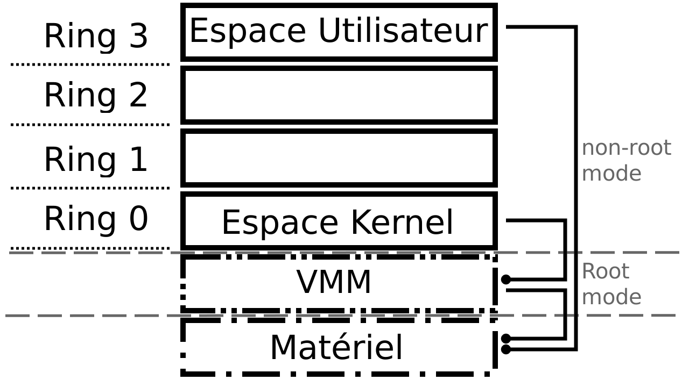{#fig:hardvirt width=75%}

#### Tableau des différences de virtualisation

+---------------------+-----------------------------------+
| Method              | Mode                              |
+=====================+===================================+
| Para-Virtualization | Guest Modification, Hypercalls    |
+---------------------+-----------------------------------+
| Full-Virtualization | Binary Translation at run time    |
+---------------------+-----------------------------------+
| Hardware-Assisted   | VT-x & AMD-V ISA Ring0P & Ring 0D |
+---------------------+-----------------------------------+

### Les Capacités

#### Snapshots

La possibilité de sauvegarder l'état actuel de l'invité sur le stockage système, cette fonctionnalité aide au cas où un invité serait confronté à une panne après une mise à jour ou une installation de logiciel malveillant, auquel cas l'administrateur système aura la possibilité de restaurer un fonctionnement propre et connu. Instantané.

#### Migration

La migration ajoute la possibilité de déplacer des machines virtuelles invitées d'un hôte à un autre, et cela peut être effectué de trois manières différentes

- **À froid (Cold)**: arrêt complet de la VM invitée la rendant inopérante pendant le processus de migration
- **À chaud (Warm)**: interrompre la VM pendant la migration, cela entraînera un temps d'arrêt mineur
- **À vie (Live)**: pas de temps d'arrêt du tout, la VM est migrée sans interruption des services qu'elle exécute

- **Virtualisation imbriquée (Nested):**

La possibilité d'exécuter de manière récursive des machines virtuelles les unes dans les autres, cette fonctionnalité nécessite une prise en charge matérielle.

#### Basculement (Failover)

Le basculement est un mécanisme de sécurité vers lequel basculer en cas de défaillance de l'infrastructure de virtualisation principale ou de l'un de ses composants.

#### La haute disponibilité (High Availability)

La haute disponibilité s'appuie fortement sur **l'équilibrage de charge (Load Balancing)** pour s'assurer que toutes les fonctionnalités seront disponibles pour les clients quoi qu'il arrive.Cela se produit en faisant passer la charge des composants d'infrastructure malsains aux composants les plus performants.


### Avantages et inconvénients

- **Avantages :**
  1. Haute sécurité
  1. Isolation élevée
  1. Stabilité
  1. Compatibilité

- **Inconvénients :**
  1. Utilisation élevée des ressources
  1. Temps de démarrage élevés en général
  1. Un peu plus difficile à entretenir

## SECTION II: Conteneurisation

### Introduction

Au lieu de surcharger l'infrastructure avec des tas de machines virtuelles dupliquées et pour la plupart identiques, l'industrie de la technologie a opté pour la conteneurisation. De toute évidence, cette évolution est motivée par le besoin d'un modèle de développement, de distribution et de déploiement plus rapide, léger, gérable, maintenable et sécurisé.

\

Alors que la conteneurisation comme un petit frère de la virtualisation est devenue la norme pour le développement de logiciels dans toute l'industrie technologique, cette technologie relativement nouvelle change à jamais la façon dont les logiciels sont écrits et distribués.

Ensuite, nous verrons ce que c'est exactement? Comment ça fonctionne? Et à quoi pouvons-nous l'utiliser?

### Définition

Un conteneur est une version séparée d'une application ou d'un système d'exploitation, qu'il soit de type Unix ou Windows. L'aspect le plus important d'un conteneur est qu'il n'a pas de noyau "kernel" contrairement aux machines virtuelles qui sont pré-emballées puisqu'elles sont installées à partir d'une image `iso` ou d'un serveur `pxe`; Cela rend les conteneurs qui s'exécutent sur un hôte particulier avec une architecture spécifique dépendant de cet hôte noyau & architecture.

\

Le **Moteur** de la containerization ou **Engine**, **Container runtime** en anglais sont les "hyperviseurs" dans le monde de la conteneurisation, ces moteurs peuvent être un daemon fonctionnant en arrière-plan comme dans le cas de *Docker* avec **dockerd** et **containerd** et ou un outil d'espace utilisateur pour gérer les conteneurs comme processus système comme le produit RedHat **Podman**. Un autre aspect important des conteneurs est qu'ils ne prennent par défaut en charge qu'une seule application par conteneur, et cette propriété est appelée **"immutabilité"** donc, comme les conteneurs sont immutables par leur conception, toute amélioration apportée à l'image de base remplacera complètement l'actuelle instance Exécuter le conteneur en détruisant simplement l'ancien conteneur et en faisant exécuter le nouveau à partir de l'image de base mise à jour. Dans un autre spectre, une machine virtuelle est créée pour durer aussi longtemps que possible grâce à la maintenance et le nettoyage périodiques; Un conteneur est l'opposé complet de cela, un conteneur est démarré pour n'accomplir qu'une seule tâche, une fois cela fait, il est détruit instantanément, ce modèle s'appelle **Microservices**.

\

Un autre des plus grands arguments de vente de la technologie de conteneurisation est le temps de démarrage / arrêt, alors qu'une machine virtuelle peut prendre de 30 à 60 secondes, voire plus dans certains cas, pour démarrer et être complètement utilisable, les conteneurs prennent une fraction de ce temps à 1 -2 secondes. En raison de la différence de taille, car généralement une machine virtuelle mesure quelques gigaoctets ~ 1 à 5 Go dans les cas où elle est conçue à dessein, mais les conteneurs sont en principe beaucoup plus légers de l'ordre de mégaoctets, une autre raison est que un conteneur ne le fait pas besoin de démarrer un noyau pour gérer le matériel, E/S ... comme il est déjà en cours d'exécution, l'exécution du conteneur crée les **Namespaces** et les **Cgroups** pour ce conteneur et l'exécute comme un processus système.

\

À la fin, il convient de noter que même si les deux termes conteneurisation et virtualisation peuvent apparaître comme la même chose au début, bien qu'en réalité la conteneurisation ne soit pas tellement liée à la virtualisation dans la plupart des aspects, ils sont fondamentalement différents dans de nombreux cas. Cependant, la conteneurisation peut être appelée virtualisation au niveau du système d'exploitation car elle ne virtualise pas le matériel pour ses *"invités"* mais utilise le système d'exploitation de l'hôte comme base pour s'exécuter.


### Contexte

L'exemple de conteneurisation le plus basique peut être trouvé dans toute installation manuelle d'un système d'exploitation de type Unix en tant qu'étape appelée **"chrooting"** ou changer de racine, cela se fait en utilisant le programme `chroot`, ce que cela fait essentiellement est de définir la racine du système de fichiers ou "`/`" dans un répertoire différent dans le rootfs parent, maintenant les processus de la nouvelle racine ne peuvent pas connaître le contenu de la racine parente ou même qu'elle existe, fournissant une isolation du système de fichiers. Cela fait de `chroot` qui a été développé en 1979 sous `Unix v7` le premier ancêtre d'un environnement d'exécution de conteneur.

\

Deux décennies plus tard, la fondation *FreeBSD* a lancé son propre projet appelé **Jails**^[https://www.freebsd.org/doc/handbook/jails.html] au début des années 2000 et après un an suivi de *Linux* **Linux VServer** en 2001 apportant des fonctionnalités de type *jails* au Linux. *Solaris* a lancé son propre produit de conteneurisation **Solaris Containers** vers 2004. Suivi d'un correctif du noyau Linux appelé **OpenVZ** un an plus tard. Puis le bien connu **LXC/LXD**^[Linux Containers https://linuxcontainers.org/] avec prise en charge complète de **cgourps** et **namesapces**, peu de temps après en 2008.

<div id="bigfive" style="centered">
{#fig:docker width=25%}
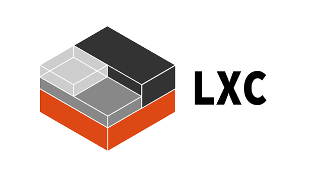{#fig:lxc width=35%}
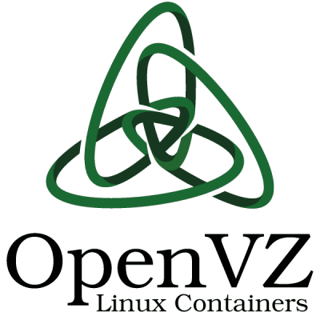{#fig:ovs width=17%}
</div>

Docker est l'un des projets les plus réussis et représente l'un des jalons les plus réussis de la conteneurisation; lancés en 2013 par Google, démarrer de la base du la bibliothèque spécifique LXC appelé `liblxc` dans un premier temps, puis en passant à sa propre bibliothèque `libcontainer`; Quelques mois plus tard, **CoreOS Rocket**, également appelé **rkt**, a été lancé à partir de la campagne sans démon; Peu de temps suivi par *Project Atomic*, il est plus axé sur la sécurité que n'importe lequel des produits précédemment mentionnés.

<div id="bigfive" style="centered">
{#fig:cos width=14%}
{#fig:rkt width=14%}
{#fig:atomic width=15%}
</div>


### Orchistrateurs

Il est difficile de parler de conteneurs sans mentionner les orchestrateurs de conteneurisation, jetez un œil à tout réseau haute performance à grande échelle et il y a de fortes chances que vous en trouviez un sous le capot, il s'agit essentiellement de cadres de gestion et d'automatisation qui facilitent même le travail avec des conteneurs. À une infrastructure à l'échelle de l'entreprise.

Les orchestrateurs fournissent de nombreuses fonctionnalités utiles qui ne peuvent tout simplement pas être négligées, en particulier dans les environnements d'entreprise où chaque tâche est un défi.

- Surveillance de la santé
- Auto-guérison
- L'équilibrage de charge
- La gestion des ressources
- Configuration
- Approvisionnement
- Mise à l'échelle

Certains des frameworks d'orchestration bien connus incluent

<div id="bigfive" style="centered">
{#fig:kublogo width=15%}
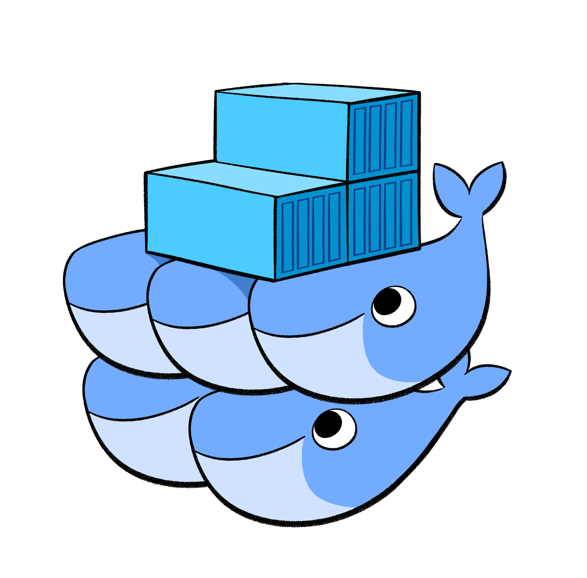{#fig:swarmlogo width=20%}
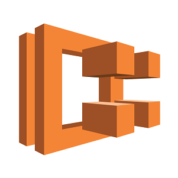{#fig:acs width=17%}
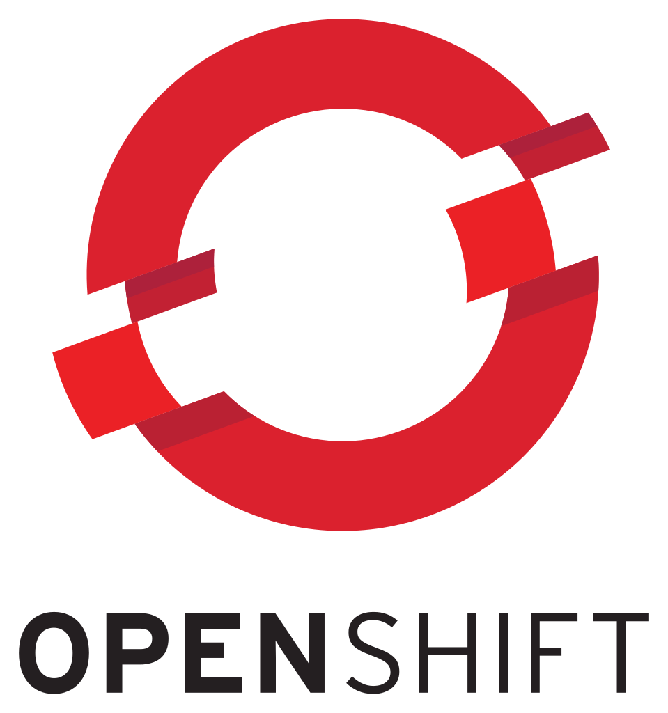{#fig:ost width=13%}
{#fig:meslogo width=35%}
</div>

- **Amazon Container Service:** Également appelé **ACS**.

- **Openshift:** Orchestrateur de conteneurs développé par RedHat.

- **Kubernetes:**
Est un projet d'orchestrateur de conteneurs open-source lancé à l'origine par google afin de simplifier le déploiement, la gestion et la mise à l'échelle des environnements confinés dans les centres de données de Google.

- **Mesos:**
Initié et développé par Twitter et maintenant maintenu par apache, est un autre projet open-source qui vise à abstraire complètement le matériel et à le présenter comme un pool géant de ressources aux systèmes virtualisés / confinés.

- **Docker Swarm:**
Comme son nom l'indique, **SWARM** est destiné aux conteneurs docker, pour la création d'un cluster a partir d'un pool d'hôtes pour former un seul hôte virtuel.

### Un Container dans un VM ?

Étant donné que les solutions de conteneurisation en général sont nettement moins sécurisées que leurs homologues de virtualisation, c'est la principale raison pour laquelle l'utilisateur final doit absolument se méfier des services qui sont exposés à un réseau non approuvé tel qu'Internet en toutes circonstances.

Et de manière générale, presque toutes les entités gouvernementales déconseillent de déployer des conteneurs sans prendre un ensemble de mesures de sécurité pour réduire la surface d'attaque de vos systèmes; En 2017, **NIST** ou *National Institute of Standards and Technologies*^[https://www.nist.gov] a exposé les raisons pour lesquelles la conteneurisation n'est pas adaptée aux applications sensibles et comment elle peut être utilisée aux côtés des VM pour renforcer le Sécurité. Et ce paragraphe de *NIST SP 800-190* explique exactement pourquoi l'isolement est nécessaire

> *"Bien que les conteneurs soient parfois considérés comme la phase suivante de la virtualisation, dépassant la virtualisation matérielle, la réalité pour la plupart des organisations est moins une question de révolution que d’évolution. Les conteneurs et la virtualisation matérielle peuvent non seulement bien coexister et s’améliorer très fréquemment les capacités de chacun. Les VM offrent de nombreux avantages, tels qu'une isolation renforcée, l'automatisation du système d'exploitation et un écosystème de solutions large et approfondi. Les entreprises n'ont pas besoin de choisir entre les conteneurs et les VM. Au lieu de cela, les entreprises peuvent continuer à utiliser des VM pour déployer, partitionner et gérer leur disque"*

L'autre chose qu'ils mentionnent est la raison pour laquelle les mesures de sécurité traditionnelles telles que les pare-feu ne fonctionneront pas pour sécuriser les conteneurs

> *"La gestion des conteneurs inclut la gestion et la surveillance de la sécurité. Cependant, les contrôles de sécurité conçus pour les environnements autres que les conteneurs ne sont souvent pas bien adaptés à une utilisation avec des conteneurs. Par exemple, envisagez des contrôles de sécurité qui prennent en compte les adresses IP. Cela fonctionne bien pour les machines virtuelles et serveurs physique avec des adresses IP statiques qui restent les mêmes pendant des mois ou des années. À l'inverse, les conteneurs se voient généralement attribuer des adresses IP par des orchestrateurs, et comme les conteneurs sont créés et détruits beaucoup plus fréquemment que les machines virtuelles, ces adresses IP changent également fréquemment au fil du temps rend difficile, voire impossible, la protection des conteneurs à l'aide de techniques de sécurité base sur des adresses IP statiques, telles que des ensembles de règles de pare-feu filtrant le trafic en fonction de l'adresse IP. De plus, un réseau de conteneurs peut inclure des communications entre des conteneurs sur le même nœud, sur différents nœuds et même à travers les clouds"*

Et pour terminer notre question, voici une citation tirée directement de la documentation de docker

> *"... si vous instrumentez Docker à partir d'un serveur Web pour provisionner des conteneurs via une API, vous devez être encore plus prudent que d'habitude avec la vérification des paramètres, pour vous assurer qu'un utilisateur malveillant ne peut pas transmettre des paramètres spécialement conçus, ce qui oblige Docker à créer des conteneurs arbitraires."*

> *"Pour cette raison, le point de terminaison de l'API REST (utilisé par la CLI Docker pour communiquer avec le daemon Docker) a changé dans Docker 0.5.2, et utilise maintenant un socket UNIX au lieu d'un socket TCP lié à 127.0.0.1 (ce dernier être sujet aux attaques de "Cross-site Rquest Forgery" falsification de requêtes intersites si vous exécutez Docker directement sur votre machine locale, en dehors d'une VM)."*

# Sécurité

## Introduction

*"Les conteneurs ne contiennent pas"* une phrase que chaque chercheur en sécurité vous dira quand on l'interrogera sur le sujet de la sécurité de la conteneurisation, niant l'illusion que le nom *Container* pourrait donner. Le problème de la conteneurisation est que beaucoup de gens pensent qu'il s'agit d'une solution de virtualisation ultra rapide avec les mêmes avantages de sécurité et d'isolation. Cette mauvaise interprétation conduit aux pires revenus dans la plupart des cas. Alors, qu'est-ce qui n'est pas sûr dans la conteneurisation?

\

Dans les chapitres précédents, nous avons discuté du fait que la technologie de conteneurisation n'est pas aussi sûre que nous le pensions, du moins lorsqu'elle est utilisée de manière incorrecte, mais nous n'avons fait qu'effleurer la raison pour laquelle cela est. Dans le chapitre suivant, nous allons approfondir le sujet et, espérons-le, voir exactement pourquoi? et ce que nous pouvons faire à ce sujet?

## SECTION 1: Menaces

### Exploits du noyau

Comme nous l'avons vu précédemment, les conteneurs utilisent le même noyau que le système d'exploitation hôte, ce fait est un cauchemar de sécurité car en cas de panique du noyau dans un conteneur, tous les autres conteneurs, y compris la machine hôte elle-même, seront affectés. Par un attaque DOS par exemple.

### Attaques par déni de service

Contrairement à une machine virtuelle, un conteneur a un accès illimité à toutes les ressources système *par défaut* telles que le processeur, la RAM et le stockage, un conteneur malveillant ou mal configuré pourrait mener une attaque DOS sur d'autres processus sur le système hôte, entraînant une privation de ressources.

### root est toujours root

L'exécution de l'utilisateur root dans un conteneur est exactement la même chose que l'exécution en tant que root dans le système hôte. Cette faille de sécurité ouvre de nombreuses possibilités aux pirates.

### Escalade des privilèges

La possibilité de changer d'utilisateur de force en exploitant les vulnérabilités du système cible associée à *"root in = root out"* cette attaque peut avoir des conséquences désagréables.

**Horizontal Privesc:** L'intrus est capable de changer d'utilisateur avec les mêmes niveaux de privilèges, cela permet un accès aux données privées telles que les répertoires personnels.

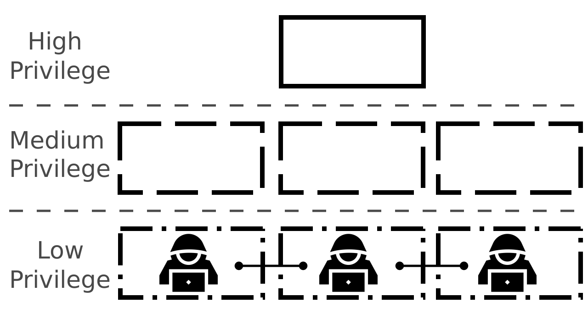{#fig:hpresc width=50%}

**Vertical Privesc:** L'intrus est capable d'élever les privilèges à des niveaux plus élevés tels que l'utilisateur *root* afin d'obtenir un accès et un contrôle complets sur le système.

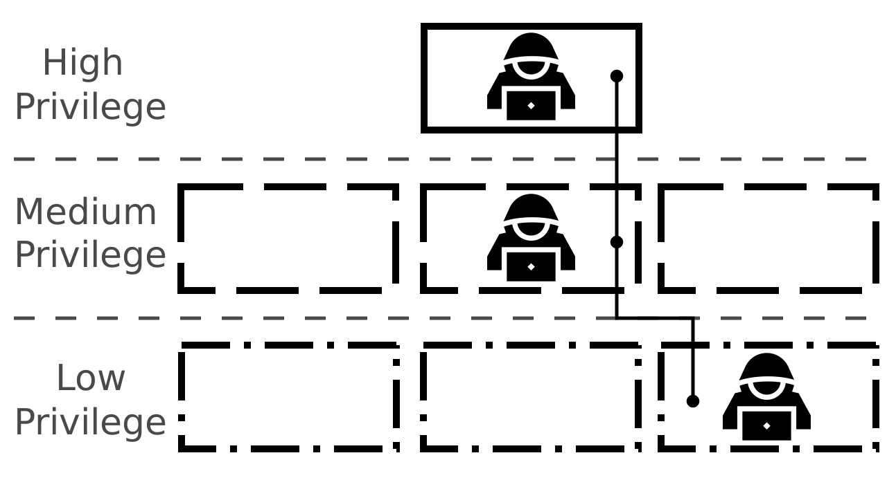{#fig:vpresc width=50%}

### Éruptions

Aussi connu sous le nom d'échappements de sandbox, est le fait qu'un attaquant pourrait accéder et contrôler un conteneur et en exploiter une vulnérabilité afin de s'en sortir de deux manières:

**Escalade horizontale:** elle commence par l'accès de l'attaquant à l'un des conteneurs sur l'hôte et continue en compromettant d'autres conteneurs et processus avec le même niveau de privilège.

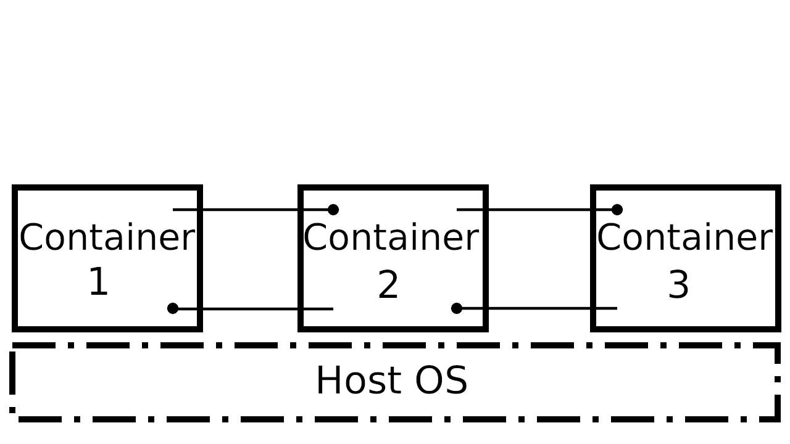{#fig:horesc width=50%}

**Escalade verticale:** où l'attaquant est capable de s'évader vers le système hôte en exploitant une vulnérabilité dans un conteneur déjà compromis ou en escaladant horizontalement vers un autre conteneur vulnérable.

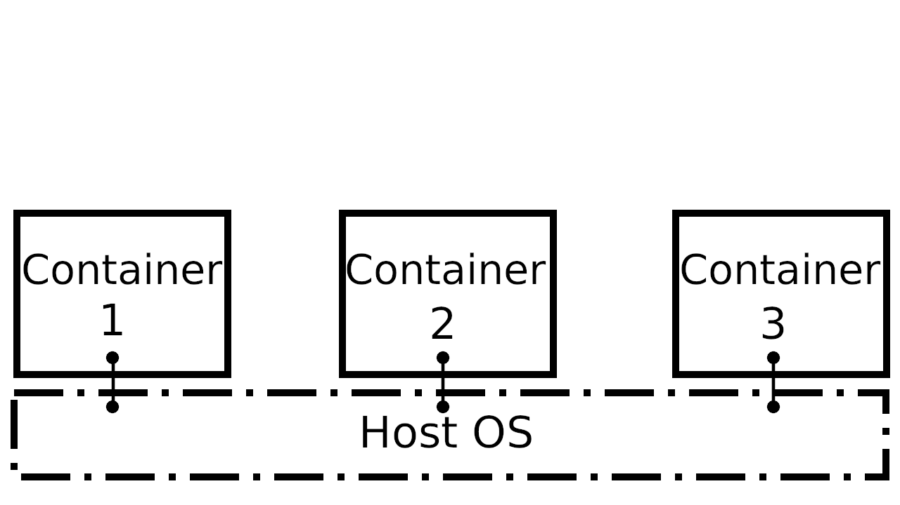{#fig:vertesc width=50%}

Ce type d'attaque est encore pire en sachant que si l'attaquant a été en mesure d'obtenir un accès root dans l'un des conteneurs et a réussi à s'échapper vers l'hôte, il s'exécutera avec le même niveau de privilège qu'il avait l'habitude dans le conteneur dans ce cas l'accès root dans l'hôte.

### Empoisonnement

Cela se produit lors du téléchargement d'images de base à partir d'une ou de plusieurs sources inconnues / non approuvées, ces images peuvent contenir des logiciels malveillants, des logiciels espions et tout type de payloads malveillantes extrêmement difficiles à détecter et à identifier sans une analyse complète de l'image.
Le déploiement d'une image empoisonnée mettra tout le système hôte en danger.

### Compromis secret

Les mots de passe en texte brut codées directement dans les conteneurs sont une faille de sécurité majeure, par exemple, si le conteneur a besoin d'accéder à une base de données pour récupérer ou stocker certaines données, il aura très probablement besoin d'une mot de passe pour interagir avec l'API de base de données. Un pirate dans ce cas aura du mal à obtenir les clés secrètes juste après avoir pris le contrôle du conteneur.

## SECTION 2: Préconisations

Un conteneur peut être aussi sécurisé qu'une VM et dans certains cas même plus si et seulement si certaines règles et pratiques de sécurité sont respectées.

### Espaces de noms

Les espaces de noms sont l'un des composants de sécurité les plus importants du noyau Linux à partir de la version 3.8, un espace de noms est un «environnement» isolé où chaque élément a un nom unique indépendamment des autres espaces de noms. Même si les espaces de noms ne peuvent pas être contrôlés directement par l'utilisateur, il est important de les comprendre car la conteneurisation est basée sur l'espace de noms.

#### Types des Espace de noms:

+---------+-----------------------+--------------------------------------+
| Espace  | Page                  | L'isolation de                       |
+=========+=======================+======================================+
| Cgroup  | cgroup_namespaces(7)  | Cgroup root directory                |
+---------+-----------------------+--------------------------------------+
| IPC     | ipc_namespaces(7)     | System V IPC,POSIX message queues    |
+---------+-----------------------+--------------------------------------+
| Network | network_namespaces(7) | Network devices, stacks, ports, etc. |
+---------+-----------------------+--------------------------------------+
| Mount   | mount_namespaces(7)   | Mount points                         |
+---------+-----------------------+--------------------------------------+
| PID     | pid_namespaces(7)     | Process IDs                          |
+---------+-----------------------+--------------------------------------+
| Time    | time_namespaces(7)    | Boot and monotonic, clocks           |
+---------+-----------------------+--------------------------------------+
| User    | user_namespaces(7)    | User andgroup IDs                    |
+---------+-----------------------+--------------------------------------+
| UTS     | uts_namespaces(7)     | Hostname and NIS, domain name        |
+---------+-----------------------+--------------------------------------+

- **ID Processus:** par exemple, le système d'initialisation *"init"* est toujours PID 1 sous Unix-like systèmes d'exploitation, lorsque vous utilisez un PIDNamespace, chaque conteneur a ses propres PID à partir du PID 1 sans entrer en conflit avec l'hôte ou tout autre conteneur.

- **ID utilisateur/groupe :** Les UID et GID sont également placés sous chaque conteneur pour éviter les conflits.

<!-- fakeroot example -->

- **Les Points de Montage :** Les montures sont également espacées de noms

- IPC^[Inter Process Communication]

- **Réseau :**

Les espace de noms de réseau est largement utilisé dans la conteneurisation, et c'est le composant clé qui rend le réseau beaucoup plus flexible et pratique à utiliser. C'est ce qui rend possible le déploiement de plusieurs services sur le même système hôte.

Bien sûr, cela est géré automatiquement par le moteur de conteneurisation au moment de l'exécution, mais ils peuvent être utilisés hors de ce contexte dans d'autres tâches de mise en réseau. Voici un simple exemple et direct d'utilisation de l'espace de noms réseau sous **Annexe A**.


### Cgroups

#### Définition

Les *Cgroups* ou *control groups* est un mécanisme de noyau Linux de gestion des ressources, lancé par Google en 2006 puis officiellement ajouté dans le noyau principal un an plus tard en 2007.

\

Ils permettent à l'administrateur système de contrôler, limiter et surveiller divers types de ressources via un pseudo-système de fichiers du noyau appelé cgroupfs. Plusieurs sous-systèmes, appelés *contrôleurs de ressources*, permettent un contrôle plus précis des ressources de manière hiérarchique, comme le nombre de partages CPU, la limite de mémoire, les E/S de périphérique de bloc, les paquets réseau avec un certain type. Le tout par processus, cela augmente considérablement les performances du système et, plus important encore, la sécurité.

\

Donc c quoi que les groupes de contrôle ont à voir avec les conteneurs? Et la réponse est beaucoup des fonctionnalités ce qui est d'autres moyens vraiment difficiles à réaliser. À ce stade, il est clair que la conteneurisation en général est basée sur la séparation et l'isolation et les groupes de contrôle vont encore plus loin en restreignant l'accès aux ressources si nécessaire pour chaque conteneur en cours d'exécution, cela a l'avantage d'éviter la famine des ressources ainsi que les paniques du noyau en cas de problème d'un conteneur bogué qui a par exemple une fuite de mémoire ou une attaque DOS conduisant tout l'hôte à tomber en panne.

#### Utilisation

Les groupes de contrôle peuvent être utilisés dans l'interface de ligne de commande du docker comme indicateurs ou dans le fichier `docker-compose.yml`, et dans les deux sens, ils signifient la même chose puisque chaque paramètre de `Docker` a son équivalent de `Docker Compose`

##### Limites CPU {-}

i. **Docker CLI**

```bash
--cpus
```

> Le nombre des cœurs de processeur que la conteneur peut utiliser

```bash
--cpuset-cpus
```

> Sur quels processeurs le point d'entrée du conteneur va fonctionner, il peut s'agir d'un seul cœur de processeur `0`, d'une plage de cœurs `0-3` ou de plusieurs cœurs `0,3`


```bash
--cpu-shares
```

> L'allocation du temps CPU par conteneur est définie en douceur, ceci est analogue à la fonction de mise en réseau QOS. Cela peut être une valeur comprise entre `0` et `1024` [0, 1024]. Veuillez noter que les partages de CPU impliquent des calculs complexes, surtout si les cœurs de CPU > 1

```bash
--pids-limit
```

> Les limites d'identification des processus sont explicites, elles limitent le nombre d'identifiants de processus auxquels un conteneur peut accéder. Ceci est vraiment utile contre les attaques DOS ciblant les ressources système et la table de processus en particulier.

ii. **Docker Compose**

```yaml
cpu_count:
cpu_percent:
cpus:
cpu_shares:
cpu_quota:
cpu_period:
cpuset:
```

##### Limites Mémoire {-}

i. **Docker CLI**


```bash
--memory
```

> La quantité maximale de mémoire que le conteneur peut atteindre

```bash
--memory-swap
```

> La quantité de mémoire que le conteneur est autorisé à swaper

```bash
--memory-swappiness
```

> Le pourcentage de mémoire de conteneur échangeable

```bash
--memory-reservation
```

> En cas de stress mémoire sur l'hôte, revenez à cette limite souple

```bash
--kernel-memory
```

> Définir la quantité de mémoire du noyau qu'un conteneur peut utiliser

ii. **Docker Compose**

```yaml
cgroup_parent:
mem_limit:
memswap_limit:
memswapiness:
mem_reservation:
```

### Capacités

Comme son nom l'indique, les capacités permettent un contrôle fin sur les privilèges en les freinant en plusieurs modules dont chacun est responsable de l'octroi / du refus de ce que le logiciel peut faire avec cette capacité particulière. Pour consulter la liste complète des capacités `man capabilities`.

i. **Docker**

Pour ajouter une dite capacité à un conteneur docker, le drapeau `--cap-add` est utilisé, par contre pour supprimer toute capacité, utilisez `--cap-drop`

```bash
docker --cap-drop
docker --cap-add
```


ii. **Docker Compose**

Vous pouvez également définir les indicateurs ci-dessous dans `docker-compose.yml` d'un fichier conteneur

```yaml
cap-drop:
cap-add:
```

### Contrôle d'accès

En regardant les systèmes de contrôle d'accès, l'une des choses les plus dangereuses dans tout système d'exploitation est le système d'autorisations, car tout processus lancé par un utilisateur donné héritera complètement des autorisations de cet utilisateur et aura accès à tout ce qu'il peut accéder. Ce problème est malheureusement fondamental dans le fonctionnement du mécanisme DAC *"Discretionary Access Control"* des contrôles d'accès discrétionnaires.

\

Pour résoudre ce problème, un autre système de contrôle d'accès doit être utilisé, n'éliminant pas nécessairement complètement le système DAC et le remplaçant, mais en ajoutant une autre couche par-dessus; Cette couche est appelée contrôles d'accès obligatoires MAC *"Mandatory Access Control"*.

\

Il existe plusieurs systèmes de contrôle d'accès obligatoires tels que **Apparmor**, **Tomoyo** et **SELinux**. Cependant, nous utiliserons **SELinux** exclusivement dans cet article pour des raisons de cohérence.

#### SELinux

{#fig:selogo width=25%}

##### Définition

Security Enhanced Linux est un ensemble de correctifs du noyau Linux comme LSM^[Linux Security Module] ou *modules de sécurité Linux* et les outils associés développés par la NSA^[National Security Agency] publié en 2000 et fusionné dans l'arborescence du noyau 2003.

SELinux est principalement utilisé par le ministère de la Défense des États-Unis, alias DoD^[Departement of Defence]. Par conséquent, les politiques font un usage intensif d'un modèle de sécurité appelé *contrôles d'accès obligatoires* ou MAC^[Mandatory Access Control] en abrégé. Le mécanisme de contrôle d'accès par défaut sur tout système d'exploitation basé sur Linux standard est DAC^[Discretionary Access Controls] qui signifie *Discretionary Access Controls*, SELinux améliore la situation en ajoutant des règles MAC qui permettent un seuil de sécurité beaucoup plus élevé, l'avantage est que les politiques sont strictement appliquées aux utilisateurs.

Pour mieux comprendre les règles MAC, prenons un exemple de programme racine SUID. Sous les règles d'accès DAC, l'exécution de ce programme engendrera un processus avec un accès complet au système en tant qu'utilisateur root permettant une élévation des privilèges en cas de compromission. Cependant, si les règles MAC correctes sont appliquées par les politiques SELinux, le processus généré sera limité à ce qu'il est supposé pour accéder aux politiques, quel que soit le niveau de privilège.

##### Contexte

SELinux est un système d'étiquetage permettant d'identifier les processus ainsi que les fichiers, répertoires et objets système. Une politique est utilisée pour contrôler l'accès entre les processus et les objets étiquetés, les règles sont appliquées forcément par le noyau.

Ces étiquetés sont regroupés dans des contextes SELinux et se composent de quatre éléments ou étiquetés:

> user:role:type:level

Où

> utilisateur:rôle:type:niveau

Une fois que le DAC autorise l'accès, le MAC sera évalué en fonction du VAC le *"Access Vector Cache"* les permissions / restrictions qui sont appliquées sur le sujet -> action -> objet demandes, en cas de manque de réponse cache, le serveur de sécurité SELinux est demandé qui est une opération relativement plus lente, l'action de contrôle d'accès est alors mise en cache sous le VAC pour des raisons de performances.

Dans le cas où l'accès est refusé sur la base du DAC, MAC ne sera jamais vérifié. De même, si aucune stratégie d'autorisation n'est trouvée, l'action de contrôle d'accès par défaut est appliquée; Et c'est, accès refusé.

##### Type de politique de sécurité

Plusieurs types de politique sont utilisés pour que SELinux prenne les décisions d'accès en accordant ou refusant l'accès en fonction des règles de politique du type de politique choisi:

- **Type Enforcement (TE)**

> Ce modèle lie une étiquette à chaque processus appelé domaine et une étiquette appelée type à chaque objet, mais en interne, il n'y a pas de différence entre un processus *domaine* et un *type* de fichier puisque pour SELinux ils sont tous les deux un *type*, les règles de politique SELinux définissent ensuite quels domaines SELinux accordera l'accès à quels objets en fonction des types associés.

> Le type est représenté par le 3ème champ et est suffixé avec \_t comme suit

> user_u:role_r:**type_t**:level

- **Role Based Access Control (RBAC)**

> Chaque utilisateur SELinux est associé à un ensemble de rôles dont chacun permet à l'utilisateur d'accéder à un ensemble de domaines TE. Par exemple, l'utilisateur *user0* qui est dans le *staff_u* l'utilisateur SELinux peut prendre le *webadm_r, dbadm_r, viradm_r*, sous *webadm_r* le *user0* est capable d'administrer le serveur Web, lorsque *user0* passe au *viradm_r* il ne sera plus administrateur web mais administrateur de virtualisation, et il en va de même pour l'administrateur de base de données *dbadm_r*.

> Le rôle est représenté par le 2ème champ et il est suffixé avec \_r comme indiqué

> **user_u**:**role_r**:type_t:level

- **Multi Level Security (MLS)**

> Cette technologie est basée sur le modèle de sécurité BLP^[Bell LaPadula], qui prend la décision de contrôle d'accès sur la base de l'étiquette d'autorisation du sujet afin d'appliquer le principe du moindre privilège; Par exemple, il peut être structuré comme les quatre niveaux de sécurité *TopSecret, Secret, Classified & Unclassified*, où un sujet avec l'autorisation *Secret* a un accès en lecture uniquement aux niveaux d'autorisation inférieurs, *Classified* dans ce cas, et un accès en écriture sur niveaux de clairance plus élevés *TopSecret* uniquement, Cette structure n'est pas obligatoire car il peut y avoir plus ou moins de niveaux selon le cas d'utilisation, mais c'est une classification courante.

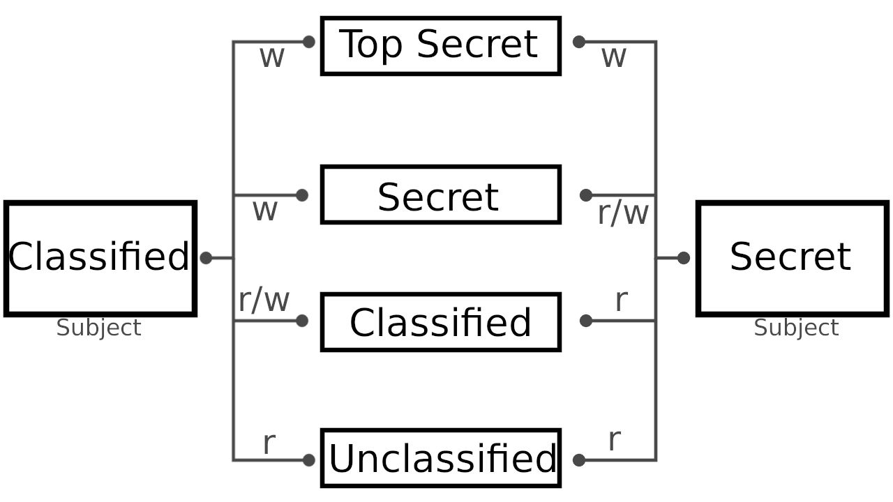{#fig:lapadula}

> Le principe est simplement appelé *Read Down, Write Up* ou encore *No Read Up, No Write Down*, comme illustré dans la figure [@fig:lapadula].

> user_u:role_r:type_t:**level**

- **Multi Category Security (MCS)**

> les catégories permettent la séparation entre différents départements, organisations, etc. Par exemple, si l'accès est autorisé pour le niveau de sécurité TopSecret dans la catégorie département (A) mais pas dans la catégorie département (B). En fait, cette terminologie peut être directement projetée dans le monde de la virtualisation et de la conteneurisation, puisque tous les processus enfants invités auront la même étiquette TE, disons *cont_t*, héritant du type de processus parent de départ, d'où la possibilité pour eux de lire et d'écrire les images les uns des autres de type *cont_img_t* qui permettent aux VM ou aux conteneurs de lire et d'écrire les données les uns des autres. Ce scénario constituera le cas d'utilisation parfait du schéma **MCS** en attribuant à chaque invité un niveau de catégorie unique à côté de son propre fichier image et en restreignant toutes les actions autorisées aux seules catégories correspondantes.

> Le **MCS** déposé est annexé au **MLS** déposé comme suit:

> user_u:role_r:type_t:**level:c**

##### Les Modes D'opération

Le fichier de configuration principal de SELinux est `/etc/selinux/config` qui contient les variables les plus élémentaires:

```bash
# This file controls the state of SELinux on the system on boot.

# SELINUX can take one of these three values:
#       enforcing - SELinux security policy is enforced.
#       permissive - SELinux prints warnings instead of enforcing.
#       disabled - No SELinux policy is loaded.
SELINUX=permissive

# SELINUXTYPE can take one of these four values:
#       targeted - Only targeted network daemons are protected.
#       strict   - Full SELinux protection.
#       mls      - Full SELinux protection with Multi-Level Security
#       mcs      - Full SELinux protection with Multi-Category Security
#                  (mls, but only one sensitivity level)
SELINUXTYPE=targeted
```

Le variable `SELINUX` ont trois modes de fonctionnement de valeurs possibles:

- **Enforcing**

> En mode *Enforcing*, les règles de politique SELinux sont appliquées et tout accès non autorisé est refusé par le noyau, les refus sont également mis en cache sous l'AVC et consignés par auditd, syslogd, journalctl pour une analyse plus approfondie.

- **Permissive**

> Le mode *Permissive* enregistrera tous les refus AVC exactement comme si l'accès était interdit. Cependant, l'action réussira toujours puisque SELinux surveillera et enregistrera de manière transparente toutes les actions non autorisées. Ce mode améliore considérablement les tâches de dépannage pour les rédacteurs et développeurs de politiques SELinux.

- **Disabled**

> Comme son nom l'indique dans le mode *Disabled*, SELinux sera complètement désactivé, aucune journalisation ne sera disponible même si des actions non autorisées se produisaient. Ce mode n'est pas recommandé car il peut causer des problèmes dans les contextes SELinux, causant divers problèmes la prochaine fois que SELinux est rallumé.

\

Il existe également la variable `SELINUXTYPE` qui est responsable du type de politique de sécurité SELinux:

- **Targeted**

> La politique de sécurité *Targeted* ciblera uniquement un sous-ensemble des sujets et objets du système, en particulier ceux qui présentent un risque de sécurité élevé, comme les services exposés publiquement, en les isolant dans des contextes SELinux *confinés* le reste du système sera traité comme *Domaines non confinés* où seules les règles DAC seront appliquées. Il convient de noter que si et un sujet non confinés exécute un processus sous *Confinement*, les règles de politique du processus seront appliquées sur le sujet.

- **Strict**

> La politique de sécurité *Strict* appliquera les règles de politique SELinux sur chaque sujet et objet du système.

- **MLS**

> Le type de politique de sécurité **MLS** utilisera le 4ème champ des étiquettes de contexte SELinux, c'est-à-dire l'étiquette "*level*", Activation du contrôle d'accès aux niveaux de libération *"Clearance Levels"* pour un contrôle fin sur les actions des sujets du système sur les objets.

- **MCS**

> L'activation de MCS n'est requise que dans certains cas particuliers, comme indiqué précédemment, comme pour la *virtualisation* et *la conteneurisation* où MLS ne suffit pas.

##### Ligne de Commande

- **setenforce**

Cet outil permet d'activer et de désactiver SELinux directement sans avoir besoin d'éditer `/etc/selinux/config` et de changer la variable `SELINUX=`.

`setenforce 0` activera le mode de débogage SELinux, de sorte qu'il ne générera que des journaux sans appliquer réellement la politique.

`setenforce 1` activera SELinux en mode d'application et tout accès non autorisé est refusé.

Pour reétiqueter automatiquement le système sous des distributions spécifiques à RedHat, créez `.autorelable` dans `/` et redémarrez la machine, après avoir terminé de reétiqueter tout le système de fichiers exécuter la commande `setenforce 1` pour rallumez *SELinux*. Le processus de réactivation est effectué en cas de problème d'étiquetage erroné ou de changement de politique.

Dans les systèmes d'exploitation prenant en charge SELinux, presque tous les utilitaires de l'espace utilisateur incluent l'indicateur `-Z` qui permet à l'utilisateur de vérifier les étiquettes SELinux pour les objets avec lesquels cet outil fonctionne.

- **selinux 0**

Cela désactivera complètement selinux, donc tout nouveau contenu n'aura pas d'étiquettes, mais ce n'est pas une bonne idée car selinux ne fonctionnera pas sans objets étiquetés s'il est réactivé au lieu de cela, selinux réétiquera le système de fichiers entier, à moins que les objets non étiquetés ne soient réactivés manuellement avant activer selinux.

- **sestatus**

Vérifiez l'état de SELinux dans l'hôte, comme le mode sur lequel il est défini et le type de politique spécifié.

- **setsebool**

Utilisé pour définir les booléens selinux, pour lister tous les booléens disponibles

```bash
# Pour un list complète
semanage boolean --list

# Activez le booléen `httpd_can_sendmail`
setsebool -P httpd_can_sendmail 1
```

- **chcon**

Ou *"Change Context"*, appliquez des changements temporaires au contexte, ces changements ne survivent pas au redémarrage ou à l'exécution de la commande `restorecon`.

```bash
# Changer le type de fichier `file_name` a `type_t`
chcon -t type_t file_name

# Ou aver `-R` si est un répertoire
chcon -R -t type_t dir_name
```

- **semanage**

Pour gérer les types selinux comme, les contextes de fichiers avec `fcontext` et `login, user, port ...`de manière persistante même après avoir relablé le système de fichiers ou restauré des contextes en utilisant `restorecon` à moins que `-F` soit utilisé pour forcer la restauration.

Commencez par définir le nouveau contexte de fichier avec `fcontext`, le paramètre `-a` pour ajouter un enregistrement, `-t` pour le type puis le type suivi du chemin absolu vers le fichier ou le répertoire:

```bash
semanage fcontext -a -t httpd_sys_content absolute_path
```

+----------------------------------------------------------------------------------------------------------------------------------------------------------------------------------------+
| {width=4%} REMARQUE: le chemin absolu est requis pour éviter les erreurs d'étiquetage après une nouvelle étiquette du système de fichiers. |
+----------------------------------------------------------------------------------------------------------------------------------------------------------------------------------------+

Cependant, la commande `semanage` n'appliquera pas les modifications au fichier, à la place, elle sera ajoutée aux contextes de fichier gérés localement par défaut sous `/etc/selinux/[SELINUXTYPE]/contextts/files/file_contexts.local`, d'où `restorecon` est appelé pour appliquer les modifications au disque

```bash
restorecon -v abs_path
# or with '-R' for dirs
restorecon -v -R abs_path
```

- **restorecon**

Restaurer les contextes en fonction du la politique sélectionné sous `/etc/selinux/[SELINUXTYPE]/contextts/files/` par l'application du paramètre configurer par l'administrateur avec `semanage` sur les fichier de contrôle d'accès par défaut du système.

- **setfiles**

Identique à `restorecon` mais fonctionne pour tout le système de fichiers afin de *étiqueter* ou *réétiqueter* l'arborescence système en fonction des contextes de fichiers par défaut `/etc/selinux/[SELINUXTYPE]/contextts/files/`.

- **matchpathcon**

Vérifiez si le contexte du fichier ou du répertoire correspond correctement au contexte des fichiers SELinux tel que défini sous `/ etc / selinux / [SELINUXTYPE] / files /`, si le contexte ne correspond pas, un message apparaîtra indiquant le contexte actuel et le contexte dans lequel il est supposé être.

```bash
matchpathcon -V /home/user/*
```

- **newrole**

Permet à l'utilisateur de changer entre plusieurs rôles tant que la politique SELinux le lui accorde la permission.

- **sepolicy**

Gérer les politiques SELinux

+-------------+-------------------------------------+
| Paramètre   | Description                         |
+=============+=====================================+
| boolean     | Description Des booléens            |
+-------------+-------------------------------------+
| generate    | Générer un modèle de stratégie      |
+-------------+-------------------------------------+
| communicate | État de la communication du domaine |
+-------------+-------------------------------------+
| network     | Rechercher des informations réseau  |
+-------------+-------------------------------------+
| transition  | Générer un rapport de transition    |
+-------------+-------------------------------------+
| interface   | Liste des interfaces de politique   |
+-------------+-------------------------------------+
| manpage     | Générer le manuel de politique      |
+-------------+-------------------------------------+
| gui         | Interface utilisateur graphique     |
+-------------+-------------------------------------+

: sepolicy parameters {#tbl:sepolicy_parm}

```bash
# Imprime le port ssh sur l'écran
sepolicy network -t ssh_port_t
```

Pour le dépannage, il existe quelques commandes selinux qui peuvent rendre les choses beaucoup plus faciles:


- **autid2allow**

```bash
# Cela affichera un message de diagnostic avec les booléens à activer
grep ftp /var/log/audit/audit.log | autid2allow
```

- **setroubleshoot**

# Technologies

## Introduction

Dans ce chapitre, nous verrons quelles sont les différentes solutions logicielles que nous allons utiliser pendant la phase d'application, cela inclut les logiciels sur l'hôte ainsi que les invités.

## SECTION 1 : Les Systèmes d'exploitation

### Linux

Linux est un noyau open source développé par *Linus Torvalds*. Le noyau en lui-même n'est pas d'une grande utilité pour les utilisateurs finaux, cela fait des utilitaires de l'espace utilisateur une exigence pour les fonctionnalités complètes du système et Linux est distribué principalement avec les utils de base du projet GNU, ce qui fait que beaucoup de gens pensent à GNU / Linux quand ils dit Linux.

<div id="linux" style="centered">
{width=10%}
{width=35%}
{width=33%}
</div>

### Archlinux

La distribution spécifique que nous allons utiliser dans le système hôte ainsi que dans l'interface utilisateur Web de Qemu/KVM s'appelle Archlinux^[archlinux.org], qui est une distribution Linux basée sur le modèle de version continue.


> Arch Linux is an independently developed, x86-64 general-purpose GNU/Linux distribution that strives to provide the latest stable versions of most software by following a rolling-release model. The default installation is a minimal base system, configured by the user to only add what is purposely required.

### Fedora

Fedora^[fedoraproject.org] est une distribution de développement Red Hat spécialement conçue pour les dernières versions logicielles. Tout comme Archlinux, Fedora est une distribution à diffusion continue.

> The Fedora Project is a community of people working together to build a free and open source software platform and to collaborate on and share user-focused solutions built on that platform. Or, in plain English, we make an operating system and we make it easy for you do useful stuff with it.

## SECTION 2: Virtualisation


### Kvm


Techniquement, KVM^[Kernel-based Virtual Machine] ou *Kernel-based Virtual Machine* est un module de noyau open source pour le noyau Linux, il a été annoncé en 2006 et fusionné avec le noyau Linux principal en 2007.

{width=40%}

KVM fournit à son hôte hyperviseur tel que QEMU la possibilité d'utiliser la virtualisation assistée par matériel en faisant abstraction de la complexité sous-jacente des extensions de virtualisation CPU Intel-VT et AMD-V en tant que périphérique de caractères `/dev/kvm`, cela transforme essentiellement l'hôte en un Hyperviseur de 1er type.

Sans le support KVM, Qemu reviendra à l'émulation logicielle uniquement, d'où une virtualisation plus lente de plusieurs ordres de grandeur.

### Qemu

{width=20%}

#### Définition:

QEMU^[Quick EMUlator] abréviation *"Quick Emulator"* de est un émulateur et un virtualiseur de machine générique et un projet FOSS^[Logiciel libre et open source].

Qemu est un émulateur capable d'émuler toutes sortes d'architectures matérielles, dans une architecture x86_64 le module noyau KVM peut être utilisé pour accélérer considérablement la virtualisation.

Lorsqu'il est utilisé comme émulateur de machine, QEMU peut exécuter des systèmes d'exploitation et des programmes conçus pour une machine (par exemple, un ARM) sur une autre machine (par exemple PC x86) afin que, par exemple, nous puissions émuler un appareil Android.

En utilisant la traduction dynamique, il atteint des performances quasi natives en fournissant un ensemble de modèles de matériel et de périphérique au système d'exploitation invité, ce qui signifie que le système d'exploitation émulé fonctionne comme s'il était sur du matériel réel. QEMU a des instructions CPU spécifiques à exécuter aussi vite que possible, elles sont appelées virtualisation assistée par matériel sur les processeurs Intel VT-x et AMD-V sur les processeurs AMD.


En tant que virtualiseur, QEMU/KVM atteint des performances quasi natives en exécutant le code invité directement sur l'unité de traitement hôte. QEMU prend en charge la virtualisation lors de l'exécution sous l'hyperviseur Xen ou de l'utilisation du module de noyau KVM sous Linux. Lors de l'utilisation de KVM, QEMU peut émuler les architecturs; x86 les deux variantes, serveur et PowerPC embarqué, POWER 64 bits, S390, ARM 32 bits et 64 bits et MIPS.

#### CLI:

Le Qemu CLI est une mer d'arguments et de paramètres qui servent tous un objectif spécifique, mais nous examinerons les paramètres les plus utiles pour la virtualisation des systèmes x86 et x86_64, la commande spécifique utilisée est,

`qemu-system-x86_64`

##### Unité centrale de traitement: {-}

Le modèle de processeur doit être sélectionné et cela est réalisé avec l'indicateur *-cpu*, pour lister tous les modèles disponibles sous l'architecture x86_64:

`$ qemu-system-x86_64 -cpu help`

\

Pour la même configuration que la machine hôte, on peut utiliser `-cpu host`.

\

La définition du nombre d'unités de traitement se fait à l'aide de l'indicateur `-smp`, ou *Symmetric Multiprocessing*. Qui émule plusieurs unités de traitement connectées à la même mémoire principale. Cet indicateur prend plusieurs paramètres séparés par des virgules au format *paramètre0=valeur0, paramètre1=valeur0*.

L'indicateur `-smp` prend les paramètres suivants comme arguments:


+-----------+-----------------------------------------+
| Parameter | Function                                |
+===========+=========================================+
| cpus      | Le nombre de packages CPU               |
+-----------+-----------------------------------------+
| dies      | Matrices par paquet de CPU              |
+-----------+-----------------------------------------+
| cores     | Cœurs par matrice de processeur         |
+-----------+-----------------------------------------+
| threads   | Threads par cœur                        |
+-----------+-----------------------------------------+
| sockets   | Prises CPU par carte mère               |
+-----------+-----------------------------------------+
| maxcpus   | Processeurs maximum enfichables à chaud |
+-----------+-----------------------------------------+


Comme illustré [@fig: cpudiagram], composants du processeur.

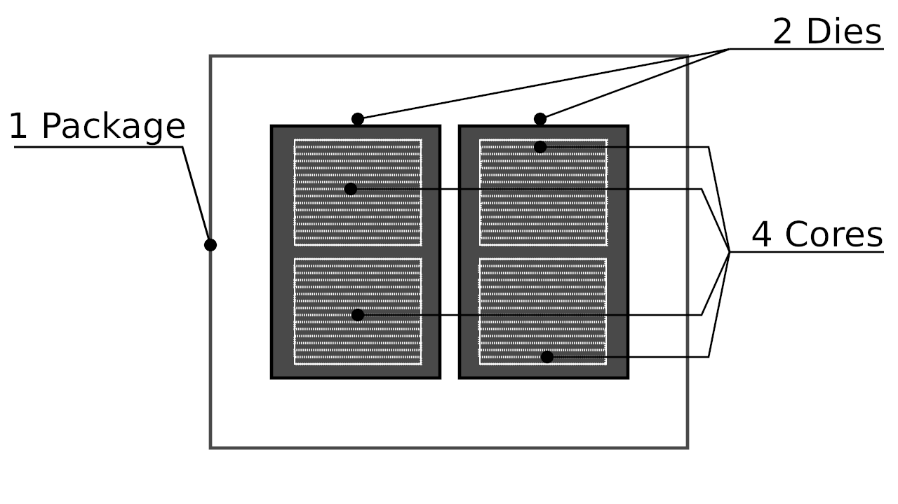{#fig:cpudiagram width=50%}

##### Mémoire principale : {-}

Pour spécifier la quantité de mémoire principale de démarrage, l'indicateur `-m` est utilisé, cet indicateur prend 3 paramètres séparés par des virgules:

+-----------+-----------------------------------------------------------+
| Parameter | Function                                                  |
+===========+===========================================================+
| size      | Quantité de mémoire en mégaoctets                         |
+-----------+-----------------------------------------------------------+
| slots     | Nombre d'emplacements supplémentaires enfichables à chaud |
+-----------+-----------------------------------------------------------+
| maxmem    |  Quantité maximale de mémoire hot-plug                                                         |
+-----------+-----------------------------------------------------------+

Le paramètre *size * peut éventuellement prendre les suffixes *K, M, G, T, P, E * pour { *Kilo, Mega, Giga, Tera, Peta, Exa *} Octets respectivement.

##### Type de machine: {-}

Le type de machine spécifie le type de chipset de la carte mère. Le drapeau est *-machine * il a 10 paramètres, cependant nous ne sommes intéressés que par un paramètre:

Le paramètre *accel * peut prendre l'une des valeurs suivantes:

+-----------+---------------------------+-------------------------------+
| Parameter | Function                  | Valeurs                       |
+===========+===========================+===============================+
| accel     | L'accélérateur à utiliser | kvm, xen, hax, hvf, whpx, tcg |
+-----------+---------------------------+-------------------------------+


+--------------------------------------------------------------------------------------------------------------------------------------------------------------------------------------------------+
| {width=4%} Notez que pour une accélération *kvm* complète, le drapeau `-machine accel=kvm` est utilisé en conjonction avec le drapeau `-enable-kvm`. |
+--------------------------------------------------------------------------------------------------------------------------------------------------------------------------------------------------+

##### Espace de stockage : {-}

Tout d'abord, une image disque doit être créée si elle n'existe pas, ce qui est fait à l'aide de la commande `qemu-img`:

\

`$ qemu-img create -f [format] [nom_image] [taille]`

\

Où `[format]` est le format souhaité pour le fichier image, par exemple *qcow2,qcow,qed,vmdk...*, & `[taille]` est l'espace disque à allouer pour l'image.

+-------------------------------------------------------------------------------------------------------------------------------------------------------------------------------------------------------------------------------------------------------------------------------------------------------+
| {width=4%} REMARQUE: la taille de l'image peut être Thinprovisioned ou Thikprovisioned selon le cas d'utilisation. Par défaut, `qemu-img` crée des fichiers images Thinprovisioned sauf indication contraire en utilisant l'option `--preallocation=full`. |
+-------------------------------------------------------------------------------------------------------------------------------------------------------------------------------------------------------------------------------------------------------------------------------------------------------+

Voici deux formats d'image disque avec les valeurs de `preallocation` correspondantes:

+--------+-----------------------------+
| Format | Preallocation Values        |
+========+=============================+
| qcow2  | full, falloc, metadate, off |
+--------+-----------------------------+
| raw    | full, falloc, off           |
+--------+-----------------------------+


Il existe plusieurs façons d'initier un périphérique de stockage dans qemu, la plus simple est l'indicateur `-drive` qui prend les paramètres suivants:

+-----------+-------------------------------------+--------------------------------------------------+
| Parameter | Function                            | Valeurs                                          |
+===========+=====================================+==================================================+
| file      | The disk image file                 | Path to image file                               |
+-----------+-------------------------------------+--------------------------------------------------+
| if        | Type d'interface                    | ide, scsi, sd, mtd, floppy, pflash, virtio, none |
+-----------+-------------------------------------+--------------------------------------------------+
| media     | Type de support                     | disk, cdrom                                      |
+-----------+-------------------------------------+--------------------------------------------------+
| format    | Format d'image                      | qcow2, raw, qed ... etc                          |
+-----------+-------------------------------------+--------------------------------------------------+
| snapshot  | activer ou désactiver les snapthots | on, off                                          |
+-----------+-------------------------------------+--------------------------------------------------+

Un autre moyen simple d'initier un périphérique bloc est d'utiliser respectivement les indicateurs `-hda, -hdb, -hdc, -hdd` pour le périphérique de stockage et `-cdrom, -fda, -fdb` pour les CD et les disquettes.

+-----------------------------------------------------------------------------------------------------------------------------------------------------------------------+
| {width=4%} Notez que cet ensemble d'indicateurs prend un chemin vers un fichier image disque sans aucun paramètre requis. |
+-----------------------------------------------------------------------------------------------------------------------------------------------------------------------+

Les snapshots sont l'un des aspects les plus importants des environnements de virtualisation:

`$ qemu-img create -f qcow2 -b origin.qcow2 origin_snap.qcow2`

##### L'audio : {-}

La configuration audio se fait via l'indicateur `-soundhw`, les paramètres de cet indicateur sont les modèles de carte son pris en charge. Toutes Les cartes son prises en charge peuvent être répertoriées avec la commande:

```bash
qemu-system-x86_64 -soundhw help
```

Pour la version Qemu utilisée, ce sont celles prises en charge:

+-----------+---------------------------+
| Parameter | Function                  |
+===========+===========================+
| sb16      | Creative Sound Blaster 16 |
+-----------+---------------------------+
| es1370    | ENSONIQ AudioPCI ES1370   |
+-----------+---------------------------+
| ac97      | Intel 82801AA AC97 Audio  |
+-----------+---------------------------+
| adlib     | Yamaha YM3812 (OPL2)      |
+-----------+---------------------------+
| gus       | Gravis Ultrasound GF1     |
+-----------+---------------------------+
| cs4231a   | CS4231A                   |
+-----------+---------------------------+
| hda       | Intel HD Audio            |
+-----------+---------------------------+
| pcspk     | PC speaker                |
+-----------+---------------------------+


+--------------------------------------------------------------------------------------------------------------------------------------------------------------------------+
| {width=4%} Notez que le moyen le plus avancé est d'utiliser l'indicateur `-audiodev`, ce qui est hors de portée de cet article. |
+--------------------------------------------------------------------------------------------------------------------------------------------------------------------------+

##### Réseau: {-}

Par défaut, Qemu utilise le mode réseau *utilisateur * qui ne nécessite aucun privilège pour s'exécuter et il démarre automatiquement avec chaque VM, gardez à l'esprit que le protocole ICMP ne fonctionne pas en mode réseau *utilisateur *. La plage d'adresses par défaut pour ce réseau est `10.0.2.0 / 24`, c'est-à-dire le masque de sous-réseau `255.255.255.0`, avec les adresses `10.0.2.2`, `10.0.2.3`, `10.0.2.4` pour *Gateway*, *DNS* & *SMB* (facultatif) respectivement, les invités se voient attribuer des adresses par le serveur DHCP intégré et commencent à partir de `10.0.2.15`.

+--------------------------------------------------------------------------------------------------------------------------------------------------------------------------------------------------------------------------------------------------------------------------------+
| {width=4%} Notez que la plage d'adresses Qemu par défaut peut être modifiée en utilisant les paramètres d'indicateur `-netdiv` comme `net=` & `dhcpstart=`. Et le réseau peut être complètement désactivé en tant que `-nic none`. |
+--------------------------------------------------------------------------------------------------------------------------------------------------------------------------------------------------------------------------------------------------------------------------------+

Pour toute configuration réseau avancée, un backend et un frontend sont requis et doivent donc être créés et configurés. Le backend de mise en réseau est responsable de la lecture / écriture des paquets depuis l'avant qui est l'interface réseau de la VM.

La configuration du backend réseau Qemu se fait via le drapeau `-netdev`, il y a plusieurs choix en fonction des besoins:

+---------+----------------------+
| Backend | Function             |
+=========+======================+
| user    | réseau en mode SLiRP |
+---------+----------------------+
| tap     | interface TAP        |
+---------+----------------------+
| bridge  | interfac Bridge      |
+---------+----------------------+

Pour ajouter une interface macvtap à une machine virtuelle qemu:

`-net nic,model=virtio,macaddr=4e:04:d0:76:ce:07`
`-net tap,fd=3 3<>/dev/tap6`

Avec des scripts de démarrage et d'arrêt, nous pouvons démarrer et arrêter l'interface *macvtap* lorsque la machine virtuelle démarre et s'arrête, voire **Appendix A**.

##### Graphiques et affichage: {-}

Qemu est capable d'émuler plusieurs backends de cartes graphiques. Pour en spécifier un, utilisez l'indicateur `-vga`:

+-----------+---------------------------------+
| Parameter | Function                        |
+===========+=================================+
| virtio    | Virtio VGA                      |
+-----------+---------------------------------+
| std       | VGA Standard                    |
+-----------+---------------------------------+
| qxl       | QXL VGA                         |
+-----------+---------------------------------+
| xenfb     | Xen paravirtualized Framebuffer |
+-----------+---------------------------------+
| cirrus    | Cirrus VGA                      |
+-----------+---------------------------------+
| vmware    | Vmware SVGA output              |
+-----------+---------------------------------+
| none      | Aucun graphique                 |
+-----------+---------------------------------+

Pour une sortie d'affichage, l'indicateur `-display` est utilisé avec les valeurs possibles suivantes:

+--------+---------------------------------------+
| Values | Function                              |
+========+=======================================+
| gtk    | fenêtre gtk comme sortie graphique    |
+--------+---------------------------------------+
| vnc    | Utilisez le protocole vnc             |
+--------+---------------------------------------+
| curses | Sortie en mode texte curses / ncurses |
+--------+---------------------------------------+
| none   | Aucun graphique                       |
+--------+---------------------------------------+

Cette liste n'est pas exhaustive, pour la liste complète des arguments, utilisez la commande:

`$ -qemu-system-x86_64 -display help`

##### Générateur de nombres aléatoires: {-}

Si un vrai *RNG* est requis par exemple pour la génération de clé cryptographique à l'intérieur d'une VM particulière, il est possible de passer l'RNG  hôte en utilisant l'indicateur `-object`:

`-objet rng-random, id=id, filename=/dev/random`

### Libvirt

{width=40%}

#### Définition:

Il s'agit d'une bibliothèque de gestion de virtualisation open source capable de gérer plusieurs backends de virtualisation. Dans ce projet, c'est un wrapper autour de l'interface cli `qemu-system-x86_64` qui va fournir des fonctionnalités de gestion supplémentaires qui manquent ou très difficile à configurer sous pure Qemu/KVM.

Libvirt peut être utilisé pour gérer divers backends tels que *Qemu/KVM, LXC, Xen, Hyper-V, Bhyve* & *VMware ESXi*, tandis que Qemu utilise une syntaxe *CLI* comme interface de configuration, libvirt est capable d'utiliser *CLI* ainsi que Fichiers de représentation XML^[Extensible Markup Language] à configurer les **Domains** qui est le terme libvirt pour les machines virtuelles.

Il existe deux types de domaines dans libvirt *Transient* & *Persistent*, vous pouvez considérer le premier comme un pseudo-conteneur, il n'existe que lorsqu'il est en cours d'exécution et il est détruit instantanément lorsqu'il est désactivé, le dernier existe cependant sous n'importe quel état .

Comme indiqué précédemment, les utilitaires Libvirt peuvent être utilisés pour gérer l'environnement virtuel de deux manières, via l'interface de ligne de commande directement ou en utilisant des fichiers de description XML, nous allons donc examiner les deux méthodes.


#### CLI:

Libvirt utilise plusieurs outils cli pour configurer les ressources de domaine. L'outil principal est `virsh` ou shell de virtualisation, il peut être utilisé pour *démarrer, mettre en pause, arrêter, détruire* des domaines parmi d'autres fonctionnalités.

Pour continuer à utiliser l'un des utilitaires de libvirt, une connexion doit être établie avec l'hyperviseur, et Qemu dans ce cas propose deux options:

> `qemu:///system`: connexion locale en tant que root (niveau de privilège élevé)

> `qemu:///session`: connexion locale en tant qu'utilisateur régulier (faible niveau de privilège)

##### Création de domaine:

Pour rendre les choses beaucoup plus simples, regardons un exemple de commande:

```bash
virt-install \
--connect qemu:///system \
--virt-type kvm \
--name guest0 \
--ram 2048 \
--disk path=/path/to/disk/image,size=80G \
--vnc \
--cdrom /path/to/cdrom \
--network network=default,mac=aa:bb:cc:dd:ee:ff
```

Cette commande créera un domaine nommé *guest0 *

##### Unité centrale de traitement:

Le paramètre `--cpu` de l'outil `virt-install` et la balise XML `<vcpu> </vcpu>`

##### Mémoire principale :

L'indicateur `--ram` est utilisé pour spécifier la quantité de RAM nécessaire pour un invité, et la balise XML `<Memory> </Memory>`

##### Espace de Stockage :

Libvirt utilise un concept appelé stockage *pool* & *volume*, un *pool* est un espace disque réservé pour stocker les *volumes* qui sont les images disque des rafales

Afin de créer une image disque, un pool de stockage doit être disponible, pour en créer un:

```bash
virsh --connect=qemu:///system \
pool-define-as [pool_name] dir [/path/to/pool_dir]
```

Les volumes peuvent être créés:

`$ virsh --connect=qemu:///system vol-create`

Pour passer un volume à un domaine, l'indicateur `--disk` est utilisé

Tous les utilitaires de snapshot libvirt sont au format `snapshot-*`, Les snapshots peuvent être créés comme suit:

```bash
virsh snapshot-create-as
```


##### Migration :

Est l'une des fonctionnalités que libvirt ajoute à Qemu, libvirt est capable de faire des migrations *Hot *, *Warm * & *Cold * de manière transparente. Bien que cette opération ne soit possible que si les conditions suivantes sont remplies:

- Le stockage du domaine est partagé entre les hôtes tels que NFS.
- Le processeur hôte de destination est capable de prendre en charge la configuration du processeur du domaine.
- Les hôtes source et de destination exécutent la même version d'hyperviseur.
- Configuration réseau identique.

Plusieurs variantes de migration sont prises en charge:

+-----------------+---------------------------------------+
| Migration       | Function                              |
+=================+=======================================+
| Standard        | Le domaine est suspendu et repris     |
+-----------------+---------------------------------------+
| Peer-to-Peer    | Communication directe                 |
+-----------------+---------------------------------------+
| Tunnelled       | Création de tunnel tel que SSH        |
+-----------------+---------------------------------------+
| Live / Non-live | Migration en direct sans interruption |
+-----------------+---------------------------------------+
| Direct          | Fait complètement par hyperviseur     |
+-----------------+---------------------------------------+

#### XML:

De toute évidence, l'utilisation de libvirt cli n'est pas une option évolutive, et c'est pourquoi les fichiers XML peuvent être utilisés pour déployer et gérer l'environnement de virtualisation.


##### Initialisation du domaine: {-}

- L'élément principal pour créer un nouveau domaine est le `<domain>`:

```xml
<domain></domain>
```

Il faut deux attributs:

+-----------+-------------------------------------------+-------------------------+
| Attribute | Function                                  | Valeur                  |
+===========+===========================================+=========================+
| type      | L'hyperviseur                             | kvm, qemu, xen, lxc ... |
+-----------+-------------------------------------------+-------------------------+
| id        | ID pour les domaines en cours d'exécution |                         |
+-----------+-------------------------------------------+-------------------------+

Et plusieurs sous-éléments, les plus utiles sont:

+-------------+-------------------------------------------------------------+
| Subelement  | Function                                                    |
+=============+=============================================================+
| name        | Le nom de la VM                                             |
+-------------+-------------------------------------------------------------+
| uuid        | Identificateur unique universel                             |
+-------------+-------------------------------------------------------------+
| description | Description de la VM                                        |
+-------------+-------------------------------------------------------------+
| metadate    | Utilisé par d'autres logiciels pour stocker des métadonnées |
+-------------+-------------------------------------------------------------+

- L'élément suivant est l'élément ``<os>``:

```xml
<os></os>
```

Il a un attribut:

+-----------+----------------------------------+-----------+
| Attribute | Function                         | Valeur    |
+===========+==================================+===========+
| firmware  | Le type de firmware de démarrage | bios, efi |
+-----------+----------------------------------+-----------+

Et de nombreux sous-éléments sont également pris en charge:

+------------+-----------+-------------------------------+------------------------+
| Subelement | Attribute | Function                      | Valeur                 |
+============+===========+===============================+========================+
| boot       | dev       | Périphérique de démarrage     | hd, cdrom, network, fd |
+------------+-----------+-------------------------------+------------------------+
| bootmenu   | enable    | Basculer le menu de démarrage | on, off                |
+------------+-----------+-------------------------------+------------------------+
|            | timeout   | Délai du menu de démarrage    | time in ms             |
+------------+-----------+-------------------------------+------------------------+
| type       |           |                               | hvm, linux(not really) |
+------------+-----------+-------------------------------+------------------------+
|            | arch      | Architecture                  | x86_64...              |
+------------+-----------+-------------------------------+------------------------+
|            | machine   | Type de machine               | pc-q35, pc-i440fx...   |
+------------+-----------+-------------------------------+------------------------+

##### Unité centrale de traitement: {-}


La balise d'élément pour ajouter un nouveau modèle de CPU à un domaine est:

```xml
<cpu></cpu>
```

Les attribut prend en charge:

+-----------+-------------------------------------------+--------------------------------------+
| Attribute | Function                                  | Valeur                               |
+===========+===========================================+======================================+
| match     | Politique de correspondance du processeur | minimum, exact(default), strict      |
+-----------+-------------------------------------------+--------------------------------------+
| check     | Vérifier la correspondance                | none, partial, full                  |
+-----------+-------------------------------------------+--------------------------------------+
| mode      | CPU de l'hôte Mimic                       | custom, host-model, host-passthrough |
+-----------+-------------------------------------------+--------------------------------------+

Les sous-éléments disponibles sont:

+------------+-----------+---------------------------------+
| Subelement | Attribute | Function                        |
+============+===========+=================================+
| model      |           | modèle cpu                      |
+------------+-----------+---------------------------------+
| vendor     |           | Fournisseur de CPU              |
+------------+-----------+---------------------------------+
| feature    | policy    | État de la fonctionnalité       |
+------------+-----------+---------------------------------+
| cache      | level     | Sélectionnez le niveau de cache |
+------------+-----------+---------------------------------+
|            | mode      | Action sur le cache             |
+------------+-----------+---------------------------------+
| topology   | sockets   | sockets                         |
+------------+-----------+---------------------------------+
|            | dies      | dies                            |
+------------+-----------+---------------------------------+
|            | cores     | cores                           |
+------------+-----------+---------------------------------+
|            | threads   | threads                         |
+------------+-----------+---------------------------------+


```xml
<vcpu><vcpu/>
```

Avec les attributs suivants:

+-----------+---------------------------------------------+--------------+
| Attribute | Function                                    | Valeur       |
+===========+=============================================+==============+
| placement | Épingler les processus de domaine sur vcpus | static, auto |
+-----------+---------------------------------------------+--------------+

Il existe également les balises ci-dessous pour une configuration de réglage fin avancée telle que NUMA et plusieurs processeurs physiques, mais cela sort du cadre de cet article:

```xml
<cpus>
 <vcpu id='' enabled='' hotpluggable=''/>
</vcpus>
```

Et pour un réglage fin:

```xml
<cputune>
</cputune>
```

##### Mémoire principale : {-}

Pour définir la quantité de RAM, les éléments suivants sont utilisés:

Cet élément définit la quantité de mémoire limite supérieure maximale que le domaine peut atteindre, y compris toute RAM enfichable à chaud.

```xml
<maxMemory></maxMemory>
```

Un autre élément est:

```xml
<memory></memory>
```

Ce qui définit la mémoire de démarrage maximale, cette taille peut être augmentée jusqu'à ce qu'elle atteigne la valeur spécifiée par l'élément `<maxMemory>`.

Les deux éléments prennent les attributs suivants:

+-----------+----------------+----------------------------------------+
| Attribute | Function       | Valeur                                 |
+===========+================+========================================+
| unit      | RAM value unit | b, KB, k(default), MB, M, GB, G, TB, T |
+-----------+----------------+----------------------------------------+
| slots     | RAM slots      |                                        |
+-----------+----------------+----------------------------------------+

De plus, l'élément:

```xml
<currentMemory>
</currentMemory>
```

Peut être ajouté pour définir l'allocation réelle de RAM de l'invité, si cette valeur est inférieure à la valeur `<maxMemory>`, le gonflage pourra l'augmenter à la valeur maximale en fonction de la charge de travail.


##### Espace de stockage : {-}

Création de pool en représentation XML:

```xml
<pool type="dir">
  <name>vms</name>
  <target>
    <path>/path/to/pool_dir</path>
  </target>
</pool>
```

Création de volume en représentation XML:

```xml
<volume>
 <name>sparse.img</name>
 <capacity unit="G">10</capacity>
</volume>
```

`$ virsh --connect=qemu:///system vol-create vol.xml`

Ajoutez le volume créé à la représentation XML du domaine, l'élément «<disk>» est utilisé sous l'élément parent «<devices>»:

```xml
<disk>
</disk>
```

Cet élément prend en charge l'ensemble d'attributs suivant:

+-----------+------------------+-----------------------------------------+
| Attribute | Function         | Valeur                                  |
+===========+==================+=========================================+
| type      | Type de disque   | file, block, dir, network, volume, nvme |
+-----------+------------------+-----------------------------------------+
| device    | Exposé comme     | disk, cdrom, floppy, lun                |
+-----------+------------------+-----------------------------------------+
| snapshot  | Type de snapshot | internal, external, no                  |
+-----------+------------------+-----------------------------------------+

L'élément `<disk>` prend en charge les sous-éléments suivants:

+------------+-----------+----------------------------------------------+----------------------+
| Subelement | Attribute | Function                                     | Valeur               |
+============+===========+==============================================+======================+
| source     | file      | répertoire du disque                         |                      |
+------------+-----------+----------------------------------------------+----------------------+
|            | block     | répertoire de l'hôte blockdev                |                      |
+------------+-----------+----------------------------------------------+----------------------+
|            | dir       | Chemin du répertoire à utiliser comme disque |                      |
+------------+-----------+----------------------------------------------+----------------------+
| target     | dev       | Nom de l'appareil                            | sda, hda, vdb...     |
+------------+-----------+----------------------------------------------+----------------------+
|            | bus       | Bus Dvice                                    | ide, scsi, virtio... |
+------------+-----------+----------------------------------------------+----------------------+
| driver     | name      | Nom du pilote de disque                      | tap, qemu            |
+------------+-----------+----------------------------------------------+----------------------+
|            | type      | Type de pilote                               | aio, raw, qcow2 ...  |
+------------+-----------+----------------------------------------------+----------------------+
| readonly   |           | Ne modifiez pas                              |                      |
+------------+-----------+----------------------------------------------+----------------------+

Voir l'exemple ci-dessous pour un exemple d'utilisation de l'élément `<disk>`:

```xml
<disk type='file' device='disk'>
  <driver name='qemu' type='raw'/>
  <source file='/path/to/disk/image'/>
  <target dev='vda' bus='virtio'/>
</disk>
```

##### Réseau : {-}

Une interface réseau peut être ajoutée en utilisant les balises `<interface> </interface>` avec l'attribut `type =" "` qui prend en charge plusieurs valeurs:

+---------+------------------------------------------+
| Valeur   | Function                                 |
+=========+==========================================+
| direct  | Pour une connexion directe comme Macvtap |
+---------+------------------------------------------+
| network | Se connecter à un réseau préconfiguré    |
+---------+------------------------------------------+
| bridge  | Se connecter à un appareil pont          |
+---------+------------------------------------------+
| user    |  Mode réseau utilisateur Qemu SLiRP                                        |
+---------+------------------------------------------+

##### Affichage : {-}

Cela se fait via l'élément `<graphics>` qui est un enfant de la balise `<devices>`, le premier supportant les attributs suivants:

+-----------+-------------------+------------------------------------------------------+
| Attribute | Function          | Valeur                                               |
+===========+===================+======================================================+
| type      | Le type de sortie | sdl, vnc, spice, rdp, desktop, egl-headless, network |
+-----------+-------------------+------------------------------------------------------+
| port      |  Port de sortie                 | Port number for remote types                         |
+-----------+-------------------+------------------------------------------------------+


##### Carte graphique : {-}

Pour spécifier les caractéristiques du GPU, l'élément `<video>` peut être utilisé, cet élément est un enfant de l'élément `<devices>`.

Cet élément prend en charge les sous-éléments suivants:

+--------------+-----------+-------------+---------------------------------------------------------------------+
| Subelement   | Attribute | Function    | Valeur                                                               |
+==============+===========+=============+=====================================================================+
| model        | type      | Type de GPU | vga, cirrus, vmvga, xen, vbox, qxl, virtio, gop, bochs, rambf, none |
+--------------+-----------+-------------+---------------------------------------------------------------------+
| acceleration | accel2d   | Accel 2D    | yes, no                                                             |
+--------------+-----------+-------------+---------------------------------------------------------------------+
|              | accel3d   | Accel 3D    | yes, no                                                             |
+--------------+-----------+-------------+---------------------------------------------------------------------+

##### XML du domaine complet:

Ceci est la sortie de représentation XML complète de la commande `virsh --connect=qemu:///system` puis sur l'invite virsh:

```bash
edit archlinux
```

+----------------------------------------------------------------------------------------------------------------------------------------------------------------------------------+
| {width=4%} Notez que la variable d'environnement `$EDITOR` définira l'éditeur utilisé pour éditer XML, dans ce cas `EDITOR=nvim` |
+----------------------------------------------------------------------------------------------------------------------------------------------------------------------------------+

Le domaine en question est un invité *Archlinux*, décomposons-le en plusieurs sections et voyons ce que fait chaque section:

\

Cette section définit un domaine avec KVM comme hyperviseur le domaine est nommé *archlinux* avec un identifiant unique universel *uuid* qui est une empreinte digitale unique pour ce domaine spécifique, la balise `<metadata>` est utilisée par d'autres applications pour stocker des métadonnées :

```xml
<domain type='kvm'>
  <name>archlinux</name>
  <uuid>9f719c2b-79f0-4192-89ec-2c78844a72ce</uuid>
  <metadata>
    <libosinfo:libosinfo xmlns:libosinfo="http://libosinfo.org/xmlns/libvirt/domain/1.0">
      <libosinfo:os id="http://archlinux.org/archlinux/rolling"/>
    </libosinfo:libosinfo>
  </metadata>
```

Définition de la quantité de RAM à 4 Go dans les balises `<memory> </memory>` & `<currentMemory> </currentMemory>` et à 2 cœurs de processeur virtuels dans les balises` <vcpu> </vcpu> `:

```xml
  <memory unit='KiB'>4194304</memory>
  <currentMemory unit='KiB'>4194304</currentMemory>
  <vcpu placement='static'>2</vcpu>
```

La balise `<os> </os>` spécifie l'architecture de la machine en tant que x86_64 aka AMD64 et le type de machine à `pc-q35-5.0` qui est équivalent à la commande `qemu-system-x86_64 -machine pc-q35-5.0`, il définit également le périphérique de démarrage comme `hd` ou disque dur:

```xml
  <os>
    <type arch='x86_64' machine='pc-q35-5.0'>hvm</type>
    <boot dev='hd'/>
  </os>
```

La balise `<features> </features>` offre la possibilité d'activer ou de désactiver les fonctionnalités du processeur selon les besoins, `<acpi/>` est une balise à fermeture seul qui ajoute des fonctionnalités de gestion de l'alimentation au domaine, cela permet des fonctionnalités telles que *Graceful Shutdown* pour fonctionner. `<apic/>` active *la gestion d'IRQ programmable * qui correspond aux demandes d'interruption, la dernière balise `<vmport/>` avec le `state` réglé sur `off` désactive les ports d'entrée / sortie VMware pour le domaine actuel:

```xml
  <features>
    <acpi/>
    <apic/>
    <vmport state='off'/>
  </features>
```

Le `<cpu/>` est une balise à fermeture automatique qui spécifie le modèle de CPU:

```xml
  <cpu mode='host-model' check='partial'/>
```

La balise `<clock> </clock>` règle l'horloge du système invité sur UTC^[Universal Time Coordinated], elle sélectionne trois minuteries

- `rtc`^[Real Time Clock], réglez sa `tickpolicy` sur `catchup`, en cas de retard augmentez l'unité de fréquence d'horloge guest rtc = host rtc.
- `pit`^[Programmable Interval Timer], définit la `tickpolicy` sur `delay`, ce qui va retarder l'horloge des invités.
- `hpet`^[High Precession Event Timer]

```xml
  <clock offset='utc'>
    <timer name='rtc' tickpolicy='catchup'/>
    <timer name='pit' tickpolicy='delay'/>
    <timer name='hpet' present='no'/>
  </clock>
```

Viennent ensuite les balises `<on_poweroff>`, `<on_reboot>` et `<on_crash>`, et elles spécifient l'action à entreprendre en cas de *poweroff *, *reboot * & un système *crash *:

```xml
  <on_poweroff>destroy</on_poweroff>
  <on_reboot>restart</on_reboot>
  <on_crash>destroy</on_crash>
```

La balise `<pm> </pm>` signifie *gestion de l'alimentation *, désactivant à la fois `suspend-to-mem` et` suspend-to-disk`, ce qui empêchera le domaine de *Suspendre * et *Hibernation *:

```xml
  <pm>
    <suspend-to-mem enabled='no'/>
    <suspend-to-disk enabled='no'/>
  </pm>

```

À la balise `<devices> </devices>` qui sera le parent de tous les appareils du domaine:

```xml
  <devices>
```

La balise `<emulator> </emulator>` définit le chemin vers l'hyperviseur, dans ce cas `qemu-system-x86_64`:

```xml
   <emulator>/usr/bin/qemu-system-x86_64</emulator>
```

Définition des fichiers de disque image à utiliser par le domaine:

```xml
   <disk type='file' device='disk'>
     <driver name='qemu' type='qcow2'/>
     <source file='/home/user/.vms/arch.qcow2'/>
     <target dev='vda' bus='virtio'/>
     <address type='pci' domain='0x0000' bus='0x04' slot='0x00' function='0x0'/>
   </disk>
```

Configuration de l'interface réseau, en créant la balise `<interface> </interface>` de type *network* puis en définissant l'adresse *mac*, le réseau *source* et la carte *modèle* sur *virtio* et l'adresse de la carte sur le bus pci:

```xml
   <interface type='network'>
     <mac address='52:54:00:eb:82:d0'/>
     <source network='default'/>
     <model type='virtio'/>
     <address type='pci' domain='0x0000' bus='0x08' slot='0x00' function='0x0'/>
   </interface>
```

```xml
<input type='mouse' bus='ps2'/>
<input type='keyboard' bus='ps2'/>
```

Ceci permet de configurer la sortie graphique (affichage) pour utiliser le protocole *Spice * avec un numéro de port automatiquement sélectionné, paramétrez le client pour qu'il écoute sur l'hôte local avec la compression d'image désactivée:

```xml
<graphics type='spice' autoport='yes'>
  <listen type='address'/>
  <image compression='off'/>
</graphics>
```

Configuration du son via les balises `<sound> </sound>`, en sélectionnant le modèle de carte son comme `ich9` et en définissant l'adresse de la carte sur le bus PCI:

```xml
<sound model='ich9'>
  <address type='pci' domain='0x0000' bus='0x00' slot='0x1b' function='0x0'/>
</sound>
```

Le segment suivant consiste à définir le modèle de la carte graphique sur `qxl`, la RAM à 64 Ko (primaire), la quantité de VRAM à 64 Ko (secondaire) et le tampon de trame VGA à 16 Ko avec 1 sortie et considérez cette carte vidéo comme la principale:

```xml
<video>
  <model type='qxl' ram='65536' vram='65536' vgamem='16384' heads='1' primary='yes'/>
  <address type='pci' domain='0x0000' bus='0x00' slot='0x01' function='0x0'/>
</video>
```

Cette partie est destinée à la configuration du ballon de mémoire, qui permet à l'hôte d'augmenter / diminuer la mémoire des invités selon les besoins:

```xml
<memballoon model='virtio'>
  <address type='pci' domain='0x0000' bus='0x05' slot='0x00' function='0x0'/>
</memballoon>
```

Passthough le générateur de nombres aléatoires RNG de l'hôte au domaine:

```xml
<rng model='virtio'>
  <backend model='random'>/dev/urandom</backend>
  <address type='pci' domain='0x0000' bus='0x06' slot='0x00' function='0x0'/>
</rng>
```

Enfin les balises de fermeture pour `<devices>` et `<domain> `:

```xml
  </devices>
</domain>
```


### Libguestfs

{width=25%}

Comme son nom l'indique, une bibliothèque qui se concentre sur la modification du système de fichiers de la machine virtuelle gust, c'est-à-dire effectuant toute opération possible sur les images disque des invités avec un ensemble d'outils en ligne de commande, libguestfs est un projet open source développé et maintenu par **RedHat** et la communauté open source et il est écrit en langage de programmation **C**.

Voici un ensemble des opérations les plus importantes qui peuvent être effectuées:

- Création d'images disque à partir de zéro
- Édition des images de disque
- Redimensionner
- Clonage
- Sauvegardes
- Mise en forme

LIBGUESTFS est capable d'accéder à pratiquement tous les formats d'image disque existants jamais connus, y compris les formats propriétaires tels que les formats VM-ware **vmdk** et Hyper-V, l'objectif principal de LIBGUESTFS est de créer une interface scriptable pour interagir avec divers disques formats d'image, la liste suivante est la liste complète des commandes CLI pour LIBGUESTFS:

+---------------------------------+-------------------------------------------------------------+
| Utility                         | Function                                                    |
+=================================+=============================================================+
| guestfs                         | main API documentation                                      |
+---------------------------------+-------------------------------------------------------------+
| guestfish                       | interactive shell                                           |
+---------------------------------+-------------------------------------------------------------+
| guestmount                      | mount guest filesystem in host                              |
+---------------------------------+-------------------------------------------------------------+
| guestunmount                    | unmount guest filesystem                                    |
+---------------------------------+-------------------------------------------------------------+
| virt-alignment-scan             | check alignment of virtual machine partitions               |
+---------------------------------+-------------------------------------------------------------+
| virt-builder                    | quick image builder                                         |
+---------------------------------+-------------------------------------------------------------+
| virt-builder-repository         | create virt-builder repositories                            |
+---------------------------------+-------------------------------------------------------------+
| virt-cat                        | display a file                                              |
+---------------------------------+-------------------------------------------------------------+
| virt-copy-in                    | copy files and directories into a VM                        |
+---------------------------------+-------------------------------------------------------------+
| virt-copy-out                   | copy files and directories out of a VM                      |
+---------------------------------+-------------------------------------------------------------+
| virt-customize                  | customize virtual machines                                  |
+---------------------------------+-------------------------------------------------------------+
| virt-df                         | free space                                                  |
+---------------------------------+-------------------------------------------------------------+
| virt-dib                        | safe diskimage-builder                                      |
+---------------------------------+-------------------------------------------------------------+
| virt-diff                       | differences                                                 |
+---------------------------------+-------------------------------------------------------------+
| virt-edit                       | edit a file                                                 |
+---------------------------------+-------------------------------------------------------------+
| virt-filesystems                | display information about filesystems, devices, LVM         |
+---------------------------------+-------------------------------------------------------------+
| virt-format                     | erase and make blank disks                                  |
+---------------------------------+-------------------------------------------------------------+
| virt-get-kernel                 | get kernel from disk                                        |
+---------------------------------+-------------------------------------------------------------+
| virt-inspector                  | inspect VM images                                           |
+---------------------------------+-------------------------------------------------------------+
| virt-list-filesystems           | list filesystems                                            |
+---------------------------------+-------------------------------------------------------------+
| virt-list-partitions            | list partitions                                             |
+---------------------------------+-------------------------------------------------------------+
| virt-log                        | display log files                                           |
+---------------------------------+-------------------------------------------------------------+
| virt-ls                         | list files                                                  |
+---------------------------------+-------------------------------------------------------------+
| virt-make-fs                    | make a filesystem                                           |
+---------------------------------+-------------------------------------------------------------+
| virt-p2v                        | convert physical machine to run on KVM                      |
+---------------------------------+-------------------------------------------------------------+
| virt-p2v-make-disk              | make P2V ISO                                                |
+---------------------------------+-------------------------------------------------------------+
| virt-p2v-make-kickstart         | make P2V kickstart                                          |
+---------------------------------+-------------------------------------------------------------+
| virt-rescue                     | rescue shell                                                |
+---------------------------------+-------------------------------------------------------------+
| virt-resize                     | resize virtual machines                                     |
+---------------------------------+-------------------------------------------------------------+
| virt-sparsify                   | make virtual machines sparse (thin-provisioned)             |
+---------------------------------+-------------------------------------------------------------+
| virt-sysprep                    | unconfigure a virtual machine before cloning                |
+---------------------------------+-------------------------------------------------------------+
| virt-tail                       | follow log file                                             |
+---------------------------------+-------------------------------------------------------------+
| virt-tar                        | archive and upload files                                    |
+---------------------------------+-------------------------------------------------------------+
| virt-tar-in                     | archive and upload files                                    |
+---------------------------------+-------------------------------------------------------------+
| virt-tar-out                    | archive and download files                                  |
+---------------------------------+-------------------------------------------------------------+
| virt-v2v                        | convert guest to run on KVM                                 |
+---------------------------------+-------------------------------------------------------------+
| virt-win-reg                    | export and merge Windows Registry keys                      |
+---------------------------------+-------------------------------------------------------------+
| libguestfs-test-tool            | test libguestfs                                             |
+---------------------------------+-------------------------------------------------------------+
| libguestfs-make-fixed-appliance | make libguestfs fixed appliance                             |
+---------------------------------+-------------------------------------------------------------+
| hivex                           | extract Windows Registry hive                               |
+---------------------------------+-------------------------------------------------------------+
| hivexregedit                    | merge and export Registry changes from regedit-format files |
+---------------------------------+-------------------------------------------------------------+
| hivexsh                         | Windows Registry hive shell                                 |
+---------------------------------+-------------------------------------------------------------+
| hivexml                         | convert Windows Registry hive to XML                        |
+---------------------------------+-------------------------------------------------------------+
| hivexget                        | extract data from Windows Registry hive                     |
+---------------------------------+-------------------------------------------------------------+
| febootstrap                     | tool for building supermin appliances                       |
+---------------------------------+-------------------------------------------------------------+
| febootstrap-supermin-helper     | febootstrap helper                                          |
+---------------------------------+-------------------------------------------------------------+
| supermin                        | tool for building supermin appliances                       |
+---------------------------------+-------------------------------------------------------------+
| supermin-helper                 | supermin helper                                             |
+---------------------------------+-------------------------------------------------------------+
| guestfsd                        | guestfs daemon                                              |
+---------------------------------+-------------------------------------------------------------+

## SECTION 3: Conteneurisation

### Docker

#### Définition

Docker est l'un des moteurs de conteneurisation les plus populaires, et c'est l'outil que nous allons utiliser tout au long de ce document pour déployer, gérer et surveiller les conteneurs. Et ceci est une brève description de leur site Web^[www.docker.com/why-docker].

> Developing apps today requires so much more than writing code. Multiple languages, frameworks, architectures, and discontinuous interfaces between tools for each lifecycle stage creates enormous complexity. Docker simplifies and accelerates your workflow, while giving developers the freedom to innovate with their choice of tools, application stacks, and deployment environments for each project.

{width=45%}

#### CLI

L'outil principal pour gérer les conteneurs docker est l'utilitaire `docker` suivi d'un ensemble de commandes dont chacune permet à l'administrateur de gérer un aspect spécifique de l'infrastructure de conteneurisation.

##### La Liste Des Commandes : {-}

L'outil `docker` a un tas de commandes qui peuvent être utilisées pour gérer tous les aspects importants des images et des conteneurs, le tableau suivant répertorie et décrit les plus utilisés dans les sections suivantes. Pour la liste complète, voir `docker --help` et `docker [COMMAND] --help` pour le manuel d'une commande spécifique

+-----------+----------------------------------------+
| Parameter | Description                            |
+-----------+----------------------------------------+
| attach    |Joindre stdin, out ou error au conteneur|
+-----------+----------------------------------------+
| context   | Gérer les contextes de docker          |
+-----------+----------------------------------------+
| exec      | Exécuter une commande dans le conteneur|
+-----------+----------------------------------------+
| rm        | Supprimer un conteneur                 |
+-----------+----------------------------------------+
| build     | Créer une image à partir de Dockerfile |
+-----------+----------------------------------------+
| cp        | Copier dans et hors d'un conteneur     |
+-----------+----------------------------------------+
| logs      | Afficher les journaux de conteneur     |
+-----------+----------------------------------------+
| ps        | les conteneurs en cours d'exécution    |
+-----------+----------------------------------------+
| volume    | Gérer les volumes de stockage          |
+-----------+----------------------------------------+
| inspect   | Inspecter un objet                     |
+-----------+----------------------------------------+
| network   | Gérer les réseaux                      |
+-----------+----------------------------------------+
| pull      | Récupérer une image docker             |
+-----------+----------------------------------------+
| run       | Démarrer un conteneur                  |
+-----------+----------------------------------------+
| stop      | Arrêter un conteneur                   |
+-----------+----------------------------------------+
| start     | Démarrer un conteneur arrêté           |
+-----------+----------------------------------------+
| pause     | Suspendre un conteneur                 |
+-----------+----------------------------------------+
| unpause   | Réactiver un conteneur mis en pause    |
+-----------+----------------------------------------+
| image     | Gérer les images                       |
+-----------+----------------------------------------+
| imgaes    | Alias pour "docker image ls"           |
+-----------+----------------------------------------+

##### Gestion Basic

Voici une liste très simple en ce qui concerne l'utilisation des commandes les plus importants:

```bash
docker pull [mage]
```

Pour exécuter une image:

```bash
docker run [image]
```

Attribuez un nom à un conteneur:

```bash
docker run --name [name] [container]
```

Pour répertorier le conteneur en cours d'exécution:

```bash
docker ps
docker ps -a
```

Pour obtenir un shell interactif dans un conteneur:

```bash
docker -it [container | id] [shell]
```

Pour arrêter un conteneur en cours d'exécution :

```bash
docker container sotp [container | id]
```

Pour supprimer un conteneur en cours d'exécution:

```bash
docker container rm [container | id]
```

##### Réseau : {-}

La commande principale utilisée pour gérer et configurer les réseaux docker est `docker network`, elle prend son propre ensemble de commandes au format ci-dessous, la liste complète des commandes prises en charge est dans le tableau [@tbl:docker_network]

```bash
docker network COMMAND
```

+------------+--------------------------------------+
| Subcommand | Function                             |
+============+======================================+
| ls         | Liste des réseaux disponibles        |
+------------+--------------------------------------+
| inspect    | Afficher les détails des réseaux     |
+------------+--------------------------------------+
| connect    | Connecter un conteneur à un réseau   |
+------------+--------------------------------------+
| disconnect | Déconnecter un conteneur d'un réseau |
+------------+--------------------------------------+
| create     | Créer un réseau                      |
+------------+--------------------------------------+
| rm         | Supprimer un réseau                  |
+------------+--------------------------------------+
| prune      | Supprimer tous les réseaux inutilisés|
+------------+--------------------------------------+

: Gestion Réseau Docker {#tbl:docker_network}


Pour répertorier les réseaux disponibles sur l'hôte:

```bash
docker network ls
```

Pour créer un réseau:

```bash
docker network create [net_name]
docker network create --driver [ bridge | ]
```

Inspectez un réseau avec:

```bash
docker network inspect [net_name]
```

Pour connecter un conteneur à un réseau existant:

```bash
docker run --net [net_name] [container]
```

Exposition des ports:

```bash
docker run -p 8888:80 [container]
```

Mappez les ports aléatoires aux ports exposés dans le conteneur:

```bash
docker run -P [container]
```

Pour supprimer un réseau:

```bash
docker network rm [net_name]
```


##### Volumes

Les volumes Docker permettent une fonctionnalité très importante de la conteneurisation, à savoir la persistance des données puisqu'ils jouent le même rôle que les périphériques de stockage virtuels dans la virtualisation. Un volume est un mappage du système de fichiers de l'hôte vers celui du conteneur, permettant au conteneur d'accéder à ce chemin sur l'hôte pour la lecture, l'écriture ou les deux. Les montages de volume prennent leurs autorisations d'accès en les ajoutant au montage au format suivant `[VOL_NAME]:/chemin/dans/conteneur[:MOUNT_OPTS]`, les options disponibles sont `ro` pour autoriser l'accès en lecture uniquement, `rw` autoriser accès en lecture et en écriture. Les options de montage peuvent également être des listes séparées par des virgules dans le cas des indicateurs `z` et `Z` de SELinux.

Les volumes Docker peuvent être créés à l'aide de l'indicateur `-v` à côté de la commande `docker run`, ils peuvent également être gérés à l'aide de la commande `docker volume`. Un volume peut être mappé au chemin des volumes du docker par défaut `/var/lib/docker/volumes/` ou à un *chemin personnalisé* en omettant le premier `/`.

```bash
# montage par défaut
docker run -v vol:/path/in/container[:MOUNT_OPTS]

# point de montage custom
docker run -v /path/in/host:/path/in/container[:MOUNT_OPTS]
```

+---------+-----------------------------+
| Options | Description                 |
+---------+-----------------------------+
| create  | Créer un nouveau volume     |
+---------+-----------------------------+
| inspect | Les détails du volume       |
+---------+-----------------------------+
| ls      | Lister les volumes          |
+---------+-----------------------------+
| prune   | Supprimer les orphelins     |
+---------+-----------------------------+
| rm      | Supprimer volume spécifique |
+---------+-----------------------------+

Dans le fichier `docker-compose.yml`, la liste `volumes:` est utilisée pour déclarer les volumes de la manière suivante

```yaml
volumes:
  - /path/in/host:/path/in/container[:MOUNT_OPTS]
```

#### Dockerfile

Les `Dockerfile` sont des fichiers en texte brut contenant une liste de commandes, tout comme les scripts shell uniquement avec une syntaxe différente, ces fichiers automatisent la création d'image docker en la décomposant en étapes à partir d'une image de base par `FROM`, le démon docker exécute les commandes l'une après l'autre en validant les modifications la nouvelle image.

Le diagramme suivant montre les étapes requises pour obtenir un conteneur en déployant l'image, en commençant par le `Dockerfile` et en terminant par un conteneur en cours d'exécution en déployant *l'image* générée à partir du processus de construction (Building).

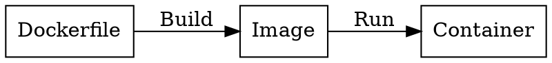
```graphviz
digraph {
    rankdir=LR;
    a [label=Dockerfile, shape=box]
    b [label=Image, shape=box]
    c [label=Container, shape=box]

    a -> b [label=Build]
    b -> c [label=Run]
}
```

Pour bien comprendre le fonctionnement interne des fichiers dockerfiles, décomposons ses règles de syntaxe:


- FROM: pour sélectionner l'image de base avec laquelle commencer la construction
- MAINTAINER: les informations du mainteneur d'image
- WORKDIR: définir le répertoire de travail actuel
- ENTRYPOINT: il s'agit de la commande par défaut à exécuter à chaque démarrage du conteneur
- ENV: Définition des variables d'environnement pour le conteneur
- LABEL: Ajout de métadonnées et de description à l'image
- ARG: des arguments a passer vers CMD ou ENTRYPOINT
- USER: définissez le nom d'utilisateur et le groupe sous lequel le conteneur initié à partir de l'image va s'exécuter
- VOLUME: créer un point de montage sur le conteneur
- COPY: Copiez les fichiers du système de fichiers hôte vers le système de fichiers du conteneur
- RUN: exécuter une commande à l'intérieur du conteneur
- ADD: Ajouter des fichiers d'une URL distante au conteneur
- EXPOSE: metadata pour exposez un port de conteneur afin qu'il puisse être mappé lorsque le conteneur est démarré.
- CMD: commande à exécuter lorsque le conteneur est finalement démarré après le processus de construction
- Commentaires: les commentaires commencent par un `#`
- .dockerignore: ce fichier oblige la commande build à ignorer le répertoire dans lequel il se trouve

+------------------------------------------------------------------------------------------------------------------------------------------------------------------------+
| {width=4%} Notez que le fichier docker doit être nommé `Dockerfile` pour que la commande `docker` puisse le trouver ou `-f` pour spécifier un fichier custom. |
+------------------------------------------------------------------------------------------------------------------------------------------------------------------------+

Dans le même répertoire que le `Dockerfile` ou en passant le drapeau `-f` avec le répertoire où `Dockerfile` est situé, en exécutant la commande:

```bash
docker build .
# ou
docker build -f /path/to/dir
```

Pour enregistrer la nouvelle image construite avec un nom donné, utiliser le drapeau `-t` pour un *"tag"*:

```bash
docker build . -t repo/app
```

Une fois le processus de construction est terminé, vérifiez si l'image existe:

```bash
docker images
```

#### Docker compose

Compose joue un rôle essentiel dans les déploiements et la gestion des applications conteneurisées. Dans l'ensemble, il permet la configuration et le déploiement de masse de conteneurs en aussi peu de touches que possible, ce qui s'est avéré être à certains égards une tâche difficile en utilisant des outils CLI de docker simples et dans certains cas irréalisable.

L'utilitaire `docker-compose` a une liste de commandes qui est similaire à ce que l'outil `docker` a à offrir, cependant la fonctionnalité la plus utile de docker compose est l'utilisation des fichiers `docker-compose.yml` ; Ces fichiers permettent une plus grande flexibilité lors de la configuration de divers paramètres de chaque conteneur. Le tableau [@tbl:compose_yaml] répertorie les éléments du fichier `docker-compose.yml`.

+----------------+-----------------------------------------------+
| Clé            | Valeur                                        |
+================+===============================================+
| version        | la version de la syntaxe                      |
+----------------+-----------------------------------------------+
| volumes        | définir les volumes à utiliser sous services  |
+----------------+-----------------------------------------------+
| networks       | définir les réseaux à utiliser sous services  |
+----------------+-----------------------------------------------+
| services       | définir les services à déployer               |
+----------------+-----------------------------------------------+
| deploy         | se déployer sur un docker swarm               |
+----------------+-----------------------------------------------+
| image          | référentiel d'images de base et nom           |
+----------------+-----------------------------------------------+
| command        | exécutez commande au lieu du CMD par défaut   |
+----------------+-----------------------------------------------+
| build          | construire à partir de `Dockerfile`           |
+----------------+-----------------------------------------------+
| context        | chemin vers `Dockerfile` ou URL (build)       |
+----------------+-----------------------------------------------+
| args           | arguments (build)                             |
+----------------+-----------------------------------------------+
| target         | sélectionnez une étape de build               |
+----------------+-----------------------------------------------+
| container_name | nom d'instance de conteneur                   |
+----------------+-----------------------------------------------+
| ports          | transférer les ports vers le réseau hôte      |
+----------------+-----------------------------------------------+
| expose         | exposer les ports au conteneurs uniquement    |
+----------------+-----------------------------------------------+
| depends_on     | ne commencez pas avant dépendance             |
+----------------+-----------------------------------------------+
| environment    | exporter les variables d'environnement        |
+----------------+-----------------------------------------------+

: Docker Compose Yaml {#tbl:compose_yaml}

+------------------------------------------------------------------------------------------------------------------------------------------------------------------------------------------------------------------------------------------------------------------------------------------------------------------------------------------------------------------+
| {width=4%} REMARQUE: Les deux `docker-compose.yaml` et `docker-compose.yml` sont considérés comme corrects, car le format du langage de sérialisation des données `YAML` utilise à la fois l'extension `.yml` ou `.yaml`. Bien que techniquement, `YAML` soit un acronyme pour `Yaml isn't Markup Language`. |
+------------------------------------------------------------------------------------------------------------------------------------------------------------------------------------------------------------------------------------------------------------------------------------------------------------------------------------------------------------------+

\

Ci-dessous, un simple exemple modèle de structure de fichier de docker compose `docker-compose.yml`:

```yaml
version:

    networks:

    volumes:

    services:
        image:
        container_name:
        ports:
        expose:
        networks:
        volumes:
        environment:
        depends_on:
        restart:
```


Pour démarrer tous les conteneurs définis dans un fichier de configuration de `docker-compose` donné, exécutez simplement la commande ci-dessous, l'option `-d` exécutera les conteneurs en arrière-plan afin que les journaux ne soient pas redirigés vers le `stdout` de la session en cours:

```bash
docker-compose up -d
```

## SECTION 4 : Networking

### Openvswitch

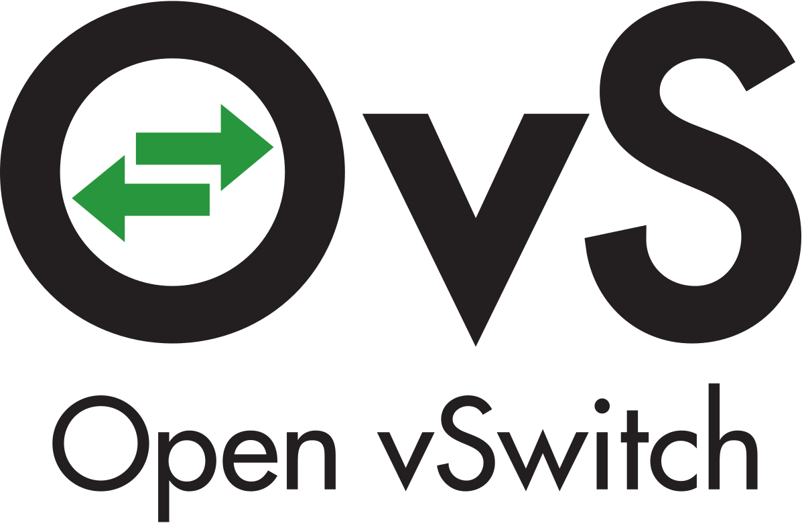{width=35%}

#### Definition :

Le projet Openvswitch est une licence open source Apache 2.0, un framework de switching virtuelle de qualité de production. Conçu avec la virtualisation à l'esprit et prend en charge toutes les fonctionnalités disponibles dans les commutateurs matériels permettant des réseaux très flexibles.

Voici quelques-unes des fonctionnalités prises en charge par Openvswitch, veuillez garder à l'esprit que cette liste n'est pas exhaustive.

- Interface Bonding
- LACP - Link Aggregation Control Protocol
- OpenFlow
- Qos - Quality Of Service
- 802.1Q VLAN support with trunk & access ports
- 802.1ag for Connectivity Fault Management
- 802.1D STP - Spanning Tree Protocol

#### CLI

Le projet Openvswitch est composé de trois composants principaux: *Base de données, serveur et contrôleur*. La *base de données* contient la configuration et les paramètres du réseau, le *serveur* est responsable de la gestion du réseau et il s'interface avec le noyau, enfin le *contrôleur* agit en tant que firmware pour les commutateurs

```bash
systemctl enable --now ovs-vswitchd.services
```

L'outil principal de configuration d'Openvswitch est

```bash
ovs-vsctl
```

Et voici quelques-uns des paramètres les plus utiles avec une description de chacun

```bash
# créer un pont
ovs-vsctl add-br [bridge_name]

# supprimer le pont
ovs-vsctl del-br [bridge_name]

# ajouter un port au pont
ovs-vsctl add-port [bridge_name] [port_name]
# ajouter un port comme matériel physique
ovs-vsctl add-port [bridge_name] [interface_name]

# supprimer le port du pont
ovs-vsctl add-port [bridge_name] [port_name]

# liste des ponts et des ports
ovs-vsctl show

# attribuer un contrôleur à un pont
ovs-vsctl set-controller [bridge_name] [controller]

# activer le protocole Spanning Tree
# nécessite un support matériel au niveau d'infrastructure
ovs-vsctl set bridge [bridge_name] stp_enable=true
```

### Linux Virtual Interfaces

#### Définition :

Afin de fournir des configurations réseau extrêmement flexibles, le noyau Linux a la capacité d'émuler plusieurs types d'interfaces réseau logiciel.

#### Types

- **Tun/Tap**

Représentant respectivement un appareil de couche 3 et 2 en d'autres termes *routage* et *bridging*.

- **Macvtap/Macvlan**

Il prend en charge plusieurs modes, *Bridge - VEPA - Passingthrough - Private*, Pour initier une interface macvtap.

```bash
ip link add link [int] name [name] type macvtap mode [mode]
```

- **Veth**

Veth est une paire d'interfaces qui agit exactement comme un câble Ethernet avec chaque extrémité comme un connecteur RJ45,

```bash
ip link add dev [1st_pair_name] type veth peer name [2nd_pair_name]
```

- **Bridge**

Aussi appelé un Linux Bridge

```bash
ip link add [bridge_name] type bridge
```


# Application

## Introduction

Ce chapitre est dédié à la phase de configuration à la fois sur l'hôte de virtualisation `Archlinux` et sur l'invité de conteneurisation `Fedora`. Le processus implique l'installation et la configuration de `Qemu, KVM, libvirt & virt-manager` du côté hôte ainsi que de `selinux, cgoups, docker` & `docker-compose` du côté invité des choses, comme indiqué dans le diagramme de configuration [@fig:netdiagram]

Les étapes sont divisées en trois sections dont deux sont dédiées à *Installation & Configuration* spécifiquement *SECTION 1 & SECTION 2* dans l'ordre, Et enfin se terminant par une phase *Test* dans *SECTION 3* où nous serons déployer des conteneurs docker pour des services utiles.

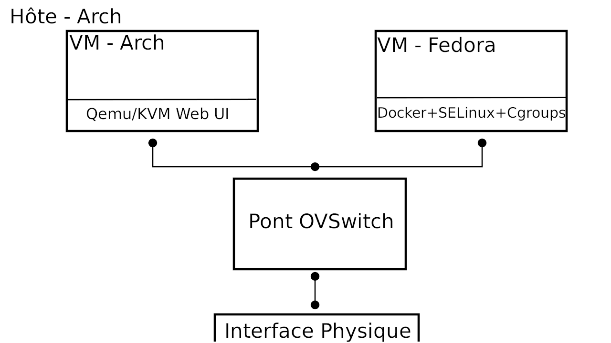{#fig:netdiagram}

Étant donné que la configuration archlinux est assez simple, zoomons sur la boîte fedora et voyons quels services nous allons déployer et à quoi ressemblera le flux de données entre les différents conteneurs docker.

Comme le montre le diagramme ci-dessous, il y aura 5 conteneurs docker au total dont 4 sont des services backend exposés uniquement au réseau docker interne, l'autre est un conteneur proxy inverse qui mappera chaque demande de domaine à un conteneur backend basé sur le nom de domaine. Bien que cela ne soit pas montré dans le diagramme, la requête DNS sera résolue par le serveur DNS `BIND 9` qui sera également installé et configuré plus tard sur la VM fedora.

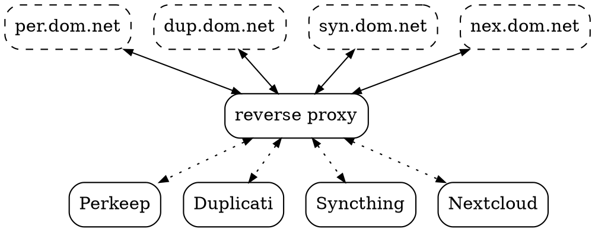
```graphviz
digraph {
    // graph [ dpi = 600 ];
    graph [concentrate=true];
    a [label="reverse proxy", shape=box, style=rounded]
    b [label=Perkeep, shape=box, style=rounded]
    c [label=Duplicati, shape=box, style=rounded]
    d [label=Syncthing, shape=box, style=rounded]
    e [label=Nextcloud, shape=box, style=rounded]
    f [label="per.dom.net", shape=box, style="rounded,dashed" ]
    g [label="dup.dom.net", shape=box, style="rounded,dashed" ]
    h [label="syn.dom.net", shape=box, style="rounded,dashed" ]
    i [label="nex.dom.net", shape=box, style="rounded,dashed" ]

    a -> { b c d e } [dir=both, arrowhead=normal, arrowtail=normal, arrowsize=0.7, style=dotted]
    { f g h i } -> a [dir=both, arrowhead=normal, arrowtail=normal, arrowsize=0.7]
    // b -> d
    // a -> a[label="oh!"]
}
```

## SECTION 1 : l'hôte {#sec:host}

### Installation & Configuration

La première étape à effectuer avant d'installer un logiciel de virtualisation est de vérifier si le processeur de l'hôte est capable de prendre en charge la virtualisation matérielle. La sortie doit contenir les mots-clés `vmx` ou `svm` mis en évidence sur la sortie si le processeur cible prend en charge la virtualisation matérielle pour `VT-x` ou `AMD-v` respectivement

```bash
# pour intel CPUs
sort -u /proc/cpuinfo | grep --color vmx
lscpu | grep --color vmx

# pour AMD CPUs
sort -u /proc/cpuinfo | grep --color svm
lscpu | grep --color svm

# pour les deux vendors (si vous ne savez pas quoi utiliser)
sort -u /proc/cpuinfo | grep --color -E '(vmx|svm)'
```

+-----------------------------------------------------------------------------------------------------------------------------------------------------------------------------------------------------------------------+
| {width=4%} REMARQUE: si aucune sortie n'est affichée, vous pouvez activer les extensions de virtualisation dans le BIOS ou UEFI en supposant qu'elles sont prises en charge. |
+-----------------------------------------------------------------------------------------------------------------------------------------------------------------------------------------------------------------------+

\

Après s'être assuré que le CPU prend en charge `HAV`^[Hardware Assisted Virtualization], installons tous les logiciels nécessaires pour configurer l'environnement de virtualisation de l'hôte sur l'hôte `Archlinux`

```bash
pacman -Syu qemu libvirt virt-manager virt-viewer openvswitch libguestfs
```

#### KVM

Vérifiez si le module du noyau `kvm` est activé

```bash
lsmod | grep kvm
```

Si aucune sortie n'est affichée, alors `kvm` est désactivé, pour l'activer parallèlement à la fonction de virtualisation `imbriquée` requise pour l'interface Web Qemu/kvm dans `Archlinux Guest`

```bash
# pour intel
echo "options kvm-intel nested=1" > /etc/modprobe.d/kvm-intel.conf

# pour amd
echo "options kvm-amd nested=1" > /etc/modprobe.d/kvm-amd.conf
```

Ajouter l'utilisateur actuel au groupe `kvm` afin de permettre à l'utilisateur de gérer

```bash
usermod -aG kvm user
```

#### Libvirt

Activation et démarrage du service `libvirtd.service`

```bash
# enable le service libvirtd
systemctl enable --now libvirtd.service

# vérification
systemctl is-active libvirtd.service
systemctl status libvirtd.service
```

Ajout de l'utilisateur actuel au groupe libvirt

```bash
usermod -aG libvirt user
```

Nous devons d'abord créer un pool de stockage en créant un fichier `pool.xml` avec le contenu suivant, ce processus ne doit être qu'une seule fois, puis tous les fichiers d'image disque seront dans le pool créé sauf si un autre pool est requis

```xml
<pool type="dir">
  <name>.vms</name>
  <target>
    <path>/home/user/.vms</path>
  </target>
</pool>
```

```bash
# sous virsh
pool-define --file pool.xml

# si non sans un fichier XML
pool-define-as --name .vms --type dir --target /home/user/.vms
# équivalent
pool-define-as .vms dir --target /home/user/.vms

# build, start & autostart le pool
pool-start -- build --pool.vms
pool-autostart --pool .vms
```

Nous devons maintenant rendre la connectivité réseau disponible pour les machines virtuelles invitées en utilisant un pont Openvswitch comme réseau. Nous commençons par créer le fichier de définition de réseau `ovsbr-net.xml`

```xml
<network>
    <name>ovsbr0</name>
    <forward mode="bridge"/>
    <bridge name="ovsbr0"/>
    <virtualport type="openvswitch"/>
</network>
```

```bash
# sous virsh
net-define --file ovsbr-net.xml

# vérification
net-list --all

# start & enable le réseau
net-start --network ovsbr-net
net-autostart --network ovsbr-net
```

#### Openvswitch

Activation et démarrage du service `ovs-vswitchd.service` pour gérer la configuration du réseau

```bash
# activation & démarrage de service
systemctl enable --now ovs-vswitchd.service

# vérification
systemctl is-active ovs-vswitchd.service
systemctl status ovs-vswitchd.service
```

Initialisation de la base de données pour la première exécution uniquement, cette commande n'a aucun effet si la base de données est déjà initialisée

```bash
ovs-vsctl init
```

Création d'un pont Openvswitch appelé `ovsbr0`, puis affectation de l'interface physique Ethernet `enp0s20f0u1` à un port vswitch

```bash
ovs-vsctl add-br ovsbr0
ovs-vsctl add-port ovsbr0 enp0s20f0u1

# vérification
ovs-vsctl show
```

#### Fedora Guest Installation


- **Stockage**

Nous allons commencer par créer une image disque au format *thinprovisioned* ou en d'autres termes *sparse* *qcow2* de 100G dans le répertoire `.vms`

```bash
# création d'un disk image avec qemu-img
qemu-img create -f qcow2 ~/.vms/fedora33.qcow2 100G
```


```bash
# ou avec virsh directement
vol-create-as --name fedora33.qcow2 --format qcow2 --pool .vms --capacity 100G
vol-list --pool .vms
```

Puis en créant un fichier `disk.xml` avec le contenu ci-dessous, et en utilisant la commande `virsh` `vol-create`


```xml
<volume>
  <name>vol.qcow2</name>
  <capacity>107374182400</capacity>
  <allocation>0</allocation>
  <target>
    <format type="qcow2"/>
  </target>
</volume>
```

Utilisant maintenant `virsh --connect qemu:///system`

```bash
# sous virsh
connect qemu:///system
vol-create --file disk.xml --pool .vms

# ou sans un fichier XML
vol-create-as --format qcow2 --pool .vms --name fedora33.qcow2 --capacity 100G
# équivalent
vol-create-as .vms fedora33.qcow2 100G
```

- **Réseaux**

Pour la connectivité réseau des invités Qemu/kvm, le pont Openvswitch `ovsbr0` est utilisé. Ajoutez le bloc XML suivant dans la configuration de l'invité pour vous connecter au pont OVS quels que soient les réseaux libvirt disponibles

```xml
<interface type="bridge">
  <source bridge="ovsbr0"/>
  <virtualport type="openvswitch"/>
  <target dev="arch_port"/>
</interface>
```

Ou connectez la VM en créant et en attachant une nouvelle interface au réseau `ovsbr0` que nous avons créé lors de l'installation de `libvirt`

```bash
attach-interface --persistent --domain fedora33 --source ovsbr0 --type network
```

- **Création**

Pour créer et démarrer la VM *fedora*, nous utilisons la commande virt-install avec la syntaxe suivante :

```bash
 virt-install --connect qemu:///system \
  --name fedora33 \
  --memory 4096 \
  --vcpus 1 \
  --cpu host,secure=on \
  --features kvm.hidden.state=on \
  --cdrom /home/user/Downloads/Fedora-Server-dvd-x86_64-33-1.2.iso \
  --boot bootmenu.enable=on \
  --os-variant archlinux \
  --disk /home/user/.vms/fedora33.qcow2 \
  --network network=ovsbr0 \
  --os-variant detect=on \
  --hvm \
  --virt-type=kvm \
  --memballoon virtio \
  --rng /dev/urandom \
  --machine q35 \
  --events on_poweroff=destroy,on_reboot=restart,on_crash=destroy \
  --graphics vnc
```

Ce qui peut également être fait en utilisant la commande `qemu-system-x86_64`, avec l'interface `macvtap` à la place *(qui n'est pas couverte dans cet article)* et la commande est

```bash
#!/bin/sh

/usr/bin/qemu-system-x86_64 \
    -monitor stdio \
    -smp 2,cores=2,threads=1,sockets=1 \
    -cpu host \
    -device intel-hda \
    -device hda-duplex \
    -vga virtio \
    -machine accel=kvm \
    -m 4096 \
    -drive file="/home/user/.vms/fedora33.qcow2",if=virtio,media=disk \
    -drive file="/home/user/Downloads/Fedora-Server-dvd-x86_64-33-1.2.iso",if=virtio,media=cdrom \
    -net nic,model=virtio,macaddr=$(cat /sys/class/net/tap_fed0/address) \
    -net tap,fd=3 3<>/dev/tap6 \
    -boot menu=on \
    -rtc base=localtime \
    -name "fedora"
```

- **Installation**

Après avoir démarré la VM Qemu/kvm fedora 33 Server Edition à partir de l'ISO d'installation, le programme d'installation démarrera automatiquement dans le menu principal d'installation comme indiqué dans [@fig:fedmenu]

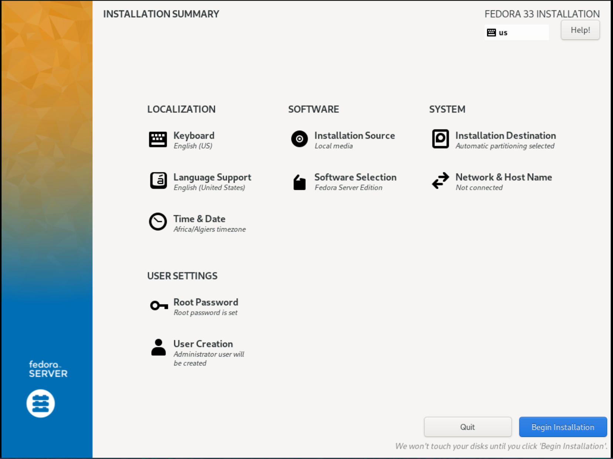{#fig:fedmenu}

La prochaine chose est la configuration des mots de passe des utilisateurs, en cliquant sur le menu *Mot de passe racine* et en remplissant le formulaire selon les besoins par l'administrateur système [@fig:fedrootpass]

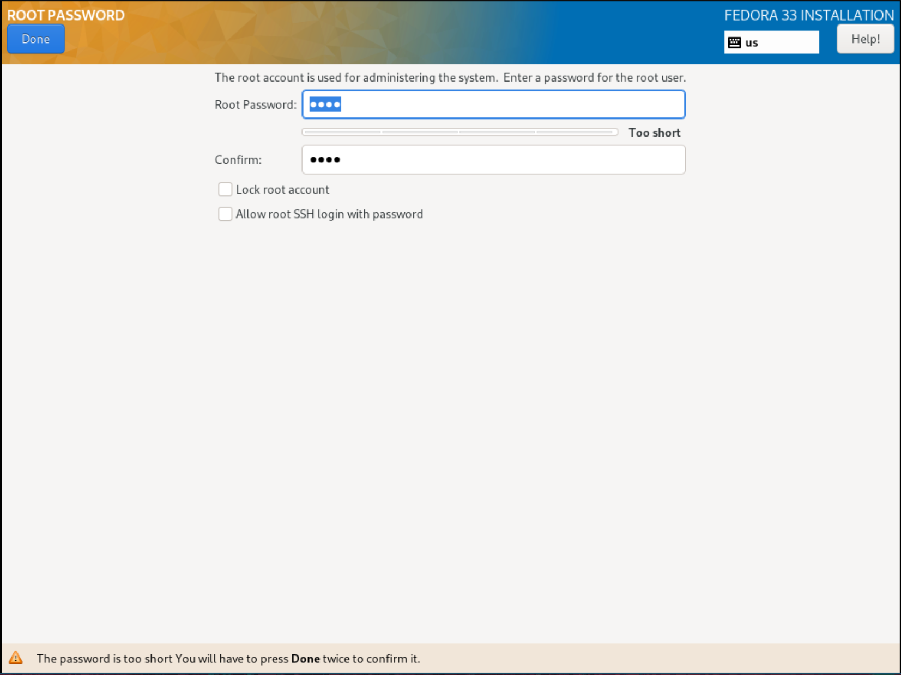{#fig:fedrootpass}

Après cela, nous allons créer un utilisateur et lui donner des privilèges administratifs en cliquant sur *Création d'utilisateur*, cette étape est fortement recommandée afin que nous ne nous connections pas en tant que root pour des raisons de sécurité [@fig:feduserpass]

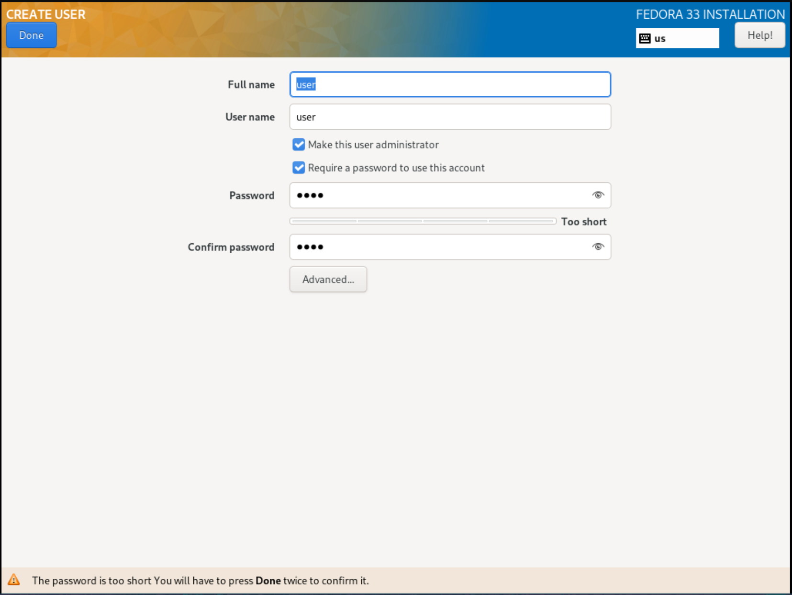{#fig:feduserpass}

La dernière étape de l'installation consiste à cliquer sur *Commencer l'installation*, et la progression du programme d'installation sera affichée [@fig:fedprogress]

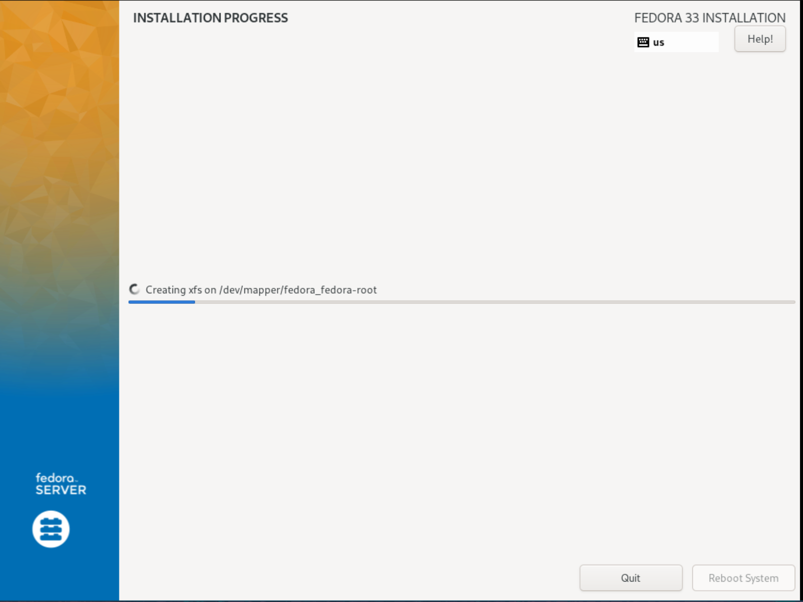{#fig:fedprogress}

Une fois l'installation terminée, redémarrez la VM fedora serveur.

#### Archlinux Guest Installation

- **Stockage**

```bash
# création d'un disk image
qemu-img create -f qcow2 ~/.vms/arch.qcow2 100G
```

```bash
# équivalent par virsh
vol-create-as --name arch.qcow2 --format qcow2 --pool .vms_test --capacity 100G
vol-list --pool .vms
```

- **Réseaux**

Ajoutez le bloc XML suivant dans la configuration de l'invité pour vous connecter au pont *OVS* quels que soient les réseaux *libvirt* disponibles

```xml
<interface type="bridge">
  <source bridge="ovsbr0"/>
  <virtualport type="openvswitch"/>
  <target dev="arch_port"/>
</interface>
```

Ou connectez la VM en créant et en attachant une nouvelle interface au réseau `ovsbr0` que nous avons créé lors de l'installation de `libvirt`

```bash
attach-interface --persistent --domain archlinux --source ovsbr0 --type network
```

- **Création**

La dernière étape consiste à créer et démarrer la machine virtuelle avec les spécifications requises en utilisant la commande `virt-install` avec le bon ensemble de paramètres

```bash
 virt-install --connect qemu:///system \
  --name arch \
  --memory 4096 \
  --vcpus 2 \
  --cpu host,secure=on \
  --features kvm.hidden.state=on \
  --cdrom /home/user/Downloads/archlinux-2020.05.01-x86_64.iso \
  --boot bootmenu.enable=on \
  --os-variant archlinux \
  --disk /home/user/.vms/arch.qcow2 \
  --network network=ovsbr0 \
  --os-variant detect=on \
  --hvm \
  --virt-type=kvm \
  --memballoon virtio \
  --rng /dev/urandom \
  --machine q35 \
  --events on_poweroff=destroy,on_reboot=restart,on_crash=destroy \
  --graphics vnc
```

Pour rappel, la VM peut également être démarrée en utilisant Qemu directement avec la commande suivante. Cependant pour la mise en réseau, nous utilisons un pont `macvtap` au lieu de **OVS**, ce qui est moins pratique dans certains cas en fonction de la configuration

```bash
#!/bin/sh

/usr/bin/qemu-system-x86_64 \
    -monitor stdio \
    -smp 2,cores=2,threads=1,sockets=1 \
    -cpu host \
    -device intel-hda \
    -device hda-duplex \
    -vga virtio \
    -machine accel=kvm \
    -m 4096 \
    -drive file="/home/user/.vms/arch.qcow2 ",if=virtio,media=disk \
    -drive file="/home/user/Downloads/archlinux-2020.05.01-x86_64.iso ",if=virtio,media=cdrom \
    -net nic,model=virtio,macaddr=$(cat /sys/class/net/tap_arch0/address) \
    -net tap,fd=3 3<>/dev/tap6 \
    -boot menu=on \
    -rtc base=localtime \
    -name "fedora"
```

- **Installation**

Lorsque la VM démarre, installez **Archlinux** avec les commandes suivante. Veuillez garder à l'esprit qu'il ne s'agit en aucun cas d'un guide d'installation **`Archlinux`**, il ne s'agit donc que d'une brève liste des commandes requises du processus

```bash

# partitionnement de disk
fdisk /dev/vda
fdisk -l

# formatage
mkfs.ext4 /dev/{vda1,vda2}

# montage des partitions
mkdir /mnt/home
mount /dev/vda1 /mnt
mount /dev/vda2 /home

# l'installation de la base
pacstrap -i /mnt base linux linux-firmware sudo vim

# la generation d'fstab
genfstab -U -p /mnt >> /mnt/etc/fstab

# chrooting
arch-chroot /mnt /bin/bash

# configuration de locale
echo "en_US.UTF-8 UTF-8" >> /etc/locale.gen
# Generating locale
locale-gen
echo "LANG=en_US.UTF-8" > /etc/locale.conf

# selection de zone to temps
ln -sf /usr/share/zoneinfo/Africa/Algiers /etc/localtime
# synchronisation de clock
hwclock --systohc --utc

# le nom do hôte & loopback
echo "archserver" > /etc/hostname
echo "127.0.0.1 localhost.localdomain archserver" > /etc/hosts

# l'installation & démarrage de NetworkManager
pacman -S NetworkManager
systemctl enable NetworkManager

# mot de pass root
passwd

# l'installation & configuration de grub
pacman -S grub
grub-install /dev/vda
grub-mkconfig -o /boot/grub/grub.cfg
exit

# démontage des partitions
umount -R /mnt
reboot
```


## SECTION 2 : Guests {#sec:guests}

### Fedora Guest

#### Initial Setup

Lorsque le serveur redémarre, connectez-vous et mettez à jour le cache et le logiciel système du gestionnaire de packages. Ceci est important pour obtenir les derniers correctifs de sécurité pour diverses applications

```bash
yum update
```

Vérifiez que SELinux fonctionne en mode `enforcing` en exécutant `sestatus`, si c'est le cas, désactivez-le pour le moment afin que nous puissions configurer le système sans déclencher les AVC

```bash
sestatus
setenforce 0
```

#### BIND DNS

L'installation de `BIND9`^[Berkeley Internet Name Domain] est également connue sous le nom de serveur `named` *DNS*, n'est pas obligatoire, mais cela réduira considérablement la confusion des utilisateurs lorsque plusieurs services partagent le même hôte avec plusieurs ports exposés.

```bash
yum install bind
```

Editez `/etc/named.conf` et ajoutez les deux blocs de zone de recherche *Forward* & *Reverse* lookup, Le contenu complet du fichier se trouve sous **Appendix A**

```javascript
zone "dom.net" IN {
type master;
file "forward.dom.net";
allow-update { none; };
};

zone "10.1.10.in-addr.arpa" IN {
type master;
file "reverse.dom.net";
allow-update { none; };
};
```

Créez ensuite les fichiers de zone sous `/var/named/`

- Chemin `/var/named/forward.dom.net`

```yaml
$TTL 604800
@	IN	SOA	fedora.dom.net.	root.dom.net.	(
		2011071006	;serial
		604800		;refresh
		86400		;retry
		2419200		;expire
		806400 )		;min TTL

;
@		IN	NS	fedora.dom.net.
fedora		IN	A	10.1.10.2
arch		IN	A	10.1.10.3
nextcloud	IN	CNAME	fedora
nex		    IN	CNAME	fedora
duplicati	IN	CNAME	fedora
dup		    IN	CNAME	fedora
syncthing	IN	CNAME	fedora
syn		    IN	CNAME	fedora
perkeep		IN	CNAME	fedora
per		    IN	CNAME	fedora
```

- Chemin `/var/named/reverse.dom.net`

```yaml
$TTL 604800
@	IN	SOA	fedora.dom.net.	root.dom.net.	(
		2011071001	;serial
		604800		;refresh
		86400		;retry
		2419200		;expire
		806400 )		;min TTL

;
@	IN	NS	fedora.dom.net.
fedora	IN	A	10.1.10.2
2	IN	PTR	fedora.dom.net.
3	IN	PTR	arch.dom.net.
```

Vérification de la cohérence des fichiers de configuration

```bash
named-checkconf /etc/named.conf

named-checkzone forward.dom.net /var/named/forward.dom.net

named-checkzone reverse.dom.net /var/named/reverse.dom.net
```

Si tout va bien et que l'étape précédente n'a produit aucun message d'erreur, continuez et démarrez l'unité systemd `named.service`

```bash
systemctl enable --now named.service
```


#### Cgroups

Depuis que `fedora 33` est passé de **`Cgroups V1`** "Version 1" à **`Cgroups V2`** "Version 2", il y a quelques options parmi lesquelles l'utilisateur doit choisir, Ceci est dû au manque de support de `Cgroups V2` du moteur de docker.

Les options disponibles sont de revenir à `Cgroups V1` ou d'utiliser une alternative à docker qui est maintenue par **RedHat** appelée *Podman* cet utilitaire a à peu près la même syntaxe que *docker*, ce qui en fait une solution de remplacement pour docker dans la plupart des utilisations cas.

i. **Passer à Cgroups V1**

En éditant le fichier `/etc/default/grub` et en ajoutant manuellement le paramètre de démarrage du noyau `systemd.unified_cgroup_hierarchy = 0` à la variable `GRUB_CMDLINE_LINUX`. Ou en utilisant simplement l'utilitaire CLI `grubby` pour mettre à jour la configuration

```
grubby --update-kernel=ALL \
--args="systemd.unified_cgroup_hierarchy=0"
```

ii. **Utiliser Podman**

Évidemment, cet article concerne `docker`, cependant si l'utilisateur de `Cgroups V2` est désiré, utiliser `podman` est une remplacement de l'utilitaire `docker` car il utilise la même syntaxe CLI que `docker` tout en étant sans daemon cela signifie moins qu'il ne nécessite pas que le daemon `dockerd` soit constamment en cours d'exécution en arrière-plan pour qu'il puisse gérer, surveiller et superviser les processus de conteneur. Le seul inconvénient est qu'au moment de la rédaction de ce texte, `podman-compose` est un projet séparé et il n'est pas encore tout à fait prêt pour les environnements production.

```bash
yum install podman podman-compose
```


#### Docker

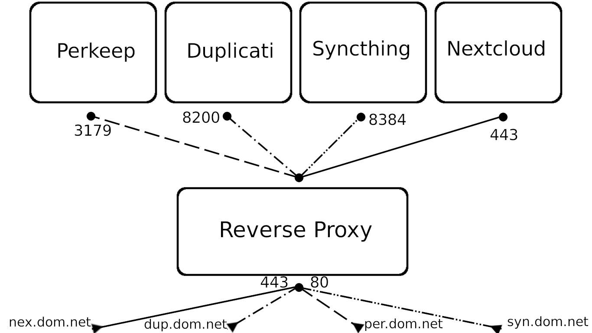{#fig:cont_topo width=100%}

Ensuite, installons le logiciel de conteneurisation, dans ce cas, cela inclut le moteur `docker` et `docker-compose`

```bash
yum install docker docker-compose
```

Ajouter un utilisateur au groupe docker pour que l'utilisateur non privilégié puisse contrôler le daemon docker, sans avoir besoin d'un accès root

```bash
usermod -aG docker user
```

```bash
systemctl start docker.service
systemctl enable docker.service
```

Ensuite, nous déploierons plusieurs conteneurs Docker pour les services dont nous avons besoin dans l'environnement de production ainsi que dans les maisons et les bureaux. Les conteneurs déployés seront derrière un proxy inverse et accessibles en utilisant le format d'URL `service.dom.net` cela améliorera considérablement la convivialité lors de l'accès aux services, sinon l'utilisateur doit se souvenir des hôtes et des ports du conteneur pour chaque service qui est intimidant.

##### Nginx Reverse Proxy

Le proxy inverse `nginx` mappera chaque requête à la VM `fedora` dans un port de conteneur basé sur l'hôte demandé sur le domaine `dom.net` et cela se fait via la variable d'environnement `VIRTUAL_HOST` sur la définition docker-compose du conteneur. Le proxy inverse se connectera également aux backends en utilisant `https` si la variable d'environnement `VIRTUAL_PROTO` est définie sur la valeur `https`. Si le backend expose plus d'un port, le port de l'interface utilisateur peut également être spécifié via `VIRTUAL_PORT`.

\

Le conteneur de proxy inverse surveille le démon docker pour tous les conteneurs en cours d'exécution qui ont les variables d'environnement décrites précédemment en montant le socket de domaine Unix `dockerd` `/var/run/docker.sock` en lecture seule car il n'y a pas besoin de capacités de gestion.

Pour une connexion sécurisée `ssl/tls`, le chemin `/etc/nginx/certs` peut être rempli en montant un répertoire hôte contenant le certificat et les fichiers de clé privée pour chaque conteneur sous la forme `service.dom.net.crt` et `service.dom.net.key` respectivement, ainsi que le pontage du numéro de port `443` vers la machine hôte.

\

Nous devons également ajouter un fichier de configuration personnalisé au répertoire `/etc/nginx/conf.d/` pour permettre les téléchargements de fichiers volumineux, car presque tous les services relaient cette fonctionnalité. Cela se fait en créant un fichier avec n'importe quel nom comme par exemple `proxy.conf` avec la variable `client_max_body_size` définir la valeur maximale que nous prévoyons de télécharger sur l'un des services en tant que fichier unique, qui est dans ce cas `2048M` qui est égal à `2 GiB`; Et monter le fichier de configuration personnalisé dans le répertoire du proxy inverse `conf.d`.

```apache
client_max_body_size 2048M;
```

Enfin, voici la section complète `reverse_proxy` dans le fichier `docker-compose.yml`

```yaml
reverse_proxy:
   image: jwilder/nginx-proxy
   container_name: reverse_proxy
   ports:
     - 80:80
     - 443:443
   volumes:
     - /var/run/docker.sock:/var/run/docker.sock:ro
     - ./keys:/etc/nginx/certs:Z
     - ./proxy.conf:/etc/nginx/conf.d/proxy.conf:ro,Z
```

##### NextCloud

Nextcloud est une plate-forme de productivité qui permet à une entreprise de collaborer plus efficacement en partageant *des documents, des fichiers, des e-mails, des calendriers ...* et ainsi de suite, elle fournit également des discussions en équipe et bien plus encore.

Nous pouvons démarrer le conteneur `Nextcloud` de deux manières, la première consiste à utiliser l'utilitaire de gestion de conteneur `docker` et la seconde à utiliser `docker-compose`. L'image de base utilisée est l'image `linuxserver/nextcloud` car le dépôt docker `linuxserver` est bien connu pour ses images de haute qualité à jour et bien entretenues.

Tout d'abord, nous créons l'utilisateur auquel le conteneur va abandonner ses privilèges après son démarrage, l'utilisateur est nommé `nextcloud` et a l'UID^[User Identifier] de `1002`.

```bash
useradd -u 1002 nextcloud
```

Et voici la section service `nextcloud` du fichier `docker-compose.yml`

```yaml
  nextcloud:
    image: ghcr.io/linuxserver/nextcloud
    container_name: nextcloud
    expose:
      - 443
    volumes:
      - /nextsqll/appdata:/config:Z
      - /nextsqll/data:/data:Z
    environment:
      - VIRTUAL_HOST=nextcloud.dom.net,nex.dom.net
      - VIRTUAL_PROTO=https
      - VIRTUAL_PORT=443
      - PUID=1002
      - PGID=1002
      - TZ=Africa/Algiers
    depends_on:
      - nextcloud_reverse_proxy
    restart: unless-stopped
```

Vous trouverez également ci-dessous l'utilitaire `docker` expliquant comment exécuter ce conteneur

```bash
# docker
docker run --rm -d \
  --expose 443 \
  -v /nextsqll/appdata:/config:Z \
  -v /nextsqll/data:/data:Z \
  -e VIRTUAL_HOST=nextcloud.dom.net,nex.dom.net \
  -e VIRTUAL_PROTO=https \
  -e VIRTUAL_PORT=443 \
  -e PUID=1002 \
  -e PGID=1002 \
  -e TZ=Africa/Algiers \
  --name=nextcloud \
  --restart=unless-stopped \
ghcr.io/linuxserver/nextcloud
```


+----------------------------------------------------------------------------------------------------------------------------------------------------------------------------------------------------------------------------------------------------------------+
| {width=4%}Remarque: le `depend_on` est omis lorsque le conteneur est démarré à l'aide de l'outil `docker` car il est démarré manuellement et l'utilisateur devrait pouvoir démarrer les conteneurs dans le bon ordre. |
+----------------------------------------------------------------------------------------------------------------------------------------------------------------------------------------------------------------------------------------------------------------+

\

+-------------------------------------------------------------------------------------------------------------------------------------------------------------------------------------------------------------------------------------------------------------------------------------------------------------------------------------------------------------------------------------------------------------------------------------------------------------------------------------------------------------------------------------------------------------------------------------------------------------------------------------------------------------------------------------------------+
| {width=4%}Notez les indicateurs de volume **:Z**, ils sont utilisés pour étiqueter automatiquement les volumes du conteneur avec les bonnes étiquettes SELinux. Cet indicateur peut être en majuscule *Z* ou en minuscule *z*, la différence est que la majuscule *Z* ajoute des étiquettes MCS qui rendent le volume accessible uniquement par le conteneur qui le possède, ce qui signifie que ce volume n'est pas partageable entre les conteneurs. Ces options de montage peuvent être appliquées manuellement en utilisant `chcon -t fichier_conteneur_t -l s0:c100,c200` où `c100,c200` est l'étiquette MCS du conteneur. |
+-------------------------------------------------------------------------------------------------------------------------------------------------------------------------------------------------------------------------------------------------------------------------------------------------------------------------------------------------------------------------------------------------------------------------------------------------------------------------------------------------------------------------------------------------------------------------------------------------------------------------------------------------------------------------------------------------+

\

Passons maintenant à la configuration de communications sécurisées avec un proxy inverse lorsque les utilisateurs se connectent à celui-ci car ils ne se connecteront plus directement à l'instance nextcloud, les certificats doivent être utilisés du côté du *proxy inverse nginx*. Et nous commencerons par copier le certificat et la clé privée du prochain conteneur cloud vers le répertoire du projet actuel dans le répertoire `keys`

```bash
docker cp nextcloud:/config/keys .
```

Renommer le certificat `cert.crt` en `nextcloud.dom.net.crt` et la clé privée `cert.key` en `nextcloud.dom.net.key`, car c'est le format que le * nginx * attend afin de faire correspondre chaque fichier dans `/etc/nginx/certs` à un service unique dans le backend

```bash
mv cert.crt nextcloud.dom.net.crt
mv cert.key nextcloud.dom.net.key
```

Nous avons également le domaine court `nex.dom.net`, nous allons donc créer deux liens symboliques à partir de `nextcloud.dom.net.crt` et `nextcloud.dom.net.key` pointant vers `nex.dom. net.crt` et `nex.dom.net.key` respectivement

```bash
ln -s nextcloud.dom.net.crt nex.dom.net.crt
ln -s nextcloud.dom.net.crt nex.dom.net.key
```

Ajout du fichier de configuration `nextcloud.dom.net` et `nex.dom.net` au fichier de configuration `/config/www/nextcloud/config/config.php` pour l'instance nextcloud pour spécifier le domaine auquel elle doit faire confiance et bloquer tout autre Connexions. Cela peut être fait de plusieurs façons, nous le ferons en accédant au conteneur de manière interactive et en éditant le fichier

```bash
docker exec -it nextcloud /bin/bash
```

```php
'trusted_domains' =>
   [
    'nextcloud.dom.net',
    'nex.dom.net',
    ],
```

##### Syncthing

La synchronisation permet une synchronisation décentralisée des données sur plusieurs appareils, comme le décrit la page principale du projet^[https://syncthing.net/]

> Syncthing est un programme de synchronisation de fichiers en continu. Il synchronise les fichiers entre deux ou plusieurs ordinateurs en temps réel, à l'abri des regards indiscrets. Vos données ne sont que vos données et vous méritez de choisir où elles sont stockées, si elles sont partagées avec un tiers et comment elles sont transmises sur Internet.


```yaml
  syncthing:
    image: syncthing/syncthing
    container_name: syncthing
    expose:
      - 8384
      - 22000
    volumes:
      - /syncthing:/var/syncthing:Z
    environment:
      - VIRTUAL_HOST=syncthing.dom.net,syn.dom.net
      - VIRTUAL_PROTO=https
      - VIRTUAL_PORT=8384
      - STGUIADDRESS=0.0.0.0:8384
    depends_on:
      - nextcloud_reverse_proxy
```

```bash
docker run --rm -d \
  --expose 8384 \
  --expose 22000 \
  -v /syncthing:/var/syncthing:Z \
  -e VIRTUAL_HOST=syncthing.dom.net,syn.dom.net \
  -e VIRTUAL_PROTO=https \
  -e VIRTUAL_PORT=8384 \
  -e STGUIADDRESS=0.0.0.0:8384 \
  --name=syncthing \
  syncthing/syncthing:latest
```

##### Duplicati

Duplicati est un logiciel de sauvegarde en ligne open source capable d'effectuer des sauvegardes sur de nombreux backends avec prise en charge du chiffrement de sauvegarde.

> Backup files and folders with strong AES-256 encryption. Save space with incremental backups and data deduplication. Run backups on any machine through the web-based interface or via command line interface. Duplicati has a built-in scheduler and auto-updater.

```bash
useadd -u 1003 duplicati
```

```yaml
  duplicati:
    image: ghcr.io/linuxserver/duplicati
    container_name: duplicati
    expose:
      - 8200
    environment:
      - VIRTUAL_HOST=duplicati.dom.net,dup.dom.net
      - PUID=1003
      - PGID=1003
      - TZ=Africa/Algiers
    volumes:
      - /duplicati/config:/config:Z
      - /duplicati/backups:/backups:Z
      - /duplicati/source:/source:Z
    depends_on:
      - nextcloud_reverse_proxy
    restart: unless-stopped
```


```bash
docker run --rm -d \
  --expose 8200 \
  -v /duplicati/config:/config:Z \
  -v /duplicati/backups:/backups:Z \
  -v /duplicati/source:/source:Z \
  -e VIRTUAL_HOST=duplicati.dom.net,dup.dom.net \
  -e PUID=1003 \
  -e PGID=1003 \
  -e TZ=Africa/Algiers \
  --name=duplicati \
  --restart=unless-stopped \
duplicati/duplicati:latest
```


##### Perkeep

`Perkeep` signifie *Permanent* & *Keep* qui est un logiciel de sauvegarde conçu à partir de zéro pour stocker des données dans une structure personnalisée cohérente et lisible dans le temps.

`Perkeep` nous permettra de voir un exemple de comment créer une image personnalisée et la déployer. Pour construire `perkeep`, nous aurons besoin d'un `Dockerfile` contenant les étapes que `docker build` doit suivre afin de générer une image de base utilisable, qui dans ce cas ressemble à ceci

```dockerfile
FROM archlinux
LABEL maintainer="guenfafhichem@protonmail.com"
ENV HOME=/home/perkeep
RUN pacman -Syu git go --noconfirm && \
	useradd -m -s /bin/bash perkeep && \
	git clone "https://github.com/perkeep/perkeep.git" ${HOME}/perkeep.org && \
	pacman -Scc --noconfirm

WORKDIR ${HOME}/perkeep.org
RUN go run make.go && \
	rm -rf ${HOME}/perkeep.org && \
	chown -R perkeep ${HOME}/go && \
	pacman -Rns go git --noconfirm

WORKDIR ${HOME}/go/bin
USER perkeep
#COPY server-config.json ${HOME}/.config/perkeep/server-config.json
ENTRYPOINT ["/home/perkeep/go/bin/perkeepd"]

EXPOSE 3179
```

La construction de l'image se fait via la commande `docker build`, et en passant le titre de l'image après le drapeau `-t` suivi du répertoire qui contient le `Dockerfile` dans ce cas `.` ou le répertoire courant

```bash
docker build -t xradiation/perkeep .
```

Puis démarrer l'image résultante en utilisant le fichier `docker-compose.yml`

```yaml
version: "3.8"
services:

  perkeep:
    image: xradiation/perkeep:latest
    container_name: perkeep
    ports:
      - 3179:3179
```

##### Portainer

Le dernier conteneur que nous allons déployer est `portainer/portainer-ce` qui est un conteneur de gestion et de surveillance qui utilise le socket de domaine Unix `/var/run/docker.sock` pour communiquer avec le démon docker.

```bash
docker run -d -p 9000:9000 -p 8000:8000 -v /portainer_data:/data:Z -v /var/run/docker.sock:/var/run/docker.sock --name=portainer --restart=always portainer/portainer-ce
```

Ensuite, nous connectons à l'interface de gestion Web sur le port hôte fedora `:9000`.

#### SELinux

Au moment, les conteneurs qui devront se connecter au démon docker via la socket de `dockerd` à `/run/docker.sock` ne pourront pas le faire tant que SELinux est en mode `enforcing` puisque les processus de type `container_t` n'est pas autorisé à exécuter l'action `connectto` sur un objet de type `container_runtime_t` n'importe où dans la politique.

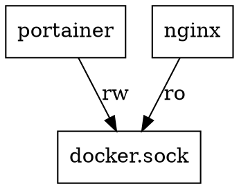
```graphviz
digraph {
    a -> c[label="rw"];
    b -> c[label="ro"];
    a[label=portainer, shape=box]
    b[label=nginx, shape=box]
    c[label="docker.sock", shape=box]
}
```


Afin de permettre au conteneur de proxy inverse de se connecter au socket de docker, nous devrons ajouter de nouvelles règles de politique qui permettront aux processus de type `container_t` de faire l'action `connectto` sur un objet de type `container_runtime_t` et `unix_stream_socket`. Cela sera fait en générant un module de politique personnalisé à l'aide de l'outil SELinux `audit2allow`, nous devons d'abord collecter les AVC générés à partir des accès refusés en démarrant les conteneurs en mode `permissive`.

```bash
setenforce 0
```

Les AVC suivants sont ceux que nous recherchons sous `/var/log/audit/audit.log`, sauvegardons-les dans un fichier séparé appelé `sock_allow.log`; Comme il est montré ci-dessous, `docker-gen` et `portainer` ont déclenché deux AVC essayant de `connectto` au socket docker `/run/docker.sock`, ainsi qu'un autre AVC par le conteneur `nginx` essayant de `associate` dans le `proc` pseudo-filesystem.

```bash
type=AVC msg=audit(1612094449.795:452): avc:  denied  { connectto } for  pid=1628
comm="docker-gen" path="/run/docker.sock" scontext=system_u:system_r:container_t:s0:c672,c722
tcontext=system_u:system_r:container_runtime_t:s0 tclass=unix_stream_socket permissive=1
type=AVC msg=audit(1612094884.764:493): avc:  denied  { connectto } for  pid=1268
comm="portainer" path="/run/docker.sock" scontext=system_u:system_r:container_t:s0:c213,c812
tcontext=system_u:system_r:container_runtime_t:s0 tclass=unix_stream_socket permissive=1
type=AVC msg=audit(1612101507.395:394): avc:  denied  { associate } for  pid=2193
comm="nginx" name="2" scontext=system_u:object_r:container_t:s0:c310,c901
tcontext=system_u:object_r:proc_t:s0 tclass=filesystem permissive=1
```

Après la collecte des AVC, nous allons générer un module de politique en utilisant l'indicateur `-M` et en passant le nom du module suivi d'une redirection des journaux précédemment collectés vers l'utilitaire `audit2allow`

```bash
audit2allow -M my_sock_allow < sock_allow.log
```

Deux fichiers apparaîtront `my_sock_allow.te` & `my_sock_allow.pp` le premier est le formulaire de politique ASCII humainement compréhensible, et le dernier est la version précompilée du premier, le contenu de `my_sock_allow.te` est le suivant

```bash
module my_sock_allow 1.0;

require {
	type container_runtime_t;
	type proc_t;
	type container_t;
	class unix_stream_socket connectto;
	class filesystem associate;
}

#============= container_t ==============
allow container_t container_runtime_t:unix_stream_socket connectto;
allow container_t proc_t:filesystem associate;
```

Maintenant, pour charger le nouveau module de politique, nous utiliserons un outil appelé `semodule` pour la gestion du *module SELinux* avec le drapeau `-i` pour *installer* un nouveau module de politique, puis passer le fichier compilé `my_sock_allow.pp` comme un argument

```bash
semodule -i my_sock_allow.pp
```

Pour nous assurer que notre politique a été chargée avec succès, vérifions quels modules sont chargés en exécutant la commande ci-dessous.

```bash
semanage module --list | grep my_sock_allow
```

Lorsque cela est fait, le conteneur de proxy inverse ainsi que portainer pourront se connecter au démon docker même si SELinux est en mode `enforcing`.

```bash
setenforce 1
```

### Archlinux

#### Explication

L'invité `Archlinux` va héberger notre interface Web Qemu/KVM, ce qui rendra le travail avec ou même l'apprentissage du fonctionnement de `Qemu` et de `KVM` beaucoup plus facile en général en exposant une interface simple qui permet à l'utilisateur de créer & Démarrez sa propre VM sans même toucher la CLI; une fois que la VM est en place, l'utilisateur sera invité avec le port `VNC` auquel il est censé se connecter en utilisant un client `VNC` de son choix, si l'utilisateur n'a pas le client `VNC` installé, il peut se diriger vers sur la page `Downloads` et saisissez un client `VNC` pour sa propre plate-forme, que ce soit *Linux, MacOs, Windows & Android*.

#### Installation & Configuration

L'installation  **Apache Web Server**

```bash
pacman -Syu apache
```

La configuration de **Common Gateway Interface** pour l'activation des script **CGI** dans `httpd.conf`

```bash
vim /etc/httpd/conf/httpd.conf
```

Trouvez cette section Ensuite, ajoutez ces deux lignes pour activer les scripts CGI sous le répertoire `/srv/http/cgi-bin`, donc avec les modifications, cela ressemblera à ceci

```apache
<Directory "/srv/http/cgi-bin">
    AllowOverride None
    Options None
    Require all granted
+   Options +ExecCGI
+   AddHandler cgi-script .cgi
</Directory>
```

Ensuite, nous allons copier le répertoire du projet de l'interface utilisateur Web dans `/srv/http/` et copier les scripts CGI dans le répertoire `/srv/http/cgi-bin`. Ensuite, nous créons le fichier `index.html` dans le répertoire racine du serveur Web et ajoutons une redirection vers la page HTML principale de l'interface utilisateur Web.

```bash
systemctl enable --now httpd.service
```

+---------------------------------------------------------------------------------------------------------------------------------------------------------------------------------------------------+
| {width=4%} REMARQUE: La page Web html/javascript ainsi que les scripts `CGI` sont disponibles sur mon compte git {hub,lab} sous la licence `BSD`. |
+---------------------------------------------------------------------------------------------------------------------------------------------------------------------------------------------------+

## SECTION 3 : Les Test {#sec:test}

### Cgroups

Dans cette section, nous testerons comment les groupes de contrôle empêcheront les attaques sur des ressources telles que `DOS` & `DDOS`, et même des bugs dans le logiciel tels que des fuites de mémoire.

#### Stress-ng

Le Dockerfile créera une image basée sur `linux alpine` et installera un outil de stress sur les ressources appelé `stress-ng`.

```dockerfile
FROM alpine
RUN apk add --no-cache stress-ng bash
ENTRYPOINT ["/bin/bash"]
```

Ensuite, démarrons le conteneur en mode interactif en utilisant l'utilitaire `docker`, et comme la figure [@fig:str_high_zoom] montre que le conteneur est en cours d'exécution. Et nous obtenons une ligne de commande dans le conteneur

```bash
docker run --rm -it --name=stress xradiation/stress
```

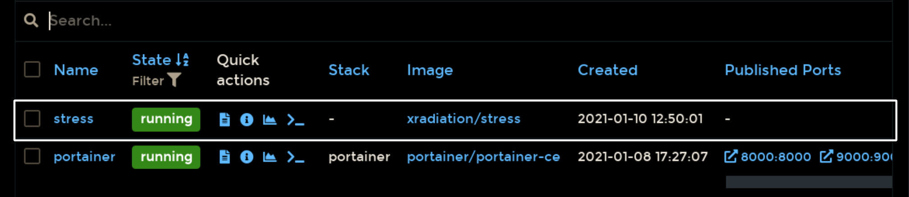{#fig:str_high_zoom width=100%}

Cliquez ensuite sur l'icône "graphique" à côté du nom du conteneur `stress` pour afficher les graphiques sur la consommation de ressources de ce conteneur particulier, tels que *CPU* load *Memory* et *Network* Usage

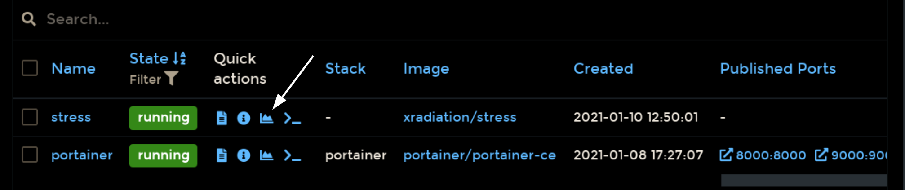{#fig:str_stats_zoom width=100%}

Avant d'exécuter l'outil `stress-ng`, voyons combien de ressources le conteneur `stress` utilise sans aucune charge, ceci est montré dans [@fig:str_idle]; Le conteneur n'utilise presque aucune ressource à `0,0%` de CPU et `250 Ko` en mémoire et en cache

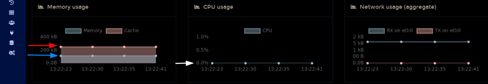{#fig:str_idle width=100%}

<div id="bigfive" style="centered">
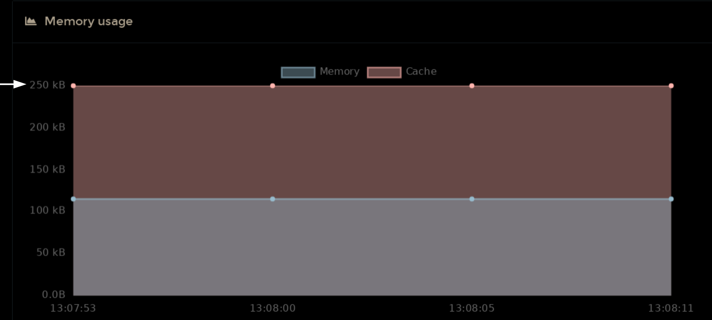{#fig:str_mem_idle width=50%}
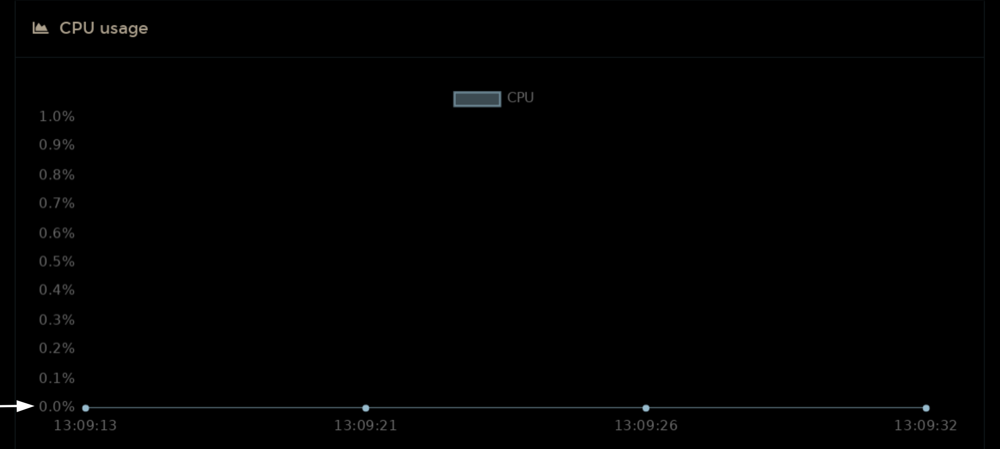{#fig:str_cpu_idle width=50%}
</div>

Après avoir obtenu la ligne de base de la consommation des ressources du conteneur, il est temps de démarrer le test de résistance et de voir combien de ressources cela va prendre à la machine hôte sans aucune règle personnalisée `cgroup`. Dans le shell du conteneur que nous tapons, cela commencera à mapper et démapper la mémoire autant que le drapeau `--vm-bytes` l'exige


```bash
stress-ng --vm 4 --vm-bytes 256m
```

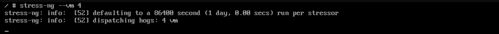{#fig:str_cmd width=100%}

Observons l'utilisation du conteneur et voyons comment cela a changé. La figure [@fig:str_stress] montre une augmentation drastique de l'utilisation du processeur et de la mémoire à `200%` et `256 Mo` respectivement, et comme la VM a un total de 2 cœurs, ce conteneur les utilise tous pour s'exécuter, ce qui ralentit vers le bas de l'hôte de manière significative.

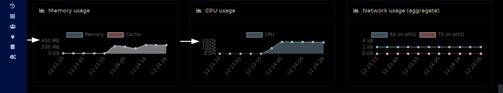{#fig:str_stress width=100%}

+-------------------------------------------------------------------------------------------------------------------------------------------------------------------------------------------------------------------+
| {width=4%} Veuillez noter que ceci n'est pas limité à `256 Mo`, en changeant le `--vm-bytes` le test de stress peut utilise presque toute la mémoire hôte disponible. |
+-------------------------------------------------------------------------------------------------------------------------------------------------------------------------------------------------------------------+

\

En définissant `--vm-bytes` sur `4096m` qui est toute la mémoire de l'hôte, le conteneur est capable d'utiliser toute la mémoire *disponible* comme indiqué dans [@fig:str_full_mem]

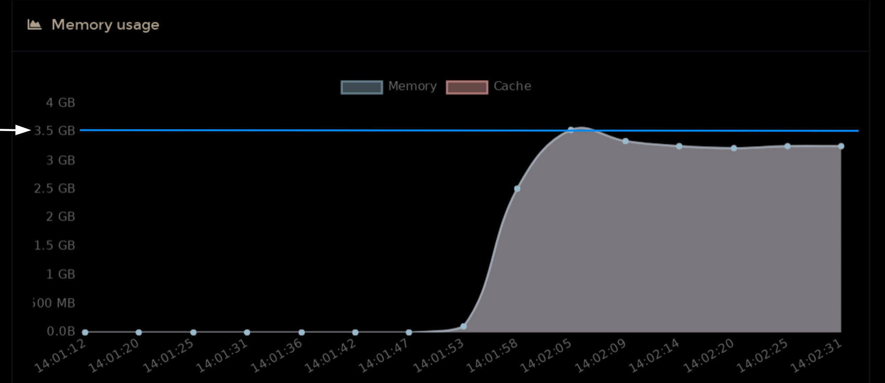{#fig:str_full_mem width=100%}

Maintenant, nous allons redémarrer le conteneur avec des limites de CPU et de mémoire `cgroups` respectivement de `25%` et `50MB`, et exécuter le même test de résistance qu'auparavant

```bash
docker run --rm -it --name=stress --cpus=0.25 --memory=50m xradiation/stress
```

La même chose que la commande ci-dessus peut être effectuée en utilisant le fichier `docker-compose.yml` ci-dessous

```yaml
version: "3.8"
services:
  stress:
    image: xradiation/stress
    container_name: stress
    cpus: 0.25
    mem_limit: 50m
    stdin_open: true
    tty: ture
```

Dans le shell des conteneurs, nous commençons le test de résistance en utilisant le drapeau `--vm` avec la valeur de `4` et `--vm-bytes` de `256m`

```bash
stress-ng --vm 4 --vm-bytes 256m
```

La figure [@fig:stc_cgrp] montre comment les règles `cgroups` que nous avons utilisées limitent l'utilisation des ressources aux valeurs que nous avons spécifiées précédemment de `25% `CPU & `50MB` Mémoire

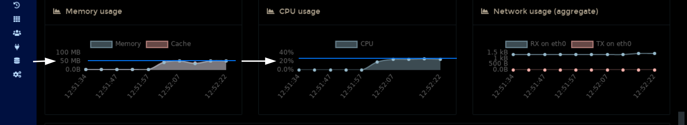{#fig:stc_cgrp width=100%}

<div id="bigfive" style="centered">
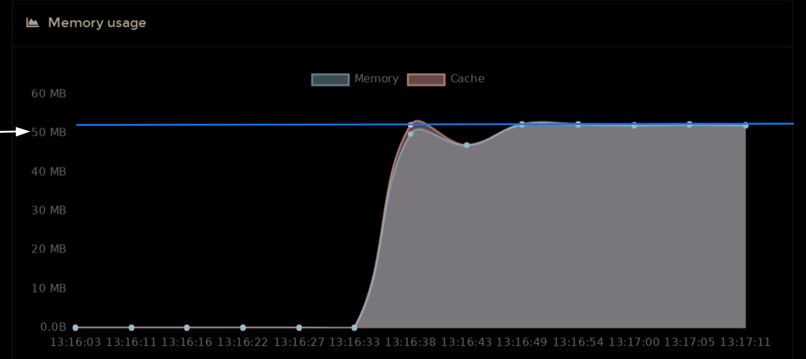{#fig:stc_cgrp_mem width=50%}
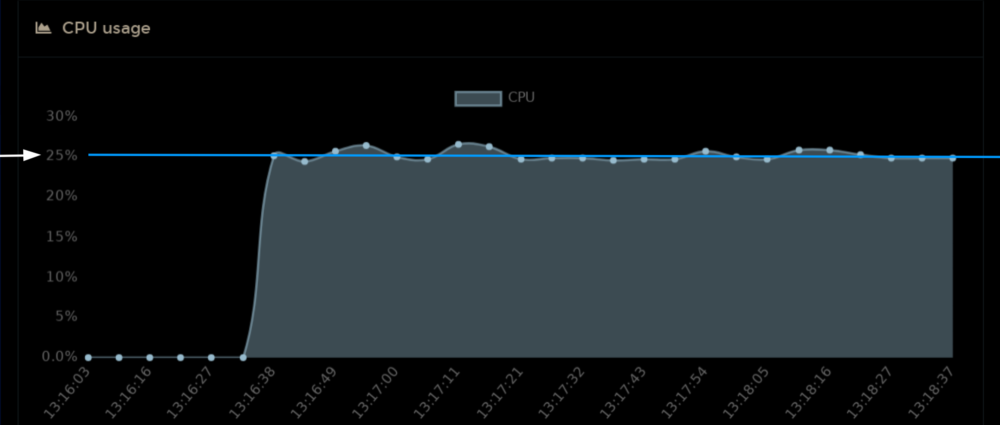{#fig:stc_cgrp_cpu width=50%}
</div>

#### Fork Bomb

Fork bomb conteneur, fonctionnera de manière récursive en l'appelant soi-même et en forçant indéfiniment jusqu'à ce que la table PID du noyau soit épuisée ou que les ressources ne prennent plus en charge la charge, auquel cas tout le système se bloquera et essaiera de libérer de la mémoire en appelant le `OOMK` ou le `Out Of Memory Killer`, et cela peut provoquer le crash du système si un processus principal est tué. Cela simulera une attaque `DOS` sur l'hôte de conteneurisation dans deux scénarios, le premier sans règles `cgroups` et le second avec des règles `cgroups` strictes sur le conteneur cible.

```bash
docker run --rm -it alpine
:(){ : | :& }; :
```

### SELinux

Pour évaluer pratiquement les avantages de l'utilisation de SELinux, nous allons faire tourner un conteneur et lui accorder explicitement un accès complet au répertoire racine du système de fichiers de l'hôte `/` dans deux scénarios. Le premier est avec SELinux en mode `permissive` avec `setenforce 0`, tandis que le second sera en mode d'application de SELinux `enforcing` avec `setenforce 1`. Dans les deux scénarios, le système de fichiers de l'hôte sera modifié en créant et en éditant des fichiers dans un système de fichiers auxquels, dans des circonstances normales, un conteneur ne devrait jamais être en mesure d'accéder en premier lieu; Tout en surveillant les fichiers journaux `auditd` sous `/var/log/audit/audit.log` pour les AVC au fur et à mesure.

#### Permissive

Tout d'abord SELinux doit être en mode `permissive`, cela nous permettra d'évaluer ce qui serait arrivé au système hôte au cas où SELinux ne serait pas active.

```bash
setenforce 0
```

Ensuite, nous démarrons notre conteneur avec le nom `setest` et montons le répertoire racine du système de fichiers de l'hôte `/` sur `/mnt` dans le processus du conteneur

```bash
docker run --rm -it --name=setest -v /:/mnt alpine
```

Nous devons maintenant obtenir les contextes SELinux des processus de conteneur `setest`, pour faciliter le suivi des AVC dans le fichier `audit.log`

```bash
ps auxZ | grep -m1 -E "container_t.*/bin/sh"
```

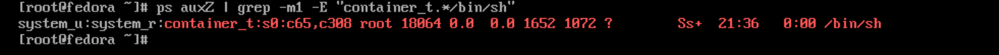{#fig:setest_mcs width=100%}

```
system_u:system_r:container_r:s0:c65,c308 root 18064 0.0 0.0 1652 1072 ?   Ss+
21:36 0:00 /bin/sh
```


Sur un autre terminal, nous démarrons la commande `watch` pour répéter la commande `tail -n20 /var/log/audit/audit.log | grep -E 'avc.*c65,c308'` toutes les `2` secondes. La commande imprimera les 20 dernières lignes de `/var/log/audit/audit.log` puis filtre ces lignes pour celles qui contiennent `avc` suivies de n'importe quoi puis `c65,308` qui sont les étiquettes MCS SELinux du conteneur particulier que nous voulons tracer; Cela nous permettra de voir les refus AVC tels qu'ils sont générés lorsque nous accédons aux fichiers que SELinux ne pense pas que nous devrions.

```bash
comm="tail -n20 /var/log/audit/audit.log | grep -E 'avc.*c65,c308'"
watch $comm
```

{#fig:setest_watch width=100%}

Dans le shell du conteneur, créons un répertoire dans le répertoire de base de l'utilisateur root `/root` appelé `setest`

```bash
mkdir /mnt/root/setest
```

Et bien sûr, nous avons eu 3 refus AVC d'affilée comme indiqué dans [@fig:setest_avc], les AVC disent que la commande était `mkdir` par l'utilisateur `root` qui essayait d'obtenir les autorisations `{write}` , `{add_name}` et `{create}`; Le contexte source est `scontext=system_u:system_r:container_t:s0:c65,c308` et le contexte cible est `tcontext=system_u:object_r:admin_home_t:s0` qui est un répertoire `tclass=dir` et l'action de contrôle était `denied`; Cependant, même si l'action était `denied`, elle réussissait malgré tout puisque `permissive=1` signifiant que SELinux n'a pas appliqué le refus puisqu'il n'est pas en mode d'application.

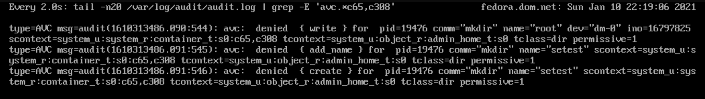{#fig:setest_avc width=100%}

```bash
type=AVC msg=audit(1610313486.090:544): avc:  denied  { write } for  pid=19476
comm="mkdir" name="root" dev="dm-0" ino=16797825
scontext=system_u:system_r:container_t:s0:c65,c308
tcontext=system_u:object_r:admin_home_t:s0 tclass=dir permissive=1

type=AVC msg=audit(1610313486.091:545): avc:  denied  { add_name } for  pid=19476
comm="mkdir" name="setest" scontext=system_u:system_r:container_t:s0:c65,c308
tcontext=system_u:object_r:admin_home_t:s0 tclass=dir permissive=1

type=AVC msg=audit(1610313486.091:546): avc:  denied  { create } for  pid=19476
comm="mkdir" name="setest" scontext=system_u:system_r:container_t:s0:c65,c308
tcontext=system_u:object_r:admin_home_t:s0 tclass=dir permissive=1
```

Dans ce cas, ce qui a déclenché les refus d'AVC était les étiquettes `TE` et `MCS`, puisque le sujet de type `container_t` n'est pas autorisé à accéder aux objets de type `admin_home_t`, et même si cela pourrait les étiquettes MCS ne correspondent pas ce qui aurait empêché l'accès de toute façon.

#### Enforcing

Revenons maintenant à SELinux en mode d'application par `setenforce 1` et désactivons momentanément les règles de non-vérification avec `semanage dontaudit off`, et lançons le conteneur `setest` de la même manière que nous l'avons fait précédemment

```bash
docker run --rm -it --name=setest -v /:/mnt alpine
```

Obtenez les étiquettes MCS du conteneur, affichées dans [@fig:setest_mcs_enf]

```bash
ps auxZ | grep -m1 -E "container_t.*/bin/sh"
```

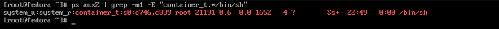{#fig:setest_mcs_enf width=100%}

```
system_u:system_r:container_r:s0:c746,c839 root 21191 0.6 0.0 1652 4 ?   Ss+
22:49 0:00 /bin/sh
```

Démarrez la commande `watch` pour récupérer tous les refus AVC

```bash
comm="tail -n20 /var/log/audit/audit.log | grep -E 'avc.*c746,c839'"
watch $comm
```

Et essayez de supprimer le répertoire que nous avons créé plus tôt `setest`, car le type d'action n'a pas vraiment plus d'importance que le fait que nous accédions à une zone restreinte en premier lieu

```bash
rm -rf /mnt/root/setest
```

```bash
type=AVC msg=audit(1610316895.043:864): avc:  denied  { read } for  pid=25617
comm="rm" name="setest" dev="dm-0" ino=16798575
scontext=system_u:system_r:container_t:s0:c746,c839
tcontext=system_u:object_r:admin_home_t:s0 tclass=dir permissive=0
```

Cette fois-ci, il semble que nous ne soyons même pas capables de lire le contenu du répertoire `{read}`, donc nous n'avons aucune autorisation de lecture ni d'écriture. Pour être sûr, essayons de voir le contenu du répertoire `/mnt/root`

```bash
ls /mnt/root
```

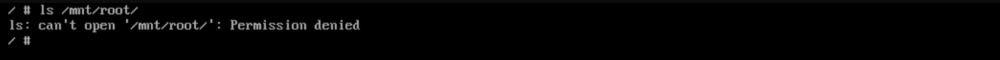{#fig:setest_permden width=100%}

Et en effet, nous ne pouvons pas du tout voir le contenu du répertoire comme indiqué dans [@fig:setest_permden], et le refus AVC suivant est apparu dans le fichier `audit.log`. Notez que cette fois, il dit `permissive=0`, ce qui signifie que SELinux est en mode d'application et que l'action de refus a été appliquée à demande l'accès.

```bash
type=AVC msg=audit(1610316864.974:862): avc:  denied  { read } for  pid=25518
comm="ls" name="root" dev="dm-0" ino=16797825
scontext=system_u:system_r:container_t:s0:c746,c839
tcontext=system_u:object_r:admin_home_t:s0 tclass=dir permissive=0
```

+----------------------------------------------------------------------------------------------------------------------------------------------------------------------------------------------------------------------------------------------+
| {width=4%} REMARQUE: Rétablissons les règles de non-audit par `semanage dontaudit on`, autrement `audit.log` seront potentiellement inondés d'AVC, ce qui rend l'analyse manuelle très difficile. |
+----------------------------------------------------------------------------------------------------------------------------------------------------------------------------------------------------------------------------------------------+

### Docker

#### Nextcloud

Pour vous connecter au conteneur `nextcloud`, connectez-vous à `nextcloud.dom.net` ou `nex.dom.net`, dans le navigateur Web, vous serez accueilli avec la page de connexion et d'inscription

{#fig:nex_shot width=100%}
<div id="bigfive" style="centered">
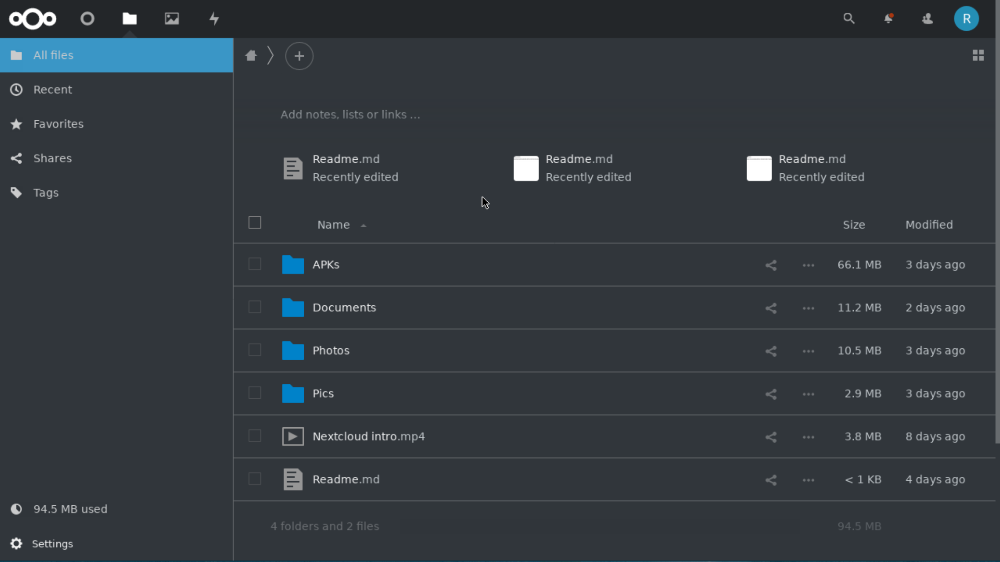{#fig:nex_files width=50%}
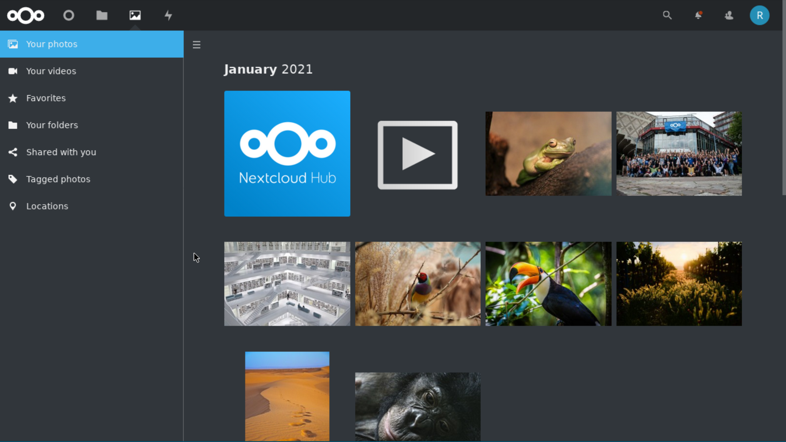{#fig:nex_photos width=50%}
</div>

#### Syncthing

Pour vous connecter au conteneur `syncthing`, connectez-vous à `syncthing.dom.net` ou `syn.dom.net`, dans le navigateur Web, vous serez accueilli avec la page de connexion et d'inscription

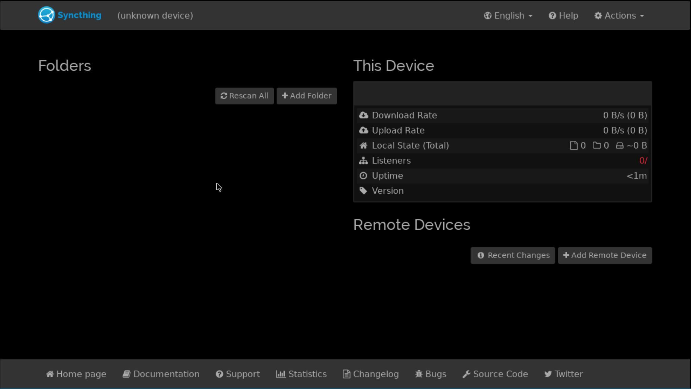{#fig:syn_shot width=100%}
<div id="bigfive" style="centered">
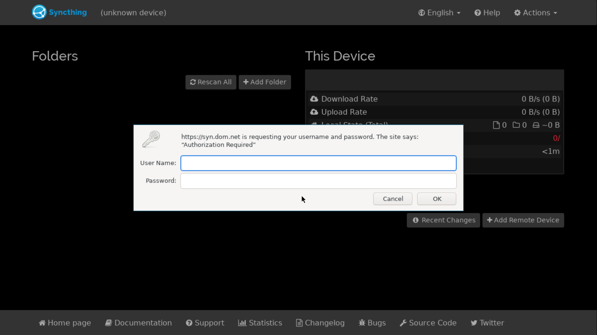{#fig:syn_login width=50%}
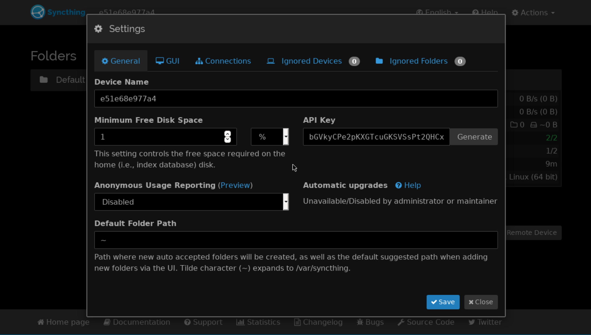{#fig:syn_set width=50%}
</div>

#### Duplicati

Pour vous connecter au conteneur `duplicati`, connectez-vous à `duplicati.dom.net` ou `dup.dom.net`, dans le navigateur Web, vous serez accueilli avec la page de connexion et d'inscription

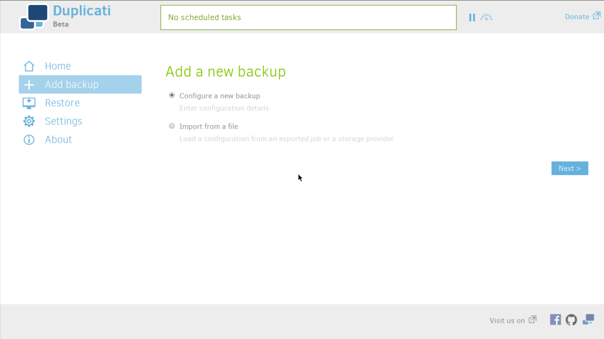{#fig:dup_addback width=100%}
<div id="bigfive" style="centered">
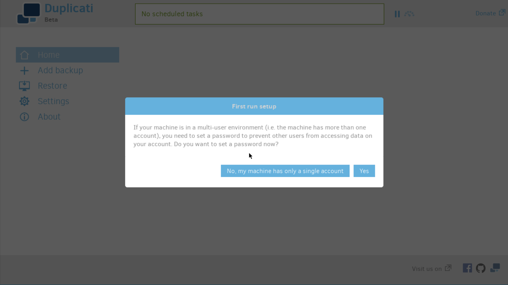{#fig:dup_home width=50%}
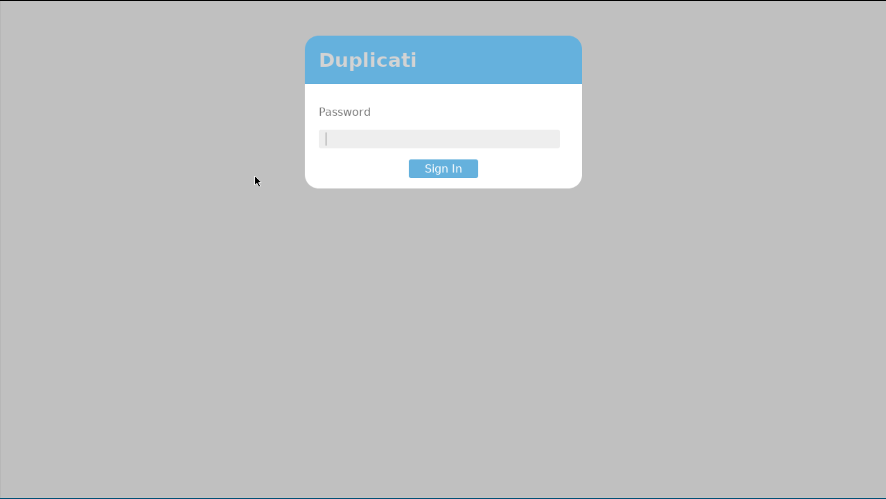{#fig:dup_shot width=50%}
</div>

#### Perkeep

Pour vous connecter au conteneur `perkeep`, connectez-vous à `perkeep.dom.net` ou `per.dom.net`, dans le navigateur Web, vous serez accueilli avec la page de connexion et d'inscription

{#fig:per_shot width=100%}

#### Portainer

Portainer est un conteneur de gestion et de supervision, donc le rendre accessible sur les interfaces réseau exposées n'est évidemment pas une bonne idée; il n'est donc accessible que par la combinaison `IP:PORT` et il ne fonctionne que lorsque la surveillance est requise, ce qui signifie qu'il devrait être possible de démarrer à distance via SSH

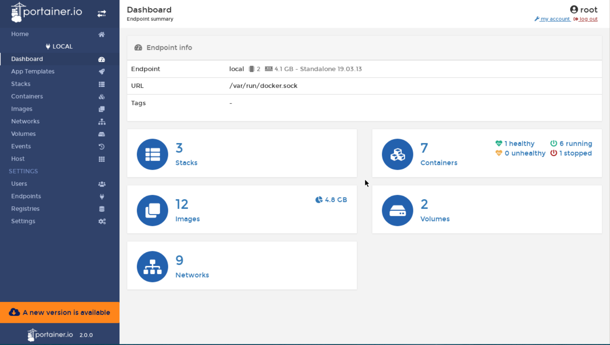{#fig:por_dash width=100%}
<div id="bigfive" style="centered">
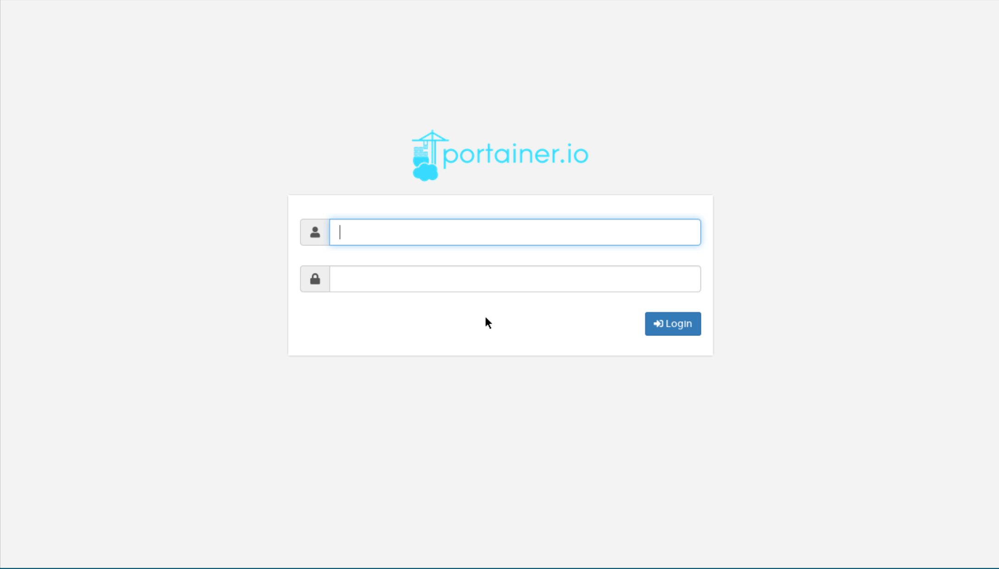{#fig:por_shot width=50%}
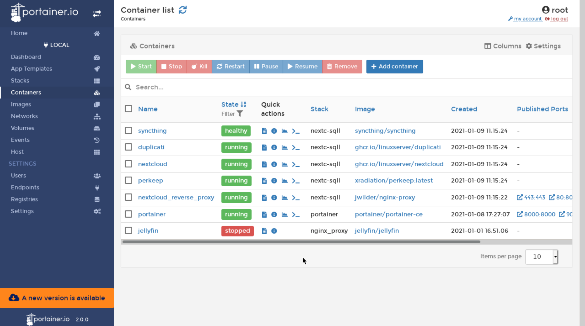{#fig:por_cont width=50%}
</div>

### Qemu/KVM Web UI

Connectons-nous à l'hôte archlinux en utilisant `http://arch.dom.net` et nous devrions être accueillis avec le formulaire de création de machine virtuelle


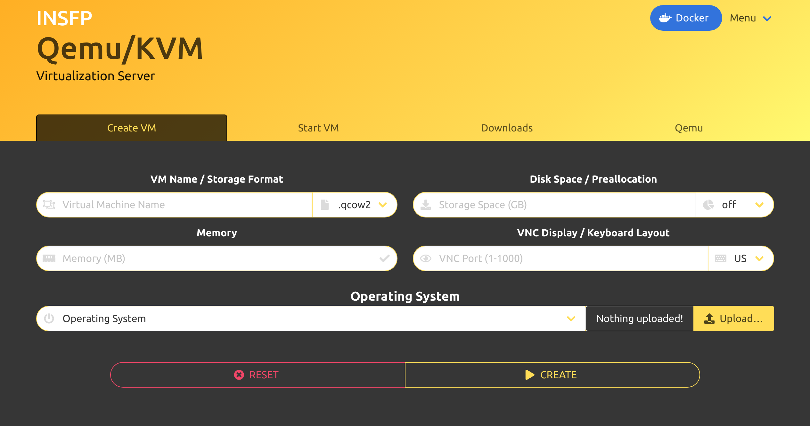{#fig:syn_shot width=100%}
<div id="bigfive" style="centered">
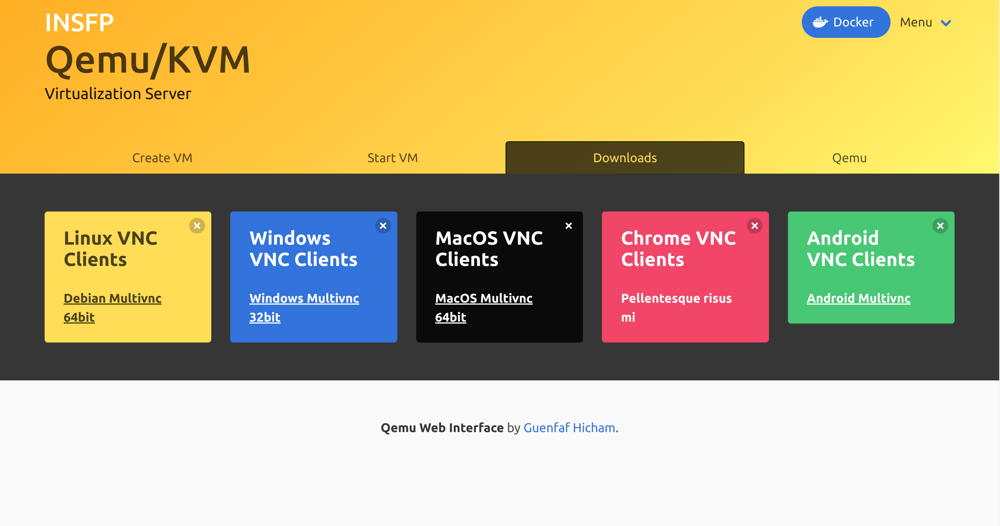{#fig:syn_set width=50%}
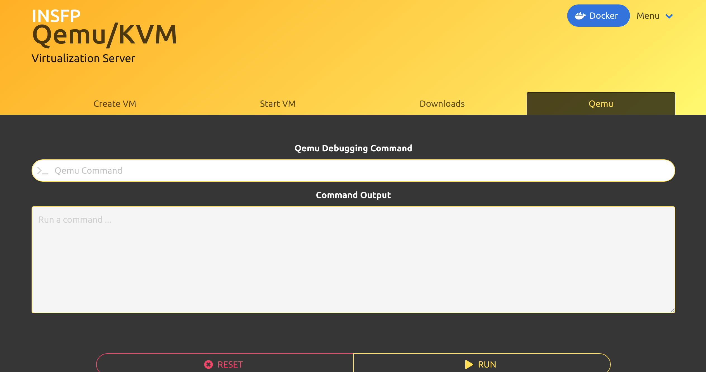{#fig:syn_set width=50%}
</div>
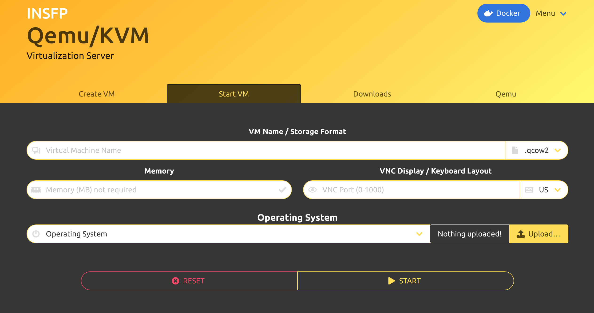{#fig:syn_login width=100%}

\

Avec une implémentation pour `Docker` aussi, mais cette projet reste sous développent (WIP^[Work In Progress]).

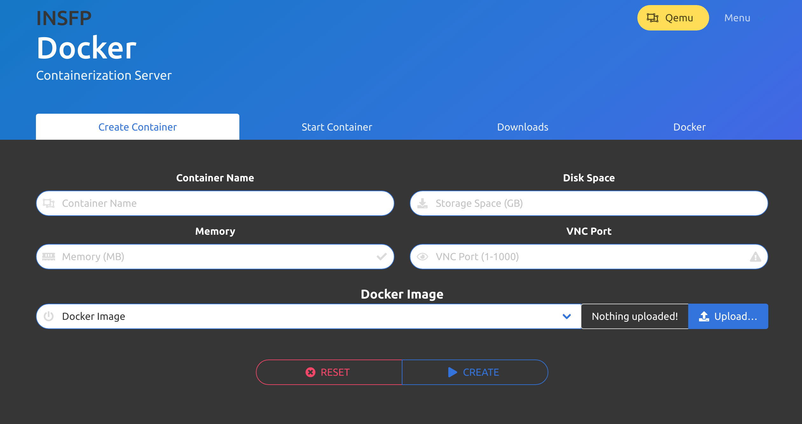{#fig:syn_shot width=100%}


# Conclusion Général {-}

## Les Résultats {-}

Ce CHAPITRE va être un récapitulatif de ce dont nous avons discuté tout au long de cet article:

- La Conteneurisation est la Visualisation sont deux technologies complémentaires.
- La conteneurisation est une visualisation au niveau du système d'exploitation.
- Les conteneurs nécessitent une isolation, de préférence sur plusieurs couches.
- Sous Linux, Qemu / kvm fournit un environnement virtuel relativement sécurisé.
- La virtualisation sous Linux est basé sur plusieurs technologies complémentaires, Qemu / kvm, libvirt, libguestfs.
- L'utilisation d'un framework de contrôle d'accès obligatoire est un élément clé d'un système sécurisé global et de conteneurisation.
- Les systèmes de contrôle d'accès obligatoires sont une exigence dans les environnements non approuvés.
- Les limites de ressources fournissent un mécanisme de sécurité contre les attaques DOS ciblées et non ciblées.

## Conclusions {-}

À la fin de cet article, il est clair à quel point il est important de s'assurer que votre infrastructure de conteneurisation est aussi sécurisée que possible en utilisant les techniques décrites précédemment, ces types de contre-mesures non seulement sauvent les entreprises exécutant les micro-services mais s'étendent au client généralement inconscient. De tomber dans les conteneurs piégés par les pirates, empêchant toute une catégorie de cybercrimes.

# Bibliographie {-}

---
nocite: |
  @*
...

::: {#refs}
:::

# Annexe A {-}

## SECTION 2: Préconisations {-}

### Espaces de noms {-}

- Réseau

```bash
# créer deux espaces de noms ns0, ns1
ip netns add [ns0]
ip netns add [ns1]

# vérification
ip netns list

# la création d'un couple virtual ethernet
ip link add [veth0] type veth peer [veth1]

# vérification
ip link list

# l'ajout de chaque un dans un espace de nom
ip link set [veth0] netns [ns0]
ip link set [veth1] netns [ns1]

# les interface n'existe plus dans le system hôte
ip link list

# pour accéder a les interfaces caché
ip netns exec [ns0] ip link list
ip netns exec [ns1] ip link list

# pour configurer les adressés ip
ip netns exec [ns0] ip addr add [192.168.1.1/24] dev [veth0]
ip netns exec [ns1] ip addr add [192.168.2.1/24] dev [veth1]

# allumez les interfaces
ip netns exec [ns0] ip link set [veth0] up`
ip netns exec [ns1] ip link set [veth1] up
```

## Technologies {-}

### SECTION 2: Virtualization {-}

#### Qemu {-}

##### CLI {-}

###### Réseau {-}

```bash
#!/bin/bash

ip link add link [interface] name [macvtap0] type macvtap mode bridge
ip link set [macvtap0] up
chown :kvm /dev/tap0
```

## BIND 9 {-}

```javascript
options {
	listen-on port 53 { 127.0.0.1; 10.1.10.2; };
	listen-on-v6 port 53 { ::1; };
	directory 	"/var/named";
	dump-file 	"/var/named/data/cache_dump.db";
	statistics-file "/var/named/data/named_stats.txt";
	memstatistics-file "/var/named/data/named_mem_stats.txt";
	secroots-file	"/var/named/data/named.secroots";
	recursing-file	"/var/named/data/named.recursing";
	allow-query     { localhost; 10.1.10.0/24; };

	recursion yes;

	dnssec-enable yes;
	dnssec-validation yes;

	managed-keys-directory "/var/named/dynamic";
	geoip-directory "/usr/share/GeoIP";

	pid-file "/run/named/named.pid";
	session-keyfile "/run/named/session.key";

	include "/etc/crypto-policies/back-ends/bind.config";
};

logging {
        channel default_debug {
                file "data/named.run";
                severity dynamic;
        };
};

zone "." IN {
	type hint;
	file "named.ca";
};

zone "dom.net" IN {
type master;
file "forward.dom.net";
allow-update { none; };
};

zone "10.1.10.in-addr.arpa" IN {
type master;
file "reverse.dom.net";
allow-update { none; };
};

include "/etc/named.rfc1912.zones";
include "/etc/named.root.key";
```
